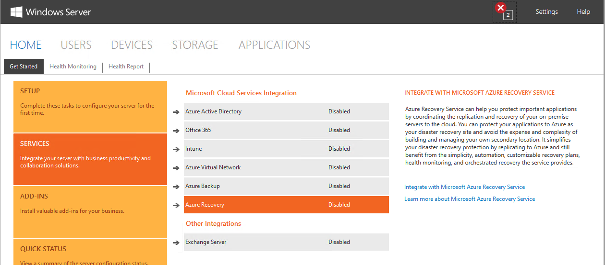
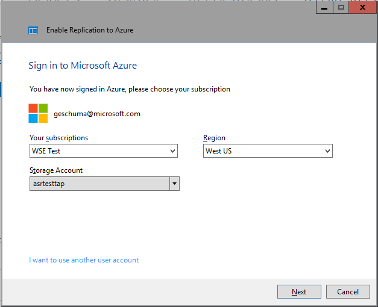
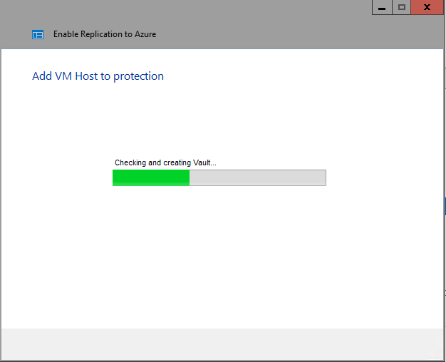

#Azure Site Recovery Services integration

>Applies To: Windows Server 2016 Essentials

Azure Site Recovery Services is a service offered by Microsoft Azure enabling real-time replication of your virtual machines (VM) to a backup vault in Azure. In the event that your server or site is down due to a hardware or other failure, you can fail-over to Azure where the VM image stored in your backup vault will be provisioned as a running VM in Azure. Combined with an Azure Virtual Network, in the event of a failover to Azure, client PCs that previously connected to the on-premises server will transparently connect to the server running in Azure.

Integrating Azure Site Recovery Services with Windows Server Essentials starts in the same manner as configuring [Azure Virtual Networking](azure-virtual-network-integration.md). From the **Microsoft Cloud Services Integration** page in the dashboard, click **Integrate with Azure Site Recovery Services** to the right of the dashboard:

As with Azure Virtual Network integration and Azure Backup integration, you must either log in to Azure with you existing Azure account, or create a new account:

After successfully logging into Azure, you'll see a screen that will ask which subscription you would like to associate with the Azure Site Recovery Service as well as the Azure Region where your VM will be stored and hosted:

After subscription and region selection, a new tab will appear in the **Windows Server Essentials dashboard** called **Azure Recovery**. Networking scanning is done to identify and enumerate supported host servers (running Windows Server Hyper-V 2012 R2 and above) as well as the virtual machines (guests) under the individual hosts:

### Enabling guest virtual machines for protection

Upon selection of a virtual machine present in the Azure Recovery window, you can click **Enable Replication to Azure** on the right side of the dashboard to prepare and copy the virtual machine’s image to Azure:

During this process, the Azure Site Recovery Service agent is installed on the host server, a backup vault where the image of the guest VM will be stored is created, and replication of the image to Azure begins. Depending on the size of the VM being replicated, completion of the replication process may take hours or days. Until the entire VM image and latest deltas are replicated to Azure, fail-over tasks are not available and the VM is not protected. Once the replication is completed, the Protection Status column in the Azure Recovery window will change from **Replicating** to **Enabled**:

### Failover of a guest VM to Azure

When a virtual machine that is protected fails, or the host server that the protected virtual machine runs on fails, failing-over to Azure can be done to maintain business continuity until the on premises virtual machine or host server is repaired and available. As the figure above shows, there are three types of failover that are supported with Azure Site Recovery Services:

-   **Test Failover** A good disaster recovery plan incorporates the ability to simulate a disaster to ensure minimal downtime in the event of a real disaster. A Test Failover takes the VM image that has been replicated to your recovery vault, provisions it as a running virtual machine in Azure and enables you to connect to the server to test scenarios that apply to the business. During a test failover, the local virtual machine continues to run with no interruptions as to not disrupt business during the disaster recovery test. Once the Test Failover is complete, you'll stop the test through the Azure Portal, which de-provisions the virtual machine and deletes the VHD. During the entire test failover, the VM image in your recovery vault continues to get replicated from the on-site VM as if nothing ever happened.

-   **Unplanned Failover** An unplanned failover occurs when there is an actual fault with the protected host server or VM running on the host server. The failover is triggered manually from either Windows Server Essentials dashboard, or if the failed server itself is the server Windows Server Essentials is running on, can be triggered from the Azure Portal directly. In this case, the Unplanned Failover takes the VM image that has been replicated to your recovery vault, provisions it as a running virtual machine in Azure, and enables you to connect to the server to test scenarios that apply to the business. When your server is restored on premises, a manual failback can be triggered from the Azure Portal that will then copy the VM image back down to the local server.

-   **Planned Failover** A planned failover is an action that can be taken in the event that planned activities, such as HW maintenance, must take place which would take the server down. In the event of a planned failover, the same process takes place with regards to the provisioning of your replicated VM image in Azure. However, prior to doing so, the local server is shut down in an orderly manner to ensure all changes are replicated to Azure before the shutdown. Once the planned maintenance is completed, you can manually trigger a failback from either the Windows Server Essentials dashboard, or the Azure portal, which would bring-up the local server and then de-provision the VM in Azure and delete the .VHD file. Replication from the on-premises VM to Azure would then continue to occur again as normal.

In any of the three cases above, when a VM is failed over to Azure, the Windows Server Essentials dashboard will show the new VM in Azure running as in the figure below.

See also
--------
[Get started with Windows Server Essentials](get-started.md)
