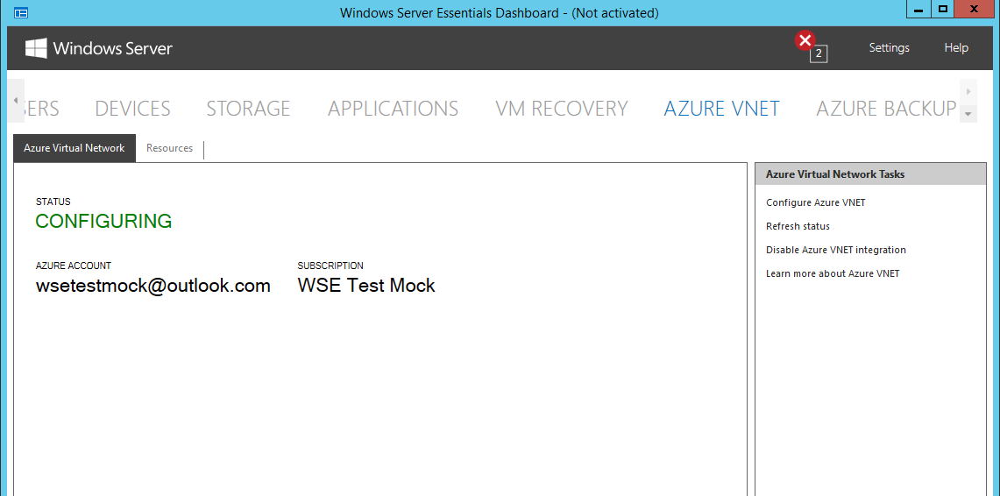
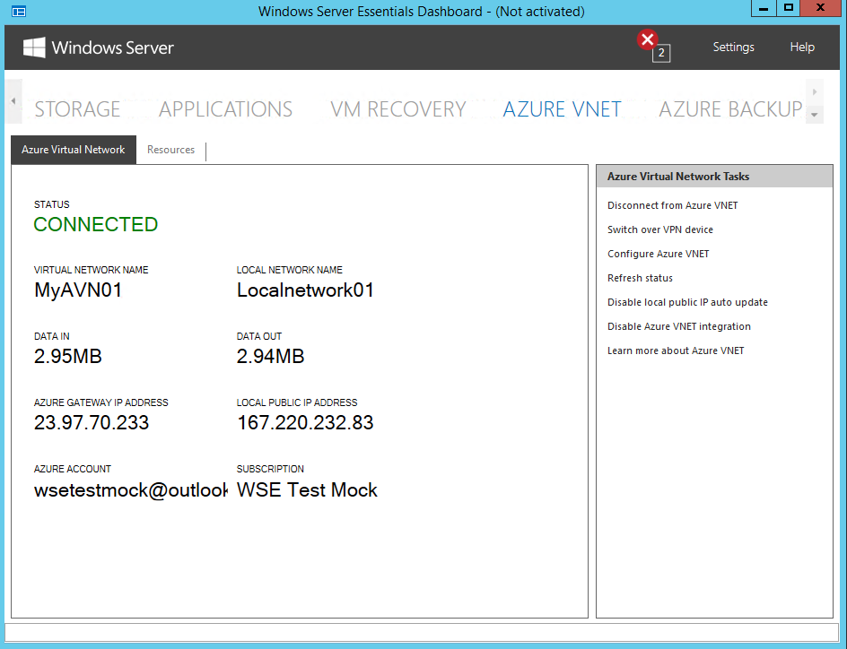

# Azure Virtual network integration

>Applies To: Windows Server 2016 Essentials

As organizations make their way to cloud computing, rarely will they move all of their resources 100% at one time, but rather take an approach where some resources are in the cloud and some are still on premises. This hybrid approach makes it easy for organizations to not only move some computing resources to the cloud, but also enables them to grow their IT infrastructure without having to acquire new hardware.

When implementing this hybrid approach to computing, a seamless way for resources in both locations to communicate with one another is required. Azure Virtual networking is an Azure service that enables organizations to create a point-to-point (P2P) or site-to-site (S2S) virtual private network that makes the resources that are running in Azure (such as virtual machines and storage) look as though they are on the local network for seamless application and resource access.

Configuration of an Azure Virtual network can be complex. With Windows Server Essentials 2016 you can easily configure your Azure Virtual network through a simple wizard that helps you choose the most appropriate defaults for your networked environment. As shown in the screenshot below, a new Azure Virtual network integration task has been added to the Microsoft Cloud Services section of the Windows Essentials dashboard to introduce Azure Virtual networking as well as provide a quick link to initiate the integration.

When you click the **Integrate Now** link for Azure Virtual networking in the screenshot above, a dialog box will appear asking you to log in to your Microsoft Azure account. If you do not have a Microsoft Azure account, you will have the option to sign-up for one on this screen, which will redirect the you to the Azure account sign-up portal:

Once signing-in to Azure, you will be presented with the option to choose which subscription they want to associate with the Azure Virtual networking service:

Once you have chosen which Azure subscription you want to use for Azure Virtual networking, you will be presented with the option to create a new Azure Virtual network, or if one already has been setup under this subscription, the drop-down box will show it is available. You will also choose a name for the Local Network that the Azure Virtual network will use to identify resources in your local network. Lastly, you will choose which Azure Region in which you want their Azure Virtual network to be hosted. Choosing a location that is physically nearest to your local network is typically best for optimizing bandwidth speed for communicating with resources you may host in their Azure services:

The last step of the integration process is to setup the VPN device that will be used for the S2S VPN connection. Since most small businesses have only a few servers in their environment and lack the IT staff to properly configure a VPN Router to connect to Microsoft Azure, the default selection will be to setup the Windows Server Essentials server as the VPN server that resources in your local network will connect to in order to access resources in the Azure Virtual network. However, if you would rather use another server in your environment as the VPN Server, or you would rather use a VPN Router, you can select those options.

Due to the variation in router types and models, Windows Server Essentials does not attempt to automatically configure the VPN Router. Selecting the VPN Router in this integration wizard only notifies Azure Virtual networking of the device type for appropriate routing configurations necessary in Azure for connectivity.

Upon completing the integration wizard, a new tab will be visible in the Windows Server Essentials dashboard for Azure Virtual networking:

>!NOTE
> Completing the configuration of an Azure Virtual network in the cloud can take a long time, upwards to 30 minutes. During this time, the status of Configuring will be present in the Azure Virtual network status page of the dashboard.

Once the configuration of the Azure Virtual network is completed, the status will change to Connected and show the details of your Azure Virtual network such as data in/out, gateway IP address, local IP address and account details:

In the tasks pane on the right side of the dashboard are the various tasks that the you can take with your Azure Virtual network.

-   **Disconnect From Azure VNET** Setting up an Azure Virtual network is free, but there is a charge for the VPN gateway that connects to on-premises and other VNETs in Azure. Disconnecting from the Azure VNET stops all billing.

-   **Switch Over VPN Device** In the event that you want to change from a VPN Server to a VPN Router, this task will enable you to make the switch and notify the Azure VNET.

-   **Configure Azure VNET** This task allows you to change advanced configuration options of the Azure VNET by redirecting them to the Azure portal configuration page for Azure VNET.

-   **Refresh Status** Refreshes the status page, updating the connection status of the Azure VNET including data in/out.

-   **Disable Azure VNET Integration** Disconnects the Azure VNET and removes integration from the Windows Server Essentials dashboard. Note this does not delete the Azure VNET, settings are still preserved in Azure if you want to later re-integrate Azure VNET with the dashboard.

-   **Learn More About Azure VNET** [https://azure.microsoft.com/services/virtual-network/](https://azure.microsoft.com/services/virtual-network/).

See also
--------
[Get started with Windows Server Essentials](get-started.md)
