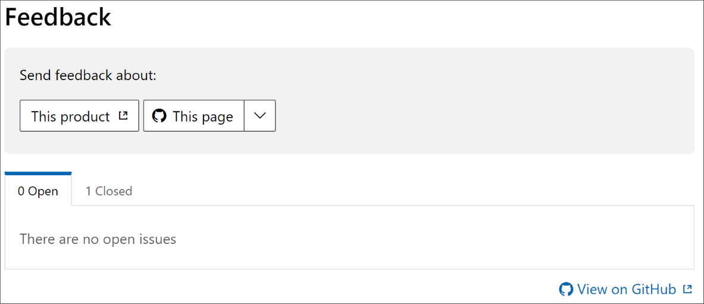

# Windows Server Documentation

Welcome to the open source documentation of Microsoft Windows Server. Please review this README file to understand how you can assist in contributing to the Windows Server documentation.

## Getting Started

Contributing to open source is more than just providing updates, it's also letting us know when there is an issue. Read our [Contributing guidance](https://github.com/MicrosoftDocs/windowsserverdocs-pr/blob/master/contributor-guide.md) to find out more.

## Prerequisites

You've decided to contribute, that's great!

Contributing to the documentation first requires you to have a GitHub account. If you don't have an account, follow the instructions to [set up a GitHub account](https://review.docs.microsoft.com/help/contribute/contribute-get-started-setup-github?branch=master).

After you have your GitHub account, you'll also need to download and install the following tools:

- [Visual Studio Code](https://review.docs.microsoft.com/help/contribute/contribute-get-started-setup-tools?branch=master#install-visual-studio-code)

- [Git client](https://git-scm.com/download)

- [Docs Authoring Pack extension for Visual Studio Code](https://review.docs.microsoft.com/help/contribute/contribute-get-started-setup-tools?branch=master#docs-authoring-pack)

## WindowsServerDocs-pr

This repo is actively managed and includes the source for Windows Server content published to [docs.microsoft.com](https://docs.microsoft.com):

- [Windows Server home page](https://docs.microsoft.com/windows-server/)
- [Windows Server 2019](https://docs.microsoft.com/windows-server/get-started-19/get-started-19)
- [Windows Server 2016](https://docs.microsoft.com/windows-server/get-started/server-basics)
- [Essentials Server 2016 and Essentials Server 2019](https://docs.microsoft.com/windows-server-essentials/get-started/get-started)

## How can I contribute?

There are a couple of ways to contribute to the documentation, review the sections below to find out which one is right for you.

### Lightweight editing in the GitHub browser

Follow the [guidance to make quick edits using the GitHub web browser](./Contributor-guide/github-browser-updates.md). This guidance is intended only for small changes to existing content. If you want to make larger changes, you must follow the process using GitHub and Visual Studio Code.

### Creating new content using GitHub and Visual Studio Code

Follow the [guidance to create new articles using GitHub and Visual Studio Code](./Contributor-guide/create-new-using-github.md).

### Editing existing content using GitHub and Visual Studio Code

Follow the [guidance to update existing articles using GitHub and Visual Studio Code](./Contributor-guide/edit-existing-using-github.md).

## Reporting Bugs and Suggesting Enhancements

Please use the Feedback tool at the bottom of any article to submit bugs and suggestions.

## License

Please refer to [LICENSE](https://github.com/MicrosoftDocs/windowsserverdocs-pr/blob/master/LICENSE), [LICENSE-CODE](https://github.com/MicrosoftDocs/windowsserverdocs-pr/blob/master/LICENSE-CODE) and [ThirdPartyNotices](https://github.com/MicrosoftDocs/windowsserverdocs-pr/blob/master/ThirdPartyNotices) for all Licensing information.

## Code of Conduct

This project has adopted the [Microsoft Open Source Code of Conduct](https://opensource.microsoft.com/codeofconduct/). For more information see the [Code of Conduct FAQ](https://opensource.microsoft.com/codeofconduct/faq/) or contact [opencode@microsoft.com](mailto:opencode@microsoft.com) with any additional questions or comments.