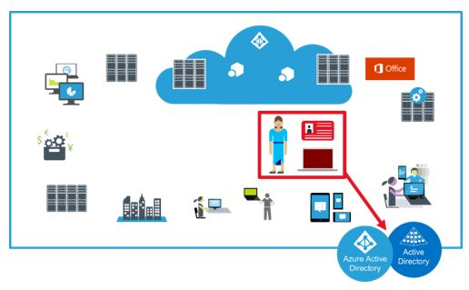
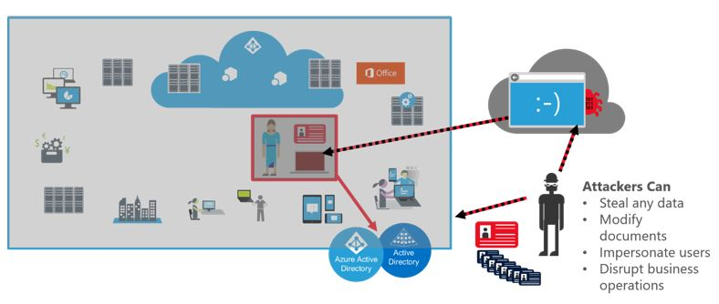
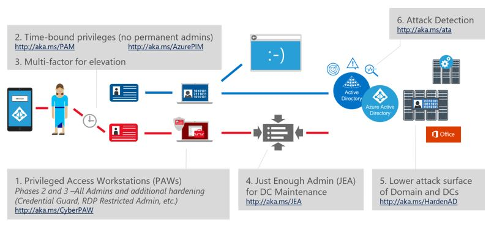

# Securing Privileged Access
Securing privileged access is a critical first step to establishing security assurances for business assets in a modern organization. The security of most or all business assets in an organization depends on the integrity of the privileged accounts that administer and manage IT systems. Cyber\-attackers are targeting these accounts and other elements of privileged access to rapidly gain access to targeted data and systems using credential theft attacks like [Pass-the-Hash and Pass-the-Ticket](http://www.microsoft.com/pth).  
  
Protecting administrative access against determined adversaries require you to take a complete and thoughtful approach to isolate these systems from risks. This figure depicts the three stages of recommendations for separating and protecting administration in this roadmap:  
  
  
  
Roadmap Objectives:  
  
-   **2\-4 week plan**: quickly mitigate the most frequently used attack techniques  
  
-   **1\-3 month plan**: build visibility and control of admin activity  
  
-   **6\+ month plan**: continue building defenses to a more proactive security posture  
  
Microsoft recommends you follow this roadmap to secure privileged access against determined adversaries. You may adjust this roadmap to accommodate your existing capabilities and specific requirements in your organizations.  
  
> [!NOTE]  
> Securing privileged access requires a broad range of elements including technical components \(host defenses, account protections, identity management, etc.\) as well as changes to process, and administrative practices and knowledge.  
  
## Why is Securing Privileged Access important?  
In most organizations, the security of most or all business assets depends on the integrity of the privileged accounts that administer and manage IT systems. Cyber\-attackers are focusing on privileged access to systems like Active Directory to rapidly gain access to all of an organizations targeted data.  
  
Traditional security approaches have focused on using the ingress and egress points of an organizations network as the primary security perimeter, but the effectiveness of network security has been significantly diminished by two trends:  
  
-   Organizations are hosting data and resources outside the traditional network boundary on mobile enterprise PCs, devices like mobile phones and tablets, cloud services, and BYOD devices  
  
-   Adversaries have demonstrated a consistent and ongoing ability to obtain access on workstations inside the network boundary through phishing and other web and email attacks.  
  
The natural replacement for the network security perimeter in a complex modern enterprise is the authentication and authorization controls in an organization’s identity layer. Privileged administrative accounts are effectively in control of this new “security perimeter” so it's critical to protect privileged access:  
  
  
  
An adversary that gains control of an administrative account can use those privileges to pursue their gain at the expense of the target organization as depicted below:  
  
  
  
For more information on the types of attacks that commonly lead to attackers in control of administrative accounts, please visit the [Pass The Hash web site](http://www.microsoft.com/pth) for informative white papers, videos and more.  
  
This figure depicts the separate “channel” for administration that the roadmap establishes to isolate privileged access tasks from high risk standard user tasks like web browsing and accessing email.  
  
  
  
Because the adversary can gain control of privileged access using a variety of methods, mitigating this risk requires a holistic and detailed technical approach as outlined in this roadmap. The roadmap will isolate and harden the elements in your environment that enable privileged access by building mitigations in each area of the defense column in this figure:  
  
  
  
## Security privileged access roadmap  
The roadmap is designed to maximize the use of technologies that you may already be deployed, take advantage of key current and upcoming security technologies, and integrate any 3rd party security tools you may already have deployed.  
  
The roadmap of Microsoft recommendations is broken into 3 stages:  
  
-   2\-4 week plan – Quickly mitigate the most frequently used attack techniques  
  
-   1\-3 month plan – Build visibility and control of admin activity  
  
-   6\+ month plan – Continue building defenses to a more proactive security posture  
  
Each stage of the roadmap is designed to raise the cost and difficulty for adversaries to attack privileged access for your on\-premises and cloud assets. The roadmap is prioritized to schedule the most effective and the quickest implementations first based on our experiences with these attacks and solution implementation.  
  
> [!NOTE]  
> The timelines for the roadmap are approximate and are based on our experience with customer implementations. The duration will vary in your organization depending on the complexity of your environment and your change management processes.  
  
### Security Privileged Access Roadmap: Stage 1  
Stage 1 of the roadmap is focused on quickly mitigating the most frequently used attack techniques of credential theft and abuse. Stage 1 is designed to be implemented in approximately 2\-4 weeks and is depicted in this diagram:  
  
  
  
Stage 1 of the Security Privileged Access roadmap includes these components:  
  
**1. Separate Admin account for admin tasks**  
  
To help separate internet risks \(phishing attacks, web browsing\) from administrative privileges, create a dedicated account for all personnel with administrative privileges. Additional guidance on this is included in the PAW instructions published [here](http://Aka.ms/CyberPAW).  
  
**2. Privileged Access Workstations \(PAWs\) Phase 1: Active Directory admins**  
  
To help separate internet risks \(phishing attacks, web browsing\) from domain administrative privileges, create dedicated privileged access workstations \(PAWs\) for personnel with AD administrative privileges. This is the first step of a PAW program and is Phase 1 of the guidance published [here](http://Aka.ms/CyberPAW).  
  
**3. Unique Local Admin Passwords for Workstations**  
  
**4. Unique Local Admin Passwords for Servers**  
  
To mitigate the risk of an adversary stealing a local administrator account password hash from the local SAM database and abusing it to attack other computers, you should use the LAPS tool to configure unique random passwords on each workstation and server and register those passwords in Active Directory. You can obtain the Local Administrator Password Solution for use on workstations and servers [here](http://Aka.ms/LAPS).  
  
Additional guidance for operating an environment with LAPS and PAWs can be found [here](http://aka.ms/securitystandards).  
  
### Security Privileged Access Roadmap: Stage 2  
Stage 2 builds on the mitigations from Stage 1 and is designed to be implemented in approximately 1\-3 months. The steps of this stage are depicted in this diagram:  
  
  
  
**1. PAW Phases 2 and 3: all admins and additional hardening**  
  
To separate internet risks from all privileged administrative accounts, continue with the PAW you started in stage 1 and implement dedicated workstations for all personnel with privileged access. This maps to Phase 2 and 3 of the guidance published [here](http://Aka.ms/CyberPAW).  
  
**2. Time\-bound privileges \(no permanent administrators\)**  
  
To lower the exposure time of privileges and increase visibility into their use, provide privileges just in time \(JIT\) using an appropriate solution such as the ones below:  
  
-   For Active Directory Domain Services \(AD DS\), use Microsoft Identity Manager \(MIM\)’s [Privileged Access Manager (PAM)](https://technet.microsoft.com/en-us/library/mt150258.aspx) capability.  
  
-   For Azure Active Directory, use [Azure AD Privileged Identity Management (PIM)](http://aka.ms/AzurePIM) capability.  
  
**3. Multi\-factor for time\-bound elevation**  
  
To increase the assurance level of administrator authentication, you should require multi\-factor authentication before granting privileges.   
This can be accomplished with MIM PAM and Azure AD PIM using Azure Multi\-factor authentication \(MFA\).  
  
**4. Just Enough Admin \(JEA\) for DC Maintenance**  
  
To reduce the quantity of accounts with domain administration privileges and associated risk exposure, use the Just Enough Administration \(JEA\) feature in PowerShell to perform common maintenance operations on domain controllers. The JEA technology allows specific users to perform specific administrative tasks on servers \(like Domain Controllers\) without giving them administrator rights. Download this guidance from [TechNet](http://aka.ms/JEA).  
  
**5. Lower attack surface of Domain and DCs**  
  
To reduce opportunities for adversaries to take control of a forest, you should reduce the pathways an attacker can take to gain control of Domain Controllers or objects in control of the domain. Follow guidance to reduce this risk published [here](http://aka.ms/HardenAD).  
  
**6. Attack Detection**  
  
To get visibility into active credential theft and identity attacks so that you can respond quickly to events and contain damage, deploy and configure [Microsoft Advanced Threat Analytics (ATA)](http://www.microsoft.com/ata).  
  
Prior to installing ATA, you should ensure you have a process in place to handle a major security incident that ATA may detect.  
  
-   For more information on setting up an incident response process, see [Responding to IT Security Incidents](http://aka.ms/irr) and the “Respond to suspicious activity” and “Recover from a breach” sections of [Mitigating Pass-the-Hash and Other Credential Theft](https://www.microsoft.com/pth), version 2.  
  
-   For more information on engaging Microsoft services to assist with preparing your IR process for ATA generated events and deploying ATA, contact your Microsoft representative by accessing [this page](https://www.microsoft.com/en-us/microsoftservices/campaigns/cybersecurity-protection.aspx).  
  
-   Access [this page](https://www.microsoft.com/en-us/microsoftservices/campaigns/cybersecurity-protection.aspx) for more information on engaging Microsoft services to assist with investigating and recovering from an incident  
  
-   To Implement ATA, follow the deployment guide available [here](http://aka.ms/ata).  
  
### Security Privileged Access Roadmap: Stage 3  
Stage 3 of the roadmap builds on the mitigations from Stages 1 and 2 to strengthen and add mitigations across the spectrum. Stage 3 is depicted visually in this diagram:  
  
  
  
These capabilities will build on the mitigations from previous phases and move your defenses into a more proactive posture.  
  
> [!NOTE]  
> Some of these steps require [!INCLUDE[winthreshold_server_2](includes/winthreshold_server_2_md.md)], which has not been released yet.  
  
**1. Modernize Roles and Delegation Model**  
  
To reduce security risk, you should redesign all aspects of your roles and delegation model to be compliant with the rules of the tier model, accommodate cloud service administrative roles, and incorporate administrator usability as a key tenet. This model should leverage the JIT and JEA capabilities deployed in the earlier stages as well as task automation technology to achieve these goals.  
  
**2. Smartcard or Passport Authentication for all admins**  
  
To increase the assurance level and usability of administrator authentication, you should require strong authentication for all administrative accounts hosted in Azure Active Directory and in your Windows Server Active Directory \(including accounts federated to a cloud service\).  
  
**3. Admin Forest for Active Directory administrators**  
  
To provide the strongest protection for Active Directory administrators, set up an environment that has no security dependencies on your production Active Directory and is isolated from attacks from all but the most trusted systems in your production environment. For more information on the ESAE architecture visit [this page](http://aka.ms/esae).  
  
**4. Code Integrity Policy for DCs \(Server 2016\)**  
  
To limit the risk of unauthorized programs on your domain controllers from adversary attack operations and inadvertent administrative errors, configure Windows Server 2016 Code Integrity for kernel \(drivers\) and user mode \(applications\) to only allow authorized executables to run on the machine.  
  
**5. Shielded VMs for virtual DCs \(Server 2016 Hyper\-V Fabric\)**  
  
To protect virtualized domain controllers from attack vectors that exploit a virtual machine’s inherent loss of physical security, use this new Server 2016 Hyper\-V capability to help prevent the theft of Active Directory secrets from Virtual DCs. Using this solution, you can encrypt Generation 2 VMs to protect the VM data against inspection, theft, and tampering by storage and network administrators as well as harden the access to the VM against Hyper\-V host administrators attacks.  
  
## Am I done?  
Completing this roadmap will gain you strong privileged access protections for the attacks that are currently known and available to adversaries today. Unfortunately, security threats will constantly evolve and shift, so we recommend you view security as an ongoing process focused on raising the cost and reducing the success rate of adversaries targeting your environment.  
  
Securing privileged access is a critical first step to establishing security assurances for business assets in a modern organization, but it is not the only part of a complete security program that would include elements like policy, operations, information security, servers, applications, PCs, devices, cloud fabric, and other components provide the security assurances you require.  
  
For more information on building a complete security roadmap, see the “Customer responsibilities and roadmap” section of the Microsoft Cloud Security for Enterprise Architects document available [here](http://aka.ms/securecustomer).  
  
For more information on engaging Microsoft services to assist with any of these topics, contact your Microsoft representative or visit [this page](https://www.microsoft.com/en-us/microsoftservices/campaigns/cybersecurity-protection.aspx).  
  
### Related topics  
[Taste of Premier: How to Mitigate Pass-the-Hash and Other Forms of Credential Theft](https://channel9.msdn.com/Blogs/Taste-of-Premier/Taste-of-Premier-How-to-Mitigate-Pass-the-Hash-and-Other-Forms-of-Credential-Theft)  
  
[Microsoft Advanced Threat Analytics](http://aka.ms/ata)  
  
[Protect derived domain credentials with Credential Guard](https://technet.microsoft.com/en-us/library/mt483740%28v=vs.85%29.aspx)  
  
[Device Guard Overview](https://technet.microsoft.com/en-us/library/dn986865(v=vs.85).aspx)  
  
[Protecting high-value assets with secure admin workstations](https://msdn.microsoft.com/en-us/library/mt186538.aspx)  
  
[Isolated User Mode in Windows 10 with Dave Probert (Channel 9)](https://channel9.msdn.com/Blogs/Seth-Juarez/Isolated-User-Mode-in-Windows-10-with-Dave-Probert)  
  
[Isolated User Mode Processes and Features in Windows 10 with Logan Gabriel (Channel 9)](http://channel9.msdn.com/Blogs/Seth-Juarez/Isolated-User-Mode-Processes-and-Features-in-Windows-10-with-Logan-Gabriel)  
  
[More on Processes and Features in Windows 10 Isolated User Mode with Dave Probert (Channel 9)](https://channel9.msdn.com/Blogs/Seth-Juarez/More-on-Processes-and-Features-in-Windows-10-Isolated-User-Mode-with-Dave-Probert)  
  
[Mitigating Credential Theft using the Windows 10 Isolated User Mode (Channel 9)](https://channel9.msdn.com/Blogs/Seth-Juarez/Mitigating-Credential-Theft-using-the-Windows-10-Isolated-User-Mode)  
  
[Enabling Strict KDC Validation in Windows Kerberos](http://www.microsoft.com/en-us/download/details.aspx?id=6382)  
  
[What's New in Kerberos Authentication for Windows Server 2012](http://technet.microsoft.com/library/hh831747.aspx)  
  
[Authentication Mechanism Assurance for AD DS in Windows Server 2008 R2 Step-by-Step Guide](http://technet.microsoft.com/library/dd378897(v=ws.10).aspx)  
  
[Trusted Platform Module](C:\sd\docs\p_ent_keep_secure\p_ent_keep_secure\trusted_platform_module_technology_overview.xml)  
  

