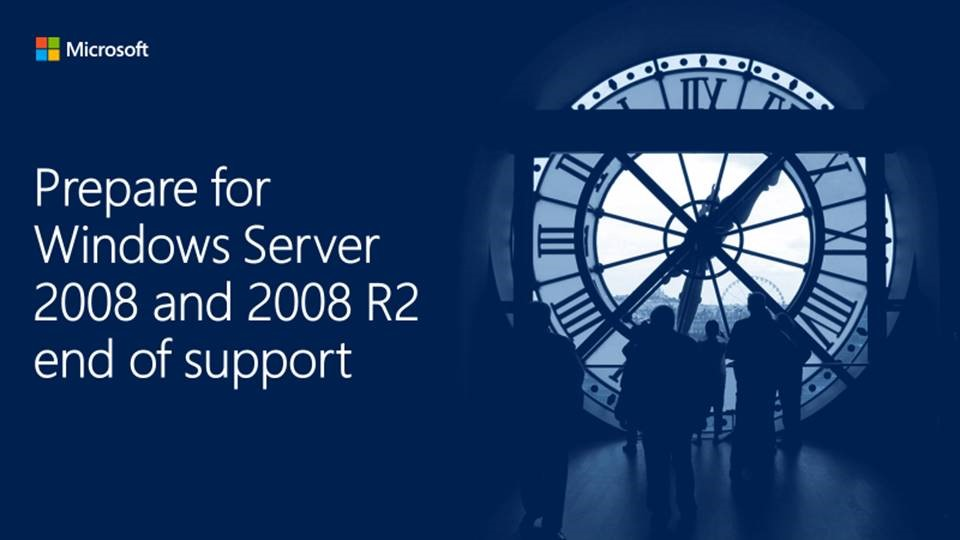

# Windows Server technical content library

This library provides info for IT pros to evaluate, plan, deploy, secure, and manage Windows Server.

>[!IMPORTANT]
> Extended support for Windows Server 2008 R2 and Windows Server 2008 ends in January 2020. [Learn about your upgrade options](get-started/modernize-windows-server-2008.md), including a new Azure solution.

<!-- *commenting out video until 1803 video available*
**What's new in Windows Server? Check out our latest mechanics video:**
 
<iframe src="https://www.youtube-nocookie.com/embed/yea9OXRZ8xg" width="640" height="360" allowfullscreen></iframe>
-->

 
<table border="0" width="100%" align='center'>
  <tr style="text-align:center;">
    <td valign="bottom" style="width:20%; border:0;">
      <a href="/windows-server/get-started/whats-new-in-windows-server-1803">
         What's new?</a></td>
    <td valign="bottom" style="width:20%; border:0;">
      <a href="/windows-server/get-started/get-started-with-1803">
         Get started</a></td>
    <td valign="bottom" style="width:20%; border:0;">
      <a href="/windows-server/administration/manage-windows-server">
         Manage</a></td>
    <td valign="bottom" style="width:20%; border:0;">
      <a href="/windows-server/failover-clustering/failover-clustering-overview">
         Failover clustering</a></td>
    <td valign="bottom" style="width:20%; border:0;"> 
      <a href="/windows-server/identity/identity-and-access">
         Identity and access</a></td>
  </tr>
  <tr style="text-align:center;">
    <td valign="bottom" style="width:20%; border:0;"> 
      <a href="/windows-server/networking/networking">
        
         Networking</a></td>
    <td valign="bottom" style="width:20%; border:0;"> 
      <a href="/windows-server/remote/index">
        
         Remote access</a></td>
    <td valign="bottom" style="width:20%; border:0;"> 
      <a href="/windows-server/security/security-and-assurance">
        
       Security and assurance</a></td>
    <td valign="bottom" style="width:20%; border:0;"> 
      <a href="/windows-server/storage/storage">
l        
       Storage</a></td>
   <td valign="bottom" style="width:20%; border:0;"> 
      <a href="/windows-server/virtualization/virtualization">
         Virtualization</a></td>
      </tr>
</table>

 

> [!Note] 
> To experience first-hand new features and functionality available in Windows Server, you can download an evaluation version by visiting [Windows Server Evaluations](https://www.microsoft.com/evalcenter/evaluate-windows-server-2016). 

## Windows Server, version 1803

Windows Server, version 1803 is the next release in the new Semi-Annual Channel. Semi-Annual Channel releases such as this one are ideal for customers who are moving at a “cloud cadence," such as those on rapid development cycles or hosters keeping up with the latest Hyper-V investments. 

**Windows Server, version 1803 runs in Server Core mode.** That means there is no local console or graphical user interface, so you manage it remotely. However, it offers great advantages such as smaller hardware requirements and much smaller attack surface. If you're new to working with Server Core, [Manage a Server Core server](administration/server-core/server-core-manage.md) will help you get used to this environment. [Manage Windows Server](administration/manage-windows-server.md) shows you the various options for managing servers remotely.

Check out [What's New in Windows Server version 1803](get-started/whats-new-in-windows-server-1803.md) for more information about the new features and functionality added in Windows Server, version 1803.

## Other versions of Windows Server

Looking for information about older versions of Windows Server? Check out our other [Windows Server libraries](/previous-versions/windows/) on docs.microsoft.com. You can also [search this site](https://docs.microsoft.com/search/index?search=Windows+Server&dataSource=previousVersions) for specific information.

## Windows Server editions

Windows Server, version 1803, is available in Standard and Datacenter editions, while Windows Server 2016 is available in Standard, Datacenter, and Essentials editions. Windows Server Datacenter includes unlimited virtualization rights plus new features to build a software-defined datacenter. Windows Server Standard offers enterprise-class features with limited virtualization rights. Windows Server 2016 Essentials is an ideal cloud-connected first server. It has its own [extensive documentation](https://go.microsoft.com/fwlink/?LinkID=827171)—the content here focuses on Standard and Datacenter editions. The following table briefly summarizes the key differences between Standard and Datacenter editions:

|Feature|Datacenter|Standard|  
|-------------------|----------|-----------------------|  
|Core functionality of Windows Server| yes| yes|
|OSEs / Hyper-V containers|unlimited|	2|
|Windows Server containers|unlimited|	unlimited|
|Host Guardian Service| yes| yes|
|Storage features including Storage Replica| yes| no|
|Shielded Virtual Machines| yes| no|
|Software Defined Networking Infrastructure (Network Controller, Software Load Balancer, and Multi-tenant Gateway)| yes| no|

For more information, see [Pricing and licensing for Windows Server 2016](https://www.microsoft.com/en-us/cloud-platform/windows-server-pricing) and [Compare features in Windows Server versions](https://www.microsoft.com/en-us/cloud-platform/windows-server-comparison).

## Installation options

Both Standard and Datacenter editions offer two installation options:

- **Server Core:** reduces the space required on disk, the potential attack surface, and especially the servicing requirements. This is the **recommended** option unless you have a particular need for additional user interface elements and graphical management tools.
- **Server with Desktop Experience:** installs the standard user interface and all tools, including client experience features that required a separate installation in Windows Server 2012 R2. Server roles and features are installed with Server Manager or by other methods.

If you are installing Windows Server, version 1803, Server Core is your only installation option, while Windows Server 2016 offers both the Server Core and Server with Desktop Experience installation options.

>[!Note]
> Unlike some previous releases of Windows Server, you cannot convert between Server Core and Server with Desktop Experience after installation. For example, if you install Server Core and later decide to user Server with Desktop Experience, you should do a fresh installation (and vice versa).

Now that you know which edition and installation option is right for you, click below to get started with Windows Server.
 
 

<table border="0" width="100%" align='center'>
    <td align='center' style="width:50%; border:0;"><a href="/windows-server/get-started/getting-started-with-server-core">  Server Core -  Recommended</a></td>
   <td align='center' style="width:50%; border:0;"><a href="/windows-server/get-started/getting-started-with-server-with-desktop-experience"> Desktop Experience -  Full interface</a></td>
  </tr>
</table>

## Windows Server Software-Defined Datacenter (SDDC)

Virtualized Storage, Networking, Security and Management technologies are the building blocks of the Windows Server Software-Defined Datacenter (SDDC).
 
 

<table border="0" width="100%" align='center'>
  <tr style="text-align:center;">
    <td align='center' style="width:10%; border:0;"></td>
    <td align='center' style="width:50%; border:0;"><a href="/windows-server/sddc"> Windows Server Software-Defined Datacenter (SDDC)</a></td>
    <td align='center' style="width:10%; border:0;"></td>
  </tr>
</table>

