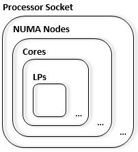

# Server Hardware Power Considerations

It is important to recognize the increasing importance of energy efficiency in enterprise and data center environments. High performance and low-energy usage are often conflicting goals, but by carefully selecting server components, you can achieve the correct balance between them. The following sections lists guidelines for power characteristics and capabilities of server hardware components.

## Processor Recommendations

Frequency, operating voltage, cache size, and process technology affect the energy consumption of processors. Processors have a thermal design point (TDP) rating that gives a basic indication of energy consumption relative to other models.

In general, opt for the lowest TDP processor that will meet your performance goals. Also, newer generations of processors are generally more energy efficient, and they may expose more power states for the Windows power management algorithms, which enables better power management at all levels of performance. Or they may use some of the new "cooperative" power management techniques that Microsoft has developed in partnership with hardware manufacturers.

For more info on cooperative power management techniques, see the section named Collaborative Processor Performance Control in the [Advanced Configuration and Power Interface Specification](http://www.uefi.org/sites/default/files/resources/ACPI_5_1release.pdf).

## Memory Recommendations

Memory accounts for an increasing fraction of the total system power. Many factors affect the energy consumption of a memory DIMM, such as memory technology, error correction code (ECC), bus frequency, capacity, density, and number of ranks. Therefore, it is best to compare expected power ratings before purchasing large quantities of memory.

Low-power memory is now available, but you must consider the performance and cost trade-offs. If your server will be paging, you should also factor in the energy cost of the paging disks.

## Disks Recommendations

Higher RPM means increased energy consumption. SSD drives are more power efficient than rotational drives. Also, 2.5-inch drives generally require less power than 3.5-inch drives.

## Network and Storage Adapter Recommendations

Some adapters decrease energy consumption during idle periods. This is an important consideration for 10 Gb networking adapters and high-bandwidth (4-8 Gb) storage links. Such devices can consume significant amounts of energy.

## Power Supply Recommendations

Improving power supply efficiency is a great way to reduce energy consumption without affecting performance. High-efficiency power supplies can save many kilowatt-hours per year, per server.

## Fan Recommendations

Fans, like power supplies, are an area where you can reduce energy consumption without affecting system performance. Variable-speed fans can reduce RPM as the system load decreases, eliminating otherwise unnecessary energy consumption.

## USB devices Recommendations

Windows Server 2016 enables selective suspend for USB devices by default. However, a poorly written device driver can still disrupt system energy efficiency by a sizeable margin. To avoid potential issues, disconnect USB devices, disable them in the BIOS, or choose servers that do not require USB devices.

## Remotely-managed Power Strip Recommendations

Power strips are not an integral part of server hardware, but they can make a large difference in the data center. Measurements show that volume servers that are plugged in, but have been ostensibly powered off, may still require up to 30 watts of power.

To avoid wasting electricity, you can deploy a remotely managed power strip for each rack of servers to programmatically disconnect power from specific servers.

## Processor terminology

The processor terminology used throughout this topic reflects the hierarchy of components available in the following figure. Terms used from largest to smallest granularity of components are the following:

- Processor socket
- NUMA node
- Core
- Logical processor

## Additional References

- [Server Hardware Performance Considerations](index.md)

- [Power and Performance Tuning](power/power-performance-tuning.md)

- [Processor Power Management Tuning](power/processor-power-management-tuning.md)

- [Recommended Balanced Plan Parameters](power/recommended-balanced-plan-parameters.md)
