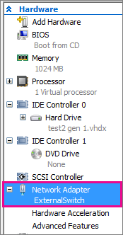

# Best practices for running FreeBSD on Hyper-V

>Applies To: Windows Server 2016, Hyper-V Server 2016, Windows Server 2012 R2, Hyper-V Server 2012 R2, Windows Server 2012, Hyper-V Server 2012, Windows Server 2008 R2, Windows 10, Windows 8.1, Windows 8, Windows 7.1, Windows 7

This topic contains a list of recommendations for running FreeBSD as a guest operating system on a Hyper-V virtual machine.

## Enable CARP in FreeBSD 10.2 on Hyper-V

The Common Address Redundancy Protocol (CARP) allows multiple hosts to share the same IP address and Virtual Host ID (VHID) to help provide high availability for one or more services. If one or more hosts fail, the other hosts transparently take over so users won't notice a service failure.To use CARP in FreeBSD 10.2, follow the instructions in the [FreeBSD handbook](https://www.freebsd.org/doc/en/books/handbook/carp.html) and do the following in Hyper-V Manager.

* Verify the virtual machine has a Network Adapter and it's assigned a virtual switch. Select the virtual machine and select **Actions** > **Settings**.



* Enable MAC address spoofing. To do this,

   1. Select the virtual machine and select **Actions** > **Settings**.

   2. Expand **Network Adapter** and select **Advanced Features**.

   3. Select **Enable MAC Address spoofing**.

## Create labels for disk devices

During startup, device nodes are created as new devices are discovered. This can mean that device names can change when new devices are added. If you get a ROOT MOUNT ERROR during startup, you should create labels for each IDE partition to avoid conflicts and changes. Tp learn how, see [Labeling Disk Devices](http://www.freebsd.org/doc/handbook/geom-glabel.html). Below are examples. 

> [!IMPORTANT]
> Make a backup copy of your fstab before making any changes.

1. Reboot the system into single user mode. This can be accomplished by selecting boot menu option 2 for FreeBSD 10.3+ (option 4 for FreeBSD 8.x), or performing a 'boot -s' from the boot prompt.

2. In Single user mode, create GEOM labels for each of the IDE disk partitions listed in your fstab (both root and swap). Below is an example of FreeBSD 10.3.

   ```bash
   # cat  /etc/fstab
   # Device           Mountpoint      FStype  Options   Dump   Pass#
   /dev/da0p2         /               ufs     rw        1       1
   /dev/da0p3         none            swap    sw        0       0

   # glabel  label rootfs  /dev/da0p2
   # glabel  label swap   /dev/da0p3
   # exit
   ```

   Additional information on GEOM labels can be found at: [Labeling Disk Devices](http://www.freebsd.org/doc/handbook/geom-glabel.html).

3. The system will continue with multi-user boot. After the boot completes, edit /etc/fstab and replace the conventional device names, with their respective labels. The final /etc/fstab will look like this:

   ```
   # Device                Mountpoint      FStype  Options         Dump    Pass#
   /dev/label/rootfs       /               ufs     rw              1       1
   /dev/label/swap         none            swap    sw              0       0

   ```

4.	The system can now be rebooted. If everything went well, it will come up normally and mount will show:
   
   ```
   # mount
   /dev/label/rootfs on / (ufs, local, journaled soft-updates)
   devfs on /dev (devfs, local, mutilabel)
   ```

## Use a wireless network adapter as the virtual switch

If the virtual switch on the host is based on wireless network adapter, reduce the ARP expiration time to 60 seconds by the following command. Otherwise the networking of the VM may stop working after a while.


```
   # sysctl net.link.ether.inet.max_age=60
```


See also

* [Supported FreeBSD virtual machines on Hyper-V](Supported-FreeBSD-virtual-machines-on-Hyper-V.md)
