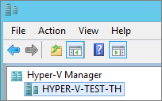
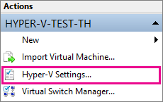
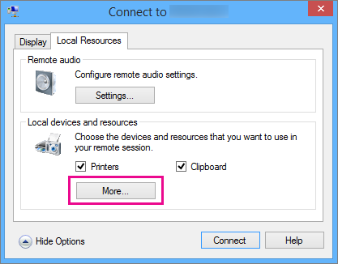
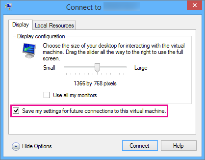

# Use local resources on Hyper-V virtual machine with VMConnect

>Applies To: Windows 10, Windows 8.1, Windows Server 2016, Windows Server 2012 R2

Virtual Machine Connection (VMConnect) lets you use a computer's local resources in a virtual machine, like a removable USB flash drive or a printer. You'll need a Hyper-V host with enhanced session mode and a Windows operating system as a guest. This article shows you how configure the host and then give the virtual machine access to a local resource.

Enhanced session mode also lets you resize the VMConnect window. 

Enhanced session mode isn't available for virtual machines that don't run Windows operating systems. For virtual machines that run Ubuntu, see [Changing Ubuntu Screen Resolution in a Hyper-V VM](https://blogs.msdn.microsoft.com/virtual_pc_guy/2014/09/19/changing-ubuntu-screen-resolution-in-a-hyper-v-vm/). 
  
## Turn on enhanced session mode on Hyper-V host  
If your Hyper-V host runs Windows 10 or Windows 8.1, enhanced session mode is on by default, so you can skip this and move to the next section. But if your host runs Windows Server 201612 or Windows Server 2012 R2, do this first. 
  
Turn on enhanced session mode:  

1.  Connect to the computer that hosts the virtual machine.  
  
2.  In Hyper-V Manager, select the host's computer name.  
  
      
  
3.  Select **Hyper-V settings**.  
  
      
  
4.  Under **Server**, select **Enhanced session mode policy**.  
  
      
  
5.  Select the **Allow enhanced session mode** check box.  
  
      
  
6.  Under **User**, select **Enhanced session mode**.  
  
      
  
7.  Select the **Allow enhanced session mode** check box.  
  
8.  Click **Ok**.  
  
## Choose a local resource

You can choose a local resource like a printer, the clipboard, or a local drive on the computer where you're running VMConnect.  
  
To choose a local resource:  
  
1.  Open VMConnect.  
  
2.  Select the virtual machine that you want to connect to.  
  
3.  Click **Show options**.  
  
      
  
4.  Select **Local resources**.  
  
      
  
5.  Click **More**.  
  
      
  
6.  Select the drive that you want to use on the virtual machine and click **Ok**.  
  
      
  
7.  Select **Save my settings for future connections to this virtual machine**.  
  
      
  
8.  Click **Connect**.  
  
## Edit VMConnect settings

You can easily edit your connection settings for VMConnect by running the following command in Windows PowerShell or the command prompt:  
  
`VMConnect.exe <ServerName> <VMName> /edit`  
  
## What's needed to use a computer's local resources?

To be able to use a computer's local resources on a virtual machine:  
  
-   The Hyper-V host must have **Enhanced session mode policy** and **Enhanced session mode** settings turned on.  
  
-   The computer that you use to connect to the virtual machine with VMConnect must run Windows 10, Windows 8.1, Windows Server 2016, or Windows Server 2012 R2.  
  
-   The virtual machine must have Remote Desktop Services enabled, and run Windows 10, Windows 8.1, Windows Server 2016, or Windows Server 2012 R2 as the guest operating system.  
  
If the computer running VMConnect and the virtual machine both meet the requirements, you can use any of the following local resources if they're available:  
  
-   Display configuration  
  
-   Audio  
  
-   Printers  
  
-   Clipboards for copy and paste  
  
-   Smart cards  
  
-   USB devices  
  
-   Drives  
  
-   Supported plug and play devices  
  
## Why use a computer's local resources?  
You might want use a computer's local resources to:  
  
-   Troubleshoot a virtual machine without a network connection to the virtual machine.  
  
-   Copy and paste files to and from the virtual machine in the same way you copy and paste using a Remote Desktop Connection (RDP).  
  
-   Sign in to the virtual machine by using a smart card.  
  
-   Print from a virtual machine to a local printer.  
  
-   Test and troubleshoot developer applications that require USB and sound redirection without using RDP.  
  
## See Also  
[Connect to a Virtual Machine](http://technet.microsoft.com/library/cc742407.aspx)  
[Should I create a generation 1 or 2 virtual machine in Hyper-V?](../plan/Should-I-create-a-generation-1-or-2-virtual-machine-in-Hyper-V.md)
  

