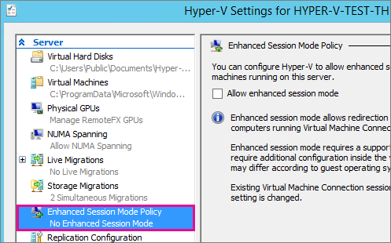
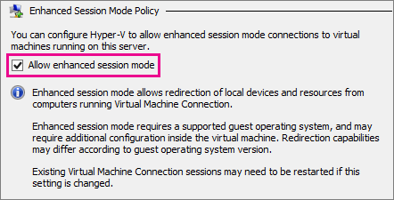
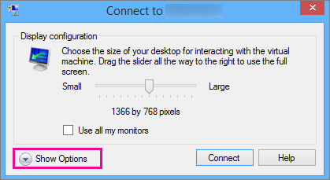

# Use local resources on Hyper-V virtual machine with VMConnect
You can give a virtual machine access to a computer’s local resources, like a removable USB flash drive, when you use Virtual Connection Manager \(VMConnect\). To make this happen, turn on enhanced session mode on the Hyper\-V host, use VMConnect to connect to the virtual machine, and before you connect, choose the local resource that you want to use.  
  
## Turn on enhanced session mode on Hyper\-V host  
If your Hyper\-V host runs [!INCLUDE[win8_client_2](../../../includes/win8_client_2_md.md)] or [!INCLUDE[winblue_client_2](../../../includes/winblue_client_2_md.md)], you might not have to go through the following steps to turn on enhanced session mode. It's turn on by default. But if your host runs [!INCLUDE[win8_server_2](../../../includes/win8_server_2_md.md)] or [!INCLUDE[winblue_server_2](../../../includes/winblue_server_2_md.md)], you must turn on enhanced session mode to use it. It is turned off by default for those operating systems.  
  
To turn on enhanced session mode,  
  
1.  Connect to the computer that hosts the virtual machine.  
  
2.  In Hyper\-V Manager, select the host’s computer name.  
  
      
  
3.  Select **Hyper\-V settings**.  
  
      
  
4.  Under **Server**, select **Enhanced session mode policy**.  
  
      
  
5.  Select the **Allow enhanced session mode** check box.  
  
      
  
6.  Under **User**, select **Enhanced session mode**.  
  
      
  
7.  Select the **Allow enhanced session mode** check box.  
  
8.  Click **Ok**.  
  
## Choose the local resource that you want to use  
You can choose a local resource like a printer, the clipboard or a local drive that’s on the computer that you’re using to connect to the VM.  
  
To select a local resource like a drive,  
  
1.  Open VMConnect.  
  
2.  Select the virtual machine that you want to connect to.  
  
3.  Click **Show options**.  
  
      
  
4.  Select **Local resources**.  
  
      
  
5.  Click **More**.  
  
      
  
6.  Select the drive that you want to use on the virtual machine and click **Ok**.  
  
      
  
7.  Select **Save my settings for future connections to this virtual machine**.  
  
      
  
8.  Click **Connect**.  
  
## Edit VMConnect settings  
You can easily edit your connection settings for VMConnect by running the following command in Windows PowerShell or the command prompt:  
  
`VMConnect.exe <ServerName> <VMName> /edit`  
  
## What’s needed to use a computer’s local resources?  
To be able to use a computer’s local resources on a virtual machine:  
  
-   The Hyper\-V host  must have **Enhanced session mode policy** and **Enhanced session mode** settings turned on.  
  
-   The computer that you use to connect to the virtual machine with VMConnect must run [!INCLUDE[win8_client_2](../../../includes/win8_client_2_md.md)], [!INCLUDE[winblue_client_2](../../../includes/winblue_client_2_md.md)], [!INCLUDE[win8_server_2](../../../includes/win8_server_2_md.md)], or [!INCLUDE[winblue_server_2](../../../includes/winblue_server_2_md.md)].  
  
-   The virtual machine must have Remote Desktop Services enabled and run [!INCLUDE[winblue_server_2](../../../includes/winblue_server_2_md.md)] or [!INCLUDE[winblue_client_2](../../../includes/winblue_client_2_md.md)] as the guest operating system.  
  
If your virtual machine fits those criteria, then you can use any of the following local resources available from the computer where you use VMConnect.  
  
-   Display configuration  
  
-   Audio  
  
-   Printers  
  
-   Clipboards for copy and paste  
  
-   Smart cards  
  
-   USB devices  
  
-   Drives  
  
-   Supported plug and play devices  
  
## Why use a computer’s local resources?  
You might want use a computer’s local resources to:  
  
-   Troubleshoot a virtual machine without a network connection to the virtual machine.  
  
-   Copy and paste files to and from the virtual machine in the same way you copy and paste using a Remote Desktop Connection \(RDP\).  
  
-   Sign in to the virtual machine by using a smart card.  
  
-   Print from a virtual machine to a local printer.  
  
-   Test and troubleshoot developer applications that require USB and sound redirection without using RDP.  
  
## See Also  
[Connect to a Virtual Machine](http://technet.microsoft.com/library/cc742407.aspx)  
  

