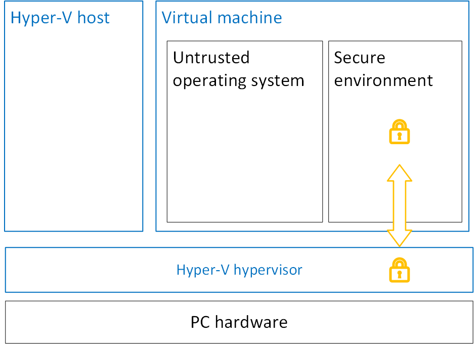

# Secure Hyper-V virtual machines using virtualization-based security

>Applies To: Windows 10, Windows Server 2016, Microsoft Hyper-V Server 2016

We recommend that you enable virtualization-based security (VBS) on generation 2 virtual machines (VMs) that run the Windows 10 Anniversary Update or Windows Server 2016. VBS is a new security technology that is available for Hyper-V hosts and guests that run Windows 10 and Windows Server 2016. VBS is on by default when you install Hyper-V on the host computer. But you have to manually turn on VBS in the guest virtual machines. 

VBS is part of the Microsoft Device Guard feature set. You can use VBS with other security technologies like Secure Boot, Shielded VMs, and Credential Guard to make your VMs even more secure. But you enable VBS on the guest virtual machine seperately from those technologies.

For more information about the related security technologies, see [Generation 2 virtual machine security settings for Hyper-V](https://technet.microsoft.com/en-us/windows-server-docs/compute/hyper-v/learn-more/Generation-2-virtual-machine-security-settings-for-Hyper-V), the [Device Guard deployment guide](https://technet.microsoft.com/itpro/windows/keep-secure/device-guard-deployment-guide), and [Guarded Fabric and Shielded VMs](https://technet.microsoft.com/windows-server-docs/security/Guarded-Fabric-and-Shielded-VMs).

## Enable VBS for a virtual machine
The steps to configure VBS in a virtual machine are identical to the steps taken in a physical machine. For instructions on how to do this, see the [Device Guard deployment guide](https://technet.microsoft.com/itpro/windows/keep-secure/device-guard-deployment-guide). 

## Disable or opt a virtual machine out of VBS
By default, you can enable VBS in any compatible virtual machine. You as a Hyper-V host administrator can opt-out of VBS for a guest VM by running the following PowerShell command on the Hyper-V host:
```powershell
Set-VMSecurity -VMName <VMName> -VirtualizationBasedSecurityOptOut $true
```

## How VBS works
In a VM, VBS provides a framework for isolating privileged code to run in an isolated environment outside of the normal operating system. This isolation protects secrets (like credentials) from the lesser-privileged and untrusted guest operating system. This solution is designed to protect secrets even if the guest kernel is exploited by malware. 

VBS leverages the Hyper-V hypervisor to isolate secrets from the untrusted guest operating system. The hypervisor provides a strong security boundary between the privileged and untrusted environments by using hardware virtualization extensions. This is the same hardware technology that is used to isolate virtual machines. The following diagram shows that the Hyper-V hypervisor handles the protection for the guest virtual machine.



### Protection from the host
When running in a VM, VBS protects secrets from untrusted parts of the guest operating system. This is to protect against exploits launched from within the VM. VBS running in a VM provides no additional protection from software running in the host.
For further protection from malicious host administrators, use [Guarded Fabric and Shielded VMs](https://technet.microsoft.com/windows-server-docs/security/Guarded-Fabric-and-Shielded-VMs).

## Compatibility of VBS and nested VMs
[Nested virtualization](https://msdn.microsoft.com/en-us/virtualization/hyperv_on_windows/user_guide/nesting) lets you use a virtual machine as a Hyper-V host and create virtual machines within that virtualized host. You can use VBS with nested virtualization. But this configuration is less secure than if you enabled VBS for a guest virtual machine on a physical Hyper-V host. VBS relies on hardware virtualization extensions to create a completely isolated environment in the guest operating system. With nested virtualization, these hardware extensions (Intel VT-X and EPT) are virtualized. This means that the nested hypervisor isn't directly programming the hardware. So this changes the security guarantees of VBS.  We recommend that you only use nested virtualization with VBS for demonstration and testing purposes.   

### VBS in a nested configuration
Virtualization based security is provided by the closest instance of Hyper-V. When you enable nested virtualization for a guest VM that has VBS running, there's no change to VBS. But when you install Hyper-V on that VM, then the underlying hypervisor on the physical host no longer plays a part in securing the VM. The nested instance of the Hyper-V host on the VM takes over protection of both the nested-enabled operating system and any nested guest virtual machines you create on that host. 

The following diagram shows that a physical Hyper-V host handles protection for a guest VM. But the nested instance of Hyper-V handles the protection of the nested-enabled OS and the nested guest virtual machine.


There are two major downsides to using nested virtualization with VBS enabled:

1.	The nested-enabled VM cannot make use of an IOMMU. So the guest operating system can still be susceptible to malicious device attacks.
2.	Security boundaries are now enforced by the nested hypervisor, which is running on virtual hardware. In the same way that VBS does not protect a VM from the host, VBS does not protect the nested hypervisor from the physical host.

Given these security limitations, you should carefully consider the security implications to your environment before enabling VBS and nested virtualization at the same time.

### Nesting VBS in a 3rd party VM
It's possible to run VBS in a VM that is provided by a 3rd party hypervisor that has nested virtualization technology enabled. The underlying hypervisor would not be Hyper-V, but it would expose virtualization extensions to a VM. If you installed Hyper-V on that nested-enabled VM, you could use the exposed virtualization extensions to run VBS in the VM. But we don't recommend this. This type of configuration is not supported, and is less secure than Hyper-V based deployments.
