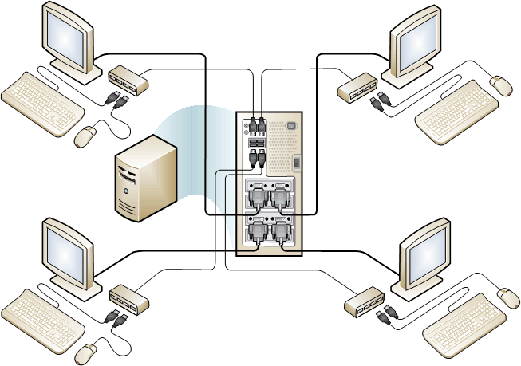
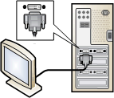
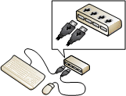

# Set up a direct-video-connected station in MultiPoint Services
On a direct video-connected station, the monitor is connected directly to a video port on the MultiPoint Server computer. A keyboard and mouse are then connected to a USB hub, and are associated with the monitor.  
  
The following illustration shows a MultiPoint Server environment that has a single MultiPoint Server computer and four direct-video-connected stations. For more information, see [MultiPoint Server Stations](MultiPoint-services-Stations.md).  
  
**MultiPoint Services system with four direct video connections**  
  
  
  
> [!NOTE]  
> To configure a direct-video-connected station, you must use a Latin keyboard (such as an English or Spanish language keyboard).  
  
## To set up a direct video-connected station  
  
1.  Connect the monitor cable to the video display port on the computer, as shown below.  
  
     
  
2.  Connect the power cord of the video monitor to a power outlet.  
  
3.  Connect a USB hub to an open USB port on the computer, as shown below.  
  
      
  
4.  Connect a keyboard and mouse to the USB station hub.  
  
      
  
5.  Connect any additional peripherals, such as headphones, to the USB hub.  
  
6.  If you are using an externally powered hub, connect the power cable of the hub to a power outlet.  
  
    > [!IMPORTANT]  
    > We strongly recommend the use of a powered hub. Erratic system behavior can result from under-current conditions.  
    >   
    > Users should not attach mice and keyboards directly to the USB ports of the computer. Doing so is likely to cause the incorrect association of multiple keyboards and mice to the same station, or to no station at all.  
  
7.  Follow the instructions that appear on the monitor to create the station.  
  
If you add more than one direct video-connected station to your MultiPoint Services environment, the primary station might change. You can easily find out which direct video connected station is your primary station.  
  
## To find out which direct video-connected station is the primary station  
  
1.  Turn on all monitors that are connected directly to the computer’s display adapters (video cards).  
  
2.  Start (or restart) the MultiPoint Services computer, and see which monitor displays the startup screens. That station is the primary station.  
  
    > [!NOTE]  
    > In some cases, BIOS startup information is displayed on multiple monitors simultaneously. In that case, any of the monitors can be considered the “primary station” for the purpose of accessing the BIOS.