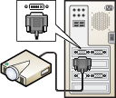

# Work with Video Devices
Learn how video devices, such as a monitor or projector, function when they are connected to a computer in your MultiPoint Services system or to a MultiPoint Services *station*.  
  
## Working with video monitors  
Depending on your MultiPoint Services system hardware, there are two ways to connect a video monitor:  
  
-   For *USB hub-based systems*, connect the video monitor cable to an open video port on the computer, as shown in the following illustration:  
  
      
  
-   For *multifunction hub-based systems* with built-in video support, connect the video monitor cable to the video port on the multifunction hub:  
  
      
  
For more information, see the [Set Up a Station](Set-Up-a-Station.md) topic.  
  
## Working with video projectors  
You can connect a video projector to your MultiPoint Services system when you want to project a large image to be viewed by others; for example, in a lab setting. For both USB hub-based and multifunction hub-based stations, you have two options for connecting a projector to a station:  
  
-   Replace a monitor with a projector and use the projector as the display device for that station, as shown in the following illustration:  
  
      
  
-   Obtain a video splitter device to connect both a projector and monitor to the station’s video port.  
  
    MultiPoint Services will display the same image on both display devices. When not projecting, you can turn the projector off and use just the video monitor.  
  
When using either option, note the following:  
  
-   Connecting a video display may require that you *associate the station* again so that MultiPoint Services can correctly recognize the new display. Follow the instructions that appear on the station’s video display device.  
  
-   You may need to obtain adapter or converter devices to convert between DVI and VGA plugs.  
  
-   Use of a “Y” splitter cable may decrease video quality on both video devices.  
  
-   When using both a projector and a monitor via a “Y” splitter cable, MultiPoint Services adjusts the screen resolution of both devices to the lowest maximum resolution of either device—most typically the projector.  
  
-   MultiPoint Services does not support extending a single station’s display across multiple monitors.  
  
## See Also  
[Manage Station Hardware](Manage-Station-Hardware.md)  
[Set Up a Station](Set-Up-a-Station.md) 