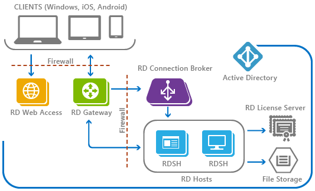

# Quick start for Remote Desktop Services in Azure

>Applies To: Windows Server 2016, Windows Server 2012 R2

Remote Desktop Services (RDS) is the platform of choice to cost-effectively host Windows desktops and applications. You can use an Azure marketplace offering or a Quickstart template to quickly create an RDS on IaaS deployment for testing and proof-of-concept purposes. Once set up, you can connect to the published desktops and applications from various platforms and devices, using the Microsoft Remote Desktop apps for Windows, Mac, iOS and Android.

## What does an RDS deployment in Azure look like?

Your RDS deployment in Azure includes the following: 

- 1 virtual machine as the domain controller 
- 2 virtual machines running the infrastructure components of RDS 
- Virtual machines running the Remote Desktop Session Host role. You can create as many endpoints (where users will connect and run applications) as you need. The default is 2.
- A public IP address to connect to your deployment and resources 
- All internal networking pieces 

There are two ways to create your RDS deployment in Azure:
- [Using the Azure Marketplace RDS offering](#basic-rds-through-the-azure-marketplace). Use this option to create a basic RDS deployment.
- [Using one of the Quickstart templates](#Customized-RDS-using-Quickstart-templates). Use this option to customize your deployment - for example, if you want to use an existing AD domain or a custom OS image (as opposed to the default Windows Server images available in Azure).

## Basic RDS through the Azure Marketplace

Creating your deployment through the Azure Marketplace is the quickest way to get up and running. The offering creates all the RDS components that you need - all you need to do is supply some information.

You'll need to supply the following information when you deploy the Marketplace offering:
- Administrator user name and password. This is a new user that will manage the deployment.
- DNS name and AD domain name. These are NEW resources that are created. Make sure the names are meaningful.
- VM size. You get to choose the size of VMs to use for the RDSH endpoints. You can also manually change the sizes after the initial deployment to help you optimize the VMs for your workloads and for cost.

Use these steps to create your small-footprint RDS deployment from the Azure Marketplace: 

1. Launch the Azure Marketplace RDS deployment:
   1. Sign into the [Azure portal](https://portal.azure.com).
   2. Click **New** to add your deployment.
   3. Type "RDS" in the search field and press Enter.
   4. Click **Remote Desktop Services (RDS) - Basic - Devtest**, and then click **Create**.
   5. Follow the steps in the portal to create and deploy RDS.
2. Connect to your deployment. When the deployment finishes, check the outputs section for final steps to complete and connect to your deployment.
   1. Download and run [this PowerShell script](https://gallery.technet.microsoft.com/Azure-Resource-Manager-4ea7e328) to install any certificates needed to connect to the RDS deployment. The script also starts RD Web in your browser.
   2. When prompted, sign into your Azure account. Select the Azure subscription, resource group, and public IP address created for this new deployment.
   3. The RD Web page lets you authenticate to your new deployment - sign in with the admin user and password you created during deployment. You can also send users this RD Web site to test their desktops and applications.

## Customized RDS using Quickstart templates

You can use Azure Resource Manager templates to deploy RDS in Azure. This is especially useful if you want a basic RDS deployment but have existing components (like AD) that you want to use. o	Unlike the Marketplace offering, you can make further customizations, such as use an existing AD on a virtual network, use a custom OS image for the RDSH VMs, and layer on high availability for RDS components. 

Use these steps to create your small-footprint RDS deployment from an Azure RDS template: 

1. Pick your Azure Quickstart template:
   1. Go to the [Azure Quickstart Templates](https://azure.microsoft.com/resources/templates/) site.
   2. Type "RDS" in the search box, and press Enter.
   3. Choose the template that matches what you are trying to do. Make sure you meet any prerequisites for that specific template. (For example, if you are want to use a custom image for your VMs, make sure you have already uploaded that image to an Azure storage account.)
   4. Click **Deploy to Azure**.
   5. You'll need to provide some details (like admin user name, AD domain name) in the Azure portal. This varies based on the template you choose.
   6. Click **Purchase**.
2. Connect to your deployment. When the deployment finishes, check the outputs section for final steps to complete and connect to your deployment.
   1. Download and run [this PowerShell script](https://gallery.technet.microsoft.com/Azure-Resource-Manager-4ea7e328) to install any certificates needed to connect to the RDS deployment. The script also starts RD Web in your browser.
   2. When prompted, sign into your Azure account. Select the Azure subscription, resource group, and public IP address created for this new deployment.
   3. The RD Web page lets you authenticate to your new deployment - sign in with the admin user and password you created during deployment. You can also send users this RD Web site to test their desktops and applications.
