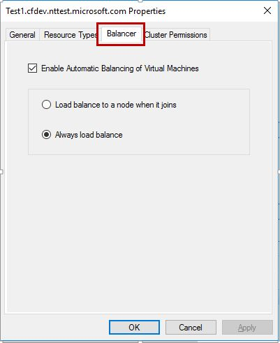

# Virtual Machine Load Balancing deep-dive

> Applies to: Windows Server (Semi-Annual Channel), Windows Server 2016

Windows Server 2016 introduces the [Virtual Machine Load Balancing feature](vm-load-balancing-overview.md) to optimize the utilization of nodes in a Failover Cluster. This document describes how to configure and control <abbr title="virtual machine">VM</abbr> Load Balancing. 

## <a id="heuristics-for-balancing"></a>Heuristics for balancing
<abbr title="Virtual machine">VM</abbr> Virtual Machine Load Balancing evaluates a node's load based on the following heuristics:
1. Current **memory pressure**: Memory is the most common resource constraint on a Hyper-V host
2. <abbr title="Central processing unit">CPU</abbr> **utilization** of the Node averaged over a 5 minute window: Mitigates a node in the cluster becoming over-committed

## <a id="controlling-aggressiveness-of-balancing"></a>Controlling the aggressiveness of balancing
The aggressiveness of balancing based on the Memory and CPU heuristics can be configured using the by the cluster common property 'AutoBalancerLevel'. To control the aggressiveness run the following in PowerShell:

```PowerShell
(Get-Cluster).AutoBalancerLevel = <value>
```

| AutoBalancerLevel | Aggressiveness | Behavior |
|-------------------|----------------|----------|
| 1 (default) | Low | Move when host is more than 80% loaded |
| 2 | Medium | Move when host is more than 70% loaded |
| 3 | High | Move when host is more than 60% loaded | 


## Controlling <abbr title="Virtual Machine">VM</abbr> Load Balancing
<abbr title="Virtual machine">VM</abbr> Load Balancing is enabled by default and when load balancing occurs can be configured by the cluster common property 'AutoBalancerMode'. To control when Node Fairness balances the cluster:

### Using Failover Cluster Manager:
1. Right-click on your cluster name and select the "Properties" option  
    

2.  Select the "Balancer" pane  
    

### Using PowerShell:
Run the following:
```powershell
(Get-Cluster).AutoBalancerMode = <value>
```

|AutoBalancerMode |Behavior| 
|:----------------:|:----------:|
|0| Disabled| 
|1| Load balance on node join| 
|2 (default)| Load balance on node join and every 30 minutes |

## <abbr title="Virtual Machine">VM</abbr> Load Balancing vs. System Center Virtual Machine Manager Dynamic Optimization
The node fairness feature, provides in-box functionality, which is targeted towards deployments without System Center Virtual Machine Manager (<abbr title="System Center Virtual Machine Manager">SCVMM</abbr>). <abbr title="System Center Virtual Machine Manager">SCVMM</abbr> Dynamic Optimization is the recommended mechanism for balancing virtual machine load in your cluster for <abbr title="System Center Virtual Machine Manager">SCVMM</abbr> deployments. <abbr title="System Center Virtual Machine Manager">SCVMM</abbr> automatically disables the Windows Server <abbr title="virtual machine">VM</abbr> Load Balancing when Dynamic Optimization is enabled.

## See Also
* [Virtual Machine Load Balancing Overview](vm-load-balancing-overview.md)
* [Failover Clustering](failover-clustering-overview.md)
* [Hyper-V Overview](../virtualization/hyper-v/Hyper-V-on-Windows-Server.md)
