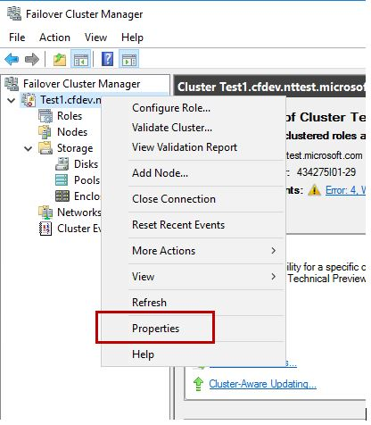

---
title: Virtual Machine Load Balancing Deep-Dive
ms.custom: na
ms.prod: windows-server-threshold
ms.reviewer: na
ms.suite: na
ms.technology:
  - techgroup-clustering
ms.tgt_pltfrm: na
ms.topic: article
author: bhattacharyaz
manager: eldenc
ms.author: subhatt
--- 
# Virtual Machine Load Balancing Deep-Dive
Windows Server 2016 introduces the Node Fairness feature to optimize the utilization of nodes in a Failover Cluster. During the lifecycle of your private cloud, certain operations (such as rebooting a node for patching), results in the Virtual Machines (VMs) in your cluster being moved. This could result in an unbalanced cluster where some nodes are hosting more VMs and others are underutilized (such as a freshly rebooted server). The Node Fairness feature seeks to identify over committed nodes and re-distribute VMs from those nodes. VMs are live migrated to idle nodes with no down time. Failure policies such as anti-affinity, fault domains and possible owners are honored. Thus, the Node Fairness feature seamlessly balances your private cloud.

## <a id="heuristics-for-balancing"></a>Heuristics for Balancing
Node Fairness evaluates a node’s load based on the following heuristics:
1. Current *Memory pressure*: Memory is the most common resource constraint on a Hyper-V host
2. CPU *utilization* of the Node averaged over a 5 minute window: Mitigates a node in the cluster becoming overcommitted

## <a id="controlling-aggressiveness-of-balancing"></a>Controlling Aggressiveness of Balancing

The aggressiveness of balancing based on the Memory and CPU heuristics can be configured using the by the cluster common property ‘AutoBalancerLevel’. To control the aggressiveness run the following in PowerShell:

```powershell
(Get-Cluster).AutoBalancerLevel = <value>
```

| AutoBalancerLevel | Aggressiveness | Behavior |
|:-------------------:|:----------------:|:----------:|
| 1 (default) | Low | Move when host is more than 80% loaded |
| 2 | Medium | Move when host is more than 70% loaded |
| 3 | High | Move when host is more than 60% loaded | 


## Controlling Node Fairness

Node Fairness is enabled by default and when load balancing occurs can be configured by the cluster common property ‘AutoBalancerMode’. To control when Node Fairness balances the cluster:

**Using Failover Cluster Manager:**

1. Right-click on your cluster name and select the “Properties” option



2.  Select the “Balancer” pane


**Using PowerShell:**

Run the following:
```powershell
(Get-Cluster).AutoBalancerMode = <value>
```

|AutoBalancerMode |Behavior| 
|:----------------:|:----------:|
|0| Disabled| 
|1| Load balance on node join| 
|2 (default)| Load balance on node join and every 30 minutes |

## Node Fairness vs. SCVMM Dynamic Optimization

The node fairness feature, provides in-box functionality, which is targeted towards deployments without System Center Virtual Machine Manager (SCVMM). SCVMM Dynamic Optimization is the recommended mechanism for balancing virtual machine load in your cluster for SCVMM deployments. SCVMM automatically disables the Node Fairness feature when Dynamic Optimization is enabled.