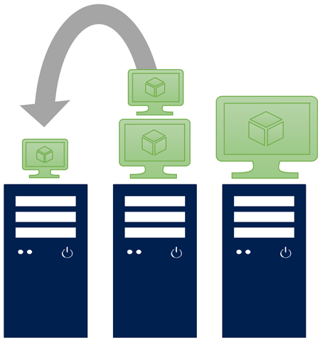

---
title: Virtual Machine Load Balancing Overview
ms.custom: na
ms.prod: windows-server-threshold
ms.reviewer: na
ms.suite: na
ms.technology:
  - techgroup-clustering
ms.tgt_pltfrm: na
ms.topic: article
author: bhattacharyaz
manager: eldenc
ms.author: subhatt
--- 
# Virtual Machine Load Balancing Overview
In our discussions with customers, we learned that a key consideration for private cloud deployments is the capital expenditure (CapEx) required to go into production. We also learned that customers added redundancy to their private clouds, thereby increasing CapEx, to avoid under-capacity during peak traffic in production. The need for redundancy is driven by unbalanced private clouds where some nodes are hosting more Virtual Machines (VMs) and others are underutilized (such as a freshly rebooted server).

During the lifecycle of your private cloud, certain operations (such as rebooting a node for patching) results in the VMs in your clusters being moved. This ultimately results in an unbalanced cluster. System Center Virtual Machine Manager (SCVMM) has a feature called Dynamic Optimization which automatically balances the utilization of your cluster. A consistent and vocal message we heard from you is the need for a similar solution for environments without SCVMM. VM Load Balancing thus provides an in-box feature in Windows Server to optimize your private cloud utilization.

## What is Virtual Machine Load Balancing?
VM Load Balancing is a new in-box feature in Windows Server 2016 that allows you to optimize the utilization of nodes in a Failover Cluster. It identifies over-committed nodes and re-distributes VMs from those nodes to under-committed nodes. Some of the salient aspects of this feature are as follows:

* *It is a zero-downtime solution*: VMs are live-migrated to idle nodes.
* *Seamless integration with your existing cluster environment*: Failure policies such as anti-affinity, fault domains and possible owners are honored.
* *Heuristics for balancing*: VM memory pressure and CPU utilization of the node.
* *Granular control*: Enabled by default. Can be activated on-demand or at a periodic interval.
* *Aggressiveness thresholds*: Three thresholds available based on the characteristics of your deployment.

## The Feature in Action

### A new node is added to your private cloud

When you add new capacity to your private cloud, the VM Load Balancing feature automatically balances capacity from the existing nodes in your private cloud, to the newly added capacity. Here is the flow of the steps:

1. The pressure is evaluated on the existing nodes in the private cloud.
2. All nodes exceeding threshold are identified.
3. The nodes with the highest pressure are identified to determine priority of balancing.
4. VMs are Live Migrated (with no down time) from a node exceeding threshold to a newly added node in the private cloud.

### Recurring load balancing

When configured for periodic balancing, the pressure on the cluster nodes is evaluated for balancing every 30 minutes. Alternately, the pressure can be evaluated on-demand. Here is the flow of the steps:

1. The pressure is evaluated on all nodes in the private cloud.
2. All nodes exceeding threshold and those below threshold are identified.
3. The nodes with the highest pressure are identified to determine priority of balancing.
4. VMs are Live Migrated (with no down time) from a node exceeding the threshold to node under minimum threshold.