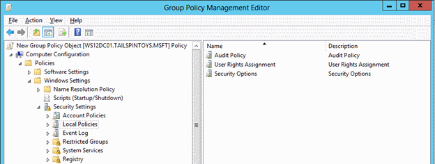
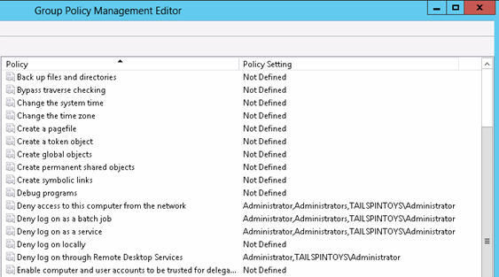
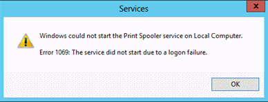

# Appendix G: Securing Administrators Groups in Active Directory
  
## Appendix G: Securing Administrators Groups in Active Directory  
As is the case with the Enterprise Admins \(EA\) and Domain Admins \(DA\) groups, membership in the built\-in Administrators \(BA\) group should be required only in build or disaster recovery scenarios. There should be no day\-to\-day user accounts in the Administrators group with the exception of the Built\-in Administrator account for the domain, if it has been secured as described in [Appendix D: Securing Built-In Administrator Accounts in Active Directory](../../../active-directory-domain-services/plan/security-best-practices/../../../active-directory-domain-services/plan/security-best-practices/Appendix-D--Securing-Built-In-Administrator-Accounts-in-Active-Directory.md).  
  
Administrators are, by default, the owners of most of the AD DS objects in their respective domains. Membership in this group may be required in build or disaster recovery scenarios in which ownership or the ability to take ownership of objects is required. Additionally, DAs and EAs inherit a number of their rights and permissions by virtue of their default membership in the Administrators group. Default group nesting for privileged groups in Active Directory should not be modified, and each domain’s Administrators group should be secured as described in the step\-by\-step instructions that follow.  
  
For the Administrators group in each domain in the forest:  
  
1.  Remove all members from the Administrators group, with the possible exception of the built\-in Administrator account for the domain, provided it has been secured as described in [Appendix D: Securing Built-In Administrator Accounts in Active Directory](../../../active-directory-domain-services/plan/security-best-practices/../../../active-directory-domain-services/plan/security-best-practices/Appendix-D--Securing-Built-In-Administrator-Accounts-in-Active-Directory.md).  
  
2.  In GPOs linked to OUs containing member servers and workstations in each domain, the DA group should be added to the following user rights in **Computer Configuration\\Policies\\Windows Settings\\Security Settings\\Local Policies\\ User Rights Assignment**:  
  
    -   Deny access to this computer from the network  
  
    -   Deny log on as a batch job  
  
    -   Deny log on as a service  
  
3.  At the domain controllers OU in each domain in the forest, the Administrators group should be granted the following user rights:  
  
    -   Access this computer from the network  
  
    -   Allow log on locally  
  
    -   Allow log on through Remote Desktop Services  
  
4.  Auditing should be configured to send alerts if any modifications are made to the properties or membership of the Administrators group.  
  
#### Step\-by\-Step Instructions for Removing All Members from the Administrators Group  
  
1.  In **Server Manager**, click **Tools**, and click **Active Directory Users and Computers**.  
  
2.  To remove all members from the Administrators group, perform the following steps:  
  
    1.  Double\-click the **Administrators** group and click the **Members** tab.  
  
          
  
    2.  Select a member of the group, click **Remove**, click **Yes**, and click **OK**.  
  
3.  Repeat step 2 until all members of the Administrators group have been removed.  
  
#### Step\-by\-Step Instructions to Secure Administrators Groups in Active Directory  
  
1.  In **Server Manager**, click **Tools**, and click **Group Policy Management**.  
  
2.  In the console tree, expand <Forest>\\Domains\\<Domain>, and then **Group Policy Objects** \(where <Forest> is the name of the forest and <Domain> is the name of the domain where you want to set the Group Policy\).  
  
3.  In the console tree, right\-click **Group Policy Objects**, and click **New**.  
  
      
  
4.  In the **New GPO** dialog box, type <GPO Name>, and click **OK** \(where *GPO Name* is the name of this GPO\).  
  
      
  
5.  In the details pane, right\-click **<GPO Name>**, and click **Edit**.  
  
6.  Navigate to **Computer Configuration\\Policies\\Windows Settings\\Security Settings\\Local Policies**, and click **User Rights Assignment**.  
  
      
  
7.  Configure the user rights to prevent members of the Administrators group from accessing member servers and workstations over the network by doing the following:  
  
    1.  Double\-click **Deny access to this computer from the network** and select **Define these policy settings**.  
  
    2.  Click **Add User or Group** and click **Browse**.  
  
    3.  Type **Administrators**, click **Check Names**, and click **OK**.  
  
          
  
    4.  Click **OK**, and **OK** again.  
  
8.  Configure the user rights to prevent members of the Administrators group from logging on as a batch job by doing the following:  
  
    1.  Double\-click **Deny log on as a batch job** and select **Define these policy settings**.  
  
    2.  Click **Add User or Group** and click **Browse**.  
  
    3.  Type **Administrators**, click **Check Names**, and click **OK**.  
  
          
  
    4.  Click **OK**, and **OK** again.  
  
9. Configure the user rights to prevent members of the Administrators group from logging on as a service by doing the following:  
  
    1.  Double\-click **Deny log on as a service** and select **Define these policy settings**.  
  
    2.  Click **Add User or Group** and click **Browse**.  
  
    3.  Type **Administrators**, click **Check Names**, and click **OK**.  
  
          
  
    4.  Click **OK**, and **OK** again.  
  
10. To exit **Group Policy Management Editor**, click **File**, and click **Exit**.  
  
11. In **Group Policy Management**, link the GPO to the member server and workstation OUs by doing the following:  
  
    1.  Navigate to the <Forest>\\Domains\\<Domain> \(where <Forest> is the name of the forest and <Domain> is the name of the domain where you want to set the Group Policy\).  
  
    2.  Right\-click the OU that the GPO will be applied to and click **Link an existing GPO**.  
  
          
  
    3.  Select the GPO that you just created and click **OK**.  
  
          
  
    4.  Create links to all other OUs that contain workstations.  
  
    5.  Create links to all other OUs that contain member servers.  
  
        > [!IMPORTANT]  
        > If jump servers are used to administer domain controllers and Active Directory, ensure that jump servers are located in an OU to which this GPOs is not linked.  
  
        > [!NOTE]  
        > When you implement restrictions on the Administrators group in GPOs, Windows applies the settings to members of a computer’s local Administrators group in addition to the domain’s Administrators group. Therefore, you should use caution when implementing restrictions in the Administrators group. Although prohibiting network, batch, and service logons for members of the Administrators group is advised wherever it is feasible to implement, do not restrict local logons or logons through Remote Desktop Services. Blocking these logon types can block legitimate administration of a computer by members of the local Administrators group.  
        >   
        > The following screen shot shows configuration settings that block misuse of built\-in local and domain Administrator accounts, in addition to misuse of built\-in local or domain Administrators groups. Note that the **Deny log on through Remote Desktop Services** user right does not include the Administrators group, because including it in this setting would also block these logons for accounts that are members of the local computer’s Administrators group. If services on computers are configured to run in the context of any of the privileged groups described in this section, implementing these settings can cause services and applications to fail. Therefore, as with all of the recommendations in this section, you should thoroughly test settings for applicability in your environment.  
  
          
  
#### Step\-by\-Step Instructions to Grant User Rights to the Administrators Group  
  
1.  In **Server Manager**, click **Tools**, and click **Group Policy Management**.  
  
2.  In the console tree, expand <Forest>\\Domains\\<Domain>, and then **Group Policy Objects** \(where <Forest> is the name of the forest and <Domain> is the name of the domain where you want to set the Group Policy\).  
  
3.  In the console tree, right\-click **Group Policy Objects**, and click **New**.  
  
      
  
4.  In the **New GPO** dialog box, type <GPO Name>, and click **OK** \(where <GPO Name> is the name of this GPO\).  
  
      
  
5.  In the details pane, right\-click **<GPO Name>**, and click **Edit**.  
  
6.  Navigate to **Computer Configuration\\Policies\\Windows Settings\\Security Settings\\Local Policies**, and click **User Rights Assignment**.  
  
      
  
7.  Configure the user rights to allow members of the Administrators group to access domain controllers over the network by doing the following:  
  
    1.  Double\-click **Access to this computer from the network** and select **Define these policy settings**.  
  
    2.  Click **Add User or Group** and click **Browse**.  
  
    3.  Click **Add User or Group** and click **Browse**.  
  
          
  
    4.  Click **OK**, and **OK** again.  
  
8.  Configure the user rights to allow members of the Administrators group to log on locally by doing the following:  
  
    1.  Double\-click **Allow log on locally** and select **Define these policy settings**.  
  
    2.  Click **Add User or Group** and click **Browse**.  
  
    3.  Type **Administrators**, click Check **Names**, and click **OK**.  
  
          
  
    4.  Click **OK**, and **OK** again.  
  
9. Configure the user rights to allow members of the Administrators group to log on through Remote Desktop Services by doing the following:  
  
    1.  Double\-click **Allow log on through Remote Desktop Services** and select **Define these policy settings**.  
  
    2.  Click **Add User or Group** and click **Browse**.  
  
    3.  Type **Administrators**, click **Check Names**, and click **OK**.  
  
          
  
    4.  Click **OK**, and **OK** again.  
  
10. To exit **Group Policy Management Editor**, click **File**, and click **Exit**.  
  
11. In **Group Policy Management**, link the GPO to the domain controllers OU by doing the following:  
  
    1.  Navigate to the <Forest>\\Domains\\<Domain> \(where <Forest> is the name of the forest and <Domain> is the name of the domain where you want to set the Group Policy\).  
  
    2.  Right\-click the domain controllers OU and click **Link an existing GPO**.  
  
          
  
    3.  Select the GPO that you just created and click **OK**.  
  
          
  
#### Verification Steps  
  
##### Verify “Deny access to this computer from the network” GPO Settings  
From any member server or workstation that is not affected by the GPO changes \(such as a “jump server”\), attempt to access a member server or workstation over the network that is affected by the GPO changes. To verify the GPO settings, attempt to map the system drive by using the **NET USE** command.  
  
1.  Log on locally using an account that is a member of the Administrators group.  
  
2.  With the mouse, move the pointer into the upper\-right or lower\-right corner of the screen. When the **Charms** bar appears, click **Search**.  
  
3.  In the **Search** box, type **command prompt**, right\-click **Command Prompt**, and then click **Run as administrator** to open an elevated command prompt.  
  
4.  When prompted to approve the elevation, click **Yes**.  
  
      
  
5.  In the **Command Prompt** window, type **net use \\\\<Server Name>\\c$**, where <Server Name> is the name of the member server or workstation you’re attempting to access over the network.  
  
6.  The following screen shot shows the error message that should appear.  
  
      
  
##### Verify “Deny log on as a batch job” GPO Settings  
From any member server or workstation affected by the GPO changes, log on locally.  
  
###### Create a Batch File  
  
1.  With the mouse, move the pointer into the upper\-right or lower\-right corner of the screen. When the **Charms** bar appears, click **Search**.  
  
2.  In the **Search** box, type **notepad**, and click **Notepad**.  
  
3.  In **Notepad**, type **dir c:**.  
  
4.  Click **File**, and click **Save As**.  
  
5.  In the **File name** field, type **<Filename>.bat** \(where <Filename> is the name of the new batch file\).  
  
###### Schedule a Task  
  
1.  With the mouse, move the pointer into the upper\-right or lower\-right corner of the screen. When the **Charms** bar appears, click **Search**.  
  
2.  In the **Search** box, type **task scheduler**, and click **Task Scheduler**.  
  
    > [!NOTE]  
    > On computers running Windows 8, in the Search box, type schedule tasks, and click Schedule tasks.  
  
3.  Click **Action**, and click **Create Task**.  
  
4.  In the **Create Task** dialog box, type **<Task Name>** \(where <Task Name> is the name of the new task\).  
  
5.  Click the **Actions** tab, and click **New**.  
  
6.  In the **Action** field, select **Start a program**.  
  
7.  In the **Program\/script** field, click **Browse**, locate and select the batch file created in the **Create a Batch File** section, and click **Open**.  
  
8.  Click **OK**.  
  
9. Click the **General** tab.  
  
10. In the **Security options** field, click **Change User or Group**.  
  
11. Type the name of an account that is a member of the Administrators group, click **Check Names**, and click **OK**.  
  
12. Select **Run whether the user is logged onor not** and **Do not store password**. The task will only have access to local computer resources.  
  
13. Click **OK**.  
  
14. A dialog box should appear, requesting user account credentials to run the task.  
  
15. After entering the password, click **OK**.  
  
16. A dialog box similar to the following should appear.  
  
      
  
##### Verify “Deny log on as a service” GPO Settings  
  
1.  From any member server or workstation affected by the GPO changes, log on locally.  
  
2.  With the mouse, move the pointer into the upper\-right or lower\-right corner of the screen. When the **Charms** bar appears, click **Search**.  
  
3.  In the **Search** box, type **services**, and click **Services**.  
  
4.  Locate and double\-click **Print Spooler**.  
  
5.  Click the **Log On** tab.  
  
6.  In the **Log on as** field, select **This account**.  
  
7.  Click **Browse**, type the name of an account that is a member of the Administrators group, click **Check Names**, and click **OK**.  
  
8.  In the **Password** and **Confirm password** fields, type the selected account’s password, and click **OK**.  
  
9. Click **OK** three more times.  
  
10. Right\-click **Print Spooler** and click **Restart**.  
  
11. When the service is restarted, a dialog box similar to the following should appear.  
  
      
  
##### Revert Changes to the Printer Spooler Service  
  
1.  From any member server or workstation affected by the GPO changes, log on locally.  
  
2.  With the mouse, move the pointer into the upper\-right or lower\-right corner of the screen. When the **Charms** bar appears, click **Search**.  
  
3.  In the **Search** box, type **services**, and click **Services**.  
  
4.  Locate and double\-click **Print Spooler**.  
  
5.  Click the **Log On** tab.  
  
6.  In the **Log on as** field, click **Local System** account, and click **OK**.  
  

