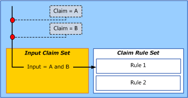
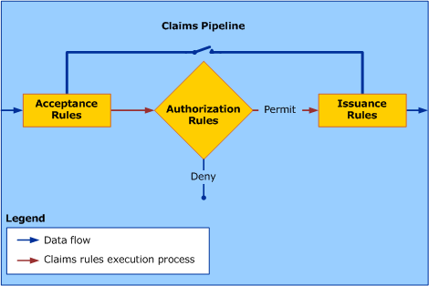

# The Role of the Claims Engine
At its highest level, the claims engine in Active Directory Federation Services \(AD FS\) is a rule\-based engine that is dedicated to serving and processing claim requests for the Federation Service. The claims engine is the sole entity within the Federation Service that is responsible for running each of the rule sets across all of the federated trust relationships you have configured and handing the output result over to the claims pipeline.

While the claims pipeline is more a logical concept of the end\-to\-end process for flowing claims, claim rules are an actual administrative element that you can use to customize the flow of claims during the claim rules execution process. For more information about the pipeline process, see [The Role of the Claims Pipeline](../../../../active-directory-federation-services/plan/tech-ref/key-concepts/../../../../active-directory-federation-services/plan/tech-ref/key-concepts/../../../../active-directory-federation-services/plan/tech-ref/key-concepts/the-role-claims-pipeline.md).

As shown in the following illustration, the act of accepting incoming claims \(acceptance rules\), authorizing claims requesters \(authorization rules\) and issuing outgoing claims \(issuance rules\) through claim rules across all of the federated trust relationships in your organization is performed by the claims engine.

## Claim rules execution process
When you configure a claims provider trust or relying party trust in your organization with claim rules, the claim rule set\(s\) for that trust act as a gatekeeper for incoming claims by invoking the claims engine to apply the necessary logic in the claim rules to determine whether to issue any claims and which claims to issue.

The following section outlines each of the steps that occur by the engine during the flow of claims through the claim rules execution process. Each of the steps as outlined below occurs for each stage described in the claims pipeline process. These steps include:

-   Step 1 – Initialization

-   Step 2 – Execution

-   Step 3 – Execution result

For more information about the pipeline process, see [The Role of the Claims Pipeline](../../../../active-directory-federation-services/plan/tech-ref/key-concepts/../../../../active-directory-federation-services/plan/tech-ref/key-concepts/../../../../active-directory-federation-services/plan/tech-ref/key-concepts/the-role-claims-pipeline.md).

### Step 1 – Initialization
In the first step of the claim rules execution process, the claims engine accepts incoming claims by first adding them to the *input claim set*. An input claim set is analogous to a cache in memory that is used to temporarily store data only as long as a required process requires that data to be made available for retrieval. The input claim set data is discarded after the rule execution finishes.

#### Adding a claim to the input claim set for a rule set
The input claim set is created by the claims engine when it needs to temporarily store claim data in memory while it processes the logic associated with a claim rule set. The claims engine copies all of the incoming claims to the input claim set where they can be retrieved by the first rule in the rule set.

For example, in the illustration below, the claims engine reads the claims of A and B from the incoming claims and copies them to the input claim set. After they are in the input claim set, the claims engine retrieves and processes claims A and B as input for the logic in the first rule in the claim rule set.

All the rules in a claim rule set share the same input claim set. Each rule in that set can add to the shared input claim set, thus affecting all subsequent rules in the set.

### Step 2 – Execution
In this step of the claim rules process, claim rules are processed when the claims engine chronologically steps through all of the rules within a particular rule set one at a time. Each rule within a rule set only runs once and is executed in the order in which they appear from top to bottom as displayed in the Edit Claim Rules dialog box in the AD FS Management snap\-in. The claim rule that is at the top of the rule set is processed first and then subsequent rules are processed until all of the rules have been run.

As defined in the claim rule language, a claim rule consists of two parts, condition and issuance statement. The claims engine first processes the condition part by using the data in the input claim set to determine whether the condition specified within the rule holds true for the claims contained in the input claim set \(the claims that match the rule’s condition are referred to as a matching claims\). If any matching claims are found, the claims engine executes the issuance statement of the rule for each set of the matching claims. The issuance statement of the rule can perform either of the following tasks with matching claims:

1.  Copy a matching claim into the output claim set

2.  Transform the claim fields and create a new claim in either just the input claim set or in both evaluation and output claim sets.

3.  Use the matching claim\(s\) as a key to lookup more information from an attribute store to create new claim\(s\) in either just the input claim set or in both input and output claim sets.

#### Adding a claim to the output claim set for a rule set
The *output claim set* is a location in memory that is initially empty and is important because the claims engine will only return claims that reside in the output claim set after the execution process completes. This means that any claims that reside only in the input claim set and not in the output claim set will be ignored when it comes time to calculate the final set of outgoing claims.

#### Adding a claim to both claim sets for a rule set
As a rule is processed, claims are either added in the input claim set or in both the input claim set and output claim set based on the statement that’s used in the rule’s issuance statement. The claim rule language refers to these statements as either *add* or *issue*.

If the *add* statement is used, the claims are added to just the input claim set and the claims will exist only for the purposes of the execution and will cease to exist once the execution completes. If the *issue* statement is used, the claims are added to both the input claim set and the output claim set and the claims will be returned in the output claim set once the execution completes. For more information about these statements, see [The Role of the Claim Rule Language](../../../../active-directory-federation-services/plan/tech-ref/key-concepts/the-role-claim-rule-language.md).

If the condition part of a rule within a rule set does not match any claims in the input claim set, the issuance statement part of the rule is ignored and thus no claims are added to either the output claim set or to the input claim set. The following illustration and corresponding steps show what happens when the claims engine executes a transform rule:

1.  Incoming claims are added to the input claim set by the claims engine.

2.  When the first rule executes, it sees the A and B claims, which are at that moment in time the only claims in the input claim set, and processes the conditional part of the rule logic in rule 1.

3.  Since the A claim is present in the input claim set, the condition of the rule is determined to be true \(matching the claim A\) and a new C claim is added to both the input claim set and the output claim set.

4.  Rule 2 can now use the A, B and C claims \(all claims in the input claim set\) as input for processing its logic.

For more information about claims transformation, see [When to Use a Transform Claim Rule](When-to-Use-a-Transform-Claim-Rule.md).

### Step 3 – Execution Result
The final stage of the claim rule set execution begins once all rules have been run within a given rule set and the final set of claims is present in the output claim set. At this point, the claims engine returns the context of the output claim set as the output of the rule set execution. From this point forward it is the claims pipeline that takes over and moves this final output to the next stage in its process.

## Sending the execution output to the claims pipeline
When the claims engine processes a rule set, that rule set has its own dedicated locations in memory for its input and output claim sets. This means that the input and output claim sets used by one rule set are separate from the input and output claim sets used in another rule set.

After the entire process has run for a give rule set \(steps 1, 2, and 3\), the newly issued outgoing claims \(content of the output claim set\) will be used as input to the next rule set in the claims pipeline. This allows for claims to flow from the output of one rule set to the input for another rule set, as shown in the following illustration.

> [!NOTE]
> Although the issuance rule set is also a critical stage in the pipeline, the illustration above does not show it only for purposes of simplifying the illustration. For an illustration that shows the issuance rule set and how it fits into the claims pipeline, see [The Role of the Claims Pipeline](../../../../active-directory-federation-services/plan/tech-ref/key-concepts/../../../../active-directory-federation-services/plan/tech-ref/key-concepts/../../../../active-directory-federation-services/plan/tech-ref/key-concepts/the-role-claims-pipeline.md).

In this case, the output of the acceptance rules is used by the pipeline to flow the final set of claims produced by the acceptance rules to the second stage in the pipeline, which is the processing of authorization rules. At this point, the entire claim rules execution process \(steps 1, 2, and 3 above\) would run again for the authorization rule set. This cycle continues until the issuance rule set \(the final stage in the pipeline\) has been completed.

Once the finalized outgoing claims have been returned from the engine for the issuance rule set, they will be packaged into a SAML token and the Federation Service will send the token back to the client.

## Processing authorization rules
If the claim rule set that is being executed during step 2 of the claim rules execution process consists of Authorization rules \(which have a different input and output claim sets than either acceptance or issuance rules\), then those authorization rules will run to determine whether a token requester is authorized to obtain a security token for a given relying party from the Federation Service based on the requester’s claims.

The goal of authorization rules is to issue a permit or deny claim based on whether the user is to be allowed to obtain a token for the given relying party or not. As shown in the following illustration, the output of the authorization execution is used by the pipeline to determine whether the issuance rule set is executed or not—based on presence or absence of the permit and\/or deny claim—but the authorization execution output itself is not used as an input to the claim rule set.

For more information about claims authorization, see [When to Use an Authorization Claim Rule](../../../../active-directory-federation-services/plan/tech-ref/key-concepts/claim-rule-template/when-use-authorization-claim-rule.md).

