# Demoting Domain Controllers and Domains (Level 200)

>Applies To: Windows Server Technical Preview

This topic explains how to remove AD DS, using Server Manager or Windows PowerShell.  
  
-   [AD DS Removal Workflow](../../ad-ds/deploy/Demoting-Domain-Controllers-and-Domains--Level-200-.md#BKMK_Workflow)  
  
-   [Demotion and Role Removal Windows PowerShell](../../ad-ds/deploy/Demoting-Domain-Controllers-and-Domains--Level-200-.md#BKMK_PS)  
  
-   [Demote](../../ad-ds/deploy/Demoting-Domain-Controllers-and-Domains--Level-200-.md#BKMK_Demote)  
  
## <a name="BKMK_Workflow"></a>AD DS Removal Workflow  
  
  
> [!CAUTION]  
> Removing the AD DS roles with Dism.exe or the Windows PowerShell DISM module after promotion to a Domain Controller is not supported and will prevent the server from booting normally.  
>   
> Unlike Server Manager or the ADDSDeployment module for Windows PowerShell, DISM is a native servicing system that has no inherent knowledge of AD DS or its configuration. Do not use Dism.exe or the Windows PowerShell DISM module to uninstall the AD DS role unless the server is no longer a domain controller.  
  
## <a name="BKMK_PS"></a>Demotion and Role Removal Windows PowerShell  
  
|||  
|-|-|  
|**ADDSDeployment and ServerManager Cmdlets**|Arguments (**Bold** arguments are required. *Italicized* arguments can be specified by using Windows PowerShell or the AD DS Configuration Wizard.)|  
|Uninstall-AddsDomainController|-SkipPreChecks<br /><br />*-LocalAdministratorPassword*<br /><br />-Confirm<br /><br />***-Credential***<br /><br />-DemoteOperationMasterRole<br /><br />*-DNSDelegationRemovalCredential*<br /><br />-Force<br /><br />*-ForceRemoval*<br /><br />*-IgnoreLastDCInDomainMismatch*<br /><br />*-IgnoreLastDNSServerForZone*<br /><br />*-LastDomainControllerInDomain*<br /><br />-Norebootoncompletion<br /><br />*-RemoveApplicationPartitions*<br /><br />*-RemoveDNSDelegation*<br /><br />-RetainDCMetadata|  
|Uninstall-WindowsFeature/Remove-WindowsFeature|***-Name***<br /><br />***-IncludeManagementTools***<br /><br />*-Restart*<br /><br />-Remove<br /><br />-Force<br /><br />-ComputerName<br /><br />-Credential<br /><br />-LogPath<br /><br />-Vhd|  
  
> [!NOTE]  
> The **-credential** argument is only required if you are not already logged on as a member of the Enterprise Admins group (demoting last DC in a domain) or the Domain Admins group (demoting a replica DC).The **-includemanagementtools** argument is only required if you want to remove all of the AD DS management utilities.  
  
## <a name="BKMK_Demote"></a>Demote  
  
### Remove Roles and Features  
Server Manager offers two interfaces to removing the Active Directory Domain Services role:  
  
-   The **Manage** menu on the main dashboard, using **Remove Roles and Features**  
  
 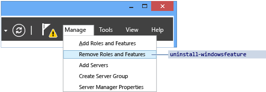  
  
-   Click **AD DS** or **All Servers** on the navigation pane. Scroll down to the **Roles and Features** section. Right-click **Active Directory Domain Services** in the **Roles and Features** list and click **Remove Role or Feature**. This interface skips the **Server Selection** page.  
  
   
  
The ServerManager cmdlets **Uninstall-WindowsFeature** and **Remove-WindowsFeature** prevent you from removing the AD DS role until you demote the domain controller.  
  
### Server Selection  
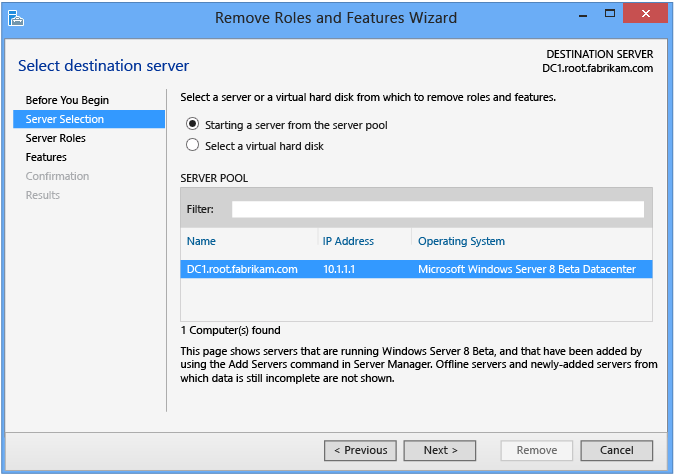  
  
The **Server Selection** dialog enables you to choose from one of the servers previously added to the pool, as long as it is accessible. The local server running Server Manager is always automatically available.  
  
### Server Roles and Features  
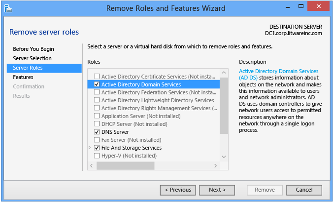  
  
Clear the **Active Directory Domain Services** check box to demote a domain controller; if the server is currently a domain controller, this does not remove the AD DS role and instead switches to a **Validation Results** dialog with the offer to demote. Otherwise, it simply removes the binaries like any other role feature.  
  
-   Do not remove any other AD DS-related roles or features - such as DNS, GPMC, or the RSAT tools - if you intend to promote the domain controller again immediately. Removing additional roles and feature increases the time to re-promote, as Server Manager reinstalls these features when you reinstall the role.  
  
-   Remove unneeded AD DS roles and features at your own discretion if you intend to demote the domain controller permanently. This requires clearing the check boxes for those roles and features.  
  
    The full list of AD DS-related roles and features include:  
  
    -   Active Directory Module for Windows PowerShell feature  
  
    -   AD DS and AD LDS Tools feature  
  
    -   Active Directory Administrative Center feature  
  
    -   AD DS Snap-ins and Command-line Tools feature  
  
    -   DNS Server  
  
    -   Group Policy Management Console  
  
The equivalent ADDSDeployment and ServerManager Windows PowerShell cmdlets are:  
  
```  
Uninstall-addsdomaincontroller  
Uninstall-windowsfeature  
  
```  
  
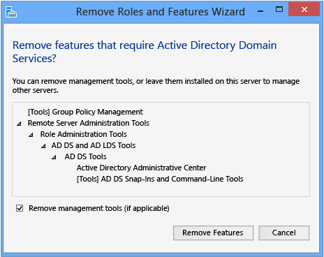  
  
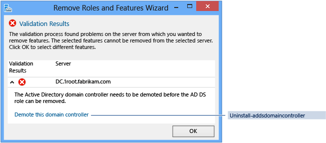  
  
### Credentials  
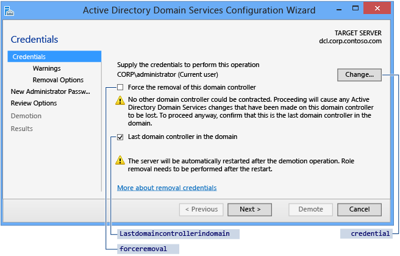  
  
You configure demotion options on the **Credentials** page. Provide the credentials necessary to perform the demotion from the following list:  
  
-   Demoting an additional domain controller requires Domain Admin credentials. Selecting **Force removal of the domain controller** demotes the domain controller without removing the domain controller object’s metadata from Active Directory.  
  
    > [!WARNING]  
    > Do not select this option unless the domain controller cannot contact other domain controllers and there is *no reasonable way* to resolve that network issue. Forced demotion leaves orphaned metadata in Active Directory on the remaining domain controllers in the forest. In addition, all un-replicated changes on that domain controller, such as passwords or new user accounts, are lost forever. Orphaned metadata is the root cause in a significant percentage of Microsoft Customer Support cases for AD DS, Exchange, SQL, and other software.  
    >   
    > If you forcibly demote a domain controller, you *must* manually perform metadata cleanup immediately. For steps, review [Clean Up Server Metadata](http://technet.microsoft.com/library/cc816907(WS.10).aspx).  
  
   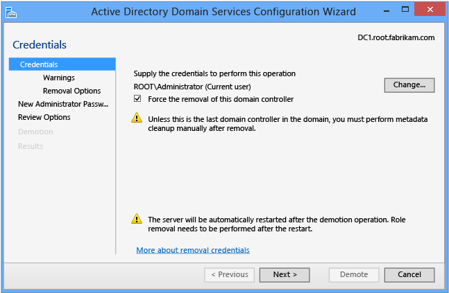  
  
-   Demoting the last domain controller in a domain requires Enterprise Admins group membership, as this removes the domain itself (if the last domain in the forest, this removes the forest). Server Manager informs you if the current domain controller is the last domain controller in the domain. Select the **Last domain controller in the domain** check box to confirm the domain controller is the last domain controller in the domain.  
  
The equivalent ADDSDeployment Windows PowerShell arguments are:  
  
```  
-credential <pscredential>  
-forceremoval <{ $true | false }>  
-lastdomaincontrollerindomain <{ $true | false }>  
  
```  
  
### Warnings  
  
  
The **Warnings** page alerts you to the possible consequences of removing this domain controller. To continue, you must select **Proceed with removal**.  
  
> [!WARNING]  
> If you previously selected **Force the removal of this domain controller** on the **Credentials** page, then the **Warnings** page shows all Flexible Single Master Operations roles hosted by this domain controller. You *must* seize the roles from another domain controller *immediately* after demoting this server. For more information on seizing FSMO roles, see [Seize the Operations Master Role](http://technet.microsoft.com/library/cc816779(WS.10).aspx).  
  
This page does not have an equivalent ADDSDeployment Windows PowerShell argument.  
  
### Removal Options  
  
  
The **Removal Options** page appears depending on previously selecting **Last domain controller in the domain** on the **Credentials** page. This page enables you to configure additional removal options. Select **Ignore last DNS server for zone**, **Remove application partitions**, and **Remove DNS Delegation** to expose the **Next** button.  
  
The options only appear if applicable to this domain controller. For instance, if there is no DNS delegation for this server then that checkbox will not display.  
  
Click **Change** to specify alternate DNS administrative credentials. Click **View Partitions** to view additional partitions the wizard removes during the demotion. By default, the only additional partitions are Domain DNS and Forest DNS Zones. All other partitions are non-Windows partitions.  
  
The equivalent ADDSDeployment cmdlet arguments are:  
  
```  
-ignorelastdnsserverforzone <{ $true | false }>  
-removeapplicationpartitions <{ $true | false }>  
-removednsdelegation <{ $true | false }>  
-dnsdelegationremovalcredential <pscredential>  
```  
  
### New Administrator Password  
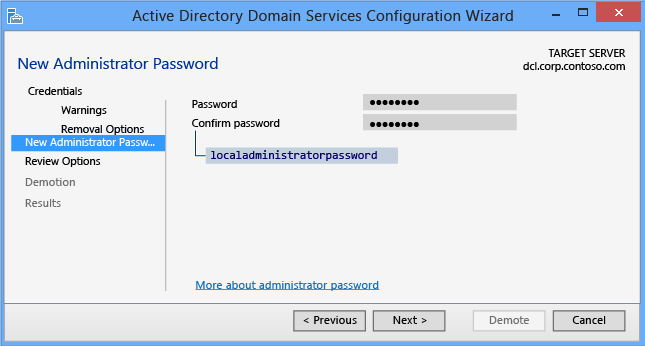  
  
The **New Administrator Password** page requires you to provide a password for the built-in local computer’s Administrator account, once the demotion completes and the computer becomes a domain member server or workgroup computer.  
  
The **Uninstall-ADDSDomainController** cmdlet and arguments follow the same defaults as Server Manager if not specified.  
  
The **LocalAdministratorPassword** argument is special:  
  
-   If *not specified* as an argument, then the cmdlet prompts you to enter and confirm a masked password. This is the preferred usage when running the cmdlet interactively  
  
-   If specified *with a value*, then the value must be a secure string. This is not the preferred usage when running the cmdlet interactively  
  
For example, you can manually prompt for a password by using the **Read-Host** cmdlet to prompt the user for a secure string  
  
```  
-localadministratorpassword (read-host -prompt "Password:" -assecurestring)  
  
```  
  
> [!WARNING]  
> As the previous two options do not confirm the password, use extreme caution: the password is not visible  
  
You can also provide a secure string as a converted clear-text variable, although this is highly discouraged. For example:  
  
```  
-localadministratorpassword (convertto-securestring "Password1" -asplaintext -force)  
  
```  
  
> [!WARNING]  
> Providing or storing a clear text password is not recommended. Anyone running this command in a script or looking over your shoulder knows the local administrator password of that computer. With that knowledge, they have access to all of its data and can impersonate the server itself.  
  
### Confirmation  
  
  
The **Confirmation** page shows the planned demotion; the page does not list demotion configuration options. This is the last page the wizard shows before the demotion begins. The View Script button creates a Windows PowerShell demotion script.  
  
Click **Demote** to run the following AD DS Deployment cmdlet:  
  
```  
Uninstall-DomainController  
  
```  
  
Use the optional **Whatif** argument with the **Uninstall-ADDSDomainController** and cmdlet to review configuration information. This enables you to see the explicit and implicit values of a cmdlet's arguments.  
  
For example:  
  
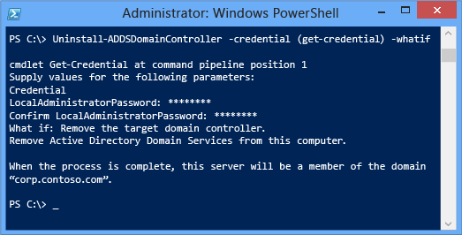  
  
The prompt to restart is your last opportunity to cancel this operation when using ADDSDeployment Windows PowerShell. To override that prompt, use the **-force** or **confirm:$false** arguments.  
  
### Demotion  
  
  
When the **Demotion** page displays, the domain controller configuration begins and cannot be halted or canceled. Detailed operations display on this page and write to logs:  
  
-   %systemroot%\debug\dcpromo.log  
  
-   %systemroot%\debug\dcpromoui.log  
  
Since **Uninstall-AddsDomainController** and **Uninstall-WindowsFeature** only have one action apiece, they are shown here in the Confirmation phase with the minimum required arguments. Pressing ENTER starts the irrevocable demotion process and restarts the computer.  
  
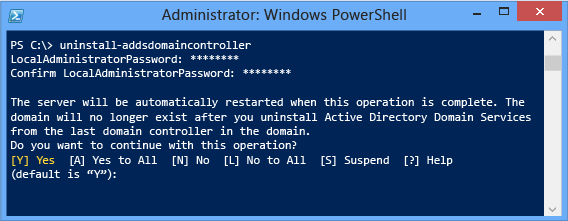  
  
  
  
To accept the reboot prompt automatically, use the **-force** or **-confirm:$false** arguments with any ADDSDeployment Windows PowerShell cmdlet. To prevent the server from automatically rebooting at the end of promotion, use the **-norebootoncompletion:$false** argument.  
  
> [!WARNING]  
> Overriding the reboot is discouraged. The member server must reboot to function correctly.  
  
  
  
Here is an example of forcibly demoting with its minimal required arguments of **-forceremoval** and **-demoteoperationmasterrole**. The **-credential** argument is not required because the user logged on as a member of the Enterprise Admins group:  
  
  
  
Here is an example of removing the last domain controller in the domain with its minimal required arguments of **-lastdomaincontrollerindomain** and **-removeapplicationpartitions**:  
  
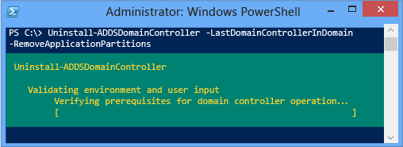  
  
If you attempt to remove the AD DS role before demoting the server, Windows PowerShell blocks you with an intentional error:  
  
```  
Uninstall-WindowsFeature : An uninstallation prerequisite step failed duringthe removal of AD-Domain-Services, and uninstallation cannot continue.1. The domain controller needs to be demoted before the Active DirectoryDomain Services Role can be uninstalled.  
```  
  
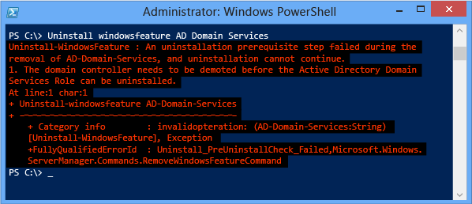  
  
> [!IMPORTANT]  
> You must restart the computer after demoting the server before you can remove the AD-Domain-Services role binaries.  
  
### Results  
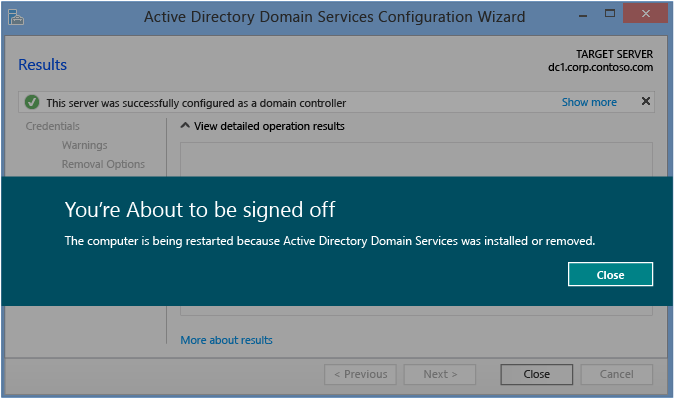  
  
The **Results** page shows the success or failure of the promotion and any important administrative information. The domain controller will automatically reboot after 10 seconds.  
  

