# Install a New Windows Server 2012 Active Directory Forest (Level 200)

>Applies To: Windows Server 2016, Windows Server 2012 R2, Windows Server 2012

This topic explains the new Windows Server 2012 Active Directory Domain Services domain controller promotion feature at an introductory level. In Windows Server 2012, AD DS replaces the Dcpromo tool with a Server Manager and Windows PowerShell-based deployment system.  
  
-   [Active Directory Domain Services Simplified Administration](../../ad-ds/deploy/Install-a-New-Windows-Server-2012-Active-Directory-Forest--Level-200-.md#BKMK_SimplifiedAdmin)  
  
-   [Technical Overview](../../ad-ds/deploy/Install-a-New-Windows-Server-2012-Active-Directory-Forest--Level-200-.md#BKMK_TechOverview)  
  
-   [Deploying a Forest with Server Manager](../../ad-ds/deploy/Install-a-New-Windows-Server-2012-Active-Directory-Forest--Level-200-.md#BKMK_SMForest)  
  
-   [Deploying a Forest with Windows PowerShell](../../ad-ds/deploy/Install-a-New-Windows-Server-2012-Active-Directory-Forest--Level-200-.md#BKMK_PSForest)  
  
## <a name="BKMK_SimplifiedAdmin"></a>Active Directory Domain Services Simplified Administration  
Windows Server 2012 introduces the next generation of Active Directory Domain Services Simplified Administration, and is the most radical domain re-envisioning since Windows 2000 Server. AD DS Simplified Administration takes lessons learned from twelve years of Active Directory and makes a more supportable, more flexible, more intuitive administrative experience for architects and administrators. This meant creating new versions of existing technologies as well as extending the capabilities of components released in Windows Server 2008 R2.  
  
### What Is AD DS Simplified Administration?  
AD DS Simplified Administration is a reimagining of domain deployment. Some of those features include:  
  
-   AD DS role deployment is now part of the new Server Manager architecture and allows remote installation.  
  
-   The AD DS deployment and configuration engine is now Windows PowerShell, even when using a graphical setup.  
  
-   Promotion now includes prerequisite checking that validates forest and domain readiness for the new domain controller, lowering the chance of failed promotions.  
  
-   The Windows Server 2012 forest functional level does not implement new features and domain functional level is required only for a subset of new Kerberos features, relieving administrators of the frequent need for a homogenous domain controller environment.  
  
### Purpose and Benefits  
These changes may appear more complex, not simpler. In redesigning the AD DS deployment process though, there was opportunity to coalesce many steps and best practices into fewer, easier actions. This means, for example, that the graphical configuration of a new replica domain controller is now eight dialogs rather than the previous twelve. Creating a new Active Directory forest requires a *single* Windows PowerShell command with only *one* argument: the name of the domain.  
  
Why is there such an emphasis on Windows PowerShell in Windows Server 2012? As distributed computing evolves, Windows PowerShell allows a single engine for configuration and maintenance from both graphical and command-line interfaces. It permits fully featured scripting of any component with the same first class citizenship for an IT Professional that an API grants to developers. As cloud-based computing becomes ubiquitous, Windows PowerShell also finally brings the ability to remotely administer a server, where a computer with no graphical interface has the same management capabilities as one with a monitor and mouse.  
  
A veteran AD DS administrator should find their previous knowledge highly relevant. A beginning administrator will find a far shallower learning curve.  
  
## <a name="BKMK_TechOverview"></a>Technical Overview  
  
### What You Should Know Before You Begin  
This topic assumes familiarity with previous releases of Active Directory Domain Services, and does not provide foundational detail around their purpose and functionality. For more information about AD DS, see the TechNet Portal pages linked below:  
  
-   [Active Directory Domain Services for Windows Server 2008 R2](http://technet.microsoft.com/library/dd378801(WS.10).aspx)  
  
-   [Active Directory Domain Services for Windows Server 2008](http://technet.microsoft.com/library/dd378891(WS.10).aspx)  
  
-   [Windows Server Technical Reference](http://technet.microsoft.com/library/cc739127(WS.10).aspx)  
  
### Functional Descriptions  
  
#### AD DS Role Installation  
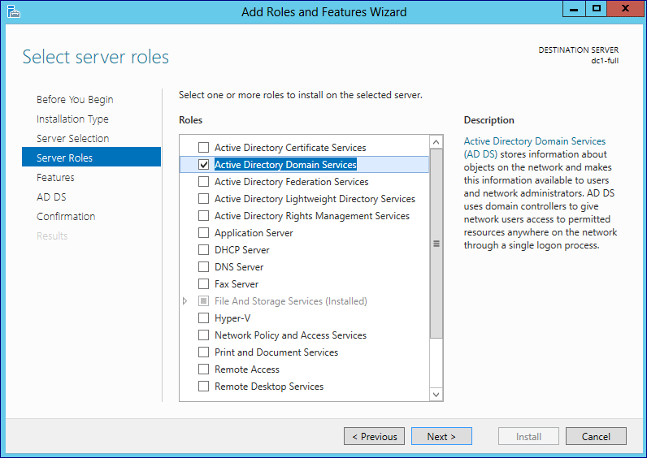  
  
Active Directory Domain Services installation uses Server Manager and Windows PowerShell, like all other server roles and features in Windows Server 2012. The Dcpromo.exe program no longer provides GUI configuration options.  
  
You use a graphical wizard in Server Manager or the ServerManager module for Windows PowerShell in both local and remote installations. By running multiple instances of those wizards or cmdlets and targeting different servers, you can deploy AD DS to multiple domain controllers simultaneously, all from one single console. Although these new features are not backwards compatible with Windows Server 2008 R2 or earlier operating systems, you can also still use the Dism.exe application introduced in Windows Server 2008 R2 for local role installation from the classic command-line.  
  
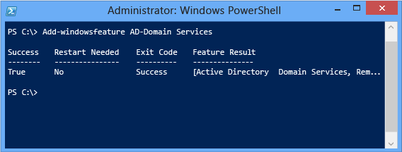  
  
#### AD DS Role Configuration  
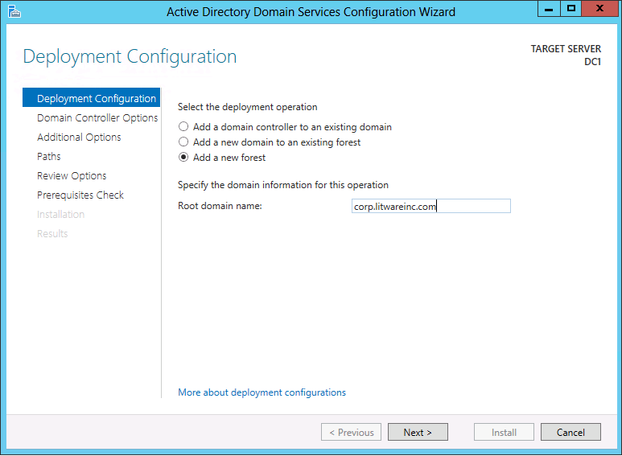  
  
Active Directory Domain Services configuration " previously known as DCPROMO " is a now a discrete operation from role installation. After installing the AD DS role, an administrator configures the server as a domain controller using a separate wizard within Server Manager or using the ADDSDeployment Windows PowerShell module.  
  
AD DS role configuration builds on twelve years of field experience and now configures domain controllers based on the most recent Microsoft best practices. For example, Domain Name System and Global Catalogs install by default on every domain controller.  
  
The Server Manager AD DS configuration wizard merges many individual dialogs into fewer prompts and no longer hides settings in an "advanced" mode. The entire promotion process is in one expanding dialog box during installation. The wizard and the ADDSDeployment Windows PowerShell module show you notable changes and security concerns, with links to further information.  
  
The Dcpromo.exe remains in Windows Server 2012 for command-line unattended installations only, and no longer runs the graphical installation wizard. It is highly recommended that you discontinue use of Dcpromo.exe for unattended installs and replace it with the ADDSDeployment module, as the now-deprecated executable will not be included in the next version of Windows.  
  
These new features are not backwards compatible to Windows Server 2008 R2 or older operating systems.  
  
  
  
> [!IMPORTANT]  
> Dcpromo.exe no longer contains a graphical wizard and no longer installs role or feature binaries. Attempting to run Dcpromo.exe from the Explorer shell returns:  
>   
> "The Active Directory Domain Services Installation Wizard is relocated in Server Manager. For more information, see http://go.microsoft.com/fwlink/?LinkId=220921."  
>   
> Attempting to run Dcpromo.exe /unattend still installs the binaries, as in previous operating systems, but warns:  
>   
> "The dcpromo unattended operation is replaced by the ADDSDeployment module for Windows PowerShell. For more information, see http://go.microsoft.com/fwlink/?LinkId=220924."  
>   
> Windows Server 2012 deprecates dcpromo.exe and it will not be included with future versions of Windows, nor will it receive further enhancements in this operating system. Administrators should discontinue its use and switch to the supported Windows PowerShell modules if they wish to create domain controllers from the command-line.  
  
#### Prerequisite Checking  
Domain controller configuration also implements a prerequisite checking phase that evaluates the forest and domain prior to continuing with domain controller promotion. This includes FSMO role availability, user privileges, extended schema compatibility and other requirements. This new design alleviates issues where domain controller promotion starts and then halts midway with a fatal configuration error. This lessens the chance of orphaned domain controller metadata in the forest or a server that incorrectly believes it is a domain controller.  
  
## <a name="BKMK_SMForest"></a>Deploying a Forest with Server Manager  
This section explains how to install the first domain controller in a forest root domain using Server Manager on a graphical Windows Server 2012 computer.  
  
### Server Manager AD DS Role Installation Process  
The diagram below illustrates the Active Directory Domain Services role installation process, beginning with you running ServerManager.exe and ending right before the promotion of the domain controller.  
  
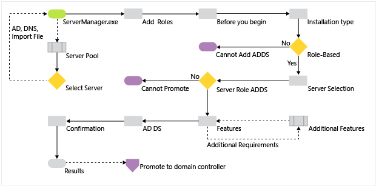  
  
#### Server Pool and Add Roles  
Any Windows Server 2012 computers accessible from the computer running Server Manager are eligible for pooling. Once pooled, you select those servers for remote installation of AD DS or any other configuration options possible within Server Manager.  
  
To add servers, choose one of the following:  
  
-   Click **Add Other Servers to Manage** on the dashboard welcome tile  
  
-   Click the **Manage** menu and select **Add Servers**  
  
-   Right-click **All Servers** and choose **Add Servers**  
  
This brings up the Add Servers dialog:  
  
  
  
This gives you three ways to add servers to the pool for use or grouping:  
  
-   Active Directory search (uses LDAP, requires that the computers belong to a domain, allows operating system filtering and supports wildcards)  
  
-   DNS search (uses DNS alias or IP address via ARP or NetBIOS broadcast or WINS lookup, does not allow operating system filtering or support wildcards)  
  
-   Import (uses a text file list of servers separated by CR/LF)  
  
Click **Find Now** to return a list of servers from that same Active Directory domain that the computer is joined to, Click one or more server names from the list of servers. Click the right arrow to add the servers to the **Selected** list. Use the **Add Servers** dialog to add selected servers to dashboard role groups. Or Click **Manage**, and then click **Create Server Group**, or click **Create Server Group** on the dashboard **Welcome to Server Manager** tile to create custom server groups.  
  
> [!NOTE]  
> The Add Servers procedure does not validate that a server is online or accessible. However, any unreachable servers flag in the Manageability view in Server Manager at the next refresh  
  
You can install roles remotely on any Windows Server 2012 computers added the pool, as shown:  
  
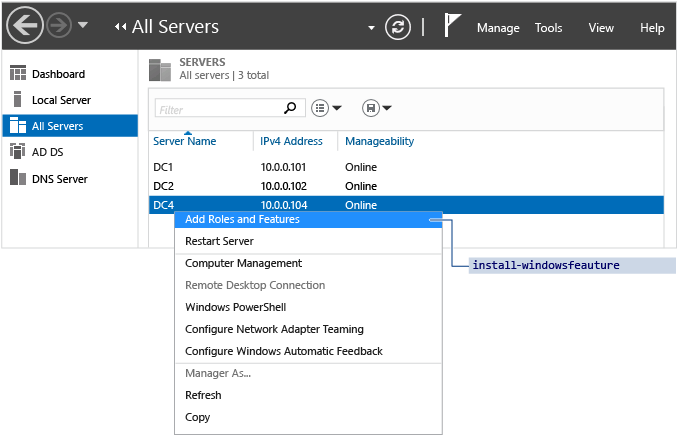  
  
You cannot fully manage servers running operating systems older than Windows Server 2012. The **Add Roles and Features** selection is running ServerManager Windows PowerShell Module **Install-WindowsFeature**.  
  
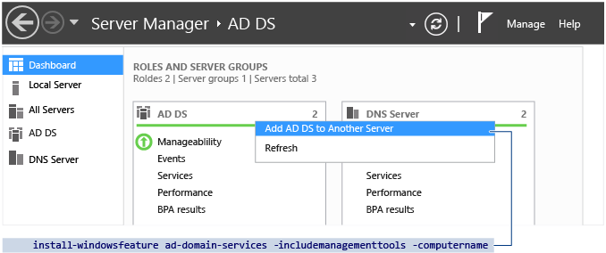  
  
You can also use the Server Manager Dashboard on an existing domain controller to select remote server AD DS installation with the role already preselected by right clicking the AD DS dashboard tile and selecting **Add AD DS to Another Server**. This is invoking **Install-WindowsFeature AD-Domain-Services**.  
  
The computer you are running Server Manager on pools itself automatically. To install the AD DS role here, simply click the **Manage** menu and click **Add Roles and Features**.  
  
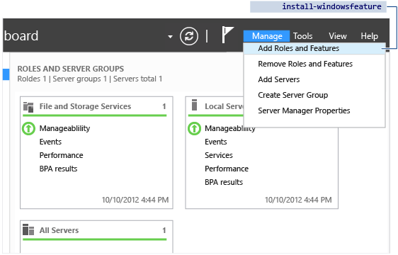  
  
#### Installation Type  
  
  
The **Installation Type** dialog provides an option that does not support Active Directory Domain Services: the **Remote Desktop Services scenario based-installation**. That option only allows Remote Desktop Service in a multi-server distributed workload. If you select it, AD DS cannot install.  
  
Always leave the default selection in place when installing AD DS: **Role-based or Feature-based Installation**.  
  
#### Server Selection  
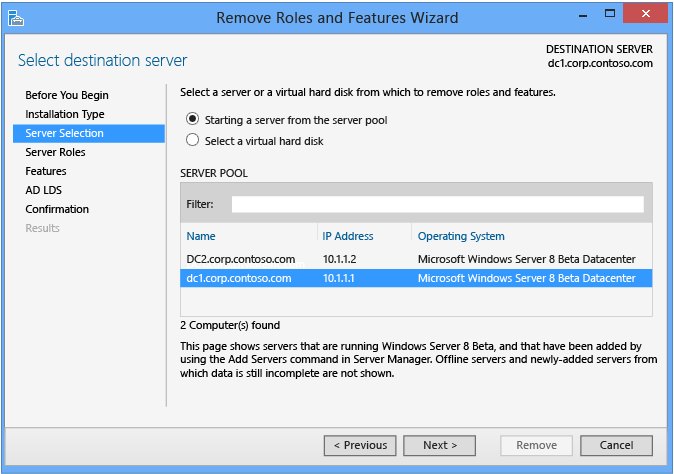  
  
The **Server Selection** dialog enables you to choose from one of the servers previously added to the pool, as long as it is accessible. The local server running Server Manager is automatically available.  
  
In addition, you can select offline Hyper-V VHD files with the Windows Server 2012 operating system and Server Manager adds the role to them directly through component servicing. This allows you to provision virtual servers with the necessary components before further configuring them.  
  
#### Server Roles and Features  
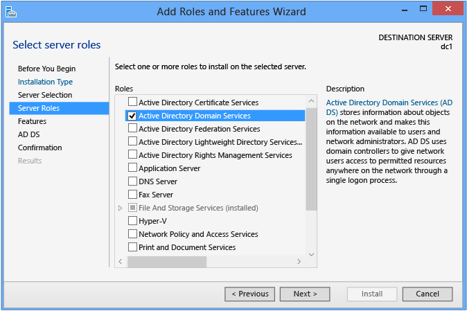  
  
Select the **Active Directory Domain Services** role if you intend to promote a domain controller. All Active Directory administration features and required services install automatically, even if they are ostensibly part of another role or do not appear selected in the Server Manager interface.  
  
Server Manager also presents an informational dialog that shows which management features this role implicitly installs; this is equivalent to the **-IncludeManagementTools** argument.  
  
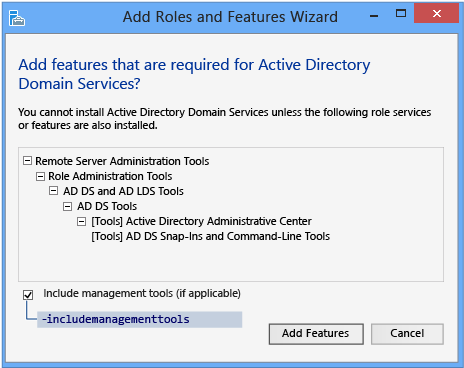  
  
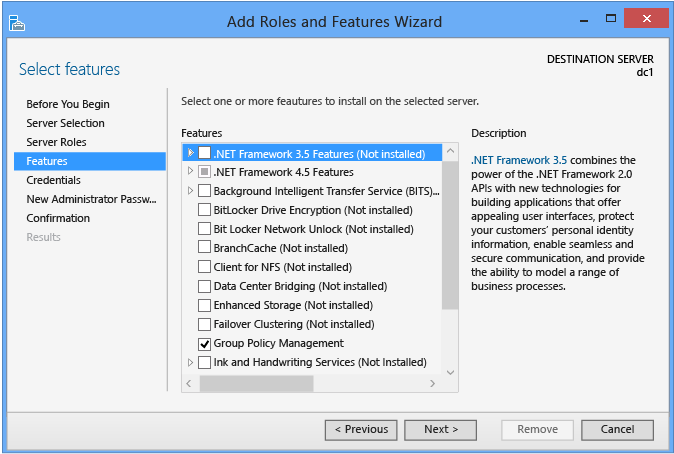  
  
Additional **Features** can be added here as desired.  
  
#### Active Directory Domain Services  
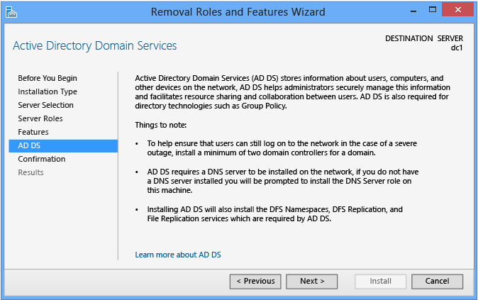  
  
The **Active Directory Domain Services** dialog provides limited information on requirements and best practices. It mainly acts as a confirmation that you chose the AD DS role " if this screen does not appear, you did not select AD DS.  
  
#### Confirmation  
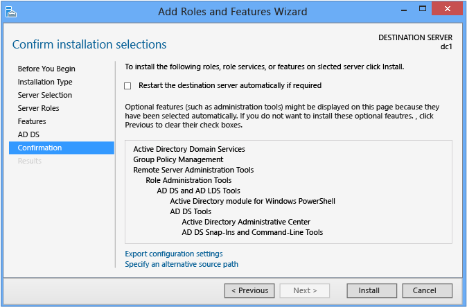  
  
The **Confirmation** dialog is the final checkpoint before role installation starts. It offers an option to restart the computer as needed after role installation, but AD DS installation does not require a reboot.  
  
By clicking **Install**, you confirm you are ready to begin role installation. You cannot cancel a role installation once it begins.  
  
#### Results  
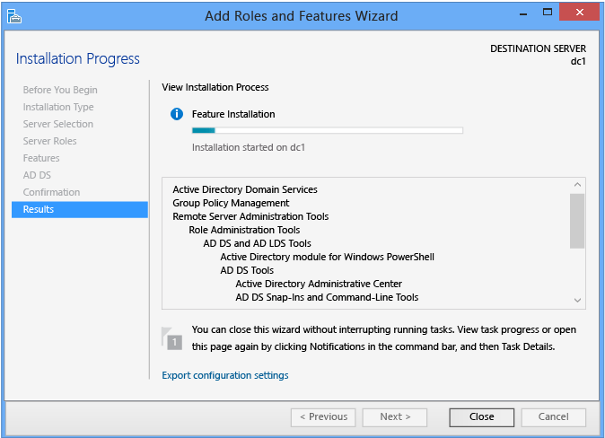  
  
The **Results** dialog shows the current installation progress and current installation status. Role installation continues regardless of whether Server Manager is closed.  
  
Verifying the installation results is still a best practice. If you close the **Results** dialog before installation completes, you can check the results using the Server Manager notification flag. Server Manager also shows a warning message for any servers that have installed the AD DS role but not been further configured as domain controllers.  
  
**Task Notifications**  
  
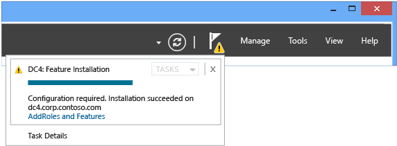  
  
**AD DS Details**  
  
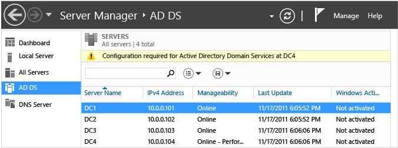  
  
**Task Details**  
  
  
  
#### Promote to Domain Controller  
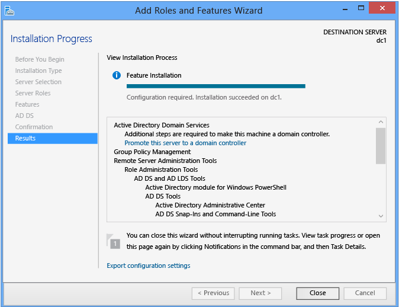  
  
At the end of the AD DS role installation, you can continue with configuration by using the **Promote this server to a domain controller** link. This is required to make the server a domain controller, but is not necessary to run the configuration wizard immediately. For example, you may only want to provision servers with the AD DS binaries before sending them to another branch office for later configuration. By adding the AD DS role before shipping, you save time when it reaches its destination. You also follow the best practice of not keeping a domain controller offline for days or weeks. Finally, this enables you to update components before domain controller promotion, saving you at least one subsequent reboot.  
  
Selecting this link later invokes the ADDSDeployment cmdlets: **install-addsforest**, **install-addsdomain**, or **install-addsdomaincontroller**.  
  
### Uninstalling/Disabling  
You remove the AD DS role like any other role, regardless of whether you promoted the server to a domain controller. However, removing the AD DS role requires a restart on completion.  
  
Active Directory Domain Services role removal is different from installation, in that it requires domain controller demotion before it can complete. This is necessary to prevent a domain controller from having its role binaries uninstalled without proper metadata cleanup in the forest. For more information, see [Demoting Domain Controllers and Domains &#40;Level 200&#41;](../../ad-ds/deploy/Demoting-Domain-Controllers-and-Domains--Level-200-.md).  
  
> [!WARNING]  
> Removing the AD DS roles with Dism.exe or the Windows PowerShell DISM module after promotion to a Domain Controller is not supported and will prevent the server from booting normally.  
>   
> Unlike Server Manager or the AD DS Deployment module for Windows PowerShell, DISM is a native servicing system that has no inherent knowledge of AD DS or its configuration. Do not use Dism.exe or the Windows PowerShell DISM module to uninstall the AD DS role unless the server is no longer a domain controller.  
  
### Create an AD DS Forest Root Domain with Server Manager  
The following diagram illustrates the Active Directory Domain Services configuration process, in the case where you have previously installed the AD DS role and started the **Active Directory Domain Services Configuration Wizard** using Server Manager.  
  
  
  
#### Deployment Configuration  
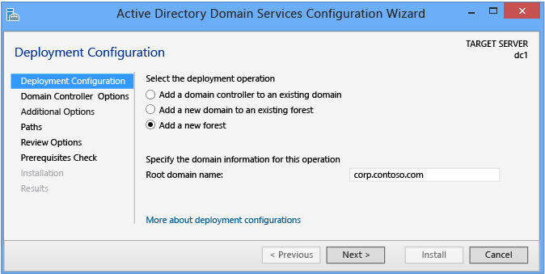  
  
Server Manager begins every domain controller promotion with the **Deployment Configuration** page. The remaining options and required fields change on this page and subsequent pages, depending on which deployment operation you select.  
  
To create a new Active Directory forest, click **Add a new forest**. You must provide a valid root domain name; the name cannot be single-labeled (for example, the name must be *contoso.com* or similar and not just *contoso*) and must use allowed DNS domain naming requirements.  
  
For more information on valid domain names, see KB article [Naming conventions in Active Directory for computers, domains, sites, and OUs](http://support.microsoft.com/kb/909264).  
  
> [!WARNING]  
> Do not create new Active Directory forests with the same name as an external DNS name. For example, if your Internet DNS URL is http://contoso.com, you must choose a different name for your internal forest to avoid future compatibility issues. That name should be unique and unlikely for web traffic. For example: corp.contoso.com.  
  
A new forest does not need new credentials for the domain's Administrator account. The domain controller promotion process uses the credentials of the built-in Administrator account from the first domain controller used to create the forest root. There is no way (by default) to disable or lock out the built-in Administrator account and it may be the only entry point into a forest if the other administrative domain accounts are unusable. It is critical to know the password before deploying a new forest.  
  
**DomainName** requires a valid fully qualified domain DNS name and is required.  
  
#### Domain Controller Options  
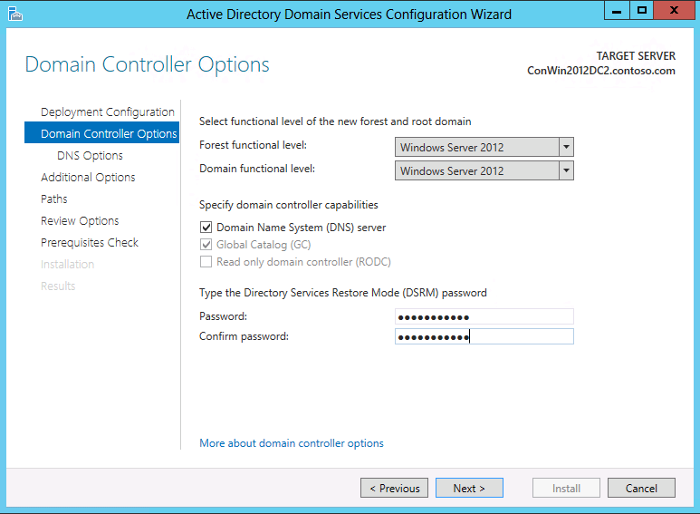  
  
The **Domain Controller Options** enables you to configure the **forest functional level** and **domain functional level** for the new forest root domain. By default, these settings are  Windows Server 2012  in a new forest root domain. The  Windows Server 2012  forest functional level does not provide any new functionality over the Windows Server 2008 R2 forest functional level. The  Windows Server 2012  domain functional level is required only in order to implement the new Kerberos settings "always provide claims" and "Fail unarmored authentication requests." A primary use for functional levels in  Windows Server 2012  is to restrict participation in the domain to domain controllers that meet minimum-allowed operating system requirements. In other words, you can specify  Windows Server 2012  domain functional level only domain controllers that run  Windows Server 2012  can host the domain.  Windows Server 2012  implements a new domain controller flag called **DS_WIN8_REQUIRED** in the **DSGetDcName** function of NetLogon that exclusively locates  Windows Server 2012  domain controllers. This allows you the flexibility of a more homogeneous or heterogeneous forest in terms of which operating systems are permitted to be run on domain controllers.  
  
For more information about domain controller Location, review [Directory Service Functions](http://msdn.microsoft.com/library/ms675900(VS.85).aspx).  
  
The only configurable domain controller capability is the DNS server option. Microsoft recommends that all domain controllers provide DNS services for high availability in distributed environments, which is why this option is selected by default when installing a domain controller in any mode or domain. The Global Catalog and read only domain controller options are unavailable when creating a new forest root domain; the first domain controller must be a GC, and cannot be a read only domain controller (RODC).  
  
The specified **Directory Services Restore Mode Password** must adhere to the password policy applied to the server, which by default does not require a strong password; only a non-blank one. Always choose a strong, complex password or preferably, a passphrase.  
  
#### DNS Options and DNS Delegation Credentials  
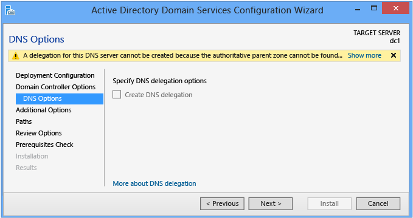  
  
The **DNS Options** page enables you to configure DNS delegation and provide alternate DNS administrative credentials.  
  
You cannot configure DNS options or delegation in the Active Directory Domain Services Configuration Wizard when installing a new Active Directory Forest Root Domain where you selected the **DNS server** on the **Domain Controller Options** page. The **Create DNS delegation** option is available when creating a new forest root DNS zone in an existing DNS server infrastructure. This option enables you to provide alternate DNS administrative credentials that have the rights to update DNS zone.  
  
For more information about whether you need to create a DNS delegation, see [Understanding Zone Delegation](http://technet.microsoft.com/library/cc771640.aspx).  
  
#### Additional Options  
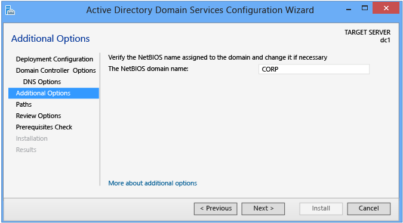  
  
The **Additional Options** page shows the NetBIOS name of the domain and enables you to override it. By default, the NetBIOS domain name matches the left-most label of the fully qualified domain name provided on the **Deployment Configuration** page. For example, if you provided the fully qualified domain name of corp.contoso.com, the default NetBIOS domain name is CORP.  
  
If the name is 15 characters or less and does not conflict with another NetBIOS name, it is unaltered. If it does conflict with another NetBIOS name, a number is appended to the name. If the name is more than 15 characters, the wizard provides a unique, truncated suggestion. In either case, the wizard first validates the name is not already in use via a WINS lookup and NetBIOS broadcast.  
  
For more information on valid domain names, see KB article [Naming conventions in Active Directory for computers, domains, sites, and OUs](http://support.microsoft.com/kb/909264).  
  
#### Paths  
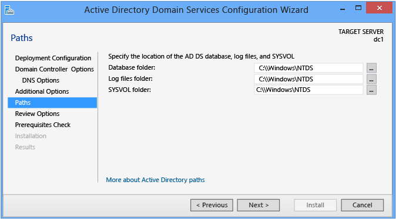  
  
The **Paths** page enables you to override the default folder locations of the AD DS database, the database transaction logs, and the SYSVOL share. The default locations are always in subdirectories of %systemroot% (i.e. C:\Windows).  
  
#### Review Options and View Script  
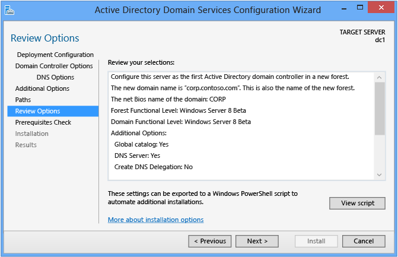  
  
The **Review Options** page enables you to validate your settings and ensure they meet your requirements before you start the installation. This is not the last opportunity to stop the installation when using Server Manager. This is simply an option to confirm your settings before continuing the configuration  
  
The **Review Options** page in Server Manager also offers an optional **View Script** button to create a Unicode text file that contains the current ADDSDeployment configuration as a single Windows PowerShell script. This enables you to use the Server Manager graphical interface as a Windows PowerShell deployment studio. Use the Active Directory Domain Services Configuration Wizard to configure options, export the configuration, and then cancel the wizard. This process creates a valid and syntactically correct sample for further modification or direct use. For example:  
  
```  
#  
# Windows PowerShell Script for AD DS Deployment  
#  
  
Import-Module ADDSDeployment  
Install-ADDSForest `  
-CreateDNSDelegation `  
-DatabasePath "C:\Windows\NTDS" `  
-DomainMode "Win2012" `  
-DomainName "corp.contoso.com" `  
-DomainNetBIOSName "CORP" `  
-ForestMode "Win2012" `  
-InstallDNS:$true `  
-LogPath "C:\Windows\NTDS" `  
-NoRebootOnCompletion:$false `  
-SYSVOLPath "C:\Windows\SYSVOL"  
-Force:$true  
  
```  
  
> [!NOTE]  
> Server Manager generally fills in all arguments with values when promoting and does not rely on defaults (as they may change between future versions of Windows or service packs). The one exception to this is the **-safemodeadministratorpassword** argument (which is deliberately omitted from the script). To force a confirmation prompt, omit the value when running cmdlet interactively.  
  
#### Prerequisites Check  
  
  
The **Prerequisites Check** is a new feature in AD DS domain configuration. This new phase validates that the server configuration is capable of supporting a new AD DS forest.  
  
When installing a new forest root domain, the Server Manager Active Directory Domain Services Configuration Wizard invokes a series of modular tests. These tests alert you with suggested repair options. You can run the tests as many times as required. The domain controller process cannot continue until all prerequisite tests pass.  
  
The **Prerequisites Check** also surfaces relevant information such as security changes that affect older operating systems.  
  
For more information on the specific prerequisite checks, see [Prerequisite Checking](../../ad-ds/manage/AD-DS-Simplified-Administration.md#BKMK_PrereuisiteChecking).  
  
#### Installation  
  
  
When the **Installation** page displays, the domain controller configuration begins and cannot be halted or canceled. Detailed operations display on this page and are written to logs:  
  
-   %systemroot%\debug\dcpromo.log  
  
-   %systemroot%\debug\dcpromoui.log  
  
> [!NOTE]  
> You can run multiple role installation and AD DS configuration wizards from the same Server Manager console simultaneously.  
  
#### Results  
  
  
The **Results** page shows the success or failure of the promotion and any important administrative information. The domain controller will automatically reboot after 10 seconds.  
  
## <a name="BKMK_PSForest"></a>Deploying a Forest with Windows PowerShell  
This section explains how to install the first domain controller in a forest root domain using Windows PowerShell on a Core Windows Server 2012 computer.  
  
### Windows PowerShell AD DS Role Installation Process  
By implementing a few straightforward ServerManager deployment cmdlets into your deployment processes, you further realize the vision of AD DS simplified administration.  
  
The next figure illustrates the Active Directory Domain Services role installation process, beginning with you running **PowerShell.exe** and ending right before the promotion of the domain controller.  
  
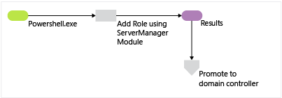  
  
|||  
|-|-|  
|ServerManager Cmdlet|Arguments (**Bold** arguments are required. *Italicized* arguments can be specified by using Windows PowerShell or the AD DS Configuration Wizard.)|  
|Install-WindowsFeature/Add-WindowsFeature|***-Name***<br /><br />*-Restart*<br /><br />*-IncludeAllSubFeature*<br /><br />*-IncludeManagementTools*<br /><br />-Source<br /><br />*-ComputerName*<br /><br />-Credential<br /><br />-LogPath<br /><br />*-Vhd*<br /><br />*-ConfigurationFilePath*|  
  
> [!NOTE]  
> While not required, the argument **-IncludeManagementTools** is highly recommended when installing the AD DS role binaries  
  
The ServerManager module exposes role installation, status, and removal portions of the new DISM module for Windows PowerShell. This layering simplifies the most tasks and reduces need for direct usage of the powerful (but dangerous when misused) DISM module.  
  
Use **Get-Command** to export the aliases and cmdlets in ServerManager.  
  
```  
Get-Command -module ServerManager  
```  
  
For example:  
  
  
  
To add the Active Directory Domain Services role, simply run the **Install-WindowsFeature** with the AD DS role name as an argument. Like Server Manager, all required services implicit to the AD DS role install automatically.  
  
```  
Install-WindowsFeature -name AD-Domain-Services  
```  
  
If you also want the AD DS management tools installed - and this is highly recommended - then provide the **-IncludeManagementTools** argument:  
  
```  
Install-WindowsFeature -name AD-Domain-Services -IncludeManagementTools  
```  
  
For example:  
  
  
  
To list all features and roles with their installation status, use **Get-WindowsFeature** without arguments. Specify **-ComputerName** argument for the installation status from a remote server.  
  
```  
Get-WindowsFeature  
```  
  
Because **Get-WindowsFeature** does not have a filtering mechanism, you must use **Where-Object** with a pipeline to find specific features. The pipeline is a channel used between multiple cmdlets to pass data and the Where-Object cmdlet acts as a filter. The built-in **$_** variable acts as the current object passing through the pipeline with any properties it may contain.  
  
```  
Get-WindowsFeature | where-object <options>  
```  
  
For example, to find all features containing "Active Dir" in their **Display Name** property, use:  
  
```  
Get-WindowsFeature | where displayname -like "*active dir*"  
```  
  
Further examples illustrated below:  
  
  
  
For more information about more Windows PowerShell operations with pipelines and Where-Object, see [Piping and the Pipeline in Windows PowerShell](http://technet.microsoft.com/library/ee176927.aspx).  
  
Note also that Windows PowerShell 3.0 significantly simplified the command-line arguments needed in this pipeline operation. Windows PowerShell 2.0 would have required:  
  
```  
Get-WindowsFeature | where {$_.displayname - like "*active dir*"}  
```  
  
By using the Windows PowerShell pipeline, you can create readable results. For example:  
  
```  
Install-WindowsFeature | Format-List  
Install-WindowsFeature | select-object | Format-List  
  
```  
  
  
  
Note how using the **Select-Object** cmdlet with the **-expandproperty** argument returns interesting data:  
  
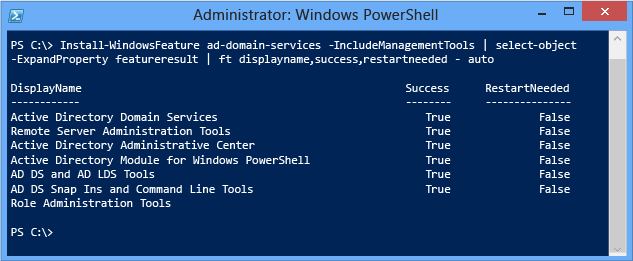  
  
> [!NOTE]  
> The **Select-Object -expandproperty** argument slows down overall installation performance slightly.  
  
### <a name="BKMK_PS"></a>Create an AD DS Forest Root Domain with Windows PowerShell  
To install a new Active Directory forest using the ADDSDeployment module, use the following cmdlet:  
  
```  
Install-addsforest  
```  
  
The **Install-AddsForest** cmdlet only has two phases (prerequisite checking and installation). The two figures below show the installation phase with the minimum required argument of **-domainname**.  
  
|||  
|-|-|  
|ADDSDeployment Cmdlet|Arguments (**Bold** arguments are required. *Italicized* arguments can be specified by using Windows PowerShell or the AD DS Configuration Wizard.)|  
|Install-Addsforest|-Confirm<br /><br />*-CreateDNSDelegation*<br /><br />*-DatabasePath*<br /><br />*-DomainMode*<br /><br />***-DomainName***<br /><br />***-DomainNetBIOSName***<br /><br />*-DNSDelegationCredential*<br /><br />*-ForestMode*<br /><br />-Force<br /><br />*-InstallDNS*<br /><br />*-LogPath*<br /><br />-NoDnsOnNetwork<br /><br />-NoRebootOnCompletion<br /><br />*-SafeModeAdministratorPassword*<br /><br />-SkipAutoConfigureDNS<br /><br />-SkipPreChecks<br /><br />*-SYSVOLPath*<br /><br />*-Whatif*|  
  
> [!NOTE]  
> The **-DomainNetBIOSName** argument is required if you want to change the automatically generated 15-character name based on the DNS domain name prefix or if the name exceeds 15 characters.  
  
The equivalent Server Manager **Deployment Configuration** ADDSDeployment cmdlet and arguments are:  
  
```  
Install-ADDSForest  
-DomainName <string>  
```  
  
The equivalent Server Manager Domain Controller Options ADDSDeployment cmdlet arguments are:  
  
```  
-ForestMode <{Win2003 | Win2008 | Win2008R2 | Win2012 | Default}>  
-DomainMode <{Win2003 | Win2008 | Win2008R2 | Win2012 | Default}>  
-InstallDNS <{$false | $true}>  
-SafeModeAdministratorPassword <secure string>  
  
```  
  
The **Install-ADDSForest** arguments follow the same defaults as Server Manager if not specified.  
  
The **SafeModeAdministratorPassword** argument's operation is special:  
  
-   If *not specified* as an argument, the cmdlet prompts you to enter and confirm a masked password. This is the preferred usage when running the cmdlet interactively.  
  
    For example, to create a new forest named corp.contoso.com and be prompted to enter and confirm a masked password:  
  
    ```  
    Install-ADDSForest "DomainName corp.contoso.com  
    ```  
  
-   If specified *with a value*, the value must be a secure string. This is not the preferred usage when running the cmdlet interactively.  
  
For example, you can manually prompt for a password by using the **Read-Host** cmdlet to prompt the user for a secure string:  
  
```  
-safemodeadministratorpassword (read-host -prompt "Password:" -assecurestring)  
```  
  
> [!WARNING]  
> As the previous option does not confirm the password, use extreme caution: the password is not visible.  
  
You can also provide a secure string as a converted clear-text variable, although this is highly discouraged.  
  
```  
-safemodeadministratorpassword (convertto-securestring "Password1" -asplaintext -force)  
```  
  
Finally, you could store the obfuscated password in a file, and then reuse it later, without the clear text password ever appearing. For example:  
  
```  
$file = "c:\pw.txt"  
$pw = read-host -prompt "Password:" -assecurestring  
$pw | ConvertFrom-SecureString | Set-Content $file  
  
-safemodeadministratorpassword (Get-Content $File | ConvertTo-SecureString)  
  
```  
  
> [!WARNING]  
> Providing or storing a clear or obfuscated text password is not recommended. Anyone running this command in a script or looking over your shoulder knows the DSRM password of that domain controller. Anyone with access to the file could reverse that obfuscated password. With that knowledge, they can logon to a DC started in DSRM and eventually impersonate the domain controller itself, elevating their privileges to the highest level in an Active Directory forest. An additional set of steps using **System.Security.Cryptography** to encrypt the text file data is advisable but out of scope. The best practice is to totally avoid password storage.  
  
The ADDSDeployment cmdlet offers an additional option to skip automatic configuration of DNS client settings, forwarders, and root hints. You cannot skip this configuration option when using Server Manager. This argument matters only if you installed the DNS Server role prior to configuring the domain controller:  
  
```  
-SkipAutoConfigureDNS  
```  
  
The **DomainNetBIOSName** operation is also special:  
  
-   If the **DomainNetBIOSName** argument is not specified with a NetBIOS domain name and the single-label prefix domain name in the **DomainName** argument is 15 characters or fewer, then promotion continues with an automatically generated name.  
  
-   If the **DomainNetBIOSName** argument is not specified with a NetBIOS domain name and the single-label prefix domain name in the **DomainName** argument is 16 characters or more, then promotion fails.  
  
-   If the **DomainNetBIOSName** argument is specified with a NetBIOS domain name of 15 characters or fewer, then promotion continues with that specified name.  
  
-   If the **DomainNetBIOSName** argument is specified with a NetBIOS domain name of 16 characters or more, then promotion fails.  
  
The equivalent Server Manager Additional Options ADDSDeployment cmdlet argument is:  
  
```  
-domainnetbiosname <string>  
```  
  
The equivalent Server Manager **Paths** ADDSDeployment cmdlet arguments are:  
  
```  
-databasepath <string>  
-logpath <string>  
-sysvolpath <string>  
  
```  
  
Use the optional **Whatif** argument with the **Install-ADDSForest** cmdlet to review configuration information. This enables you to see the explicit and implicit values of a cmdlet's arguments.  
  
For example:  
  
  
  
You cannot bypass the **Prerequisite Check** when using Server Manager, but you can skip the process when using the AD DS Deployment cmdlet using the following argument:  
  
```  
-skipprechecks  
```  
  
> [!WARNING]  
> Microsoft discourages skipping the prerequisite check as it can lead to a partial domain controller promotion or damaged AD DS forest.  
  
Note how, just like Server Manager, **Install-ADDSForest** reminds you that promotion will reboot the server automatically.  
  
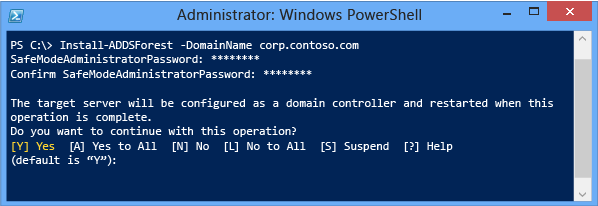  
  
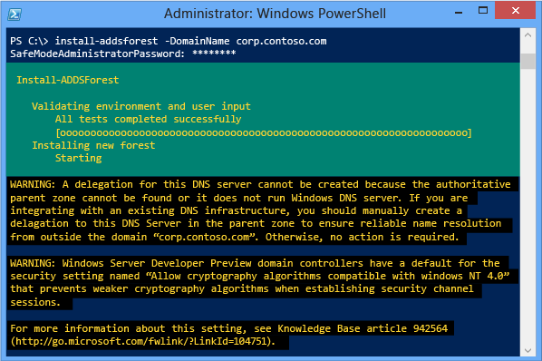  
  
To accept the reboot prompt automatically, use the **-force** or **-confirm:$false** arguments with any ADDSDeployment Windows PowerShell cmdlet. To prevent the server from automatically rebooting at the end of promotion, use the **-norebootoncompletion** argument.  
  
> [!WARNING]  
> Overriding the reboot is discouraged. The domain controller must reboot to function correctly.  
  
## See Also  
[Active Directory Domain Services  (TechNet Portal)](http://technet.microsoft.com/library/cc770946(WS.10).aspx)  
[Active Directory Domain Services for Windows Server 2008 R2](http://technet.microsoft.com/library/dd378801(WS.10).aspx)  
[Active Directory Domain Services for Windows Server 2008](http://technet.microsoft.com/library/dd378891(WS.10).aspx)  
[Windows Server Technical Reference (Windows Server 2003)](http://technet.microsoft.com/library/cc739127(WS.10).aspx)  
[Active Directory Administrative Center: Getting Started (Windows Server 2008 R2)](http://technet.microsoft.com/library/dd560651(WS.10).aspx)  
[Active Directory Administration with Windows PowerShell (Windows Server 2008 R2)](http://technet.microsoft.com/library/dd378937(WS.10).aspx)  
[Ask the Directory Services Team (Official Microsoft Commercial Technical Support Blog)](http://blogs.technet.com/b/askds)  
  

