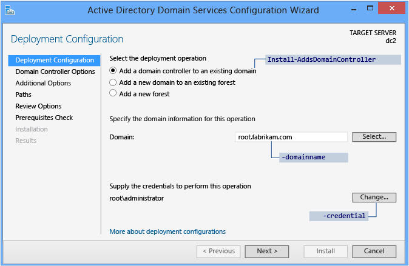
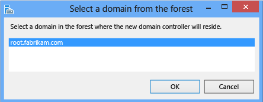
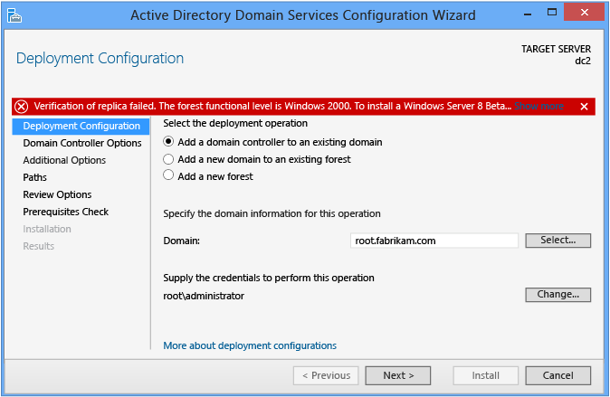
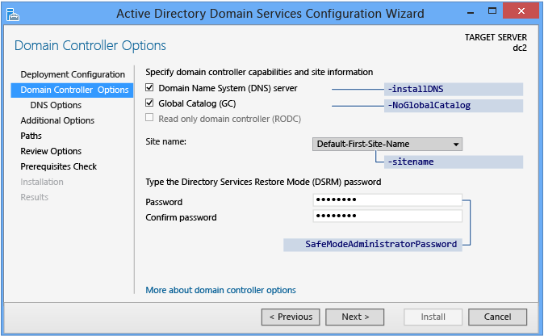
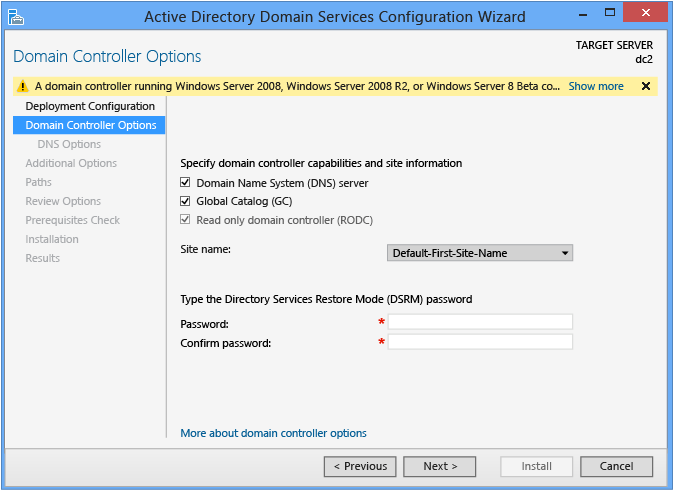
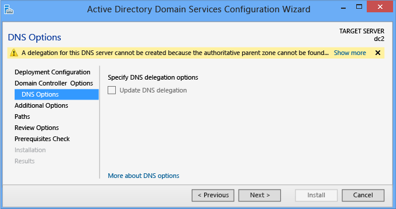
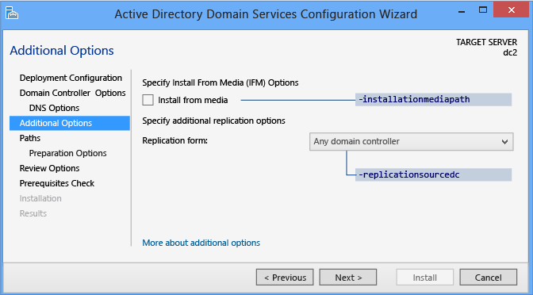
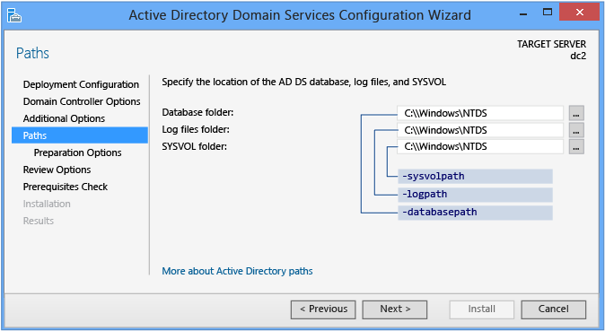
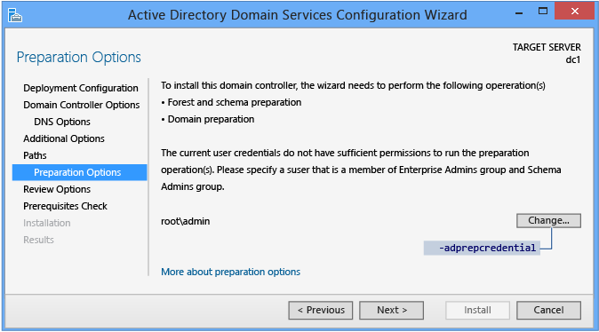
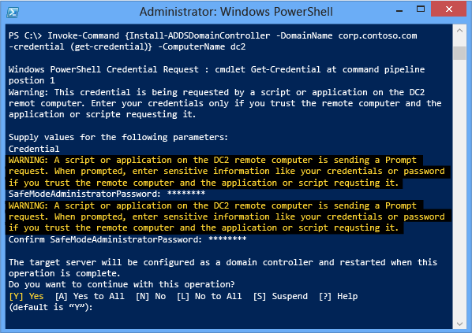

# Install a Replica Windows Server 2012 Domain Controller in an Existing Domain (Level 200)

>Applies To: Windows Server 2016, Windows Server 2012 R2, Windows Server 2012

This topic covers the steps necessary to upgrade an existing forest or domain to Windows Server 2012, using either Server Manager or Windows PowerShell. It covers how to add domain controllers that run Windows Server 2012 to an existing domain.

-   [Upgrade and Replica Workflow](../../ad-ds/deploy/Install-a-Replica-Windows-Server-2012-Domain-Controller-in-an-Existing-Domain--Level-200-.md#BKMK_Workflow)

-   [Upgrade and Replica Windows PowerShell](../../ad-ds/deploy/Install-a-Replica-Windows-Server-2012-Domain-Controller-in-an-Existing-Domain--Level-200-.md#BKMK_PS)

-   [Deployment](../../ad-ds/deploy/Install-a-Replica-Windows-Server-2012-Domain-Controller-in-an-Existing-Domain--Level-200-.md#BKMK_Dep)

## <a name="BKMK_Workflow"></a>Upgrade and Replica Workflow
The following diagram illustrates the Active Directory Domain Services configuration process when you previously installed the AD DS role and you have started the Active Directory Domain Services Configuration Wizard using Server Manager to create a new domain controller in an existing domain.


## <a name="BKMK_PS"></a>Upgrade and Replica Windows PowerShell

| ADDSDeployment  Cmdlet | Arguments (**Bold** arguments are required. *Italicized* arguments can be specified by using Windows PowerShell or the AD DS Configuration Wizard.) |
|--|--|
| Install-AddsDomainController | -SkipPreChecks<p>***-DomainName***<p>*-SafeModeAdministratorPassword*<p>*-SiteName*<p>*-ADPrepCredential*<p>-ApplicationPartitionsToReplicate<p>*-AllowDomainControllerReinstall*<p>-Confirm<p>*-CreateDNSDelegation*<p>***-Credential***<p>-CriticalReplicationOnly<p>*-DatabasePath*<p>*-DNSDelegationCredential*<p>-Force<p>*-InstallationMediaPath*<p>*-InstallDNS*<p>*-LogPath*<p>-MoveInfrastructureOperationMasterRoleIfNecessary<p>-NoDnsOnNetwork<p>*-NoGlobalCatalog*<p>-Norebootoncompletion<p>*-ReplicationSourceDC*<p>-SkipAutoConfigureDNS<p>-SiteName<p>*-SystemKey*<p>*-SYSVOLPath*<p>*-UseExistingAccount*<p>*-Whatif* |

> [!NOTE]
> The **-credential** argument is only required if you are not already logged on as a member of the Enterprise Admins and Schema Admins groups (if you are upgrading the forest) or the Domain Admins group (if you are adding a new DC to an existing domain).

## <a name="BKMK_Dep"></a>Deployment

### Deployment Configuration


Server Manager begins every domain controller promotion with the **Deployment Configuration** page. The remaining options and required fields change on this page and subsequent pages, depending on which deployment operation you select.

To upgrade an existing forest or add a writable domain controller to an existing domain, click **Add a domain controller to an existing domain** and click **Select** to **Specify the domain information for this domain**. Server Manager prompts you for valid credentials if needed.

Upgrading the forest requires credentials that include group memberships in both the Enterprise Admins and Schema Admins groups in Windows Server 2012. The Active Directory Domain Services Configuration Wizard prompts you later if your current credentials do not have adequate permissions or group memberships.

The automatic Adprep process is the only operational difference between adding a domain controller to an existing Windows Server 2012 domain and a domain where domain controllers run an earlier version of Windows Server.

The Deployment Configuration ADDSDeployment cmdlet and arguments are:

```
Install-AddsDomainController
-domainname <string>
-credential <pscredential>
```




Certain tests perform at each page, some of which repeat later as discrete prerequisite checks. For instance, if the selected domain does not meet the minimal functional levels, you do not have to go all the way through promotion to the prerequisite check to find out:



### Domain Controller Options


The **Domain Controller Options** page specifies the domain controller capabilities for the new domain controller. The configurable domain controller capabilities are **DNS server**, **Global Catalog**, and **Read-only domain controller**. Microsoft recommends that all domain controllers provide DNS and GC services for high availability in distributed environments. GC is always selected by default and DNS server is selected by default if the current domain hosts DNS already on its DCs based on Start of Authority query. The **Domain Controller Options** page also enables you to choose the appropriate Active Directory logical **site name** from the forest configuration. By default, it selects the site with the most correct subnet. If there is only one site, it selects automatically.

> [!NOTE]
> If the server does not belong to an Active Directory subnet and there is more than one Active Directory site, nothing is selected and the **Next** button is unavailable until you choose a site from the list.

The specified **Directory Services Restore Mode Password** must adhere to the password policy applied to the server. Always choose a strong, complex password or preferably, a passphrase.

The **Domain Controller Options** ADDSDeployment arguments are:

```
-InstallDNS <{$false | $true}>
-NoGlobalCatalog <{$false | $true}>
-sitename <string>
-SafeModeAdministratorPassword <secure string>
```

> [!IMPORTANT]
> The site name must already exist when provided as an argument to **-sitename**. The **install-AddsDomainController** cmdlet does not create sites. You can use cmdlet **new-adreplicationsite** to create new sites.

The **SafeModeAdministratorPassword** argument's operation is special:

-   If *not specified* as an argument, the cmdlet prompts you to enter and confirm a masked password. This is the preferred usage when running the cmdlet interactively.

    For example, to create an additional domain controller in treyresearch.net domain and be prompted to enter and confirm a masked password:

    ```
    Install-ADDSDomainController "DomainName treyresearch.net "credential (get-credential)
    ```

-   If specified *with a value*, the value must be a secure string. This is not the preferred usage when running the cmdlet interactively.

For example, you can manually prompt for a password by using the **Read-Host** cmdlet to prompt the user for a secure string:

```
-safemodeadministratorpassword (read-host -prompt "Password:" -assecurestring)
```

> [!WARNING]
> As the previous option does not confirm the password, use extreme caution: the password is not visible.

You can also provide a secure string as a converted clear-text variable, although this is highly discouraged.

```
-safemodeadministratorpassword (convertto-securestring "Password1" -asplaintext -force)

```

Finally, you could store the obfuscated password in a file, and then reuse it later, without the clear text password ever appearing. For example:

```
$file = "c:\pw.txt"
$pw = read-host -prompt "Password:" -assecurestring
$pw | ConvertFrom-SecureString | Set-Content $file

-safemodeadministratorpassword (Get-Content $File | ConvertTo-SecureString)

```

> [!WARNING]
> Providing or storing a clear or obfuscated text password is not recommended. Anyone running this command in a script or looking over your shoulder knows the DSRM password of that domain controller.  Anyone with access to the file could reverse that obfuscated password. With that knowledge, they can logon to a DC started in DSRM and eventually impersonate the domain controller itself, elevating their privileges to the highest level in an Active Directory forest. An additional set of steps using **System.Security.Cryptography** to encrypt the text file data is advisable but out of scope. The best practice is to totally avoid password storage.

The ADDSDeployment cmdlet offers an additional option to skip automatic configuration of DNS client settings, forwarders, and root hints. You cannot skip this configuration option when using Server Manager. This argument matters only if you installed the DNS Server role prior to configuring the domain controller:

```
-SkipAutoConfigureDNS
```

The **Domain Controller Options** page warns that you cannot create read only domain controllers if your existing domain controllers run Windows Server 2003. This is expected, and you can dismiss the warning.



### DNS Options and DNS Delegation Credentials


The **DNS Options** page enables you to configure DNS delegation if you selected the **DNS server** option on the *Domain Controller Options* page and if pointing to a zone where DNS delegations are allowed. You may need to provide alternate credentials of a user that is a member of the **DNS Admins** group.

The **DNS Options** ADDSDeployment cmdlet arguments are:

```
-creatednsdelegation
-dnsdelegationcredential <pscredential>
```


For more information about whether you need to create a DNS delegation, see [Understanding Zone Delegation](/previous-versions/windows/it-pro/windows-server-2008-R2-and-2008/cc771640(v=ws.11)).

### Additional Options


The **Additional Options** page provides the configuration option to name a domain controller as the replication source, or you can use any domain controller as the replication source.

You can also choose to install the domain controller using backed up media using the Install from media (IFM) option. The **Install from media** checkbox provides a browse option once selected and you must click **Verify** to ensure the provided path is valid media. Media used by the IFM option is created with Windows Server Backup or Ntdsutil.exe from another existing Windows Server 2012 computer only; you cannot use a Windows Server 2008 R2 or previous operating system to create media for a Windows Server 2012 domain controller. For more information about changes in IFM, see [Simplified Administration Appendix](../../ad-ds/deploy/Simplified-Administration-Appendix.md). If using media protected with a SYSKEY, Server Manager prompts for the image's password during verification.


The **Additional Options** ADDSDeployment cmdlet arguments are:

```
-replicationsourcedc <string>
-installationmediapath <string>
-syskey <secure string>
```

### Paths


The **Paths** page enables you to override the default folder locations of the AD DS database, the database transaction logs, and the SYSVOL share. The default locations are always in subdirectories of %systemroot%.

The Active Directory Paths ADDSDeployment cmdlet arguments are:

```
-databasepath <string>
-logpath <string>
-sysvolpath <string>
```

### Preparation Options


The **Preparation Options** page alerts you that the AD DS configuration includes extending the Schema (forestprep) and updating the domain (domainprep).  You only see this page when the forest and domain have not been prepared by previous Windows Server 2012 domain controller installation or from manually running Adprep.exe. For example, the Active Directory Domain Services Configuration Wizard suppresses this page if you add a new domain controller to an existing Windows Server 2012 forest root domain.

Extending the Schema and updating the domain do not occur when you click **Next**. These events occur only during the installation phase. This page simply brings awareness about the events that will occur later in the installation.

This page also validates that the current user credentials are members of the Schema Admin and Enterprise Admins groups, as you need membership in these groups to extend the schema or prepare a domain. Click **Change** to provide the adequate user credentials if the page informs you that the current credentials do not provide sufficient permissions.



The Additional Options ADDSDeployment cmdlet argument is:

```
-adprepcredential <pscredential>
```

> [!IMPORTANT]
> As with previous versions of Windows Server, automated domain preparation for domain controllers that run Windows Server 2012 does not run GPPREP. Run **adprep.exe /gpprep** manually for all domains that were not previously prepared for Windows Server 2003, Windows Server 2008, or Windows Server 2008 R2. You should run GPPrep only once in the history of a domain, not with every upgrade. Adprep.exe does not run /gpprep automatically because its operation can cause all files and folders in the SYSVOL folder to re-replicate on all domain controllers.
>
> Automatic RODCPrep runs when you promote the first un-staged RODC in a domain. It does not occur when you promote the first writeable Windows Server 2012 domain controller. You can also still manually **adprep.exe /rodcprep** if you plan to deploy read-only domain controllers.

### Review Options and View Script


The **Review Options** page enables you to validate your settings and ensure that they meet your requirements before you start the installation. This is not the last opportunity to stop the installation using Server Manager. This page simply enables you to review and confirm your settings before continuing the configuration.

The **Review Options** page in Server Manager also offers an optional **View Script** button to create a Unicode text file that contains the current ADDSDeployment configuration as a single Windows PowerShell script. This enables you to use the Server Manager graphical interface as a Windows PowerShell deployment studio. Use the Active Directory Domain Services Configuration Wizard to configure options, export the configuration, and then cancel the wizard.  This process creates a valid and syntactically correct sample for further modification or direct use.

For example:

```
#
# Windows PowerShell Script for AD DS Deployment
#
Import-Module ADDSDeployment
Install-ADDSDomainController `
-CreateDNSDelegation `
-Credential (Get-Credential) `
-CriticalReplicationOnly:$false `
-DatabasePath "C:\Windows\NTDS" `
-DomainName "root.fabrikam.com" `
-InstallDNS:$true `
-LogPath "C:\Windows\NTDS" `
-SiteName "Default-First-Site-Name" `
-SYSVOLPath "C:\Windows\SYSVOL"
-Force:$true

```

> [!NOTE]
> Server Manager generally fills in all arguments with values when promoting and does not rely on defaults (as they may change between future versions of Windows or service packs). The one exception to this is the **-safemodeadministratorpassword** argument. To force a confirmation prompt omit the value when running cmdlet interactively
>
> Use the optional **Whatif** argument with the **Install-ADDSDomainController** cmdlet to review configuration information. This enables you to see the explicit and implicit values of the arguments for a cmdlet.


### Prerequisites Check


The **Prerequisites Check** is a new feature in AD DS domain configuration. This new phase validates that the domain and forest are capable of supporting a new Windows Server 2012 domain controller.

When installing a new domain controller, the Server Manager Active Directory Domain Services Configuration Wizard invokes a series of serialized modular tests. These tests alert you with suggested repair options. You can run the tests as many times as required. The domain controller process cannot continue until all prerequisite tests pass.

The **Prerequisites Check** also surfaces relevant information such as security changes that affect older operating systems.

For more information about the specific prerequisite checks, see [Prerequisite Checking](../../ad-ds/manage/AD-DS-Simplified-Administration.md#BKMK_PrereuisiteChecking).

You cannot bypass the **Prerequisite Check** when using Server Manager, but you can skip the process when using the AD DS Deployment cmdlet using the following argument:

```
-skipprechecks

```

> [!WARNING]
> Microsoft discourages skipping the prerequisite check as it can lead to a partial domain controller promotion or damaged AD DS forest.

Click **Install** to begin the domain controller promotion process. This is last opportunity to cancel the installation. You cannot cancel the promotion process once it begins. The computer will reboot automatically at the end of promotion, regardless of the promotion results.The **Prerequisites Check** page displays any issues it encountered during the process and guidance for resolving the issue.

### Installation


When the **Installation** page displays, the domain controller configuration begins and cannot be halted or canceled. Detailed operations display on this page and are written to logs:

-   %systemroot%\debug\dcpromo.log

-   %systemroot%\debug\dcpromoui.log

-   %systemroot%\debug\adprep\logs

-   %systemroot%\debug\netsetup.log (if server is in a workgroup)

To install a new Active Directory forest using the ADDSDeployment module, use the following cmdlet:

```
Install-addsdomaincontroller
```

See [Upgrade and Replica Windows PowerShell](../../ad-ds/deploy/Install-a-Replica-Windows-Server-2012-Domain-Controller-in-an-Existing-Domain--Level-200-.md#BKMK_PS) for required and optional arguments.

The **Install-AddsDomainController** cmdlet only has two phases (prerequisite checking and installation). The two figures below show the installation phase with the minimum required arguments of **-domainname** and **-credential**. Note how the Adprep operation happens automatically as part of adding the first Windows Server 2012 domain controller to an existing Windows Server 2003 forest:


Note how, just like Server Manager, **Install-ADDSDomainController** reminds you that promotion will reboot the server automatically. To accept the reboot prompt automatically, use the **-force** or **-confirm:$false** arguments with any ADDSDeployment Windows PowerShell cmdlet. To prevent the server from automatically rebooting at the end of promotion, use the **-norebootoncompletion** argument.

> [!WARNING]
> Overriding the reboot is discouraged. The domain controller must reboot to function correctly.


To configure a domain controller remotely using Windows PowerShell, wrap the **install-addsdomaincontroller** cmdlet *inside* of the **invoke-command** cmdlet. This requires using the curly braces.

```
invoke-command {install-addsdomaincontroller "domainname <domain> -credential (get-credential)} -computername <dc name>
```

For example:



> [!NOTE]
> For more information on how the installation and Adprep process works, see the [Troubleshooting Domain Controller Deployment](../../ad-ds/deploy/Troubleshooting-Domain-Controller-Deployment.md).

### Results


The **Results** page shows the success or failure of the promotion and any important administrative information. If successful, the domain controller will automatically reboot after 10 seconds.

As with previous versions of Windows Server, automated domain preparation for domain controllers that run Windows server 2012 does not run GPPREP. Run **adprep.exe /gpprep** manually for all domains that were not previously prepared for Windows Server 2003, Windows Server 2008, or Windows Server 2008 R2. You should run GPPrep only once in the history of a domain, not with every upgrade. Adprep.exe does not run /gpprep automatically because its operation can cause all files and folders in the SYSVOL folder to re-replicate on all domain controllers.

