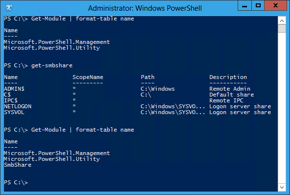
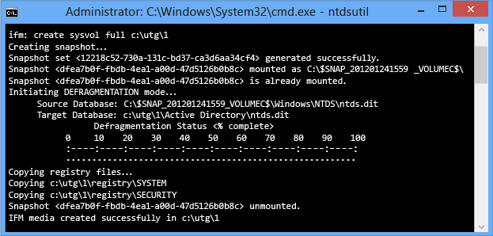

# Simplified Administration Appendix
  
-   [Server Manager Add Servers Dialog \(Active Directory\)](../../ad-ds/deploy/../../ad-ds/deploy/../../ad-ds/deploy/../../ad-ds/deploy/../../ad-ds/deploy/Simplified-Administration-Appendix.md#BKMK_AddServers)  
  
-   [Server Manager Remote Server Status](../../ad-ds/deploy/../../ad-ds/deploy/../../ad-ds/deploy/../../ad-ds/deploy/../../ad-ds/deploy/Simplified-Administration-Appendix.md#BKMK_ServerMgrStatus)  
  
-   [Windows PowerShell Module Loading](../../ad-ds/deploy/../../ad-ds/deploy/../../ad-ds/deploy/../../ad-ds/deploy/../../ad-ds/deploy/Simplified-Administration-Appendix.md#BKMK_PSLoadModule)  
  
-   [RID Issuance Hotfixes for Previous Operating Systems](../../ad-ds/deploy/../../ad-ds/deploy/../../ad-ds/deploy/../../ad-ds/deploy/../../ad-ds/deploy/Simplified-Administration-Appendix.md#BKMK_Rid)  
  
-   [Ntdsutil.exe Install from Media Changes](../../ad-ds/deploy/../../ad-ds/deploy/../../ad-ds/deploy/../../ad-ds/deploy/../../ad-ds/deploy/Simplified-Administration-Appendix.md#BKMK_IFM)  
  
## <a name="BKMK_AddServers"></a>Server Manager Add Servers Dialog \(Active Directory\)  
The **Add Servers** dialog allows searching Active Directory for servers, by operating system, using wildcards, and by location. The dialog also allows using DNS queries by fully qualified domain name or prefix name. These searches use native DNS and LDAP protocols implemented through .NET, not AD Windows PowerShell against the AD Management Gateway through SOAP – meaning that the domain controllers contacted by Server Manager can even run Windows Server 2003. You can also import a file with server names for provisioning purposes.  
  
The Active Directory search uses the following LDAP filters:  
  
```  
(&(ObjectCategory=computer)  
  
(&(ObjectCategory=computer)(cn=dc*)(OperatingSystemVersion=6.2*))  
  
(&(ObjectCategory=computer)(OperatingSystemVersion=6.1*))  
  
(&(ObjectCategory=computer)(OperatingSystemVersion=6.0*))  
  
(&(ObjectCategory=computer)(|(OperatingSystemVersion=5.2*)(OperatingSystemVersion=5.1*)))  
  
```  
  
The Active Directory search returns the following attributes:  
  
```  
( dnsHostName )( operatingSystem )( cn )  
  
```  
  
## <a name="BKMK_ServerMgrStatus"></a>Server Manager Remote Server Status  
Server Manager tests remote server accessibility using Address Routing Protocol. Any servers not responding to ARP requests are not listed, even if they are in the pool.  
  
If ARP responds, then DCOM and WMI connections are made to the server to return status information. If RPC, DCOM, and WMI are unreachable, server manager cannot fully manage the server.  
  
## <a name="BKMK_PSLoadModule"></a>Windows PowerShell Module Loading  
Windows PowerShell 3.0 implements dynamic module loading. Using the **Import\-Module** cmdlet is typically no longer required; instead, simply invoking the cmdlet, alias, or function automatically loads the module.  
  
To see loaded modules, use the **Get\-Module** cmdlet.  
  
```  
Get-Module  
  
```  
  
  
  
To see all installed modules with their exported functions and cmdlets, use:  
  
```  
Get-Module -ListAvailable  
  
```  
  
The main case for using the **import\-module** command is when you need access to the "AD:" Windows PowerShell virtual drive and nothing else has already loaded the module. For example, using the following commands:  
  
```  
import-module activedirectory  
cd ad:  
dir  
  
```  
  
## <a name="BKMK_Rid"></a>RID Issuance Hotfixes for Previous Operating Systems  
See [An update is available to detect and prevent too much consumption of the global RID pool on a domain controller that is running Windows Server 2008 R2](http://support.microsoft.com/kb/2618669).  
  
## <a name="BKMK_IFM"></a>Ntdsutil.exe Install from Media Changes  
Windows Server 2012 adds two additional options to the Ntdsutil.exe command\-line tool for the **IFM \(IFM Media Creation\)** menu. These allow you to create IFM stores without first performing an offline defrag of the exported NTDS.DIT database file. When disk space is not a premium, this saves time creating the IFM.  
  
The following table describes the two new menu items:  
  
|||  
|-|-|  
|Menu Item|Explanation|  
|Create Full NoDefrag %s|Create IFM media without defragmenting for a full AD DC or an AD\/LDS instance into folder %s|  
|Create Sysvol Full NoDefrag %s|Create IFM media with SYSVOL and without defragmenting for a full AD DC into folder %s|  
  
  
  
  
  

