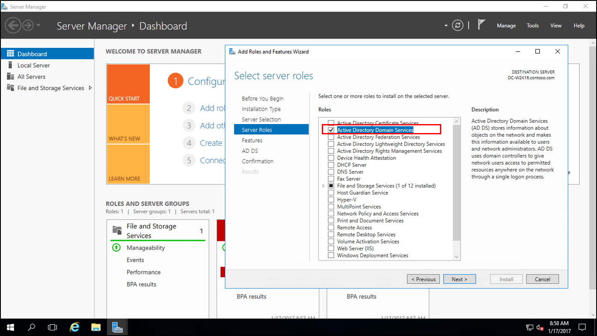
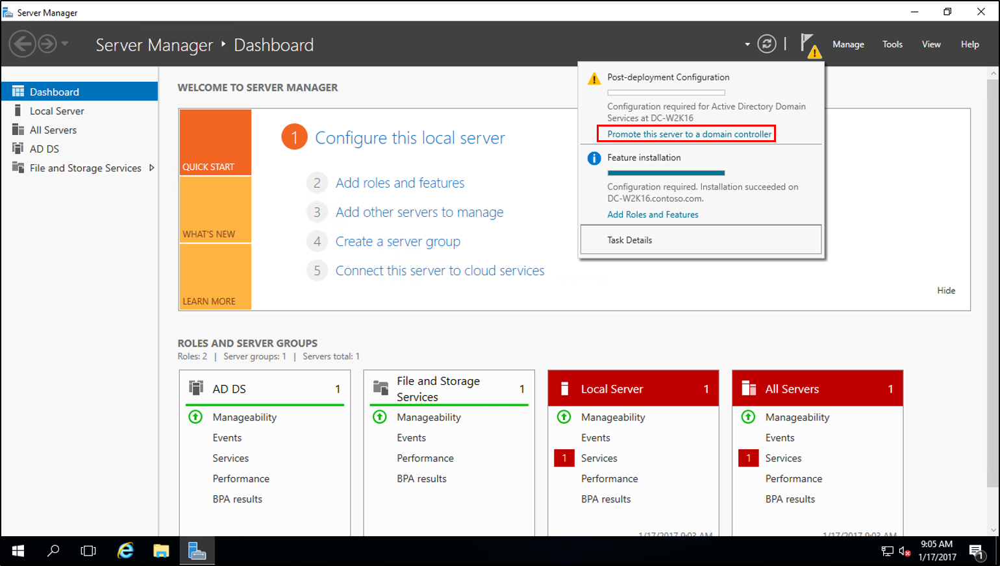
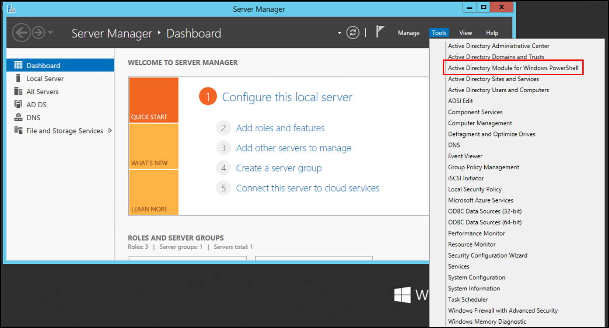
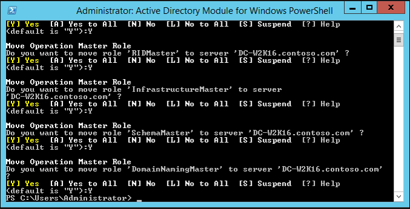
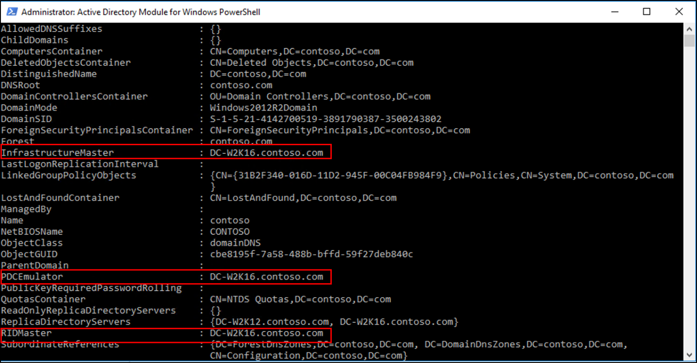

# Upgrade Domain Controllers to a newer version of Windows Server

>Applies to: Windows Server 2022, Windows Server 2019, Windows Server 2016

This topic provides background information about Active Directory Domain
Services in Windows Server and explains the process for upgrading domain controllers from an earlier version of Windows Server.

## Prerequisites

The recommended way to upgrade a domain is to promote new servers to domain controllers (DCs) that run a newer version of Windows Server and demote the older domain controllers as needed. This method is preferable to upgrading the operating system of an existing domain controller, also known as an in-place upgrade. This list covers general steps to follow before you promote a server to a domain controller that runs a newer version of Windows Server:

1. Verify the target server meets the [system requirements](../../../get-started/hardware-requirements.md).
1. Verify application compatibility.
1. Review recommendations for moving to a newer version of Windows Server.
1. Verify security settings.
1. Check connectivity to the target server from the computer where you plan to run the installation.
1. Check for availability of the necessary Flexible Single Master Operation (FSMO) roles in Active Directory. This is required for the following scenarios:
   - To install the first DC that runs the latest Windows Server version in an existing domain and forest, the machine where you run the installation needs connectivity to the **schema master** in order to run `adprep /forestprep` and the **infrastructure master** in order to run `adprep /domainprep`.
   - To install the first DC in a domain where the forest schema is already extended, you only need connectivity to the **infrastructure master**.
   - To install or remove a domain in an existing forest, you need connectivity to the **domain naming master**.
   - Any domain controller installation also requires connectivity to the **RID master.**
   - If you are installing the first read-only domain controller in an existing forest, you need connectivity to the **infrastructure master** for each application directory partition, also known as a non-domain naming context or NDNC.
   
   You can find out which server or servers holds which FSMO role by running the following commands in an elevated PowerShell session, using an account that is a member of the Domain Admins group:
   
   ```PowerShell
   Get-ADDomain | FL InfrastructureMaster, RIDMaster, PDCEmulator
   Get-ADForest | FL DomainNamingMaster, SchemaMaster
   ```

### Installation actions and required administrative levels

The following table provides a summary of the installation actions and the permissions requirements to accomplish these steps.

|Installation action|Credential requirements|
| ----- | ----- |
|Install a new forest|Local Administrator on the target server|
|Install a new domain in an existing forest|Enterprise Admins|
|Install an additional DC in an existing domain|Domain Admins|
|Run `adprep /forestprep`|Schema Admins, Enterprise Admins, and Domain Admins|
|Run `adprep /domainprep`|Domain Admins|
|Run `adprep /domainprep /gpprep`|Domain Admins|
|Run `adprep /rodcprep`|Enterprise Admins|

## Supported in-place upgrade paths

Only 64-bit version upgrades are supported. For more information about supported upgrade paths, see [Supported Upgrade Paths](../../../get-started/supported-upgrade-paths.md).

## Adprep - forestprep and domainprep

If you are doing an in-place upgrade of an existing domain controller, you need to run `adprep /forestprep` and `adprep /domainprep` manually.  `Adprep /forestprep` needs to be run only once in the forest for each newer version of Windows Server.  `Adprep /domainprep` needs to be run once in each domain in which you have domain controllers that you are upgrading for each newer version of Windows Server.

If you are promoting a new server to a domain controller you do not need to run these manually.  These are integrated into the PowerShell and Server Manager experiences.

For more information on running adprep see [Running Adprep](/previous-versions/windows/it-pro/windows-server-2008-R2-and-2008/dd464018(v=ws.10))

## Functional level features and requirements

Windows Server 2019 or later requires a Windows Server 2008 forest functional level as a minimum. Windows Server 2016 requires a Windows Server 2003 forest functional level as a minimum. If the forest contains domain controllers running an older forest functional level than the operating system supports, the installation is blocked. Those domain controllers must be removed and the forest functional level raised to a version that is supported prior to adding newer Windows Server domain controllers to your forest. See [Forest and domain functional levels](../active-directory-functional-levels.md) for more information about supported functional levels.

> [!NOTE]
> There have been no new forest or domain functional levels added since Windows Server 2016. Later operating system versions can and should be used for domain controllers, however they use Windows Server 2016 as the most recent functional levels.

### Rolling back functional levels

After you set the forest functional level to a certain value, you cannot roll back or lower the forest functional level, with the following exceptions:

- If you are upgrading from Windows Server 2012 R2 forest functional level, you can roll back to Windows Server 2012 R2.
- If you are upgrading from Windows Server 2008 R2 forest functional level, you can roll back to Windows Server 2008 R2.

After you set the domain functional level to a certain value, you cannot roll back or lower the domain functional level, with the following exceptions:

- When you raise the domain functional level to Windows Server 2016 and if the forest functional level is Windows Server 2012 or lower, you have the option of rolling the domain functional level back to Windows Server 2012 or Windows Server 2012 R2.

For more information about features that are available at each of the functional levels, see [Forest and domain functional levels](../active-directory-functional-levels.md).

## Active Directory Domain Services interoperability with other server roles and Windows operating systems

Active Directory Domain Services (AD DS) is not supported on the following Windows operating systems:

- Windows MultiPoint Server
- Windows Server Essentials

AD DS cannot be installed on a server that also runs the following server roles or role services:

- Microsoft Hyper-V Server
- Remote Desktop Connection Broker

## Administration of Windows Servers

Use the Remote Server Administration Tools for Windows 10 or later to manage domain controllers and other servers that run Windows Server. You can run the Windows Server Remote Server Administration Tools (RSAT) on a computer that runs Windows 10 or later.

## Step-by-Step for adding a new domain controller with a newer version of Windows Server

The following is a simple example of upgrading the Contoso forest from a previous version of Windows Server to a later version of Windows Server.

1. Join the new Windows Server to your forest. Restart when prompted.

   

1. Sign in to the new Windows Server with a domain admin account.
1. In **Server Manager**, under **Add Roles and Features**, install **Active Directory Domain Services** on the new Windows Server. This will automatically run adprep on the earlier version forest and domain.

   

1. In **Server Manager**, click the yellow triangle, and from the drop-down click **Promote the server to a domain controller**.

   

1. On the **Deployment Configuration** screen, select **Add a domain controller to an existing forest** and click next.

   

1. On the **Domain Controller options** screen, enter the **Directory Services Restore Mode (DSRM)** password and click next.
1. For the remainder of the screens click **Next**.
1. On the **Prerequisite Check** screen, click **install**. Once the restart has completed you can sign back in.
1. On the earlier verion of Windows Server, in **Server Manager**, under tools, select **Active Directory Module for Windows PowerShell**.

   

1. In the PowerShell window use the `Move-ADDirectoryServerOperationMasterRole` to move the FSMO roles. You can type the name of each `-OperationMasterRole` or use numbers to specify the roles. For more information see [Move-ADDirectoryServerOperationMasterRole](/previous-versions/windows/it-pro/windows-server-2008-R2-and-2008/dd464018(v=ws.10))

    ``` powershell
    Move-ADDirectoryServerOperationMasterRole -Identity "DC-W2K16" -OperationMasterRole 0,1,2,3,4
    ```

    

1. Verify the roles have been moved by going to the new Windows Server, in **Server Manager**, under **tools**, select **Active Directory Module for Windows PowerShell**. Use the `Get-ADDomain` and `Get-ADForest` cmdlets to view the FSMO role holders.

    

    

1. Demote and remove the earlier Windows Server domain controller. For information on demoting a DC, see [Demoting Domain Controllers and Domains](../../ad-ds/deploy/Demoting-Domain-Controllers-and-Domains--Level-200-.md)
1. Once the server is demoted and removed you can [raise the forest functional and domain functional levels](/troubleshoot/windows-server/identity/raise-active-directory-domain-forest-functional-levels) to the latest version of Windows Server.

## Next Steps

- [What's New in Active Directory Domain Services Installation and Removal](../../ad-ds/deploy/What-s-New-in-Active-Directory-Domain-Services-Installation-and-Removal.md)
- [Install Active Directory Domain Services &#40;Level 100&#41;](../../ad-ds/deploy/Install-Active-Directory-Domain-Services--Level-100-.md)
- [Windows Server Functional Levels](../active-directory-functional-levels.md)
