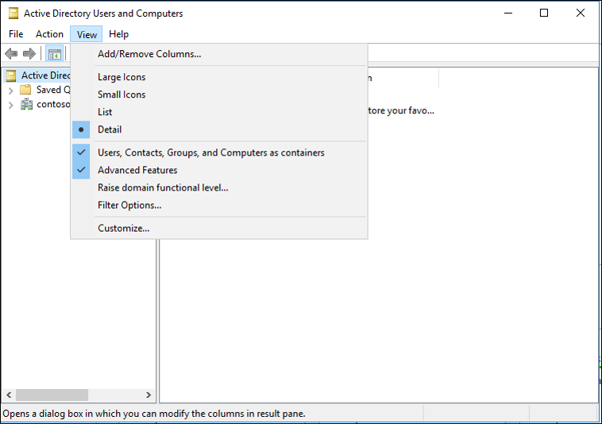
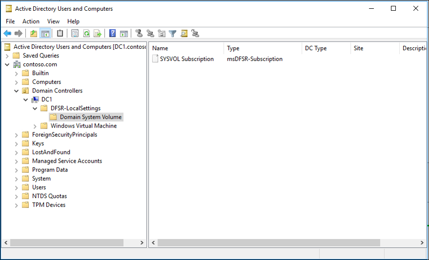
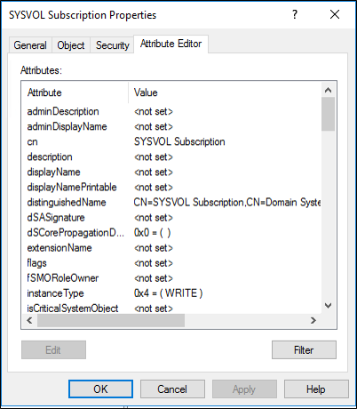
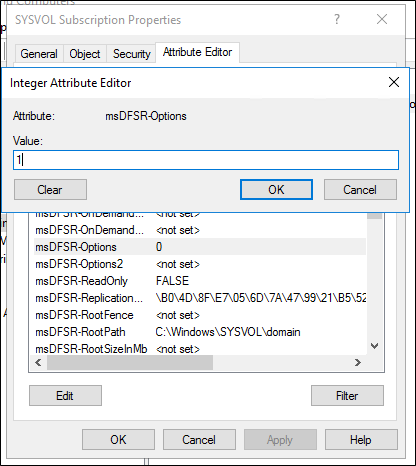

# AD Forest Recovery - Performing an authoritative synchronization of DFSR-replicated SYSVOL

>Applies to: Windows Server 2022, Windows Server 2019, Windows Server 2016, Windows Server 2012 and 2012 R2, Windows Server 2008 and 2008 R2

There are different ways to perform an authoritative restore of SYSVOL. You can either edit the **msDFSR-Options** attribute or perform a system state restore using wbadmin –authsysvol. If you have the option to restore a system state backup (that is, you're restoring AD DS to the same hardware and operating system instance) then using wbadmin –authsysvol is simpler. But if you need to perform a bare metal restore, then you need to edit the **msDFSR-Options** attribute.

Use the following steps to perform an authoritative synchronization of SYSVOL (if it's replicated using DFSR) by editing the **msDFSR-Options** attribute. If SYSVOL is replicated using FRS, see [article 290762](/troubleshoot/windows-server/networking/use-burflags-to-reinitialize-frs).

## To perform an authoritative synchronization of DFSR-replicated SYSVOL

1. Open Active Directory Users and Computers.
2. Select **View**, and then select **Users, Contacts, Groups, and Computers as containers** and **Advanced Features**.

   

3. In the tree-view, select **Domain Controllers**, the name of the DC you restored, **DFSR-LocalSettings**, and then **Domain System Volume**.

   

4. In the Details pane, right-click **SYSVOL Subscription**, select **Properties**, and select **Attribute Editor**.

   

5. Select **msDFSR-Options**, select **Edit**, type **1**, and select **OK**

   

6. Select **OK** to close the Attribute Editor.

## Next Steps

- [AD Forest Recovery Guide](AD-Forest-Recovery-Guide.md)
- [AD Forest Recovery - Procedures](AD-Forest-Recovery-Procedures.md)
