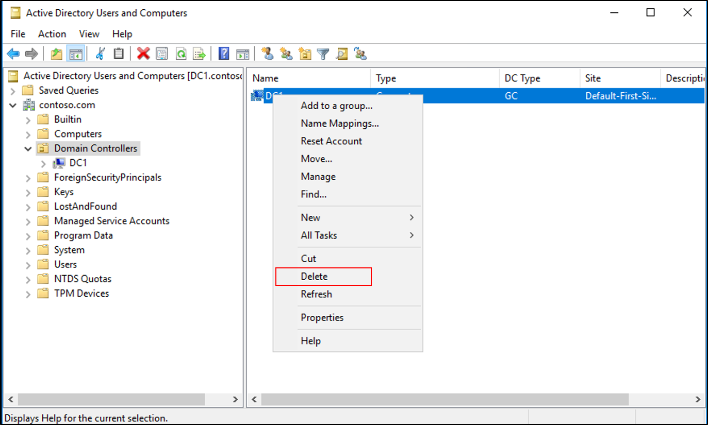

>Applies To: Windows Server 2016, Windows Server 2012 and 2012 R2, Windows Server 2008 and 2008 R2, Windows Server 2003

# AD Forest Recovery - Cleaning metadata of removed writable domain controllers  
 Metadata cleanup removes Active Directory data that identifies a DC to the replication system.  
  
 Use the following procedure to delete the DC objects for DCs that you plan to add back to the network by reinstalling AD DS.  
  
 If you are using the version of Active Directory Users and Computers or Active Directory Sites and Services that is included Remote Server Administration Tools (RSAT), metadata cleanup is performed automatically when you delete a DC object.  
  

## Deleting a domain controller using Active Directory Users and Computers  
 When you use the version of Active Directory Users and Computers or Active Directory Administrative Center in Remote Server Administration Tools (RSAT), metadata cleanup is performed automatically when you delete the DC object. The server object and the computer object are also deleted automatically.  
  
 As an alternative, you can also use Active Directory Sites and Services in RSAT to delete a DC object. If you use Active Directory Sites and Services, you must delete the associated server object and NTDS Settings object before you can delete the DC object.  
  
 To download RSAT:  

-   [Remote Server Administration Tools for Windows 10](https://www.microsoft.com/download/details.aspx?id=45520)
  
-   [Remote Server Administration Tools for Windows 8](http://www.microsoft.com/download/details.aspx?id=28972)  

-   [Remote Server Administration Tools for Windows 7 with Service Pack 1 (SP1)](http://www.microsoft.com/download/details.aspx?id=7887)  
  
-   [Microsoft Remote Server Administration Tools for Windows Vista](http://www.microsoft.com/download/details.aspx?id=21090)  
  
 The following procedure is the same for DCs that run either Windows Server 2016, 2012, 2008 R2, or 2008. The target DC of the metadata cleanup operation can run any version of Windows Server.  
  
### To delete a domain controller object using Active Directory Users and Computers in RSAT  
  
1.  Click **Start**, click **Administrative Tools**, and then click **Active Directory Users and Computers**.  
2.  In the console tree, double-click the domain container, and then double-click the **Domain Controllers** organizational unit (OU).  
3.  In the details pane, right-click the DC that you want to delete, and then click **Delete**. 
 
4.  Click **Yes** to confirm the deletion. Select the **This Domain Controller is permanently offline and can no longer be demoted using the Active Directory Domain Services Installation Wizard (DCPROMO)** check box and click **Delete**.  
5.  If the DC was a global catalog server, click **Yes** confirm that the deletion.  
  
## Next Steps

- [AD Forest Recovery Guide](AD-Forest-Recovery-Guide.md)
- [AD Forest Recovery - Procedures](AD-Forest-Recovery-Procedures.md)
  
