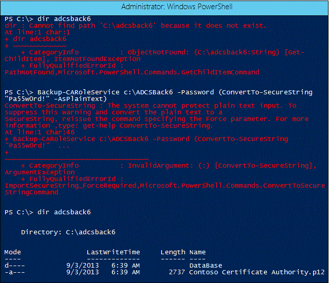

# CA Backup and Restore Windows PowerShell cmdlets

>Applies To: Windows Server Technical Preview

**Author**: Justin Turner, Senior Support Escalation Engineer with the Windows group  
  
> [!NOTE]  
> This content is written by a Microsoft customer support engineer, and is intended for experienced administrators and systems architects who are looking for deeper technical explanations of features and solutions in Windows Server 2012 R2 than topics on TechNet usually provide. However, it has not undergone the same editing passes, so some of the language may seem less polished than what is typically found on TechNet.  
  
## Overview  
The ADCSAdministration Windows PowerShell module was introduced in Window Server 2012.  Two new cmdlets were added to this module in Window Server 2012 R2 to support the Backup and Restore of a CA.  
  
-   Backup-CARoleService  
  
-   Restore-CARoleService  
  
## Backup-CARoleService  
**Table  SEQ Table \\\* ARABIC 17: Backup and Restore Windows PowerShell Cmdlets**  
  
**ADCSAdministration Cmdlet: Backup-CARoleService**  
  
|Arguments - **Bold** arguments are required|Description|  
|------------------------------------------------|---------------|  
|**-Path**|-   String - location to save the backup<br />-   This is the only unnamed parameter<br />-   positional parameter<br /><br />**Example:**<br /><br />Backup-CARoleService.-Path c:\adcsbackup1<br /><br />Backup-CARoleService c:\adcsbackup2|  
|-KeyOnly|-   Backup the CA certificate without the database<br /><br />**Example:**<br /><br />Backup-CARoleService c:\adcsbackup3 -KeyOnly|  
|-Password|-   Specifies the password to protect CA certificates and private keys<br />-   Must be a secure string<br />-   Not valid with the -DatabaseOnly parameter<br /><br />Example:<br /><br />Backup-CARoleService c:\adcsbackup4 -Password (Read-Host -prompt "Password:" -AsSecureString)<br /><br />Backup-CARoleService c:\adcsbackup5 -Password (ConvertTo-SecureString "Pa55w0rd!" -AsPlainText -Force)|  
|-DatabaseOnly|-   Backup the database without the CA certificate<br /><br />Backup-CARoleService c:\adcsbackup6 -DatabaseOnly|  
|-Force|1.  Allows you to overwrite the backup that preexists in the location specified in the -Path parameter<br /><br />Backup-CARoleService c:\adcsbackup1 -Force|  
|-Incremental|-   Perform an incremental backup<br /><br />Backup-CARoleService c:\adcsbackup7 -Incremental|  
|-KeepLog|1.  Instructs the command to keep log files. If the switch is not specified, log files are truncated by default except in the Incremental scenario<br /><br />Backup-CARoleService c:\adcsbackup7 -KeepLog|  
  
### -Password <Secure String>  
If the -Password parameter is used, the supplied password must be a secure string.  Use the **Read-Host** cmdlet to launch an interactive prompt for secure password entry, or use the **ConvertTo-SecureString** cmdlet to specify the password in-line.  
  
Review the following examples  
  
**Specifying a secure string for the Password parameter using Read-Host**  
  
```powershell  
Backup-CARoleService c:\adcsbackup4 -Password (Read-Host -prompt "Password:" -AsSecureString)  
```  
  
**Specifying a secure string for the Password parameter using ConvertTo-SecureString**  
  
```powershell  
Backup-CARoleService c:\adcsbackup5 -Password (ConvertTo-SecureString "Pa55w0rd!" -AsPlainText -Force)  
```  
  
## Restore-CARoleService  
**ADCSAdministration Cmdlet: Restore-CARoleService**  
  
|Arguments - **Bold** arguments are required|Description|  
|------------------------------------------------|---------------|  
|**-Path**|-   String - location to restore backup from<br />-   This is the only unnamed parameter<br />-   positional parameter<br /><br />**Example:**<br /><br />Restore-CARoleService.-Path c:\adcsbackup1 -Force<br /><br />Restore-CARoleService c:\adcsbackup2 -Force|  
|-KeyOnly|-   Restore the CA certificate without the database<br />-   Must be specified if the backup was taken with the -KeyOnly option<br /><br />**Example:**<br /><br />Restore-CARoleService c:\adcsbackup3 -KeyOnly -Force|  
|-Password|-   Specifies the password of the CA certificates and private keys<br />-   Must be a secure string<br /><br />**Example:**<br /><br />Restore-CARoleService c:\adcsbackup4 -Password (read-host -prompt "Password:" -AsSecureString) -Force<br /><br />Restore-CARoleService c:\adcsbackup5 -Password (ConvertTo-SecureString "Pa55w0rd!" -AsPlainText -Force) -Force|  
|-DatabaseOnly|-   Restore the database without the CA certificate<br /><br />Restore-CARoleService c:\adcsbackup6 -DatabaseOnly|  
|-Force|-   Allows you to overwrite the preexisting keys<br />-   Is an optional parameter but when restoring in-place, it is likely required<br /><br />Restore-CARoleService c:\adcsbackup1 -Force|  
  
### Issues  
A non-password protected backup is taken if the ConvertTo-SecureString function fails while using the Backup-CARoleService with the -Password parameter.  
  
  
  
**Table  SEQ Table \\\* ARABIC 18: Common Errors**  
  
|Action|Error|Comment|  
|----------|---------|-----------|  
|**Restore-CARoleService C:\ADCSBackup**|Restore-CARoleService : The process cannot access the file because it is being used by another process. (Exception from HRESULT:<br /><br />0x80070020)|Stop the Active Directory Certificate Services service prior to running the Restore-CARoleService cmdlet|  
|**Restore-CARoleService C:\ADCSBackup**|Restore-CARoleService : The directory is not empty. (Exception from HRESULT: 0x80070091)|Use the -Force parameter to overwrite preexisting keys|  
|**Backup-CARoleService C:\ADCSBackup -Password (Read-Host -Prompt "Password:" -AsSecureString) -DatabaseOnly**|Backup-CARoleService : Parameter set cannot be resolved using the specified named parameters.|The -Password parameter is only used to password protect private keys and is therefore invalid when you are not backing them up|  
|**Restore-CARoleService C:\ADCSBack15 -Password (Read-Host -Prompt "Password:" -AsSecureString) -DatabaseOnly**|Restore-CARoleService : Parameter set cannot be resolved using the specified named parameters.|The -Password parameter is only used to password protect private keys and is therefore invalid when you are not restoring them|  
|**Restore-CARoleService C:\ADCSBack14 -Password (Read-Host -Prompt "Password:" -AsSecureString)**|Restore-CARoleService : The system cannot find the file specified. (Exception from HRESULT: 0x80070002)|The path specified does not contain a valid database backup.  Perhaps the path is invalid or the backup was taken with the -KeysOnly option?|  
  
## Additional Resources  
[Active Directory Certificate Services Migration Guide](http://technet.microsoft.com/library/ee126170(v=ws.10).aspx)  
  
[Backing up a CA database and private key](http://technet.microsoft.com/library/ee126140(v=ws.10).aspx#BKMK_BackUpDB)  
  
[Restoring the CA database and configuration on the destination server](http://technet.microsoft.com/library/ee126140(v=ws.10).aspx#BKMK_RestoreCA)  
  
## Try This: Backup the CA in your lab using Windows PowerShell  
  
1.  Use the commands in this lesson to backup the CA database and private key secured with a password.  
  
2.  Hold off on the restore of the CA at this time.  
  


