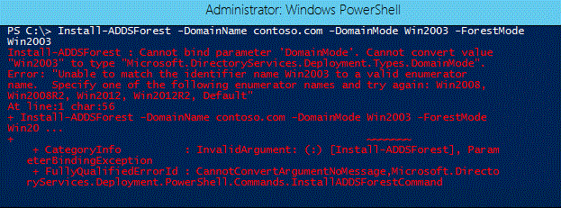
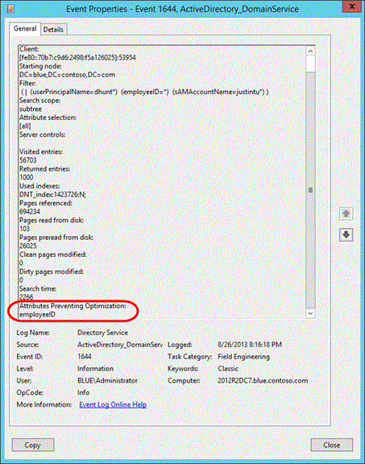
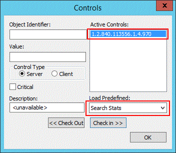
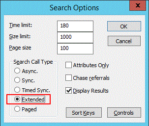
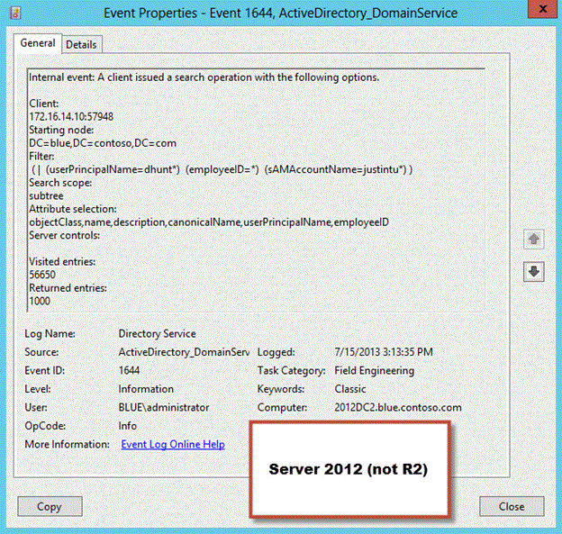

# Directory Services component updates

>Applies to: Windows Server 2022, Windows Server 2019, Windows Server 2016, Windows Server 2012 R2, Windows Server 2012

**Author**: Justin Turner, Senior Support Escalation Engineer with the Windows group

> [!NOTE]
> This content is written by a Microsoft customer support engineer, and is intended for experienced administrators and systems architects who are looking for deeper technical explanations of features and solutions in Windows Server 2012 R2 than topics on TechNet usually provide. However, it has not undergone the same editing passes, so some of the language may seem less polished than what is typically found on TechNet.

This lesson explains the Directory Services component updates in Windows Server 2012 R2.

## What You Will Learn
Explain the following new Directory Services component updates:

-   Explain the following new Directory Services component updates:

    -   [Domain and Forest Functional Levels](./Directory-Services-component-updates.md#BKMK_FL)

    -   [Deprecation of NTFRS](./Directory-Services-component-updates.md#BKMK_NTFRS)

    -   [LDAP Query Optimizer changes](./Directory-Services-component-updates.md#BKMK_LDAPQuery)

    -   [1644 Event improvements](./Directory-Services-component-updates.md#BKMK_1644)

    -   [Active Directory Replication throughput improvement](./Directory-Services-component-updates.md#BKMK_ADRepl)

## <a name="BKMK_FL"></a>Domain and Forest Functional Levels

### Overview
The section provides a brief introduction to the domain and forest functional level changes.

### New DFL and FFL
With the release, there are new domain and forest functional levels:

-   Forest Functional Level: Windows Server 2012 R2

-   Domain Functional Level: Windows Server 2012 R2

### The Windows Server 2012 R2 Domain Functional Level enables support for the following:

1.  DC-side protections for *Protected Users*

    *Protected Users* authenticating to a Windows Server 2012 R2 domain can **no longer**:

    -   Authenticate with NTLM authentication

    -   Use DES or RC4 cipher suites in Kerberos pre-authentication

    -   Be delegated with unconstrained or constrained delegation

    -   Renew user tickets (TGTs) beyond the initial 4 hour lifetime

2.  Authentication Policies

    New forest-based Active Directory policies which can be applied to accounts in Windows Server 2012 R2 domains to control which hosts an account can sign-on from and apply access control conditions for authentication to services running as an account

3.  Authentication Policy Silos

    New forest-based Active Directory object which can create a relationship between user, managed service and computer accounts to be used to classify accounts for authentication policies or for authentication isolation.

See How to Configure Protected Accounts for more information.

In addition to the above features, the Windows Server 2012 R2 domain functional level ensures that any domain controller in the domain runs Windows Server 2012 R2.
The Windows Server 2012 R2 forest functional level does not provide any new features, but it ensures that any new domain created in the forest will automatically operate at the Windows Server 2012 R2 domain functional level.

### Minimum DFL enforced on new domain creation
Windows Server 2008 DFL is the minimum functional level supported on new domain creation.

> [!NOTE]
> The deprecation of FRS is accomplished by removing the ability to install a new domain with a domain functional level lower than Windows Server 2008 with Server Manager or via Windows PowerShell.

### Lowering the forest and domain functional levels
The forest and domain functional levels are set to Windows Server 2012 R2 by default on new domain and new forest creation but can be lowered using Windows PowerShell.

To raise or lower the forest functional level using Windows PowerShell, use the **Set-ADForestMode** cmdlet.

**To set the contoso.com FFL to Windows Server 2008 mode:**

```sql
Set-ADForestMode -ForestMode Windows2008Forest -Identity contoso.com
```

To raise or lower the domain functional level using Windows PowerShell, use the Set-ADDomainMode cmdlet.

**To set the contoso.com DFL to Windows Server 2008 mode:**

```powershell
Set-ADDomainMode -DomainMode Windows2008Domain -Identity contoso.com
```

Promotion of a DC running Windows Server 2012 R2 as an additional replica into an existing domain running 2003 DFL works.

New domain creation in an existing forest


### ADPREP
There are no new forest or domain operations in this release.

These .ldf files contain schema changes for the **Device Registration Service**.

1.  Sch59

2.  Sch61

3.  Sch62

4.  Sch63

5.  Sch64

6.  Sch65

7.  Sch67

**Work Folders:**

1.  Sch66

**MSODS:**

1.  Sch60

**Authentication Policies and Silos**

1.  Sch68

2.  Sch69

## <a name="BKMK_NTFRS"></a>Deprecation of NTFRS

### Overview
FRS is deprecated in Windows Server 2012 R2.  The deprecation of FRS is accomplished by enforcing a minimum domain functional level (DFL) of Windows Server 2008.  This enforcement is present only if the new domain is created using Server Manager or Windows PowerShell.

You use the -DomainMode parameter with the Install-ADDSForest or Install-ADDSDomain cmdlets to specify the domain functional level.  Supported values for this parameter can be either a valid integer or a corresponding enumerated string value. For example, to set the domain mode level to Windows Server 2008 R2, you can specify either a value of 4 or "Win2008R2".  When executing these cmdlets from Server 2012 R2 valid values include those for Windows Server 2008 (3, Win2008) Windows Server 2008 R2 (4, Win2008R2) Windows Server 2012 (5, Win2012) and Windows Server 2012 R2 (6, Win2012R2). The domain functional level cannot be lower than the forest functional level, but it can be higher.  Since FRS is deprecated in this release, Windows Server 2003 (2, Win2003) is not a recognized parameter with these cmdlets when executed from Windows Server 2012 R2.




## <a name="BKMK_LDAPQuery"></a>LDAP Query Optimizer changes

### Overview
The LDAP query optimizer algorithm was reevaluated and further optimized.  The result is the performance improvement in LDAP search efficiency and LDAP search time of complex queries.

> [!NOTE]
> <strong>From the Developer:</strong>improvements in the performance of searches through improvements in the mapping from LDAP query to ESE query.  LDAP filters beyond a certain level of complexity prevent optimized index selection, resulting in drastically decreased performance (1000x or more). This change alters the way in which we select indices for LDAP queries to avoid this problem.
>
> [!NOTE]
> A complete overhaul of the LDAP query optimizer algorithm, resulting in:
>
> -   Faster search times
> -   Efficiency gains allow DCs to do more
> -   Less support calls regarding AD Performance issues
> -   Back ported to Windows Server 2008 R2 (KB 2862304)

### Background
The ability to search Active Directory is a core service provided by domain controllers.  Other services and line of business applications rely on Active Directory searches.  Business operations can cease to a halt if this feature is not available.  As a core and heavily used service, it is imperative that domain controllers handle LDAP search traffic efficiently.  The LDAP query optimizer algorithm attempts to make LDAP searches efficient as possible by mapping LDAP search filters to a result set that can be satisfied via records already indexed in the database.  This algorithm was reevaluated and further optimized.  The result is the performance improvement in LDAP search efficiency and LDAP search time of complex queries.

### Details of change
An LDAP search contains:

-   A location (NC head, OU, Object) within the hierarchy to begin the search

-   A search filter

-   A list of attributes to return

The search process can be summarized as follows:

1.  Simplify the search filter if possible.

2.  Select a set of Index Keys that will return the smallest covered set.

3.  Perform one or more intersections of Index Keys, to reduce the covered set.

4.  For each record in the covered set, evaluate the filter expression as well as the security. If the filter evaluates to TRUE and access is granted, then return this record to the client.

The LDAP query optimization work modifies steps 2 and 3, to reduce the size of the covered set. More specifically, the current implementation selects duplicate Index Keys and performs redundant intersections.

### Comparison between old and new algorithm
The target of the inefficient LDAP search in this example is a Windows Server 2012 domain controller.  The search completes in approximately 44 seconds as a result of failing to find a more efficient index.

```
adfind -b dc=blue,dc=contoso,dc=com -f "(| (& (|(cn=justintu) (postalcode=80304) (userprincipalname=justintu@blue.contoso.com)) (|(objectclass=person) (cn=justintu)) ) (&(cn=justintu)(objectclass=person)))" -stats >>adfind.txt

Using server: WINSRV-DC1.blue.contoso.com:389

<removed search results>

Statistics
=====
Elapsed Time: 44640 (ms)
Returned 324 entries of 553896 visited - (0.06%)

Used Filter:
 ( |  ( &  ( |  (cn=justintu)  (postalCode=80304)  (userPrincipalName=justintu@blue.contoso.com) )  ( |  (objectClass=person)  (cn=justintu) ) )  ( &  (cn=justintu)  (objectClass=person) ) )

Used Indices:
 DNT_index:516615:N

Pages Referenced          : 4619650
Pages Read From Disk      : 973
Pages Pre-read From Disk  : 180898
Pages Dirtied             : 0
Pages Re-Dirtied          : 0
Log Records Generated     : 0
Log Record Bytes Generated: 0
```

### Sample results using the new algorithm
This example repeats the exact same search as above but targets a Windows Server 2012 R2 domain controller.  The same search completes in less than a second due to the improvements in the LDAP query optimizer algorithm.

```
adfind -b dc=blue,dc=contoso,dc=com -f "(| (& (|(cn=justintu) (postalcode=80304) (userprincipalname=dhunt@blue.contoso.com)) (|(objectclass=person) (cn=justintu)) ) (&(cn=justintu)(objectclass=person)))" -stats >>adfindBLUE.txt

Using server: winblueDC1.blue.contoso.com:389

.<removed search results>

Statistics
=====
Elapsed Time: 672 (ms)
Returned 324 entries of 648 visited - (50.00%)

Used Filter:
 ( |  ( &  ( |  (cn=justintu)  (postalCode=80304)  (userPrincipalName=justintu@blue.contoso.com) )  ( |  (objectClass=person)  (cn=justintu) ) )  ( &  (cn=justintu)  (objectClass=person) ) )

Used Indices:
 idx_userPrincipalName:648:N
 idx_postalCode:323:N
 idx_cn:1:N

Pages Referenced          : 15350
Pages Read From Disk      : 176
Pages Pre-read From Disk  : 2
Pages Dirtied             : 0
Pages Re-Dirtied          : 0
Log Records Generated     : 0
Log Record Bytes Generated: 0
```

-   If unable to optimize the tree:

    -   For example: an expression in the tree was over a column not indexed

    -   Record a list of indices that prevent optimization

    -   Exposed via ETW tracing and event ID 1644

        

### <a name="BKMK_EnableStats"></a>To enable the Stats control in LDP

1.  Open LDP.exe, and connect and bind to a domain controller.

2.  On the **Options** menu, click **Controls**.

3.  On the Controls dialog box, expand the **Load Predefined** pull-down menu, click **Search Stats** and then click **OK**.

    

4.  On the **Browse** menu, click **Search**

5.  In the Search dialog box, select the **Options** button.

6.  Ensure the **Extended** check box is selected on the Search Options dialog box and select **OK**.

    

### Try This: Use LDP to return query statistics
Perform the following on a domain controller, or from a domain-joined client or server that has the AD DS tools installed.  Repeat the following targeting your Windows Server 2012 DC and your Windows Server 2012 R2 DC.

1.  Review the ["Creating More Efficient Microsoft AD Enabled Applications"](/previous-versions/ms808539(v=msdn.10)) article and refer back to it as needed.

2.  Using LDP, enable search statistics (see [To enable the Stats control in LDP](./Directory-Services-component-updates.md#BKMK_EnableStats))

3.  Conduct several LDAP searches and observe the statistical information at the top of the results.  You will repeat the same search in other activities so document them in a notepad text file.

4.  Perform an LDAP search that the query optimizer should be able to optimize because of attributes indices

5.  Attempt to construct a search that takes a long time to complete (you may want to increase the **Time limit** option so the search does not timeout).

### Additional Resources
[What Are Active Directory Searches?](/previous-versions/windows/it-pro/windows-server-2003/cc783845(v=ws.10))

[How Active Directory Searches Work](/previous-versions/windows/it-pro/windows-server-2003/cc755809(v=ws.10))

[Creating More Efficient Microsoft Active Directory-Enabled Applications](/previous-versions/ms808539(v=msdn.10))

[951581](https://support.microsoft.com/kb/951581) LDAP queries are executed more slowly than expected in the AD or LDS/ADAM directory service and Event ID 1644 may be logged

## <a name="BKMK_1644"></a>1644 Event improvements

### Overview
This update adds additional LDAP search result statistics to event ID 1644 to aid in troubleshooting purposes.  Additionally, there is a new registry value that can be used to enable logging on a time-based threshold.  These improvements were made available in Windows Server 2012 and Windows Server 2008 R2 SP1 via KB [2800945](https://support.microsoft.com/kb/2800945) and will be made available to Windows Server 2008 SP2.

> [!NOTE]
> -   Additional LDAP search statistics are added to event ID 1644 to aid in troubleshooting inefficient or expensive LDAP searches
> -   You can now specify a Search Time Threshold (eg. Log event 1644 for searches taking longer than 100ms) instead of specifying the Expensive and Inefficient search result threshold values

### Background
While troubleshooting Active Directory performance problems, it becomes apparent that LDAP search activity may be contributing to the problem.  You decide to enable logging so that you can see expensive or inefficient LDAP queries processed by domain controller.  In order to enable the logging, you must set the Field Engineering diagnostics value and can optionally specify the expensive / inefficient search results threshold values.  Upon enabling the Field Engineering logging level to a value of 5, any search that meets these criteria is logged in the Directory Services event log with an event ID 1644.

The event contains:

-   Client IP and port

-   Starting Node

-   Filter

-   Search scope

-   Attribute selection

-   Server controls

-   Visited entries

-   Returned entries

However, key data is missing from the event such as the amount of time spent on the search operation and what (if any) index was used.

#### Additional search statistics added to event 1644

-   Used indexes

-   Pages referenced

-   Pages read from disk

-   Pages preread from disk

-   Clean pages modified

-   Dirty pages modified

-   Search time

-   Attributes Preventing Optimization

#### New time-based threshold registry value for event 1644 logging
Instead of specifying the Expensive and Inefficient search result threshold values, you can specify Search Time Threshold.  If you wanted to log all search results that took 50 ms or greater, you would specify 50 decimal / 32 hex (in addition to setting the Field Engineering value).

```
Windows Registry Editor Version 5.00
[HKEY_LOCAL_MACHINE\SYSTEM\CurrentControlSet\Services\NTDS\Parameters]
"Search Time Threshold (msecs)"=dword:00000032
```

#### Comparison of the old and new event ID 1644
OLD



NEW


#### Try This: Use the event log to return query statistics

1.  Repeat the following targeting your Windows Server 2012 DC and your Windows Server 2012 R2 DC. Observe the event ID 1644s on both DCs after each search.

2.  Using regedit, enable event ID 1644 logging using a time-based threshold on the Windows Server 2012 R2 DC and the old method on the Windows Server 2012 DC.

3.  Conduct several LDAP searches that exceed the threshold and observe the statistical information at the top of the results.  Use the LDAP queries you documented earlier and repeat the same searches.

4.  Perform an LDAP search that the query optimizer is not able to optimize because one or more attributes are not indexed.

## <a name="BKMK_ADRepl"></a>Active Directory Replication throughput improvement

### Overview
AD replication uses RPC for its replication transport. By default, RPC uses an 8K transmit buffer and a 5K packet size. This has the net effect where the sending instance will transmit three packets (approximately 15K worth of data) and then have to wait for a network round trip before sending more. Assuming a 3ms roundtrip time, the highest throughput would be around 40Mbps, even on 1Gbps or 10 Gbps networks.

> [!NOTE]
> -   This update adjusts the maximum AD Replication throughput from 40Mbps to around 600 Mbps.
>
>     -   It increases the RPC send buffer size which reduces the number of network round trips
> -   The effect will be most noticeable on high speed, high latency network.

This updates increase the maximum throughput to around 600 Mbps by changing the RPC send buffer size from 8K to 256KB.  This change allows the TCP window size to grow beyond 8K, reducing the number of network round trips.

> [!NOTE]
> There are no configurable settings to modify this behavior.

### Additional Resources
[How the Active Directory Replication Model Works](/previous-versions/windows/it-pro/windows-server-2003/cc772726(v=ws.10))

