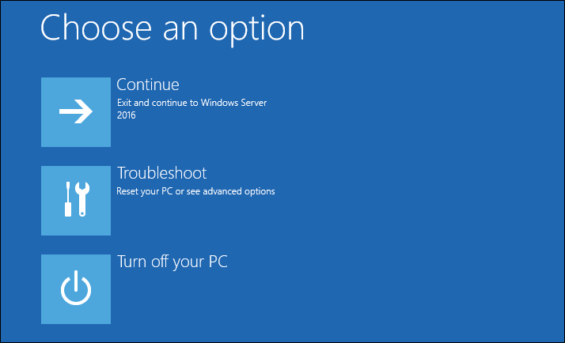
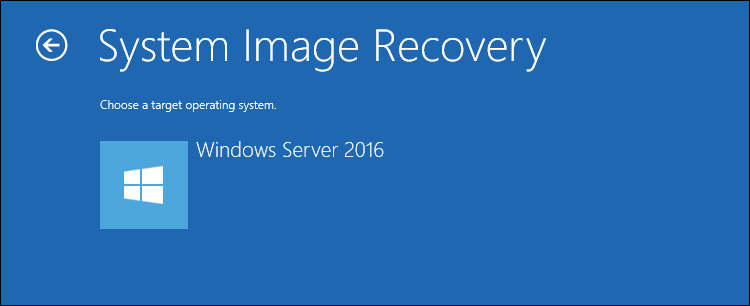
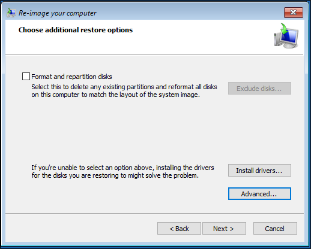
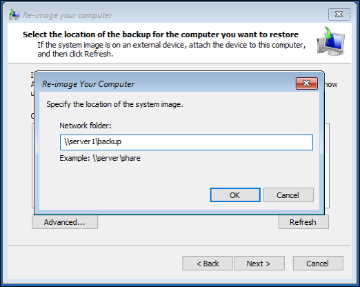

# Active Directory Forest Recovery -  Performing a full server recovery

> Applies to: Windows Server 2022, Windows Server 2019, Windows Server 2016, Windows Server 2012 R2 and 2012

## Active Directory Full Server Recovery

A full server recovery is necessary if you are restoring to different hardware
or a different operating system instance. Bare-Metal recovery is a supported
method of backup.

Keep in mind the following:

- The number drives on the target server needs to be equal to the number in
    the backup and they need to be the same size or greater.

- The target server needs to be started from the operating system DVD in order
    to access Windows PE Environment, and using the **Repair your computer**
    option.

- If you are using disk volume encryption solutions like Bitlocker, make sure
    you test and apply the steps necessary to the server recovery plan for
    getting the server OS restored and started properly.

- If the target DC is running in a VM on Hyper-V and the backup is stored on a
    network location, you must install a legacy network adapter, with all
    isolation precautions needed depending on your recovery scenario.

- After you perform a full server recovery, you need to separately perform an
    authoritative restore of SYSVOL, as described in [AD Forest Recovery - Performing an authoritative synchronization of DFSR-replicated SYSVOL](ad-forest-recovery-authoritative-recovery-sysvol.md).

Depending on your scenario, use one of the following procedures to perform a
full restore.

**Perform a full server restore with a healthy local backup using the latest
image**

1. Start Windows Setup, specify the Language, Time and currency format, and
    keyboard options and click **Next**.

2. Click **Repair your computer**.

    

3. Click **Troubleshoot**.  

    

4. Click **System Image Recovery**.  

    

5. Click **Windows Server 2016**.

    

6. If you are restoring the most recent local backup, click **Use the latest
    available system image (recommended)** and click **Next**.

    >[!NOTE]
    > If you need to select a backup from another time as the problem was introduced was introduced some time ago, select "Select a system image"
    and chose the known good backup.  

    

7. You will now be given an option to:

    - Format and repartition disks

    - Install drivers

    - De-selecting the **Advanced** features of automatically restarting and
        checking for disk errors. These are enabled by default.

        

8. Click **Next**.

9. Click **Finish**. You will be prompted if you are sure you want to continue.
    Click **Yes**.

    

10. Once this completes perform an authoritative restore of SYSVOL, as described
    in [AD Forest Recovery - Performing an authoritative synchronization of
    DFSR-replicated
    SYSVOL](ad-forest-recovery-authoritative-recovery-sysvol).

## Perform a full server restore with any image local or remote

1. Start Windows Setup, specify the Language, Time and currency format, and
    keyboard options and click **Next**.

2. Click **Repair your computer**.

3. Click **Troubleshoot**, click **System Image Recovery**, and click **Windows
    Server 2016**.

4. If you are restoring the most recent local backup, click **Select a system
    image** and click **Next**.

5. Now you can select the location of the backup that you want to restore. If
    the image is local you can select it from the list.

6. If the image is on a network share, select **Advanced**. You can also select
    **Advanced** if you need to install a driver.

    

7. If you are restoring from the network after clicking **Advanced** select
    **Search for a system image on the network**. You may be prompted to restore
    network connectivity. Select Ok.  

    

8. Type the UNC path to the backup share location (for example,
    \\\\server1\\backups) and click **OK**. You can also type the IP address of
    the target server, such as \\\\192.168.1.3\\backups.

    

9. Type credentials necessary to access the share and click OK.

10. Now **Select the date and time of system image to restore** and click
    **Next**.

11. You will now be given an option to:

    - Format and repartition disks

    - Install drivers

    - De-selecting the **Advanced** features of automatically restarting and
        checking for disk errors. These are enabled by default.

12. Click **Next**.

13. Click **Finish**. You will be prompted asking if you are sure you want to
    continue. Click **Yes**.

14. Once this completes perform an authoritative restore of SYSVOL, as described
    in [AD Forest Recovery - Performing an authoritative synchronization of DFSR-replicated SYSVOL](ad-forest-recovery-authoritative-recovery-sysvol.md).

## Enabling the network adapter for a network backup

If you need to enable a network adapter from the command prompt to restore from
a network share, use the following steps.

1. Start Windows Setup, specify the Language, Time and currency format, and
    keyboard options and click **Next**.

2. Click **Repair your computer**. I

3. Click **Troubleshoot**, click **Command Prompt**.

4. Type the following command and press ENTER:

    wpeinit

5. To confirm the name of the network adapter, type:

    show interfaces

    Type the following commands and press ENTER after each command:

    netsh

    interface

    tcp

    ipv4

    set address "Name of Network Adapter" static IPv4 Address SubnetMask IPv4
    Gateway Address 1

    For example:

    set address "Local Area Connection" static 192.168.1.2 255.0.0.0 192.168.1.1
    1

    Type quit to return to a command prompt. Type ipconfig /all to verify the
    network adapter has an IP address and try to ping the IP address of the
    server that hosts the backup share to confirm connectivity. Close the
    command prompt when you are done.

6. Now that the network adapter is working, select the steps above to complete
    the restore.

## Next Steps

[!INCLUDE [ad-forest-recovery-guide-links](includes/ad-forest-recovery-guide-links.md)]
