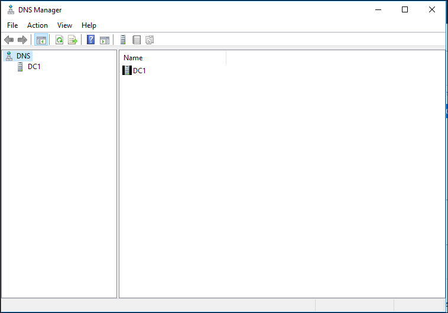
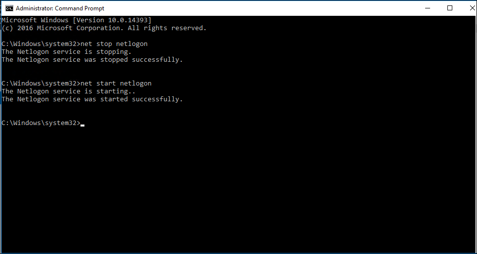

# Active Directory Forest Recovery - Configuring the DNS Server service

>Applies to: Windows Server 2022, Windows Server 2019, Windows Server 2016, Windows Server 2012 and 2012 R2, Windows Server 2008 and 2008 R2

If the DNS server role isn't installed on the DC that you restore from backup, you must install and configure the DNS server.

## Install and configure the DNS Server service

Complete this step for each restored DC that isn't running as a DNS server after the restore is complete.

> [!NOTE]
> If the DC that you restored from backup is running Windows Server 2008 R2, you must connect the DC to an isolated network in order to install DNS server. Then connect each of the restored DNS servers to a mutually shared, isolated network. Run repadmin /replsum to verify that replication is functioning between the restored DNS servers. After you verify replication, you can connect the restored DCs to the production network If the DNS server role is already installed, you can apply a hotfix that makes it possible for a DNS server to start while the server is not connected to any network. You should slipstream the hotfix into the operating system installation image during your automated build processes. For more information about the hotfix, see [Article 975654](https://go.microsoft.com/fwlink/?LinkId=184691) in the Microsoft Knowledge Base (https://go.microsoft.com/fwlink/?LinkId=184691).

Complete the installation and configuration steps below.

### To install and the DNS Server service using Server Manager

1. Open Server Manager and select **Add roles and features**.
2. In the Add Roles Wizard, if the **Before You Begin** page appears, select **Next**.
3. On the **Installation type** screen select **Role-based or feature based installation** and select **Next**.
4. On the **Server Selection** screen select the server and select **Next**.
5. On the **Server Roles** screen select **DNS Server**, if prompted select **Add Features** and select **Next**.
6. On the **Features** screen select **Next**.
7. Read the information on the **DNS Server** page, and then select **Next**.
   
8. On the **Confirmation** page, verify that the DNS Server role will be installed, and then select **Install**.

### To configure the DNS Server service

1. Open Server Manager, select **Tools** and select **DNS**.
   
2. Create DNS zones for the same DNS domain names that were hosted on the DNS servers before the critical malfunction. For more information, see Add a Forward Lookup Zone ([https://go.microsoft.com/fwlink/?LinkId=74574](/previous-versions/windows/it-pro/windows-server-2008-R2-and-2008/cc771566(v=ws.11))).
3. Configure the DNS data as it existed before the critical malfunction. For example:

   - Configure DNS zones to be stored in AD DS. For more information, see Change the Zone Type ([https://go.microsoft.com/fwlink/?LinkId=74579](/previous-versions/windows/it-pro/windows-server-2008-R2-and-2008/cc771150(v=ws.11))).
   - Configure the DNS zone that is authoritative for domain controller locator (DC Locator) resource records to allow secure dynamic update. For more information, see Allow Only Secure Dynamic Updates ([https://go.microsoft.com/fwlink/?LinkId=74580](/previous-versions/windows/it-pro/windows-server-2008-R2-and-2008/cc753751(v=ws.11))).

4. Ensure that the parent DNS zone contains delegation resource records (name server (NS) and glue host (A) resource records) for the child zone that is hosted on this DNS server. For more information, see Create a Zone Delegation ([https://go.microsoft.com/fwlink/?LinkId=74562](/previous-versions/windows/it-pro/windows-server-2008-R2-and-2008/cc753500(v=ws.11))).
5. After you configure DNS, you can speed up registration of the NETLOGON Records.

   > [!NOTE]
   > Secure dynamic updates only work when a global catalog server is available.

   At the command prompt, type the following command, and then press ENTER:

   **net stop netlogon**

6. Type the following command, and then press ENTER:

   **net start netlogon**

   

## Next Steps

- [AD Forest Recovery Guide](AD-Forest-Recovery-Guide.md)
- [AD Forest Recovery - Procedures](AD-Forest-Recovery-Procedures.md)
