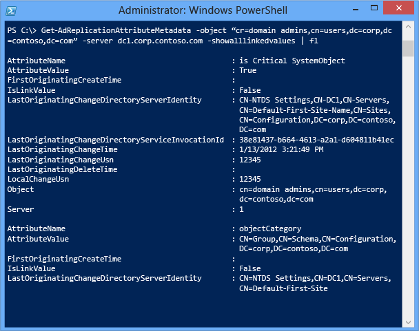
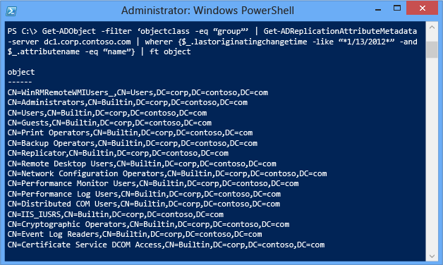
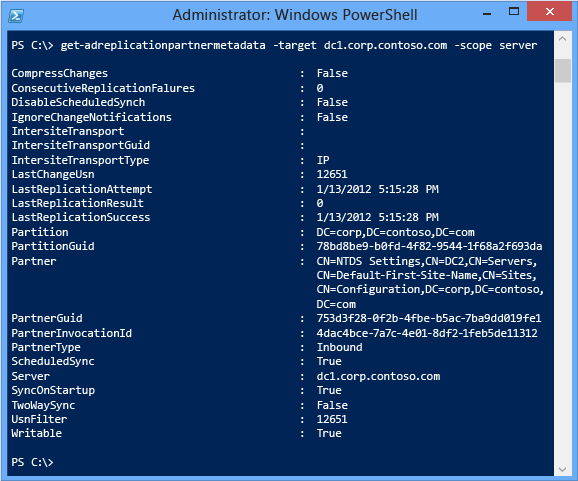

# Advanced Active Directory Replication and Topology Management Using Windows PowerShell (Level 200)

>Applies To: Windows Server 2016, Windows Server 2012 R2, Windows Server 2012

This topic explains the new AD DS replication and topology management cmdlets in more detail, and provides additional examples. For an introduction, see [Introduction to Active Directory Replication and Topology Management Using Windows PowerShell &#40;Level 100&#41;](../../../ad-ds/manage/powershell/Introduction-to-Active-Directory-Replication-and-Topology-Management-Using-Windows-PowerShell--Level-100-.md).  
  
1.  [Introduction](../../../ad-ds/manage/powershell/Advanced-Active-Directory-Replication-and-Topology-Management-Using-Windows-PowerShell--Level-200-.md#BKMK_Intro)  
  
2.  [Replication and Metadata](../../../ad-ds/manage/powershell/Advanced-Active-Directory-Replication-and-Topology-Management-Using-Windows-PowerShell--Level-200-.md#BKMK_Repl)  
  
3.  [Get-ADReplicationAttributeMetadata](../../../ad-ds/manage/powershell/Advanced-Active-Directory-Replication-and-Topology-Management-Using-Windows-PowerShell--Level-200-.md#BKMK_ReplAttrMD)  
  
4.  [Get-ADReplicationPartnerMetadata](../../../ad-ds/manage/powershell/Advanced-Active-Directory-Replication-and-Topology-Management-Using-Windows-PowerShell--Level-200-.md#BKMK_PartnerMD)  
  
5.  [Get-ADReplicationFailure](../../../ad-ds/manage/powershell/Advanced-Active-Directory-Replication-and-Topology-Management-Using-Windows-PowerShell--Level-200-.md#BKMK_ReplFail)  
  
6.  [Get-ADReplicationQueueOperation and Get-ADReplicationUpToDatenessVectorTable](../../../ad-ds/manage/powershell/Advanced-Active-Directory-Replication-and-Topology-Management-Using-Windows-PowerShell--Level-200-.md#BKMK_ReplQueue)  
  
7.  [Sync-ADObject](../../../ad-ds/manage/powershell/Advanced-Active-Directory-Replication-and-Topology-Management-Using-Windows-PowerShell--Level-200-.md#BKMK_Sync)  
  
8.  [Topology](../../../ad-ds/manage/powershell/Advanced-Active-Directory-Replication-and-Topology-Management-Using-Windows-PowerShell--Level-200-.md#BKMK_Topo)  
  
## <a name="BKMK_Intro"></a>Introduction  
Windows Server 2012 extends the Active Directory module for Windows PowerShell with twenty-five new cmdlets to manage replication and forest topology. Prior to this, you were forced to use the generic **\*-AdObject** nouns or call .NET functions.  
  
Like all Active Directory Windows PowerShell cmdlets, this new functionality requires installing the [Active Directory Management Gateway Service](http://www.microsoft.com/download/details.aspx?displaylang=en&id=2852) on at least one domain controller (and preferably, all domain controllers).  
  
The following table lists new replication and topology cmdlets added to the Active Directory Windows PowerShell module.  
  
|||  
|-|-|  
|Cmdlet|Explanation|  
|Get-ADReplicationAttributeMetadata|Returns attribute replication metadata for an object|  
|Get-ADReplicationConnection|Returns domain controller connection object details|  
|Get-ADReplicationFailure|Returns the most replication recent failure for a domain controller|  
|Get-ADReplicationPartnerMetadata|Returns replication configuration of a domain controller|  
|Get-ADReplicationQueueOperation|Returns the current replication queue backlog|  
|Get-ADReplicationSite|Returns site information|  
|Get-ADReplicationSiteLink|Returns site link information|  
|Get-ADReplicationSiteLinkBridge|Returns site link bridge information|  
|Get-ADReplicationSubnet|Returns AD subnet information|  
|Get-ADReplicationUpToDatenessVectorTable|Returns the UTD vector for a domain controller|  
|Get-ADTrust|Returns information about an inter-domain or inter-forest trust|  
|New-ADReplicationSite|Creates a new site|  
|New-ADReplicationSiteLink|Creates a new site link|  
|New-ADReplicationSiteLinkBridge|Creates a new site link bridge|  
|New-ADReplicationSubnet|Creates a new AD subnet|  
|Remove-ADReplicationSite|Deletes a site|  
|Remove-ADReplicationSiteLink|Deletes a site link|  
|Remove-ADReplicationSiteLinkBridge|Deletes a site link bridge|  
|Remove-ADReplicationSubnet|Deletes an AD subnet|  
|Set-ADReplicationConnection|Modifies a connection|  
|Set-ADReplicationSite|Modifies a site|  
|Set-ADReplicationSiteLink|Modifies a site link|  
|Set-ADReplicationSiteLinkBridge|Modifies a site link bridge|  
|Set-ADReplicationSubnet|Modifies an AD subnet|  
|Sync-ADObject|Forces replication of a single object|  
  
Most of these cmdlets have their basis in Repadmin.exe. Other cmdlets (not listed) handle features like Dynamic Access Control and Group Managed Service Accounts.  
  
For a complete list of all Active Directory Windows PowerShell cmdlets, run:  
  
```  
Get-command -module ActiveDirectory  
```  
  
For a complete list of all Active Directory Windows PowerShell cmdlet arguments, reference the help. For example:  
  
```  
Get-help New-ADReplicationSite  
  
```  
  
Use the `Update-Help` cmdlet to download and install help files  
  
### <a name="BKMK_Repl"></a>Replication and Metadata  
Repadmin.exe validates the health and consistency of Active Directory replication. Repadmin.exe offers simple data manipulation options - some arguments support CSV outputs, for example - but automation generally required parsing through text file outputs. The Active Directory module for Windows PowerShell is the first attempt at offering an option that allows real control over the returned data; prior to this, you had to create scripts or use third party tools.  
  
Additionally, the following cmdlets implement a new parameter set of **Target**, **Scope**, and **EnumerationServer**:  
  
-   **Get-ADReplicationFailure**  
  
-   **Get-ADReplicationPartnerMetadata**  
  
-   **Get-ADReplicationUpToDatenessVectorTable**  
  
The **Target** argument accepts a comma-separated list of strings that identify the target servers, sites, domains, or forests specified by the **Scope** argument. An asterisk (\*) is also permissible and means all servers within the specified scope. If no scope is specified, it implies all servers in the current user's forest. The **Scope** argument specifies the latitude of the search. Acceptable values are **Server**, **Site**, **Domain**, and **Forest**. The **EnumerationServer** specifies the server that enumerates the list of domain controllers specified in **Target** and **Scope**. It operates the same as the **Server** argument and requires the specified server run the Active Directory Web Service.  
  
To introduce the new cmdlets, here are some sample scenarios showing capabilities impossible to repadmin.exe; armed with these illustrations, the administrative possibilities become obvious. Review the cmdlet help for specific usage requirements.  
  
### <a name="BKMK_ReplAttrMD"></a>Get-ADReplicationAttributeMetadata  
This cmdlet is similar to **repadmin.exe /showobjmeta**. It enables you to return replication metadata, such as when an attribute changed, the originating domain controller, the version and USN information, and attribute data. This cmdlet is useful for auditing where and when a change occurred.  
  
Unlike Repadmin, Windows PowerShell gives flexible search and output control. For example, you can output the metadata of the Domain Admins object, ordered as a readable list:  
  
```  
Get-ADReplicationAttributeMetadata -object "cn=domain admins,cn=users,dc=corp,dc=contoso,dc=com" -server dc1.corp.contoso.com -showalllinkedvalues | format-list  
  
```  
  
  
  
Alternatively, you can arrange the data to look like repadmin, in a table:  
  
```  
Get-ADReplicationAttributeMetadata -object "cn=domain admins,cn=users,dc=corp,dc=contoso,dc=com" -server dc1.corp.contoso.com -showalllinkedvalues | format-table -wrap  
  
```  
  
  
  
Alternatively, you can get metadata for an entire class of objects, by pipelining the **Get-Adobject** cmdlet with a filter, such as all groups - then combine that with a specific date. The pipeline is a channel used between multiple cmdlets to pass data. To see all groups modified in some fashion on January 13th, 2012:  
  
```  
get-adobject -filter 'objectclass -eq "group"' | Get-ADReplicationAttributeMetadata -server dc1.corp.contoso.com | where-object {$_.lastoriginatingchangetime -like "*1/13/2012*" -and $_.attributename -eq "name"} | format-table object  
```  
  
  
  
For more information about more Windows PowerShell operations with pipelines, see [Piping and the Pipeline in Windows PowerShell](http://technet.microsoft.com/library/ee176927.aspx).  
  
Alternatively, to find out every group that has Tony Wang as a member and when the group was last modified:  
  
```  
get-adobject -filter 'objectclass -eq "group"' | Get-ADReplicationAttributeMetadata -server dc1.corp.contoso.com -showalllinkedvalues | where-object {$_.attributevalue -like "*tony wang*"} | format-table object,LastOriginatingChangeTime,version -auto  
  
```  
  
  
  
Alternatively, to find all objects authoritatively restored using a system state backup in the domain, based on their artificially high version:  
  
```  
get-adobject -filter 'objectclass -like "*"' | Get-ADReplicationAttributeMetadata -server dc1.corp.contoso.com | where-object {$_.version -gt "100000" -and $_.attributename -eq "name"} | format-table object,LastOriginatingChangeTime  
```  
  
  
  
Alternatively, send all user metadata to a CSV file for later examination in Microsoft Excel:  
  
```  
get-adobject -filter 'objectclass -eq "user"' | Get-ADReplicationAttributeMetadata -server dc1.corp.contoso.com -showalllinkedvalues | export-csv allgroupmetadata.csv  
```  
  
### <a name="BKMK_PartnerMD"></a>Get-ADReplicationPartnerMetadata  
This cmdlet returns information about the configuration and state of replication for a domain controller, allowing you to monitor, inventory, or troubleshoot. Unlike Repadmin.exe, using Windows PowerShell means you see only the data that is important to you, in the format you want.  
  
For example, the readable replication state of a single domain controller:  
  
```  
Get-ADReplicationPartnerMetadata -target dc1.corp.contoso.com  
```  
  
  
  
Alternatively, the last time a domain controller replicated inbound and its partners, in a table format:  
  
```  
Get-ADReplicationPartnerMetadata -target dc1.corp.contoso.com | format-table lastreplicationattempt,lastreplicationresult,partner -auto  
```  
  
  
  
Alternatively, contact all domain controllers in the forest and display any whose last attempted replication failed for any reason:  
  
```  
Get-ADReplicationPartnerMetadata -target * -scope server | where {$_.lastreplicationresult -ne "0"} | ft server,lastreplicationattempt,lastreplicationresult,partner -auto  
  
```  
  
  
  
### <a name="BKMK_ReplFail"></a>Get-ADReplicationFailure  
This cmdlet can be used to returns information about recent errors in replication. It is analogous to **Repadmin.exe /showreplsum**, but again, with much more control thanks to Windows PowerShell.  
  
For example, you can return a domain controller's most recent failures and the partners he failed contacting:  
  
```  
Get-ADReplicationFailure dc1.corp.contoso.com  
```  
  
  
  
Alternatively, return a table view for all servers in a specific AD logical site, ordered for easier viewing and containing only the most critical data:  
  
```  
Get-ADReplicationFailure -scope site -target default-first-site-name | format-table server,firstfailuretime,failurecount,lasterror,partner -auto  
  
```  
  
  
  
### <a name="BKMK_ReplQueue"></a>Get-ADReplicationQueueOperation and Get-ADReplicationUpToDatenessVectorTable  
Both of these cmdlets returns further aspects of domain controller "up to dateness", which includes pending replication and version vector information.  
  
### <a name="BKMK_Sync"></a>Sync-ADObject  
This cmdlet is analogous to running **Repadmin.exe /replsingleobject**. It is very useful when you make changes that require out of band replication, especially to fix an issue.  
  
For example, if someone deleted the CEO's user account and then restored it with the Active Directory Recycle Bin, you probably want it replicated to all domain controllers immediately. You also probably want to do this without forcing replication of all the other object changes made ; after all, that is why you have a replication schedule - to avoid overloading WAN links.  
  
```  
Get-ADDomainController -filter * | foreach {Sync-ADObject -object "cn=tony wang,cn=users,dc=corp,dc=contoso,dc=com" -source dc1 -destination $_.hostname}  
  
```  
  
  
  
### <a name="BKMK_Topo"></a>Topology  
While Repadmin.exe is good at returning information about replication topology like sites, site links, site link bridges, and connections, it does not have a comprehensive set of arguments to make changes. In fact, there has never been scriptable, in-box Windows utility designed specifically for administrators to create and modify AD DS topology. As Active Directory has matured in millions of customer environments, the need to bulk modify Active Directory logical information becomes apparent.  
  
For example, after a rapid expansion of new branch offices, combined with the consolidation of others, you might have a hundred site changes to make based on physical locations, network changes, and new capacity requirements. Rather than using Dssites.msc and Adsiedit.msc to make changes, you can automate. This is especially compelling when you start with a spreadsheet of data provided by your network and facilities teams.  
  
The **Get-Adreplication\*** cmdlets return information about replication topology and are useful for pipelining into the **Set-Adreplication\*** cmdlets in bulk. **Get** cmdlets do not change data, they only show data or to create Windows PowerShell session objects that can be pipelined to **Set-Adreplication\*** cmdlets. The **New** and **Remove** cmdlets are useful for creating or removing Active Directory topology objects.  
  
For example, you can create new sites using a CSV file:  
  
```  
import-csv -path C:\newsites.csv | new-adreplicationsite  
```  
  
  
  
  
  
Alternatively, create a new site link between two existing sites with a custom replication interval and site cost:  
  
```  
new-adreplicationsitelink -name "chicago<-->waukegan" -sitesincluded chicago,waukegan -cost 50 -replicationfrequencyinminutes 15  
```  
  
  
  
Alternatively, find every site in the forest and replace their **Options** attributes with the flag to enable inter-site change notification, in order to replicate at maximum speed with compression:  
  
```  
get-adreplicationsitelink -filter * | set-adobject -replace @{options=$($_.options -bor 1)}  
```  
  
  
  
> [!IMPORTANT]  
> Set **-bor 5** to disable compression on those site links as well.  
  
Alternatively, find all sites missing subnet assignments, in order to reconcile the list with the actual subnets of those locations:  
  
```  
get-adreplicationsite -filter * -property subnets | where-object {!$_.subnets -eq "*"} | format-table name  
```  
  
  
  
## See Also  
[Introduction to Active Directory Replication and Topology Management Using Windows PowerShell &#40;Level 100&#41;](../../../ad-ds/manage/powershell/Introduction-to-Active-Directory-Replication-and-Topology-Management-Using-Windows-PowerShell--Level-100-.md)  
  

