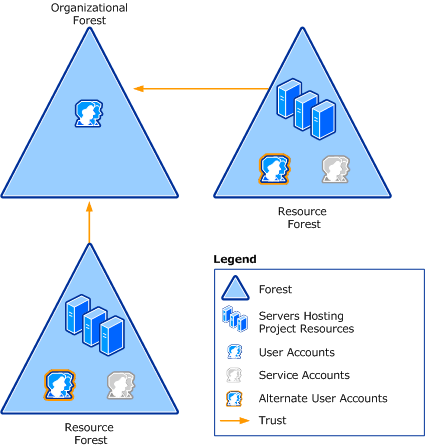

# Forest Design Models

>Applies To: Windows Server 2016, Windows Server 2012 R2, Windows Server 2012

You can apply one of the following three forest design models in your Active Directory environment:  
  
-   Organizational forest model  
  
-   Resource forest model  
  
-   Restricted access forest model  
  
It is likely that you will need to use a combination of these models to meet the needs of all the different groups in your organization.  
  
## Organizational forest model  
In the organizational forest model, user accounts and resources are contained in the forest and managed independently. The organizational forest can be used to provide service autonomy, service isolation, or data isolation, if the forest is configured to prevent access to anyone outside the forest.  
  
If users in an organizational forest need to access resources in other forests (or the reverse), trust relationships can be established between one organizational forest and the other forests. This makes it possible for administrators to grant access to resources in the other forest. The following illustration shows the organizational forest model.  
  
  
  
Every Active Directory design includes at least one organizational forest.  
  
## Resource forest model  
In the resource forest model, a separate forest is used to manage resources. Resource forests do not contain user accounts other than those required for service administration and those required to provide alternate access to the resources in that forest, if the user accounts in the organizational forest become unavailable. Forest trusts are established so that users from other forests can access the resources contained in the resource forest. The following illustration shows the resource forest model.  
  
  
  
Resource forests provide service isolation that is used to protect areas of the network that need to maintain a state of high availability. For example, if your company includes a manufacturing facility that needs to continue to operate when there are problems on the rest of the network, you can create a separate resource forest for the manufacturing group.  
  
## Restricted access forest model  
In the restricted access forest model, a separate forest is created to contain user accounts and data that must be isolated from the rest of the organization. Restricted access forests provide data isolation in situations where the consequences of compromising project data are severe. The following illustration shows a restricted access forest model.  
  
  
  
Users from other forests cannot be granted access to the restricted data because no trust exists. In this model, users have an account in an organizational forest for access to general organizational resources and a separate user account in the restricted access forest for access to the classified data. These users must have two separate workstations, one connected to the organizational forest and the other connected to the restricted access forest. This protects against the possibility that a service administrator from one forest can gain access to a workstation in the restricted forest.  
  
In extreme cases, the restricted access forest might be maintained on a separate physical network. Organizations that work on classified government projects sometimes maintain restricted access forests on separate networks to meet security requirements.  
  

