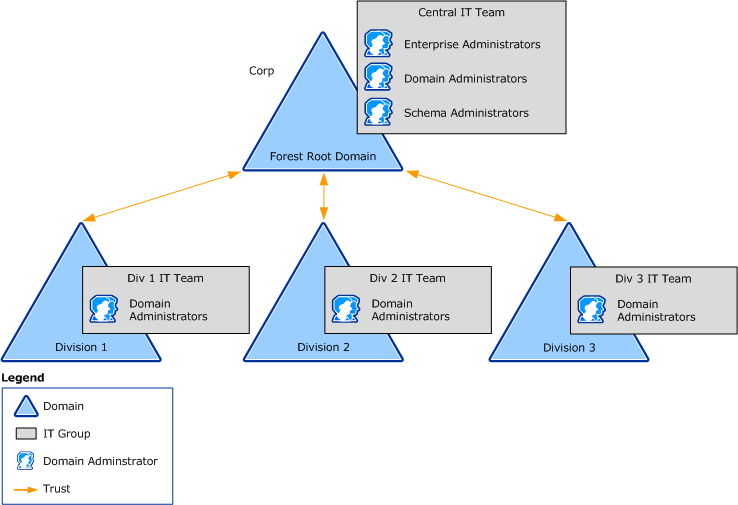

# Using the Organizational Domain Forest Model

>Applies To: Windows Server 2016, Windows Server 2012 R2, Windows Server 2012

In the organizational domain forest model, several autonomous groups each own a domain within a forest. Each group controls domain-level service administration, which enables them to manage certain aspects of service management autonomously while the forest owner controls forest-level service management.  
  
The following illustration shows an organizational domain forest model.  
  
  
  
## Domain-level service autonomy  
The organizational domain forest model enables the delegation of authority for domain-level service management. The following table lists the types of service management that can be controlled at the domain level.  
  
|Type of service management|Associated tasks|  
|------------------------------|--------------------|  
|Management of domain controller operations|-   Creating and removing domain controllers -   Monitoring the functioning of domain controllers -   Managing services that are running on domain controllers -   Backing up and restoring the directory|  
|Configuration of domain-wide settings|-   Creating domain and domain user account policies, such as password, Kerberos, and account lockout policies -   Creating and applying domain-wide Group Policy|  
|Delegation of data-level administration|-   Creating organizational units (OUs) and delegating administration -   Repairing problems in the OU structure that OU owners do not have sufficient access rights to fix|  
|Management of external trusts|-   Establishing trust relationships with domains outside the forest|  
  
Other types of service management, such as schema or replication topology management, are the responsibility of the forest owner.  
  
## Domain owner  
In an organizational domain forest model, domain owners are responsible for domain-level service management tasks. Domain owners have authority over the entire domain as well as access to all other domains in the forest. For this reason, domain owners must be trusted individuals selected by the forest owner.  
  
Delegate domain-level service management to a domain owner, if the following conditions are met:  
  
-   All groups participating in the forest trust the new domain owner and the service management practices of the new domain.  
  
-   The new domain owner trusts the forest owner and all the other domain owners.  
  
-   All domain owners in the forest agree that the new domain owner has service administrator management and selection policies and practices that are equal to or more strict than their own.  
  
-   All domain owners in the forest agree that domain controllers managed by the new domain owner in the new domain are physically secure.  
  
Note that if a forest owner delegates domain-level service management to a domain owner, other groups might choose not to join that forest if they do not trust that domain owner.  
  
All domain owners must be aware that if any of these conditions change in the future, it might become necessary to move the organizational domains into a multiple forest deployment.  
  
> [!NOTE]  
> Another way to minimize security risks to a  Windows Server 2008  Active Directory domain is to employ administrator role separation, which requires the deployment of a read-only domain controller (RODC) in your Active Directory infrastructure. An RODC is a new type of domain controller in the  Windows Server 2008  operating system that hosts read-only partitions of the Active Directory database. Before the release of  Windows Server 2008 , any server maintenance work on a domain controller had to be performed by a domain administrator. In  Windows Server 2008 , you can delegate local administrative permissions for an RODC to any domain user without granting that user any administrative rights for the domain or other domain controllers. This permits the delegated user to log on to an RODC and perform maintenance work, such as upgrading a driver, on the server. However, this delegated user cannot log on to any other domain controller or perform any other administrative task in the domain. In this way, any trusted user can be delegated the ability to effectively manage the RODC without compromising the security of the rest of the domain. For more information about RODCs, see AD DS: Read-Only Domain Controllers ([http://go.microsoft.com/fwlink/?LinkId=106616](http://go.microsoft.com/fwlink/?LinkId=106616)).  
  

