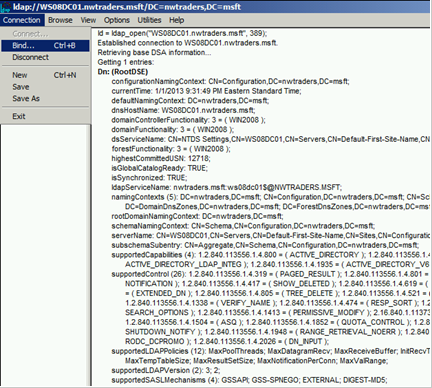
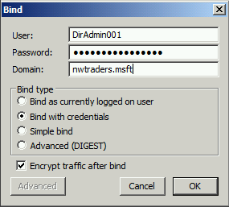
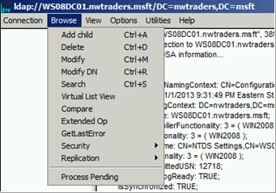
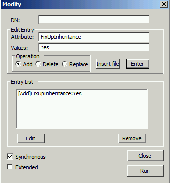
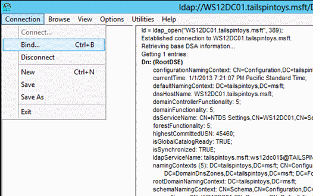
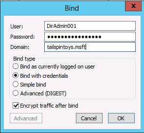
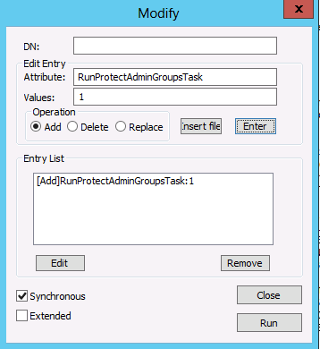

# Appendix C: Protected Accounts and Groups in Active Directory

>Applies To: Windows Server Technical Preview

## Appendix C: Protected Accounts and Groups in Active Directory  
Within Active Directory, a default set of highly privileged accounts and groups are considered protected accounts and groups. With most objects in Active Directory, delegated administrators (users who have been delegated permissions to manage Active Directory objects) can change permissions on the objects, including changing permissions to allow themselves to change memberships of the groups, for example.  

However, with protected accounts and groups, the objects' permissions are set and enforced via an automatic process that ensures the permissions on the objects remains consistent even if the objects are moved the directory. Even if somebody manually changes a protected object's permissions, this process ensures that permissions are returned to their defaults quickly.  

### Protected Groups  
The following table contains the protected groups in Active Directory listed by domain controller operating system.  

**Protected Accounts and Groups in Active Directory by Operating System**  

|||||  
|-|-|-|-|  
|**Windows 2000 <SP4**|**Windows 2000 SP4 - Windows Server 2003 RTM**|**Windows Server 2003 SP1+**|**Windows Server 2012, Windows Server 2008 R2, Windows Server 2008**|  
|Administrators|Account Operators|Account Operators|Account Operators|  
||Administrator|Administrator|Administrator|  
||Administrators|Administrators|Administrators|  
||Backup Operators|Backup Operators|Backup Operators|  
||Cert Publishers|||  
|Domain Admins|Domain Admins|Domain Admins|Domain Admins|  
||Domain Controllers|Domain Controllers|Domain Controllers|  
|Enterprise Admins|Enterprise Admins|Enterprise Admins|Enterprise Admins|  
||Krbtgt|Krbtgt|Krbtgt|  
||Print Operators|Print Operators|Print Operators|  
||||Read-only Domain Controllers|  
||Replicator|Replicator|Replicator|  
|Schema Admins|Schema Admins|Schema Admins|Schema Admins|  
||Server Operators|Server Operators|Server Operators|  

#### AdminSDHolder  
The purpose of the AdminSDHolder object is to provide "template" permissions for the protected accounts and groups in the domain. AdminSDHolder is automatically created as an object in the System container of every Active Directory domain. Its path is: **CN=AdminSDHolder,CN=System,DC=<domain_component>,DC=<domain_component>?.**  

Unlike most objects in the Active Directory domain, which are owned by the Administrators group, AdminSDHolder is owned by the Domain Admins group. By default, EAs can make changes to any domain's AdminSDHolder object, as can the domain's Domain Admins and Administrators groups. Additionally, although the default owner of AdminSDHolder is the domain's Domain Admins group, members of Administrators or Enterprise Admins can take ownership of the object.  

#### SDProp  
SDProp is a process that runs every 60 minutes (by default) on the domain controller that holds the domain's PDC Emulator (PDCE). SDProp compares the permissions on the domain's AdminSDHolder object with the permissions on the protected accounts and groups in the domain. If the permissions on any of the protected accounts and groups do not match the permissions on the AdminSDHolder object, the permissions on the protected accounts and groups are reset to match those of the domain's AdminSDHolder object.  

Additionally, permissions inheritance is disabled on protected groups and accounts, which means that even if the accounts and groups are moved to different locations in the directory, they do not inherit permissions from their new parent objects. Inheritance is disabled on the AdminSDHolder object so that permission changes to the parent objects do not change the permissions of AdminSDHolder.  

##### Changing SDProp Interval  
Normally, you should not need to change the interval at which SDProp runs, except for testing purposes. If you need to change the SDProp interval, on the PDCE for the domain, use regedit to add or modify the AdminSDProtectFrequency DWORD value in HKLM\SYSTEM\CurrentControlSet\Services\NTDS\Parameters.  

The range of values is in seconds from 60 to 7200 (one minute to two hours). To reverse the changes, delete AdminSDProtectFrequency key, which will cause SDProp to revert back to the 60 minute interval. You generally should not reduce this interval in production domains as it can increase LSASS processing overhead on the domain controller. The impact of this increase is dependent on the number of protected objects in the domain.  

##### Running SDProp Manually  
A better approach to testing AdminSDHolder changes is to run SDProp manually, which causes the task to run immediately but does not affect scheduled execution. Running SDProp manually is performed slightly differently on domain controllers running Windows Server 2008 and earlier than it is on domain controllers running Windows Server 2012 or Windows Server 2008 R2.  

Procedures for running SDProp manually on older operating systems are provided in [Microsoft Support article 251343](http://support.microsoft.com/kb/251343), and following are step-by-step instructions for older and newer operating systems. In either case, you must connect to the rootDSE object in Active Directory and perform a modify operation with a null DN for the rootDSE object, specifying the name of the operation as the attribute to modify. For more information about modifiable operations on the rootDSE object, see [rootDSE Modify Operations](http://msdn.microsoft.com/library/cc223297.aspx) on the MSDN website.  

###### Running SDProp Manually in Windows Server 2008 or Earlier  
You can force SDProp to run by using Ldp.exe or by running an LDAP modification script. To run SDProp using Ldp.exe, perform the following steps after you have made changes to the AdminSDHolder object in a domain:  

1.  Launch **Ldp.exe**.  

2.  Click **Connection** on the Ldp dialog box, and click **Connect**.  

      

3.  In the **Connect** dialog box, type the name of the domain controller for the domain that holds the PDC Emulator (PDCE) role and click **OK**.  

      

4.  Verify that you have connected successfully, as indicated by **Dn: (RootDSE)** in the following screenshot, click **Connection** and click **Bind**.  

      

5.  In the **Bind** dialog box, type the credentials of a user account that has permission to modify the rootDSE object. (If you are logged on as that user, you can select **Bind as** currently logged on user.) Click **OK**.  

      

6.  After you have completed the bind operation, click **Browse**, and click **Modify**.  

      

7.  In the **Modify** dialog box, leave the **DN** field blank. In the **Edit Entry Attribute** field, type **FixUpInheritance**, and in the **Values** field, type **Yes**. Click **Enter** to populate the **Entry List** as shown in the following screen shot.  

      

8.  In the populated Modify dialog box, click Run, and verify that the changes you made to the AdminSDHolder object have appeared on that object.  

> [!NOTE]  
> For information about modifying AdminSDHolder to allow designated unprivileged accounts to modify the membership of protected groups, see [Appendix I: Creating Management Accounts for Protected Accounts and Groups in Active Directory](../../../ad-ds/manage/component-updates/Appendix-I--Creating-Management-Accounts-for-Protected-Accounts-and-Groups-in-Active-Directory.md).  

If you prefer to run SDProp manually via LDIFDE or a script, you can create a modify entry as shown here:  

  

###### Running SDProp Manually in Windows Server 2012 or Windows Server 2008 R2  
You can also force SDProp to run by using Ldp.exe or by running an LDAP modification script. To run SDProp using Ldp.exe, perform the following steps after you have made changes to the AdminSDHolder object in a domain:  

1.  Launch **Ldp.exe**.  

2.  In the **Ldp** dialog box, click **Connection**, and click **Connect**.  

      

3.  In the **Connect** dialog box, type the name of the domain controller for the domain that holds the PDC Emulator (PDCE) role and click **OK**.  

      

4.  Verify that you have connected successfully, as indicated by **Dn: (RootDSE)** in the following screenshot, click **Connection** and click **Bind**.  

      

5.  In the **Bind** dialog box, type the credentials of a user account that has permission to modify the rootDSE object. (If you are logged on as that user, you can select **Bind as currently logged on user**.) Click **OK**.  

      

6.  After you have completed the bind operation, click **Browse**, and click **Modify**.  

      

7.  In the **Modify** dialog box, leave the **DN** field blank. In the **Edit Entry Attribute** field, type **RunProtectAdminGroupsTask**, and in the **Values** field, type **1**. Click **Enter** to populate the entry list as shown here.  

      

8.  In the populated **Modify** dialog box, click **Run**, and verify that the changes you made to the AdminSDHolder object have appeared on that object.  

If you prefer to run SDProp manually via LDIFDE or a script, you can create a modify entry as shown here:  

  
