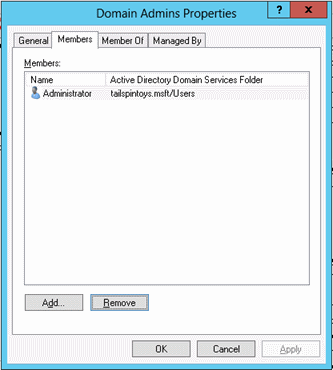
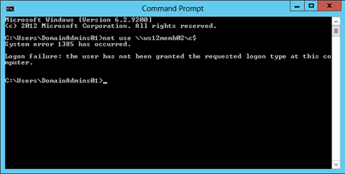
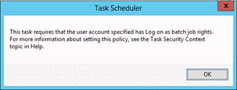
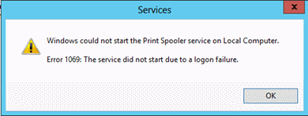

# Appendix F: Securing Domain Admins Groups in Active Directory

>Applies To: Windows Server Technical Preview

## Appendix F: Securing Domain Admins Groups in Active Directory  
As is the case with the Enterprise Admins (EA) group, membership in the Domain Admins (DA) group should be required only in build or disaster recovery scenarios. There should be no day-to-day user accounts in the DA group with the exception of the built-in Administrator account for the domain, if it has been secured as described in [Appendix D: Securing Built-In Administrator Accounts in Active Directory](../../../ad-ds/plan/security-best-practices/Appendix-D--Securing-Built-In-Administrator-Accounts-in-Active-Directory.md).  

Domain Admins are, by default, members of the local Administrators groups on all member servers and workstations in their respective domains. This default nesting should not be modified for supportability and disaster recovery purposes. If Domain Admins have been removed from the local Administrators groups on the member servers, the group should be added to the Administrators group on each member server and workstation in the domain. Each domain's Domain Admins group should be secured as described in the step-by-step instructions that follow.  

For the Domain Admins group in each domain in the forest:  

1.  Remove all members from the group, with the possible exception of the built-in Administrator account for the domain, provided it has been secured as described in [Appendix D: Securing Built-In Administrator Accounts in Active Directory](../../../ad-ds/plan/security-best-practices/Appendix-D--Securing-Built-In-Administrator-Accounts-in-Active-Directory.md).  

2.  In GPOs linked to OUs containing member servers and workstations in each domain, the DA group should be added to the following user rights in **Computer Configuration\Policies\Windows Settings\Security Settings\Local Settings\User Rights Assignments**:  

    -   Deny access to this computer from the network  

    -   Deny log on as a batch job  

    -   Deny log on as a service  

    -   Deny log on locally  

    -   Deny log on through Remote Desktop Services user rights  

3.  Auditing should be configured to send alerts if any modifications are made to the properties or membership of the Domain Admins group.  

#### Step-by-Step Instructions for Removing all Members from the Domain Admins Group  

1.  In **Server Manager**, click **Tools**, and click **Active Directory Users and Computers**.  

2.  To remove all members from the DA group, perform the following steps:  

    1.  Double-click the **Domain Admins** group and click the **Members** tab.  

          

    2.  Select a member of the group, click **Remove**, click **Yes**, and click **OK**.  

3.  Repeat step 2 until all members of the DA group have been removed.  

#### Step-by-Step Instructions to Secure Domain Admins in Active Directory  

1.  In **Server Manager**, click **Tools**, and click **Group Policy Management**.  

2.  In the console tree, expand <Forest>\Domains\\<Domain>, and then **Group Policy Objects** (where <Forest> is the name of the forest and <Domain> is the name of the domain where you want to set the Group Policy).  

3.  In the console tree, right-click **Group Policy Objects**, and click **New**.  

      

4.  In the **New GPO** dialog box, type <GPO Name>, and click **OK** (where GPO Name is the name of this GPO).  

      

5.  In the details pane, right-click <GPO Name>, and click **Edit**.  

6.  Navigate to **Computer Configuration\Policies\Windows Settings\Security Settings\Local Policies**, and click **User Rights Assignment**.  

      

7.  Configure the user rights to prevent members of the Domain Admins group from accessing members servers and workstations over the network by doing the following:  

    1.  Double-click **Deny access to this computer from the network** and select **Define these policy settings**.  

    2.  Click **Add User or Group** and click **Browse**.  

    3.  Type **Domain Admins**, click **Check Names**, and click **OK**.  

          

    4.  Click **OK**, and **OK** again.  

8.  Configure the user rights to prevent members of the DA group from logging on as a batch job by doing the following:  

    1.  Double-click **Deny log on as a batch job** and select **Define these policy settings**.  

    2.  Click **Add User or Group** and click **Browse**.  

    3.  Type **Domain Admins**, click **Check Names**, and click **OK**.  

          

    4.  Click **OK**, and **OK** again.  

9. Configure the user rights to prevent members of the DA group from logging on as a service by doing the following:  

    1.  Double-click **Deny log on as a service** and select **Define these policy settings**.  

    2.  Click **Add User or Group** and click **Browse**.  

    3.  Type **Domain Admins**, click **Check Names**, and click **OK**.  

          

    4.  Click **OK**, and **OK** again.  

10. Configure the user rights to prevent members of the Domain Admins group from logging on locally to member servers and workstations by doing the following:  

    1.  Double-click **Deny log on locally** and select **Define these policy settings**.  

    2.  Click **Add User or Group** and click **Browse**.  

    3.  Type **Domain Admins**, click **Check Names**, and click **OK**.  

          

    4.  Click **OK**, and **OK** again.  

11. Configure the user rights to prevent members of the Domain Admins group from accessing member servers and workstations via Remote Desktop Services by doing the following:  

    1.  Double-click **Deny log on through Remote Desktop Services** and select **Define these policy settings**.  

    2.  Click **Add User or Group** and click **Browse**.  

    3.  Type **Domain Admins**, click **Check Names**, and click **OK**.  

          

    4.  Click **OK**, and **OK** again.  

12. To exit **Group Policy Management Editor**, click **File**, and click **Exit**.  

13. In Group Policy Management, link the GPO to the member server and workstation OUs by doing the following:  

    1.  Navigate to the <Forest>\Domains\\<Domain> (where <Forest> is the name of the forest and <Domain> is the name of the domain where you want to set the Group Policy).  

    2.  Right-click the OU that the GPO will be applied to and click **Link an existing GPO**.  

          

    3.  Select the GPO that you just created and click **OK**.  

          

    4.  Create links to all other OUs that contain workstations.  

    5.  Create links to all other OUs that contain member servers.  

        > [!IMPORTANT]  
        > If jump servers are used to administer domain controllers and Active Directory, ensure that jump servers are located in an OU to which this GPOs is not linked.  

#### Verification Steps  

##### Verify "Deny access to this computer from the network" GPO Settings  
From any member server or workstation that is not affected by the GPO changes (such as a "jump server"), attempt to access a member server or workstation over the network that is affected by the GPO changes. To verify the GPO settings, attempt to map the system drive by using the **NET USE** command.  

1.  Log on locally using an account that is a member of the Domain Admins group.  

2.  With the mouse, move the pointer into the upper-right or lower-right corner of the screen. When the **Charms** bar appears, click **Search**.  

3.  In the **Search** box, type **command prompt**, right-click **Command Prompt**, and then click **Run as administrator** to open an elevated command prompt.  

4.  When prompted to approve the elevation, click **Yes**.  

      

5.  In the **Command Prompt** window, type **net use \\\\<Server Name>\c$**, where <Server Name> is the name of the member server or workstation you're attempting to access over the network.  

6.  The following screen shot shows the error message that should appear.  

      

##### Verify "Deny log on as a batch job" GPO Settings  

From any member server or workstation affected by the GPO changes, log on locally.  

###### Create a Batch File  

1.  With the mouse, move the pointer into the upper-right or lower-right corner of the screen. When the **Charms** bar appears, click **Search**.  

2.  In the **Search** box, type **notepad**, and click **Notepad**.  

3.  In **Notepad**, type **dir c:**.  

4.  Click **File**, and click **Save As**.  

5.  In the **File** name field, type **<Filename>.bat** (where <Filename> is the name of the new batch file).  

###### Schedule a Task  

1.  With the mouse, move the pointer into the upper-right or lower-right corner of the screen. When the **Charms** bar appears, click **Search**.  

2.  In the **Search** box, type **task scheduler**, and click **Task Scheduler**.  

    > [!NOTE]  
    > On computers running Windows 8, in the **Search** box, type **schedule tasks**, and click **Schedule tasks**.  

3.  In the **Task Scheduler** menu bar, click **Action**, and click **Create Task**.  

4.  In the **Create Task** dialog box, type **<Task Name>** (where <Task Name> is the name of the new task).  

5.  Click the **Actions** tab, and click **New**.  

6.  In the **Action** field, select **Start a program**.  

7.  Under **Program/script**, click **Browse**, locate and select the batch file created in the **Create a Batch File** section, and click **Open**.  

8.  Click **OK**.  

9. Click the **General** tab.  

10. Under **Security** options, click **Change User or Group**.  

11. Type the name of an account that is a member of the Domain Admins group, click **Check Names**, and click **OK**.  

12. Select **Run whether the user is logged on or not** and select **Do not store password**. The task will only have access to local computer resources.  

13. Click **OK**.  

14. A dialog box should appear, requesting user account credentials to run the task.  

15. After entering the credentials, click **OK**.  

16. A dialog box similar to the following should appear.  

      

##### Verify "Deny log on as a service" GPO Settings  

1.  From any member server or workstation affected by the GPO changes, log on locally.  

2.  With the mouse, move the pointer into the upper-right or lower-right corner of the screen. When the **Charms** bar appears, click **Search**.  

3.  In the **Search** box, type **services**, and click **Services**.  

4.  Locate and double-click **Print Spooler**.  

5.  Click the **Log On** tab.  

6.  Under **Log on as**, select the **This account** option.  

7.  Click **Browse**, type the name of an account that is a member of the Domain Admins group, click **Check Names**, and click **OK**.  

8.  Under **Password** and **Confirm password**, type the selected account's password, and click **OK**.  

9. Click **OK** three more times.  

10. Right-click **Print Spooler** and click **Restart**.  

11. When the service is restarted, a dialog box similar to the following should appear.  

      

##### Revert Changes to the Printer Spooler Service  

1.  From any member server or workstation affected by the GPO changes, log on locally.  

2.  With the mouse, move the pointer into the upper-right or lower-right corner of the screen. When the **Charms** bar appears, click **Search**.  

3.  In the **Search** box, type **services**, and click **Services**.  

4.  Locate and double-click **Print Spooler**.  

5.  Click the **Log On** tab.  

6.  Under **Log on as**, select the **Local System** account, and click **OK**.  

##### Verify "Deny log on locally" GPO Settings  

1.  From any member server or workstation affected by the GPO changes, attempt to log on locally using an account that is a member of the Domain Admins group. A dialog box similar to the following should appear.  

      

##### Verify "Deny log on through Remote Desktop Services" GPO Settings    
1.  With the mouse, move the pointer into the upper-right or lower-right corner of the screen. When the **Charms** bar appears, click **Search**.  

2.  In the **Search** box, type **remote desktop connection**, and click **Remote Desktop Connection**.  

3.  In the **Computer** field, type the name of the computer that you want to connect to, and click **Connect**. (You can also type the IP address instead of the computer name.)  

4.  When prompted, provide credentials for an account that is a member of the Domain Admins group.  

5.  A dialog box similar to the following should appear.  

      
