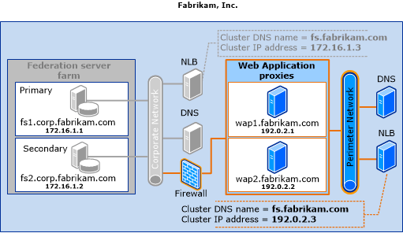

# Federation Server Farm Using WID and Proxies

>Applies To: Windows Server 2016, Windows Server 2012 R2

This deployment topology for Active Directory Federation Services \(AD FS\) is identical to the federation server farm with Windows Internal Database \(WID\) topology, but it adds proxy computers to the perimeter network to support external users. These proxies redirect client authentication requests that come from outside your corporate network to the federation server farm. In previous versions of AD FS, these proxies were called federation server proxies.  
  
> [!IMPORTANT]  
> In Active Directory Federation Services \(AD FS\) in  Windows Server 2012 R2 , the role of a federation server proxy is handled by a new Remote Access role service called Web Application Proxy. To enable your AD FS for accessibility from outside the corporate network, which was the purpose of deploying a federation server proxy in legacy versions of AD FS, such as AD FS 2.0 and AD FS in  Windows Server 2012 , you can deploy one or more web application proxies for AD FS in  Windows Server 2012 R2 .  
>   
> In the context of AD FS, Web Application Proxy functions as an AD FS federation server proxy. In addition to this, Web Application Proxy provides reverse proxy functionality for web applications inside your corporate network to enable users on any device to access them from outside the corporate network. For more information, about the Web Application Proxy role service, see Web Application Proxy Overview.  
>   
> To plan the deployment of Web Application proxy, you can review the information in the following topics:  
>   
> -   [Plan the Web Application Proxy Infrastructure (WAP)](https://technet.microsoft.com/library/dn383648.aspx)  
> -   [Plan the Web Application Proxy Server](https://technet.microsoft.com/library/dn383647.aspx)  
  
## Deployment considerations  
This section describes various considerations about the intended audience, benefits, and limitations that are associated with this deployment topology.  
  
### Who should use this topology?  
  
-   Organizations with 100 or fewer configured trust relationships that need to provide both their internal users and external users \(who are logged on to computers that are physically located outside the corporate network\) with single sign\-on \(SSO\) access to federated applications or services  
  
-   Organizations that need to provide both their internal users and external users with SSO access to Microsoft Office 365  
  
-   Smaller organizations that have external users and require redundant, scalable services  
  
### What are the benefits of using this topology?  
  
-   The same benefits as listed for the [Federation Server Farm Using WID](Federation-Server-Farm-Using-WID.md) topology, plus the benefit of providing additional access for external users  
  
### What are the limitations of using this topology?  
  
-   The same limitations as listed for the [Federation Server Farm Using WID](Federation-Server-Farm-Using-WID.md) topology  

||1 \- 100 RP Trusts|More than 100 RP Trusts 
| ----- |-----| ------ |
|1 \- 30 AD FS Nodes|WID Supported|Not supported using WID \- SQL Required 
|More than 30 AD FS Nodes|Not supported using WID \- SQL Required|Not supported using WID \- SQL Required  
  
## Server placement and network layout recommendations  
To deploy this topology, in addition to adding two web application proxies, you must make sure that your perimeter network can also provide access to a Domain Name System \(DNS\) server and to a second Network Load Balancing \(NLB\) host. The second NLB host must be configured with an NLB cluster that uses an Internet\-accessible cluster IP address, and it must use the same cluster DNS name setting as the previous NLB cluster that you configured on the corporate network \(fs.fabrikam.com\). The web application proxies should also be configured with Internet\-accessible IP addresses.  
  
The following illustration shows the existing federation server farm with WID topology that was described previously and how the fictional Fabrikam, Inc., company provides access to a perimeter DNS server, adds a second NLB host with the same cluster DNS name \(fs.fabrikam.com\), and adds two web application proxies \(wap1 and wap2\) to the perimeter network.  
  
  
  
For more information about how to configure your networking environment for use with federation servers or web application proxies, see “Name Resolution Requirements” section in [AD FS Requirements](AD-FS-Requirements.md) and [Plan the Web Application Proxy Infrastructure (WAP)](https://technet.microsoft.com/library/dn383648.aspx).  
  
## See Also  
[Plan Your AD FS Deployment Topology](Plan-Your-AD-FS-Deployment-Topology.md)  
[AD FS Design Guide in Windows Server 2012 R2](AD-FS-Design-Guide-in-Windows-Server-2012-R2.md)  
  

