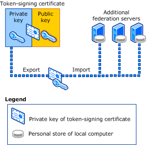

# Token-Signing Certificates

Federation servers require token\-signing certificates to prevent attackers from altering or counterfeiting security tokens in an attempt to gain unauthorized access to federated resources. The private\/public key pairing that is used with token\-signing certificates is the most important validation mechanism of any federated partnership because these keys verify that a security token was issued by a valid partner federation server and that the token was not modified during transit.

## Token\-signing certificate requirements
A token\-signing certificate must meet the following requirements to work with AD FS:

-   For a token\-signing certificate to successfully sign a security token, the token\-signing certificate must contain a private key.

-   The AD FS service account must have access to the token\-signing certificate's private key in the personal store of the local computer. This is taken care of by Setup. You can also use the AD FS Management snap\-in to ensure this access if you subsequently change the token\-signing certificate.

> [!NOTE]
> It is a public key infrastructure \(PKI\) best practice to not share the private key for multiple purposes. Therefore, do not use the service communication certificate that you installed on the federation server as the token\-signing certificate.

## How token\-signing certificates are used across partners
Every token\-signing certificate contains cryptographic private keys and public keys that are used to digitally sign \(by means of the private key\) a security token. Later, after they are received by a partner federation server, these keys validate the authenticity \(by means of the public key\) of the encrypted security token.

Because each security token is digitally signed by the account partner, the resource partner can verify that the security token was in fact issued by the account partner and that it was not modified. Digital signatures are verified by the public key portion of a partner's token\-signing certificate. After the signature is verified, the resource federation server generates its own security token for its organization and it signs the security token with its own token\-signing certificate.

For federation partner environments, when the token\-signing certificate has been issued by a CA, ensure that:

1.  The certificate revocation lists \(CRLs\) of the certificate are accessible to relying parties and Web servers that trust the federation server.

2.  The root CA certificate is trusted by the relying parties and Web servers that trust the federation server.

The Web server in the resource partner uses the public key of the token\-signing certificate to verify that the security token is signed by the resource federation server. The Web server then allows the appropriate access to the client.

## Deployment considerations for token\-signing certificates
When you deploy the first federation server in a new AD FS installation, you must obtain a token\-signing certificate and install it in the local computer personal certificate store on that federation server. You can obtain a token\-signing certificate by requesting one from an enterprise CA or a public CA or by creating a self\-signed certificate.

-   A private key from one token\-signing certificate is shared among all the federation servers in a farm.

    In a federation server farm environment, we recommend that all federation servers share \(or reuse\) the same token\-signing certificate. You can install a single token\-signing certificate from a CA on a federation server and then export the private key, as long as the issued certificate is marked as exportable.

    As shown in the following illustration, the private key from a single token\-signing certificate can be shared to all the federation servers in a farm. This option—compared to the following "unique token\-signing certificate" option—reduces costs if you plan to obtain a token\-signing certificate from a public CA.

    

For information about installing a certificate when you use Microsoft Certificate Services as your enterprise CA, see [IIS 7.0: Create a Domain Server Certificate in IIS 7.0](https://go.microsoft.com/fwlink/?LinkId=108548).

For information about installing a certificate from a public CA, see [IIS 7.0: Request an Internet Server Certificate](https://go.microsoft.com/fwlink/?LinkId=108549).

For information about installing a self\-signed certificate, see [IIS 7.0: Create a Self\-Signed Server Certificate in IIS 7.0](https://go.microsoft.com/fwlink/?LinkID=108271).

## See Also
[AD FS Design Guide in Windows Server 2012](AD-FS-Design-Guide-in-Windows-Server-2012.md)
