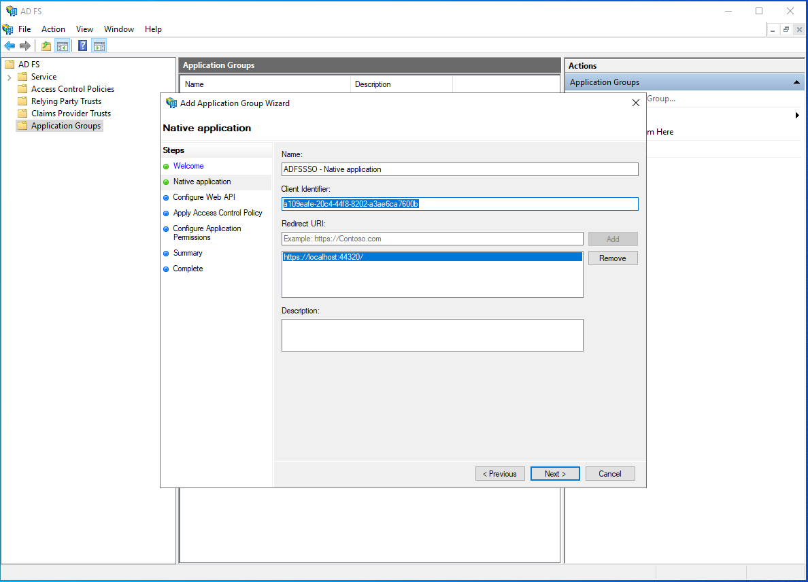
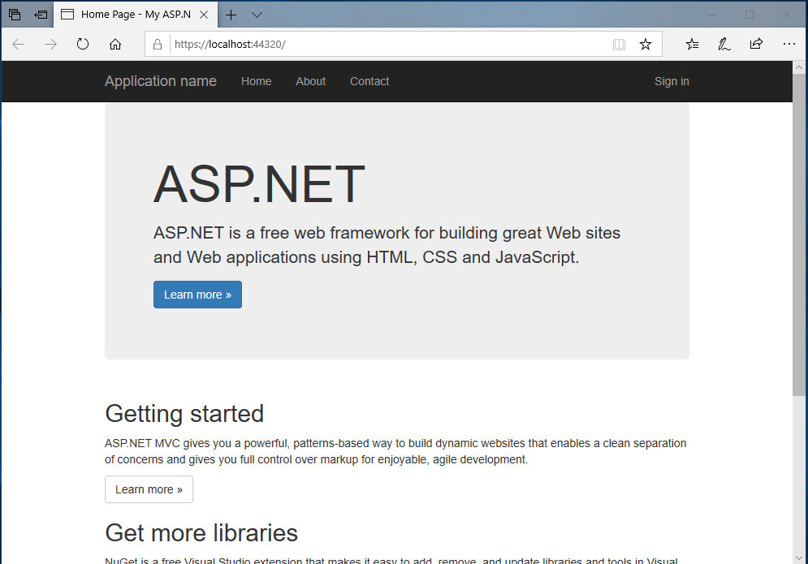
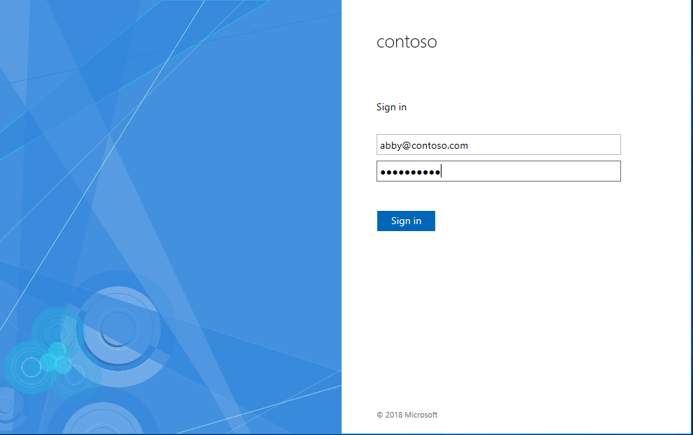

# Customize claims to be emitted in id_token when using OpenID Connect or OAuth with AD FS 2016 or later

## Overview
The article [here](native-client-with-ad-fs.md) shows how to build an app that uses AD FS for OpenID Connect sign on. However, by default there are only a fixed set of claims available in the id_token. AD FS 2016 and later releases have the capability to customize the id_token in OpenID Connect scenarios.

## When are custom ID token used?
In certain scenarios it is possible that the client application does not have a resource that it is trying to access. Therefore, it doesn’t really need an access token. In such cases, the client application essentially needs only an ID token but with some additional claims to help in the functionality.

## What are the restrictions on getting custom claims in ID token?

### Scenario 1


1.	response_mode is set as form_post
2.	Only public clients can get custom claims in ID token
3.	Relying party identifier (Web API identifier) should be same as client identifier

### Scenario 2


With [KB4019472](https://support.microsoft.com/help/4019472/windows-10-update-kb4019472) installed on your AD FS servers
1.	response_mode is set as form_post
2.	Both public and confidential clients can get custom claims in ID token
3.	Assign scope allatclaims to the client – RP pair.
You can assign the scope by using the Grant-ADFSApplicationPermission cmdlet as indicated in the example below:

``` powershell
Grant-AdfsApplicationPermission -ClientRoleIdentifier "https://my/privateclient" -ServerRoleIdentifier "https://rp/fedpassive" -ScopeNames "allatclaims","openid"
```

## Creating and configuring an OAuth application to handle custom claims in ID token
Follow the steps below to create and configure the application in AD FS for receiving ID token with custom claims.

### Create and configure an Application Group in AD FS 2016 or later

1. In AD FS Management, right-click on Application Groups and select **Add Application Group**.

2. On the Application Group Wizard, for the name enter **ADFSSSO** and under Client-Server applications select the **Native application accessing a web application** template. Click **Next**.

  

3. Copy the **Client Identifier** value.  It will be used later as the value for ida:ClientId  in the applications web.config file.

4. Enter the following for **Redirect URI:** - **https://localhost:44320/**.  Click **Add**. Click **Next**.

  

5. On the **Configure Web API** screen, enter the following for **Identifier** - **https://contoso.com/WebApp**.  Click **Add**. Click **Next**.  This value will be used later for **ida:ResourceID** in the applications web.config file.

  

6. On the **Choose Access Control Policy** screen, select **Permit everyone** and click **Next**.

  

7. On the **Configure Application Permissions** screen,  make sure **openid** and **allatclaims** are selected and click **Next**.

  

8. On the **Summary** screen,  click **Next**.  

  

9. On the **Complete** screen,  click **Close**.

10. In AD FS Management, click on Application Groups to get list of all application groups. Right-click on **ADFSSSO** and select **Properties**. Select **ADFSSSO - Web API** and click **Edit...**

    

11. On **ADFSSSO - Web API Properties** screen, select **Issuance Transform Rules** tab and click **Add Rule...**

  

12. On **Add Transform Claim Rule Wizard** screen, select **Send Claims Using a Custom Rule** from the drop-down and click **Next**

  

13. On **Add Transform Claim Rule Wizard** screen, enter **ForCustomIDToken** in **Claim rule name** and following claim rule in **Custom rule**. Click **Finish**

  ```  
  x:[]
  => issue(claim=x);  
  ```

  

```

>[!NOTE]
>You can also use PowerShell to assign the allatclaims and openid scopes
>``` powershell
Grant-AdfsApplicationPermission -ClientRoleIdentifier "[Client ID from #3 above]" -ServerRoleIdentifier "[Identifier from #5 above]" -ScopeNames "allatclaims","openid"
```

### Download and modify the sample application to emit custom claims in id_token

This section discusses how to download the sample Web APP and modify it in Visual Studio.   We will be using the Azure AD sample that is [here](https://github.com/Azure-Samples/active-directory-dotnet-webapp-openidconnect).  

To download the sample project, use Git Bash and type the following:  

```  
git clone https://github.com/Azure-Samples/active-directory-dotnet-webapp-openidconnect  
```  


#### To Modify the app

1.  Open the sample using Visual Studio.  

2.  Rebuild the app so that all of the missing NuGets are restored.  

3.  Open the web.config file.  Modify the following values so the look like the following:  

    ```  
    <add key="ida:ClientId" value="[Replace this Client Id from #3 above under section Create and configure an Application Group in AD FS 2016 or later]" />  
    <add key="ida:ResourceID" value="[Replace this with the Web API Identifier from #5 above]"  />
    <add key="ida:ADFSDiscoveryDoc" value="https://[Your ADFS hostname]/adfs/.well-known/openid-configuration" />  
    <!--<add key="ida:Tenant" value="[Enter tenant name, e.g. contoso.onmicrosoft.com]" />      
    <add key="ida:AADInstance" value="https://login.microsoftonline.com/{0}" />-->  
    <add key="ida:PostLogoutRedirectUri" value="[Replace this with the Redirect URI from #4 above]" />  
    ```  

      

4.  Open the Startup.Auth.cs file and make the following changes:  

    -   Tweak the OpenId Connect middleware initialization logic with the following changes:  

        ```  
        private static string clientId = ConfigurationManager.AppSettings["ida:ClientId"];  
        //private static string aadInstance = ConfigurationManager.AppSettings["ida:AADInstance"];  
        //private static string tenant = ConfigurationManager.AppSettings["ida:Tenant"];  
        private static string metadataAddress = ConfigurationManager.AppSettings["ida:ADFSDiscoveryDoc"];
        private static string resourceId = ConfigurationManager.AppSettings["ida:ResourceID"];
        private static string postLogoutRedirectUri = ConfigurationManager.AppSettings["ida:PostLogoutRedirectUri"];  
        ```  

    -   Comment out the following:  

            ```  
            //string Authority = String.Format(CultureInfo.InvariantCulture, aadInstance, tenant);  
            ```

          

    -   Further down, modify the OpenId Connect middleware options as in the following:  

        ```  
        app.UseOpenIdConnectAuthentication(  
            new OpenIdConnectAuthenticationOptions  
            {  
                ClientId = clientId,  
                //Authority = authority,  
                Resource = resourceId,
                MetadataAddress = metadataAddress,  
                PostLogoutRedirectUri = postLogoutRedirectUri,
                RedirectUri = postLogoutRedirectUri
        ```  

        

5.  Open the HomeController.cs file and make the following changes:  

    -   Add the following:  

            ```  
            using System.Security.Claims;  
            ```

    -   Update the About() method as shown below:  

        ```  
        [Authorize]
        public ActionResult About()
        {
            ClaimsPrincipal cp = ClaimsPrincipal.Current;
            string userName = cp.FindFirst(ClaimTypes.WindowsAccountName).Value;
            ViewBag.Message = String.Format("Hello {0}!", userName);
            return View();
        }
        ```  

        

### Test the custom claims in ID token

Once the above changes have been made, hit F5. This will bring up the sample page. Click on sign in.



You will be re-directed to the AD FS sign-in page. Go ahead and sign in.



Once this is successful you should see that you are now signed in.


Click About link. You will see Hello [Username] which is retrieved from the username claim in id_token


## Next Steps
[AD FS Development](../../ad-fs/AD-FS-Development.md)  
