# Build a multi-tiered application using On-Behalf-Of (OBO) using OAuth with AD FS 2016 or later

This walkthrough provides instruction for implementing an on-behalf-of (OBO) authentication using AD FS in Windows Server 2016 TP5 or later. To learn more about OBO authentication please read [AD FS OpenID Connect/OAuth flows and Application Scenarios](../../ad-fs/overview/ad-fs-openid-connect-oauth-flows-scenarios.md)

>WARNING: The example that you can build here is for educational purposes only. These instructions are for the simplest, most minimal implementation possible to expose the required elements of the model. The example may not include all aspects of error handling and other relate functionality and focuses ONLY on getting a successful OBO authentication.

## Overview

In this sample we will be creating an authentication flow where a client will be accessing a middle-tier Web Service and the web service will then act on behalf of the authenticated client to get an access token.

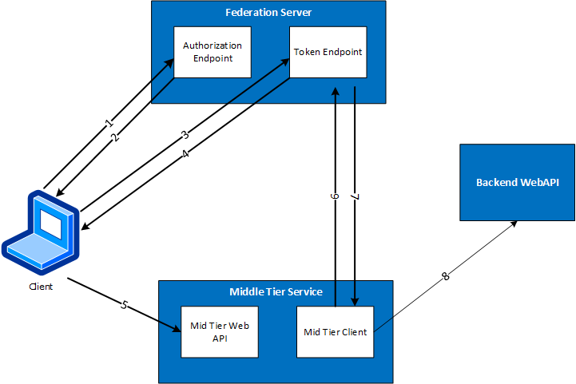

Below is the authentication flow that the sample will achieve
1. Client authenticates to AD FS authorization end point and requests an authorization code
2. Authorization endpoint returns authentication code to client
3. Client uses authentication code and presents it to the AD FS token endpoint to request access token for Middle Tier Web Service as WebAPI
4. AD FS returns the access token to Mid Tier Web Service. For additional functionality, Middle Tier Service needs access to the Backend WebAPI
5. Client uses the access token to use Middle Tier service.
6. Middle Tier service provides the access token to the AD FS token end point and requests access token for Backend WebAPI on-behalf-of the authenticated user
7. AD FS returns access token for backend WebAPI to Middle Tier Service actiing as client
8. Middle Tier Service uses the access token provided by AD FS in step 7 to access the backend WebAPI as client and perform the necessary functions

## Sample Structure

Sample will comprise of three modules

Module | Description
-------|------------
ToDoClient | Native client with which the user interacts
ToDoService | Middle Tier web API which acts as a client for the backend WebAPI
WebAPIOBO | Backend web api that is used by ToDoService to perform the requisite operation when user adds a ToDoItem

## Setting up the development box

This walk-through uses Visual Studio 2015. The project heavily uses Active Directory Authentication Library (ADAL). To learn about ADAL please read [Active Directory Authentication Library .NET](https://msdn.microsoft.com/library/azure/mt417579.aspx)

The sample also uses SQL LocalDB v11.0. Install the SQL LocalDB prior to working on the sample.

## Setting up the environment
We will be working with a basic setup of:

1. **DC**: Domain controller for the domain in which AD FS will be hosted
2. **AD FS Server**: The AD FS Server for the domain
3. **Development Machine**: Machine where we have Visual Studio installed and will be developing our sample

You can, if you want, use only two machines. One for DC/ADFS and the other for developing the sample.

How to setup the domain controller and AD FS is beyond the scope of this article. For additional deployment information see:

- [AD DS Deployment](../../ad-ds/deploy/AD-DS-Deployment.md)
- [AD FS Deployment](../AD-FS-Deployment.md)

The sample is based on the existing OBO sample against Azure created by Vittorio Bertocci and available [here](https://github.com/Azure-Samples/active-directory-dotnet-webapi-onbehalfof). Follow the instructions to clone the project on your development machine and create a copy of the sample to start working with.

## Clone or download this repository

From your shell or command line:

    git clone https://github.com/Azure-Samples/active-directory-dotnet-webapi-onbehalfof.git

## Modifying the sample

As soon as you open the solution WebAPI-OnBehalfOf-DotNet.sln, you will notice that you have two projects in the solution

* **ToDoListClient**: This will serve as the OpenID client which the user will be interacting with
* **ToDoListService**: This will be the middle-tier WebServer APP / Service that will be interacting with another backend WebAPI OBO the authenticated user

As you can see, we will need to add another project later which will act as the resource that will be accessed by the middle-tier ToDoListService.

### Configuring AD FS for the Client and WebServer App

In the current form of the sample, the authentication is configured to be done against Azure AD. We want to change the authentication mechanism and direct it towards AD FS deployed on-premises. In order to do so, we need to configure AD FS to recognize the client and WebServer App we have in the sample.

**Creating an application group**

Open the AD FS management MMC and add a new application group. Select Native-Application-WebAPI template.

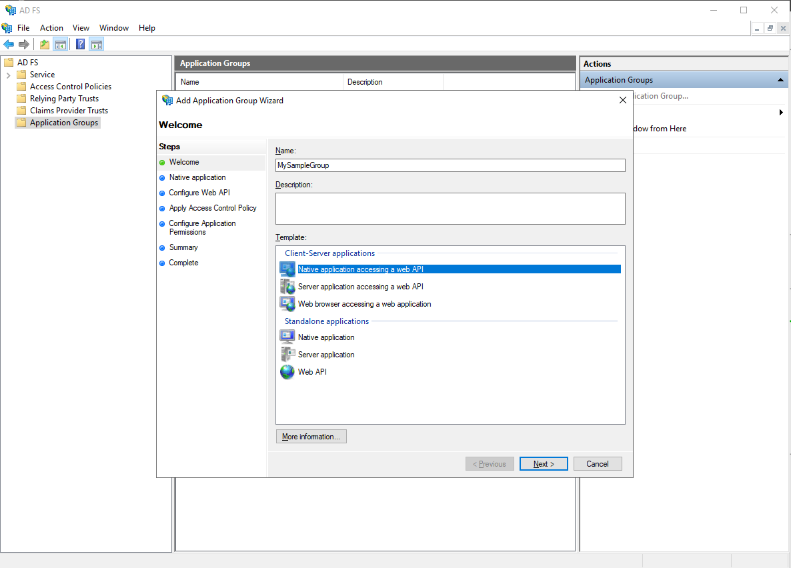

Click on Next and you will be presented with the page for providing information about Client App. Give an appropriate name to the client App in AD FS. Copy the client Identifier and save it somewhere you can access later as this will be required in the application config in visual studio.

>Note: The Redirect URI can be any arbitrary URI as it is really not used in case of native clients

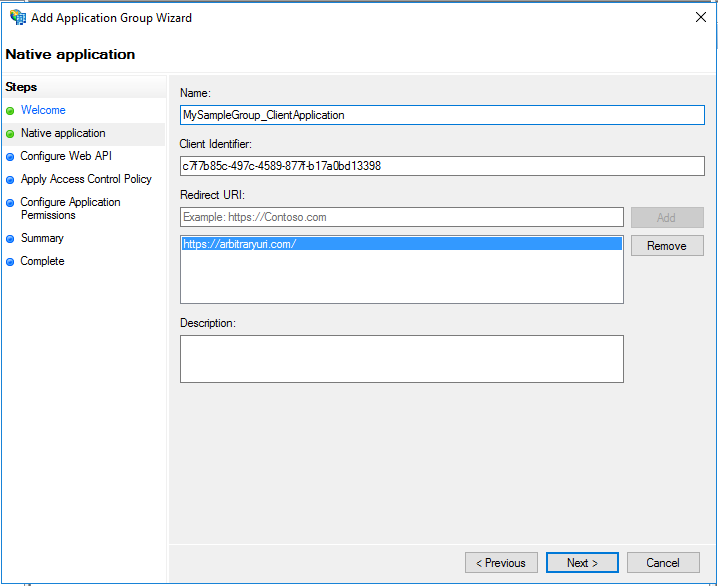

Click on Next and you will be presented with the page for providing information about WebAPI. Give a suitable name for the AD FS entry for the WebAPI and enter the redirect URI as the URI you see in Visual Studio for the ToDoListService

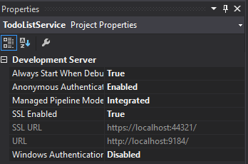

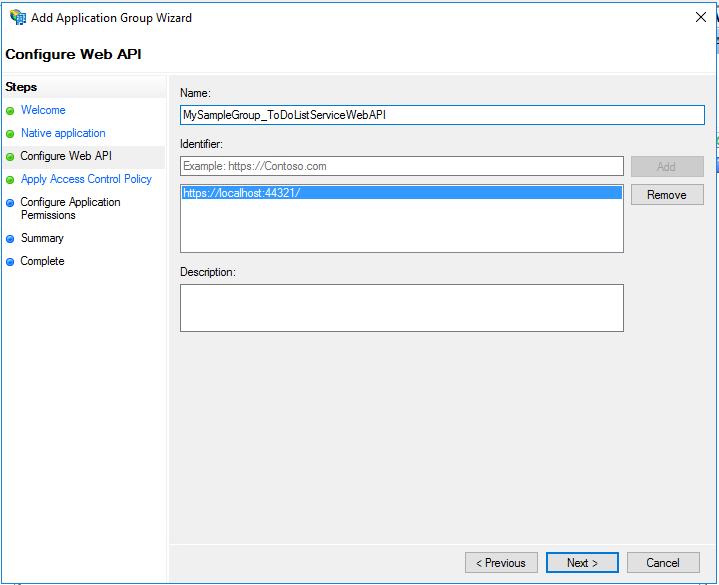

Click on Next and you will see the Choose Access Control Policy Page. Ensure you see "Permit everyone" in the Policy section.

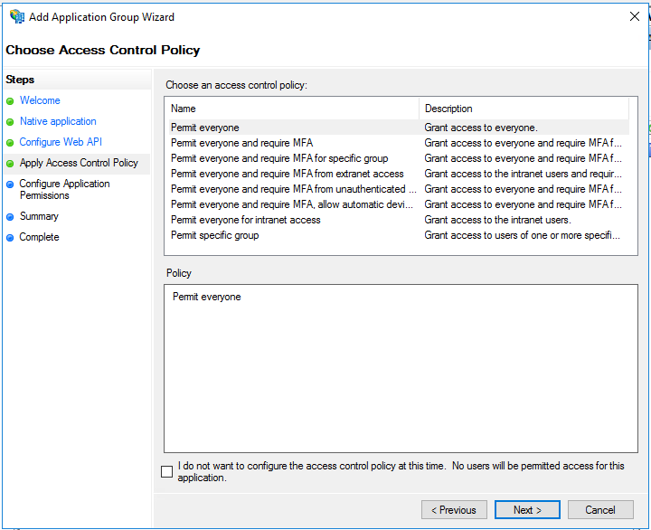

Click on Next and you will be presented with the configure Application Permissions page. On this page, select the permitted scopes as openid (selected by default) and user_impersonation. The scope 'user_impersonation' is necessary to be successfully able to request an on-behalf-of access token from AD FS.

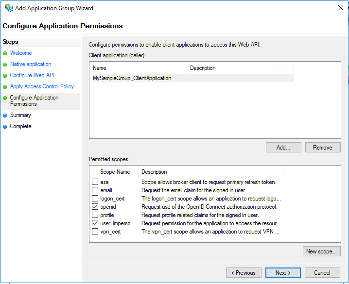

Click next will display the summary page. Go through the rest of the wizard and finish the configuration.

In order to enable on-behalf-of authentication, we need to ensure that AD FS returns an access token with scope user_impersonation to the client. Modify the claims issuance for ToDoListServiceWebApi to include the following three custom rules:

    @RuleName = "All claims"
    c:[]
    => issue(claim = c);

    @RuleName = "Issue user_impersonation scope"
    => issue(Type = "http://schemas.microsoft.com/identity/claims/scope", Value = "user_impersonation");

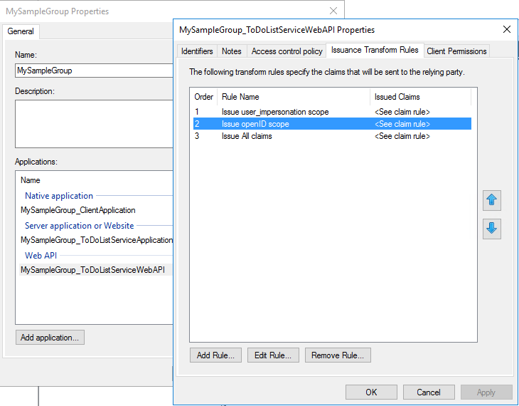

**Adding ToDoListService as a client in the application group**

At this stage we need to make an additional entry in AD FS for the WebServer App to act as a client and not just as a resource. Open the application group you just created and click on Add Application.

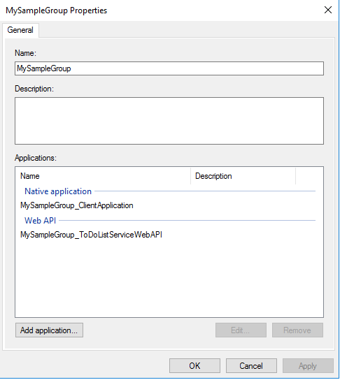

You will be presented with the "Add a new application to MySampleGroup" page. On that page, select "Server Application or Website" as the standalone application

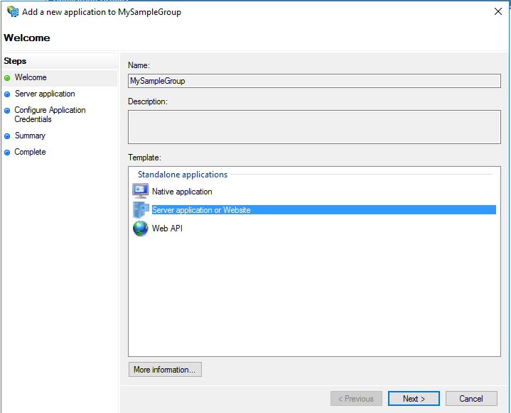

Click Next and you will be presented with the page to provide application details. Provide a suitable name for the configuration entry in the Name section. Ensure that the Client Identifier is same as the identifier for the ToDoListServiceWebAPI

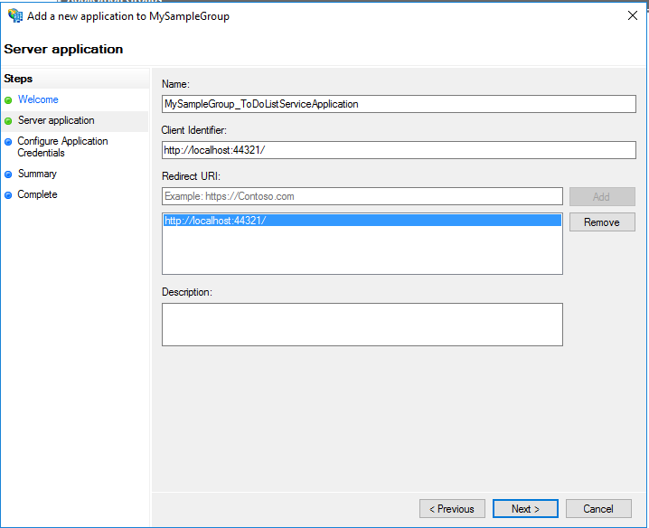

Click on Next and you will be presented with the page to configure the application credentials. Click on "Generate a shared secret". You will be presented with a secret that is automatically generated. Copy the secret at some location as this will be required while we configure the ToDoListService in visual studio.

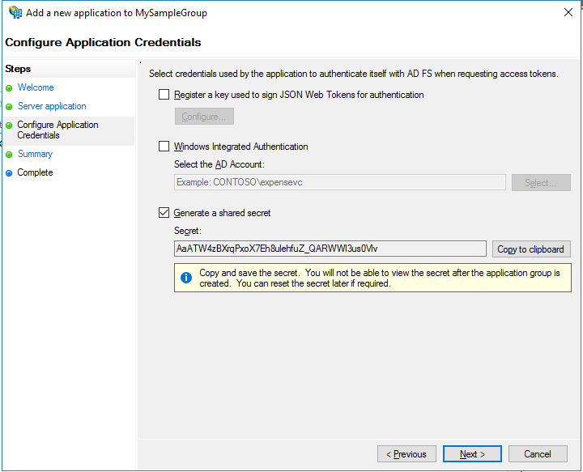

Click on Next and complete the wizard.

### Modifying the ToDoListClient code

#### Modify the Application Config

Go to your the ToDoListClient project in WebAPI-OnBehalfOf-DotNet solution. Open the App.config file and make the following modifications

* Comment the ida:Tenant key entry
* For the ida:RedirectURI enter the arbitrary URI that you provided while configuring the MySampleGroup_ClientApplication in AD FS.
* For the ida:ClientID key, provide the client ID identifier that AD FS gave while configuring the MySampleGroup_ClientApplication.
* For the ida:ToDoListResourceID provide the resource ID you gave while configuring the ToDoListServiceWebApi in AD FS
* Comment the key ida:AADInstance
* For the ida:ToDoListBaseAddress enter the resource ID of the ToDoListServiceWebApi. This will be used while calling the ToDoList WebAPI.
* Add a key ida:Authority and provide the value as the URI for AD FS.

Your **appSettings** in App.Config should look similar to this:

    <appSettings>
    <!--<add key="ida:Tenant" value="[Enter tenant name, e.g. contoso.onmicrosoft.com]" />-->
    <add key="ida:ClientId" value="c7f7b85c-497c-4589-877f-b17a0bd13398" />
    <add key="ida:RedirectUri" value="https://arbitraryuri.com/" />
    <add key="ida:TodoListResourceId" value="https://localhost:44321/" />
    <!--<add key="ida:AADInstance" value="https://login.microsoftonline.com/{0}" />-->
    <add key="ida:TodoListBaseAddress" value="https://localhost:44321" />
    <add key="ida:Authority" value="https://fs.anandmsft.com/adfs/"/>
    </appSettings>

#### Modifying the code

**MainWindow.xaml.cs**

Comment the line reading the tenant information from the application config

    //private static string aadInstance = ConfigurationManager.AppSettings["ida:AADInstance"];
    //private static string tenant = ConfigurationManager.AppSettings["ida:Tenant"];

Change the value of string authority to

    private static string authority = ConfigurationManager.AppSettings["ida:Authority"];

Change the code to read correct values of ToDoListResourceId and ToDoListBaseAddress

    private static string todoListResourceId = ConfigurationManager.AppSettings["ida:TodoListResourceId"];
    private static string todoListBaseAddress = ConfigurationManager.AppSettings["ida:TodoListBaseAddress"];

In the function MainWindow() change the authcontext initialization as:

    authContext = new AuthenticationContext(authority, false);

### Adding the backend resource

In order to complete the on-behalf-of flow, you need to create a backend resource that the ToDoListService will be accessing on-behalf-of the authenticated user. The choice of the backend resource can vary as per the requirement, but for the purpose of this sample you can create a basic WebAPI.

* Right click on solution 'WebAPI-OnBehalfOf-DotNet' in the solution explorer and select Add -> New Project
* Choose ASP.NET Web Application template

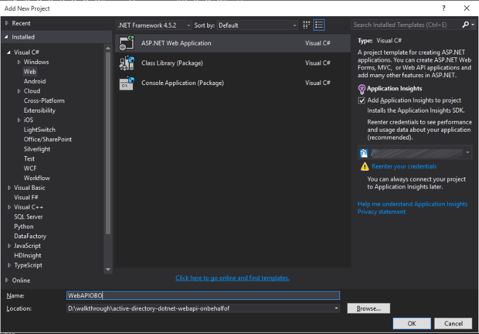

* On the next prompt click on 'Change Authentication'
* Select 'Work and School Accounts' and on the right drop down list select 'On-Premises'
* Enter the federationmetadata.xml path for your AD FS deployment and provide an App URI (provide any URI for now, and you will change it later) and click Ok to add the project to the solution.

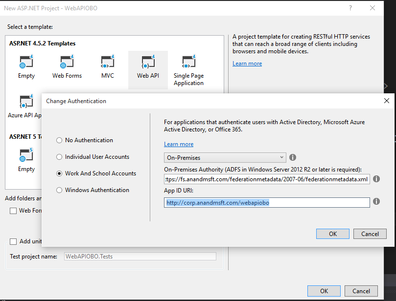

* Right click on Controllers in the solution explorer under the new project created. Select Add -> Controller
* In the template selection, select 'Web API 2 Controller - Empty' and click Ok.

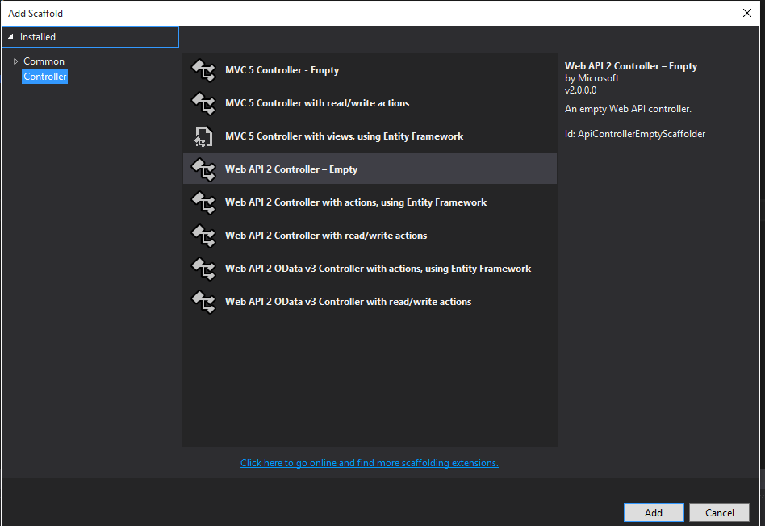

* Give appropriate controller name

* Add the following code in the controller

~~~
    using System;
    using System.Collections.Generic;
    using System.Linq;
    using System.Net;
    using System.Net.Http;
    using System.Web.Http;
    namespace WebAPIOBO.Controllers
    {
        public class WebAPIOBOController : ApiController
        {
            public IHttpActionResult Get()
            {
                return Ok("WebAPI via OBO");
            }
        }
    }
~~~

This code will simply return the string when anyone puts a Get request for the WebAPI WebAPIOBO

### Adding the new backend WebAPI to AD FS

Open the MySampleGroup application group. Click on Add application and select Web API template and click on Next.

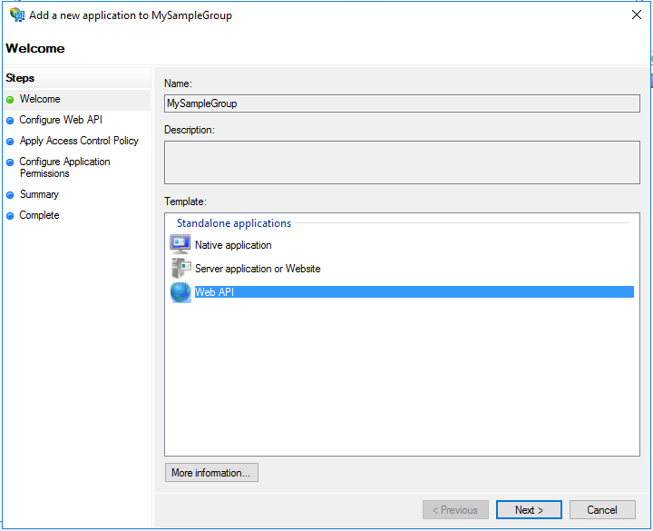

On the Configure Web API page provide an appropriate name for the WebAPI entry and the identifier. The identifier should be the value SSL URL from WebAPIOBO project in visual studio (similar to what we did for BackendWebAPIAdfsAdd).

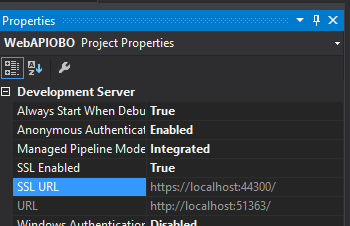

Continue through the rest of the wizard same as when we configured the ToDoListService WebAPI. At the end your application group should look like below:

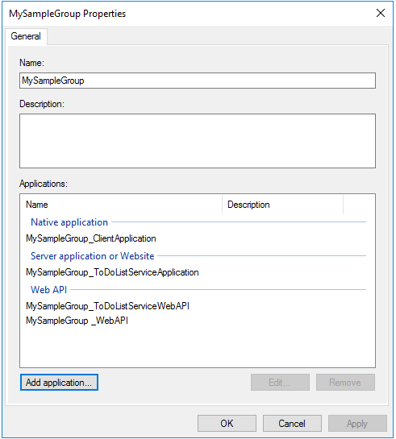

### Modifying the ToDoListService code

#### Modifying the application config

* Open the Web.config file
* Modify the following keys

| Key                      | Value                                                                                                                                                                                                                   |
|:-------------------------|:------------------------------------------------------------------------------------------------------------------------------------------------------------------------------------------------------------------------|
| ida:Audience             | ID of the ToDoListService as given to AD FS while configuring the ToDoListService WebAPI, for example, https://localhost:44321/                                                                                         |
| ida:ClientID             | ID of the ToDoListService as given to AD FS while configuring the ToDoListService WebAPI, for example, <https://localhost:44321/>  **It is very important that the ida:Audience and ida:ClientID match each other** |
| ida:ClientSecret         | This is the secret that AD FS generated when you were configuring the ToDoListService client in AD FS                                                                                                                   |
| ida:AdfsMetadataEndpoint | This is the URL to your AD FS metadata, for e.g. https://fs.anandmsft.com/federationmetadata/2007-06/federationmetadata.xml                                                                                             |
| ida:OBOWebAPIBase        | This is the base address that we will use to call the backend API, for e.g. https://localhost:44300                                                                                                                     |
| ida:Authority            | This is the URL for your AD FS service, example https://fs.anandmsft.com/adfs/                                                                                                                                          |

All other ida:XXXXXXX keys in the **appsettings** node can be commented out or deleted

#### Change authentication from Azure AD to AD FS

* Open the file Startup.Auth.cs
* Remove the following code

        app.UseWindowsAzureActiveDirectoryBearerAuthentication(
            new WindowsAzureActiveDirectoryBearerAuthenticationOptions
            {
                Audience = ConfigurationManager.AppSettings["ida:Audience"],
                Tenant = ConfigurationManager.AppSettings["ida:Tenant"],
                TokenValidationParameters = new TokenValidationParameters{ SaveSigninToken = true }
            });

with

        app.UseActiveDirectoryFederationServicesBearerAuthentication(
            new ActiveDirectoryFederationServicesBearerAuthenticationOptions
            {
                MetadataEndpoint = ConfigurationManager.AppSettings["ida:AdfsMetadataEndpoint"],
                TokenValidationParameters = new TokenValidationParameters()
                {
                    SaveSigninToken = true,
                    ValidAudience = ConfigurationManager.AppSettings["ida:Audience"]
                }
            });

#### Modifying the ToDoListController

Add reference to System.Web.Extensions. Modify the class members by replacing the code below

    //
    // The Client ID is used by the application to uniquely identify itself to Azure AD.
    // The App Key is a credential used by the application to authenticate to Azure AD.
    // The Tenant is the name of the Azure AD tenant in which this application is registered.
    // The AAD Instance is the instance of Azure, for example public Azure or Azure China.
    // The Authority is the sign-in URL of the tenant.
    //
    private static string aadInstance = ConfigurationManager.AppSettings["ida:AADInstance"];
    private static string tenant = ConfigurationManager.AppSettings["ida:Tenant"];
    private static string clientId = ConfigurationManager.AppSettings["ida:ClientId"];
    private static string appKey = ConfigurationManager.AppSettings["ida:AppKey"];

    //
    // To authenticate to the Graph API, the app needs to know the Grah API's App ID URI.
    // To contact the Me endpoint on the Graph API we need the URL as well.
    //
    private static string graphResourceId = ConfigurationManager.AppSettings["ida:GraphResourceId"];
    private static string graphUserUrl = ConfigurationManager.AppSettings["ida:GraphUserUrl"];
    private const string TenantIdClaimType = "https://schemas.microsoft.com/identity/claims/tenantid";

with

    //
    // The Client ID is used by the application to uniquely identify itself to Azure AD.
    // The client secret is the credentials for the WebServer Client

    private static string clientId = ConfigurationManager.AppSettings["ida:ClientId"];
    private static string clientSecret = ConfigurationManager.AppSettings["ida:ClientSecret"];
    private static string authority = ConfigurationManager.AppSettings["ida:Authority"];

    // Base address of the WebAPI
    private static string OBOWebAPIBase = ConfigurationManager.AppSettings["ida:OBOWebAPIBase"];

**Modify the claim used for Name**

From AD FS we are issuing the Nmae claim but we are not issuing NameIdentifier claim. The sample uses NameIdentifier to uniquely key in the ToDo items. For simplicity, you can safely remove the NameIdentifier with Name claim in the code. Find and replace all occurrences of NameIdentifier with Name.

**Modify Post routine and CallGraphAPIOnBehalfOfUser()**

Copy and paste the code below in ToDoListController.cs and replace the code for Post and CallGraphAPIOnBehalfOfUser

    // POST api/todolist
    public async Task Post(TodoItem todo)
    {
      if (!ClaimsPrincipal.Current.FindFirst("https://schemas.microsoft.com/identity/claims/scope").Value.Contains("user_impersonation"))
        {
            throw new HttpResponseException(new HttpResponseMessage { StatusCode = HttpStatusCode.Unauthorized, ReasonPhrase = "The Scope claim does not contain 'user_impersonation' or scope claim not found" });
        }

      //
      // Call the WebAPIOBO On Behalf Of the user who called the To Do list web API.
      //

      string augmentedTitle = null;
      string custommessage = await CallGraphAPIOnBehalfOfUser();

      if (custommessage != null)
        {
            augmentedTitle = String.Format("{0}, Message: {1}", todo.Title, custommessage);
        }
        else
        {
            augmentedTitle = todo.Title;
        }

      if (null != todo && !string.IsNullOrWhiteSpace(todo.Title))
        {
            db.TodoItems.Add(new TodoItem { Title = augmentedTitle, Owner = ClaimsPrincipal.Current.FindFirst(ClaimTypes.Name).Value });
            db.SaveChanges();
        }
      }

      public static async Task<string> CallGraphAPIOnBehalfOfUser()
      {
        string accessToken = null;
        AuthenticationResult result = null;
        AuthenticationContext authContext = null;
        HttpClient httpClient = new HttpClient();
        string custommessage = "";

        //
        // Use ADAL to get a token On Behalf Of the current user.  To do this we will need:
        // The Resource ID of the service we want to call.
        // The current user's access token, from the current request's authorization header.
        // The credentials of this application.
        // The username (UPN or email) of the user calling the API
        //

        ClientCredential clientCred = new ClientCredential(clientId, clientSecret);
        var bootstrapContext = ClaimsPrincipal.Current.Identities.First().BootstrapContext as System.IdentityModel.Tokens.BootstrapContext;
        string userName = ClaimsPrincipal.Current.FindFirst(ClaimTypes.Upn) != null ? ClaimsPrincipal.Current.FindFirst(ClaimTypes.Upn).Value : ClaimsPrincipal.Current.FindFirst(ClaimTypes.Email).Value;
        string userAccessToken = bootstrapContext.Token;
        UserAssertion userAssertion = new UserAssertion(bootstrapContext.Token, "urn:ietf:params:oauth:grant-type:jwt-bearer", userName);

        string userId = ClaimsPrincipal.Current.FindFirst(ClaimTypes.Name).Value;
        authContext = new AuthenticationContext(authority, false);

        // In the case of a transient error, retry once after 1 second, then abandon.
        // Retrying is optional.  It may be better, for your application, to return an error immediately to the user and have the user initiate the retry.
        bool retry = false;
        int retryCount = 0;

        do
          {
              retry = false;
              try
                {
                    result = await authContext.AcquireTokenAsync(OBOWebAPIBase, clientCred, userAssertion);
                    //result = await authContext.AcquireTokenAsync(...);
                    accessToken = result.AccessToken;
                }
              catch (AdalException ex)
                {
                    if (ex.ErrorCode == "temporarily_unavailable")
                    {
                        // Transient error, OK to retry.
                        retry = true;
                        retryCount++;
                        Thread.Sleep(1000);
                    }
                }
          } while ((retry == true) && (retryCount < 1));

        if (accessToken == null)
          {
              // An unexpected error occurred.
              return (null);
          }

        // Once the token has been returned by ADAL, add it to the http authorization header, before making the call to access the To Do list service.
        httpClient.DefaultRequestHeaders.Authorization = new AuthenticationHeaderValue("Bearer", result.AccessToken);

        // Call the WebAPIOBO.
        HttpResponseMessage response = await httpClient.GetAsync(OBOWebAPIBase + "/api/WebAPIOBO");

        if (response.IsSuccessStatusCode)
          {
              // Read the response and databind to the GridView to display To Do items.
              string s = await response.Content.ReadAsStringAsync();
              JavaScriptSerializer serializer = new JavaScriptSerializer();
              custommessage = serializer.Deserialize<string>(s);
              return custommessage;
          }
        else
          {
              custommessage = "Unsuccessful OBO operation : " + response.ReasonPhrase;
          }
        // An unexpected error occurred calling the Graph API.  Return a null profile.
        return (null);
    }

## Running the solution

By default visual studio is configured to run one project when you hit debug to run.

* Right click on the solution and select properties.
* In the properties page select Multiple Startup projects and change the Action to start for all three entries.

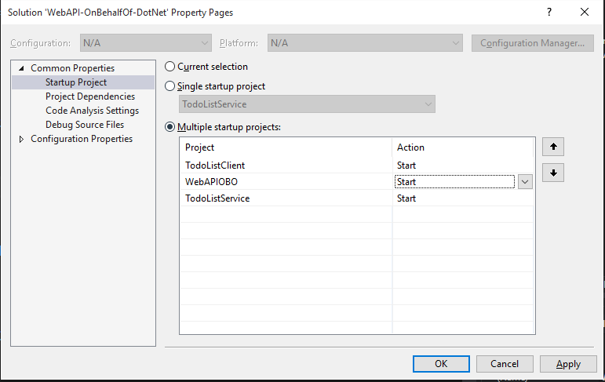

Hit F5 and execute the solution

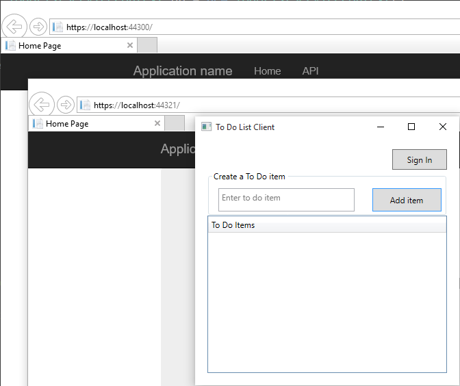

Click on the sign-in button. You will be prompted to sign-in using AD FS

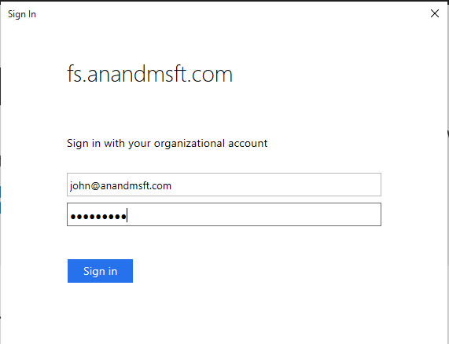

After you sign-in, add a ToDo item in the list. Behind the scenes we are going to do a Post operation to the ToDoListService which further will do a Post to the WebAPIOBO web API.

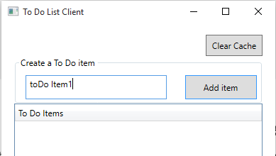

On successful operation you will see that the item has been added to the list with the additional message from the backend Web API which was accessed using OBO auth-flow.

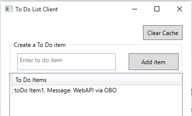

You can also see the detailed traces on Fiddler. Launch Fiddler and enable HTTPS decryption. You can see that we make two requests to the /adfs/oautincludes endpoint.
In the first interaction, we present the access code to the token endpoint and get an access token for https://localhost:44321/

In the second interaction with the token endpoint, you can see that we have **requested_token_use** set as **on_behalf_of** and we are using the access token obtained for the middle-tier web service, i.e. https://localhost:44321/ as the assertion to obtain the on-behalf-of token.
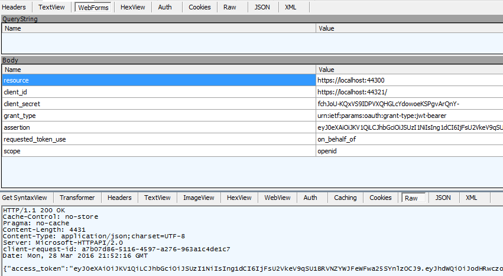

## Next Steps
[AD FS Development](../../ad-fs/AD-FS-Development.md)  
