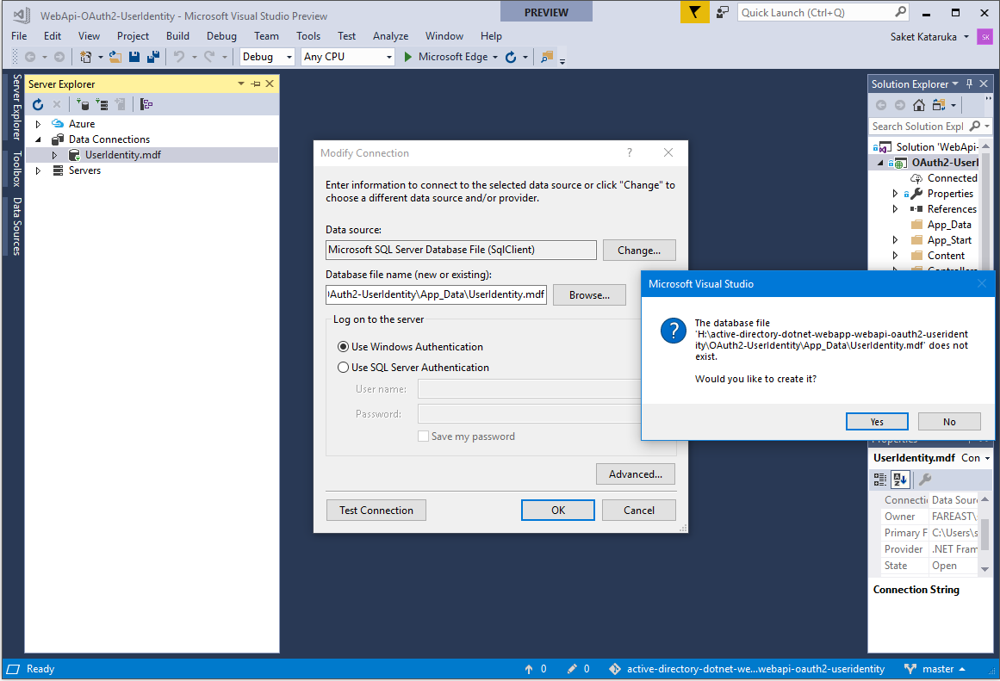
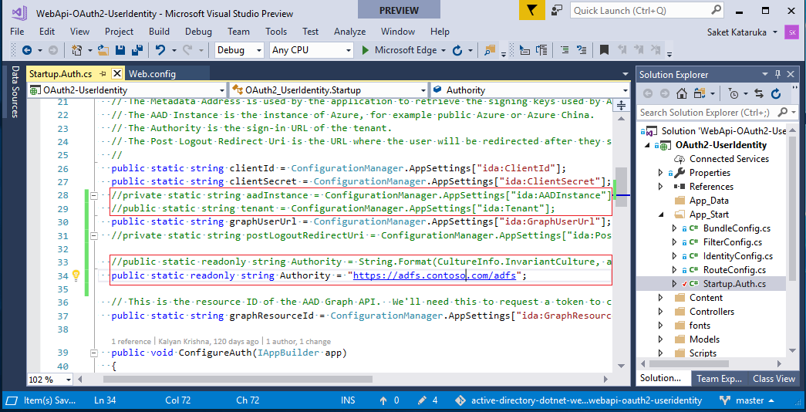
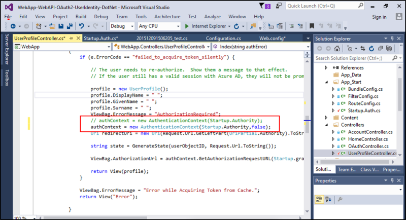
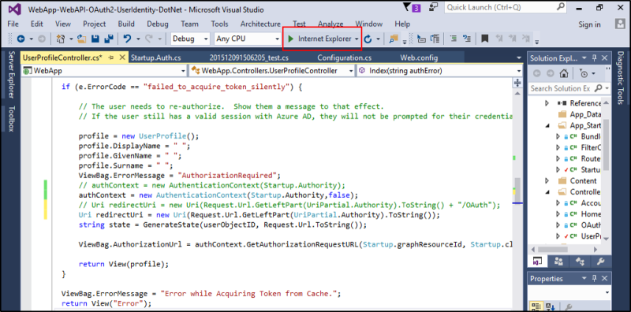

# Build a server-side app that uses OAuth confidential clients by using AD FS 2016 or later


Active Directory Federation Services (AD FS) 2016 and later supports clients that can maintain their own secret, such as an app or service that runs on a web server.  These clients are known as *confidential clients*.

This article describes a web application running on a web server. The application serves as a confidential client to AD FS.

## Prerequisites
You'll need the following resources: 

-   GitHub client tools

-   AD FS in Windows Server 2016 Technical Preview 4 or later (This article assumes that AD FS has been installed.)

-   Visual Studio 2013 or later

## Create an application group

To create an application group in AD FS 2016 or later:

1.  In AD FS Management, right-click **Application Groups**. Then select **Add Application Group**.

2.  In the **Add Application Group Wizard**: 
    1. Under **Name**, enter *ADFSOAUTHCC*. 
    1. Under **Client-Server applications**, select the **Server application accessing a Web API** template.  
    1. Select **Next**.

    :::image type="content" source="media/Enabling-Oauth-Confidential-Clients-with-AD-FS-2016/AD_FS_Confidential_2.PNG" alt-text="Screenshot that shows where to select the template for the server application that accesses a Web A P I." lightbox="media/Enabling-Oauth-Confidential-Clients-with-AD-FS-2016/AD_FS_Confidential_2.PNG":::

3.  Copy the **Client Identifier** value. You'll use it later in the applications *web.config* file. It's the value for `ida:ClientId`.

    :::image type="content" source="media/Enabling-Oauth-Confidential-Clients-with-AD-FS-2016/AD_FS_Confidential_3.PNG" alt-text="Screenshot that shows where to copy the Client Identifier value." lightbox="media/Enabling-Oauth-Confidential-Clients-with-AD-FS-2016/AD_FS_Confidential_3.PNG":::

4. For **Redirect URI**, enter *https://localhost:44323*.  Select **Add**, and then select **Next**.

5.  On the **Configure Application Credentials** page: 
    1. Select **Generate a shared secret**. 
    1. Copy the secret. You'll use this secret later in the applications *web.config* file. It's the value for `ida:ClientSecret`.  
    1. Select **Next**.

    :::image type="content" source="media/Enabling-Oauth-Confidential-Clients-with-AD-FS-2016/AD_FS_Confidential_4.PNG" alt-text="Screenshot that shows the Configure Application Credentials page." lightbox="media/Enabling-Oauth-Confidential-Clients-with-AD-FS-2016/AD_FS_Confidential_4.PNG":::

6. On the **Configure Web API** page: 
    1. For **Identifier**, enter *https://contoso.com/WebApp*. You'll use this value later in the applications *web.config* file. It's the value for `ida:GraphResourceId`. 
    1. Select **Add**. 
    1. Select **Next**.  

    :::image type="content" source="media/Enabling-Oauth-Confidential-Clients-with-AD-FS-2016/AD_FS_Confidential_9.PNG" alt-text="Screenshot that shows the Configure Web A P I page." lightbox="media/Enabling-Oauth-Confidential-Clients-with-AD-FS-2016/AD_FS_Confidential_9.PNG":::

7. On the **Apply Access Control Policy** page, select **Permit everyone**. Then select **Next**.

    :::image type="content" source="media/Enabling-Oauth-Confidential-Clients-with-AD-FS-2016/AD_FS_Confidential_7.PNG" alt-text="Screenshot that shows the Apply Access Control Policy page." lightbox="media/Enabling-Oauth-Confidential-Clients-with-AD-FS-2016/AD_FS_Confidential_7.PNG":::

8. On the **Configure Application Permissions** page, make sure **openid** and **user_impersonation** are selected. Then select **Next**.

    :::image type="content" source="media/Enabling-Oauth-Confidential-Clients-with-AD-FS-2016/AD_FS_Confidential_8.PNG" alt-text="Screenshot that shows the Configure Application Permissions page." lightbox="media/Enabling-Oauth-Confidential-Clients-with-AD-FS-2016/AD_FS_Confidential_8.PNG":::

9. On the **Summary** page,  select **Next**.

10. On the **Complete** page,  select **Close**.

## Upgrade the database
This article is based on Visual Studio 2015. To make the example work with Visual Studio 2015, upgrade the database file by following the instructions in this section.

This section discusses how to download the sample web API and upgrade the database in Visual Studio 2015. We use the [Azure Active Directory sample](https://github.com/Azure-Samples/active-directory-dotnet-webapp-webapi-oauth2-useridentity).

To download the sample project, in Git Bash, enter the following command:

```
git clone https://github.com/Azure-Samples/active-directory-dotnet-webapp-webapi-oauth2-useridentity.git
```


To upgrade the database file:

1.  Open the project in Visual Studio. In the window that appears, a message explains that the app requires SQL Server 2012 Express. If you don't have SQL Server 2012 Express, you need to upgrade the database.  Select **OK**.

    

2. At the top of the window, compile the application by selecting **Build** > **Build Solution**. All of the NuGet packages will be restored.

    

3.  At the top of the window, select **View** > **Server Explorer**.  In the pane that opens, under **Data Connections**, right-click **DefaultConnection** and then select **Modify Connection**.

    

4.  In the **Modify Connection** window, under **Database file name (new or existing)**, select **Browse**. Enter *path\filename.mdf*. Then, in the dialog box, select **Yes**.

    

5.  In the **Modify Connection** dialog box, select **Advanced**.

    

6.  In the **Advanced Properties** dialog box, under **Data Source**, change **(LocalDb\v11.0)** to **(LocalDB)\MSSQLLocalDB**.

    

7.  Select **OK** > **OK**. Then select **Yes** to upgrade the database.

    

8.  After the process finishes, on the right, copy the value in the **Connection String** field.

    

9.  Open the *web.config* file and replace the `connectionString` value with the value you copied earlier.  Save the *web.config* file.

    > [!NOTE]
    > The preceding steps are necessary so you can get the new connection string. Otherwise, you'll get errors when you run `Update-Database` later in this article.

    

10. At the top of the Visual Studio window, select **View** > **Other Windows** > **Package Manager Console**.

    

11. In the **Package Manager Console** pane, enter  `Enable-Migrations`.

    > [!NOTE]
    > If you get an error that says "Enable-Migrations isn't recognized as a cmdlet," enter *Install-Package EntityFramework* to update the entity framework.

    

12. Enter `Add-Migration <AnyNameHere>`.

    

13. Enter `Update-Database`.

    

## Modify the web API 

To modify the sample web API in Visual Studio:

1.  In Visual Studio, open the sample.

2.  Open the *web.config* file.  Modify the following settings by using the values you copied in the [Create an application group](#create-an-application-group) procedure:

    -   `ida:ClientId` - Enter the client ID.

    -   `ida:ClientSecret` - Enter the client secret.

    -   `ida:GraphResourceId` - Enter the graph resource ID.

    

3. Under **App_Start**, open the *Startup.Auth.cs* file. Make the following changes:

    -   Comment out the following lines:

        ```
        //private static string aadInstance = ConfigurationManager.AppSettings["ida:AADInstance"];
        //private static string tenant = ConfigurationManager.AppSettings["ida:Tenant"];
        //public static readonly string Authority = String.Format(CultureInfo.InvariantCulture, aadInstance, tenant);
        ```

    -   In place of the removed lines, add the following line:

        ```
        public static readonly string Authority = "https://<your_fsname>/adfs";
        ```

        Here, replace `<your_fsname>` with the DNS portion of your federation service URL, for example, *adfs.contoso.com*

        

4.  Open the *UserProfileController.cs* file. Make the following changes:

    -   Comment out the following line:

        ```
        //authContext = new AuthenticationContext(Startup.Authority, new TokenDbCache(userObjectID));
        ```

    -   Replace both occurrences with the following code:

        ```
        authContext = new AuthenticationContext(Startup.Authority, false, new TokenDbCache(userObjectID));
        ```

        

    -   Comment out the following line:

        ```
        //authContext = new AuthenticationContext(Startup.Authority);
        ```

    -   Replace both occurrences with the following code:

        ```
        authContext = new AuthenticationContext(Startup.Authority, false);
        ```

        

    -   Comment out all instances of the following line:

        ```
        Uri redirectUri = new Uri(Request.Url.GetLeftPart(UriPartial.Authority).ToString() + "/OAuth");
        ```

    -   Replace all occurrences with the following code:

        ```
        Uri redirectUri = new Uri(Request.Url.GetLeftPart(UriPartial.Authority).ToString());
        ```

        

## Test the solution

To test the confidential client solution:

1. At the top of the Visual Studio window, make sure **Internet Explorer** is selected. Then select the green arrow.

   

2. On the **ASP.NET** page that opens: 
    1. In the upper-right corner, select **Register**.  
    1. Enter a username and password. 
    1. Select **Register** to create a local account in the SQL database.

   :::image type="content" source="media/Enabling-Oauth-Confidential-Clients-with-AD-FS-2016/AD_FS_Confidential_31.PNG" alt-text="Screenshot that shows where to create a local account in the S Q L database." lightbox="media/Enabling-Oauth-Confidential-Clients-with-AD-FS-2016/AD_FS_Confidential_31.PNG":::

3. Notice the message **Hello abby\@contoso.com!**.  Select **Profile**.

   :::image type="content" source="media/Enabling-Oauth-Confidential-Clients-with-AD-FS-2016/AD_FS_Confidential_32.PNG" alt-text="Screenshot that highlights Profile." lightbox="media/Enabling-Oauth-Confidential-Clients-with-AD-FS-2016/AD_FS_Confidential_32.PNG":::

4. On the new page, you see a message that prompts you to sign in.  Select **here**.

    :::image type="content" source="media/Enabling-Oauth-Confidential-Clients-with-AD-FS-2016/AD_FS_Confidential_33.PNG" alt-text="Screenshot that shows the User Profile page." lightbox="media/Enabling-Oauth-Confidential-Clients-with-AD-FS-2016/AD_FS_Confidential_33.PNG":::

    You're prompted to sign in to AD FS.

   :::image type="content" source="media/Enabling-Oauth-Confidential-Clients-with-AD-FS-2016/AD_FS_Confidential_35.PNG" alt-text="Screenshot that shows the sign-in page for A D F S." lightbox="media/Enabling-Oauth-Confidential-Clients-with-AD-FS-2016/AD_FS_Confidential_35.PNG":::     
        
## Next steps
Learn about [AD FS development](../../ad-fs/AD-FS-Development.md).
