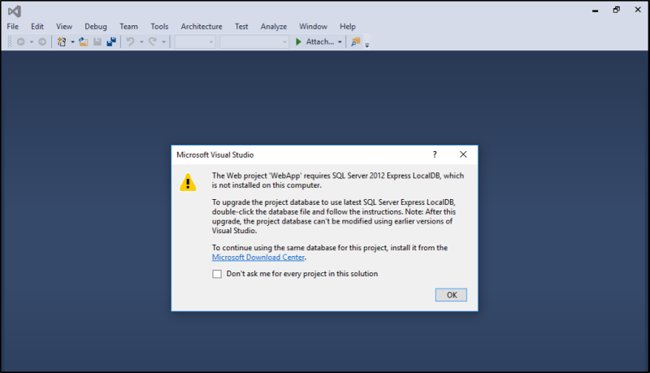
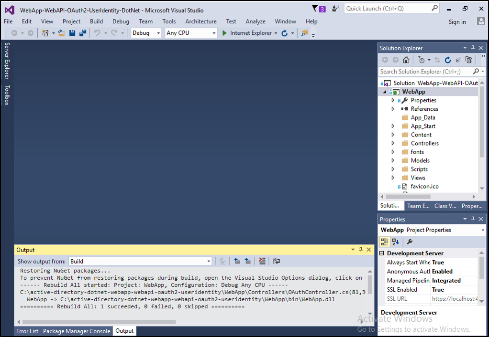

# Build a server-side application that uses OAuth confidential clients by using AD FS 2016 or later


Active Directory Federation Services (AD FS) 2016 and later supports clients that can maintain their own secret, such as an app or service that runs on a web server.  These clients are known as *confidential clients*.

The following diagram shows a web application running on a web server. The application serves as a confidential client to AD FS.

## Prerequisites
You'll need the following resources: 

-   GitHub client tools

-   AD FS in Windows Server 2016 Technical Preview 4 or later (This article assumes that AD FS has been installed.)

-   Visual Studio 2013 or later

## Create an application group

To create an application group in AD FS 2016 or later:

1.  In AD FS Management, right-click **Application Groups**. Then select **Add Application Group**.

2.  In the **Add Application Group Wizard**: 
    1. Under **Name**, enter *ADFSOAUTHCC*. 
    1. Under **Client-Server applications**, select the **Server application accessing a Web API** template.  
    1. Select **Next**.

    :::image type="content" source="media/Enabling-Oauth-Confidential-Clients-with-AD-FS-2016/AD_FS_Confidential_2.PNG" alt-text="Screenshot that shows where to select the template for the server application that accesses a Web A P I." lightbox="media/Enabling-Oauth-Confidential-Clients-with-AD-FS-2016/AD_FS_Confidential_2.PNG":::

3.  Copy the **Client Identifier** value. You'll use it later in the applications *web.config* file. It's the value for **ida:ClientId**.

    :::image type="content" source="media/Enabling-Oauth-Confidential-Clients-with-AD-FS-2016/AD_FS_Confidential_3.PNG" alt-text="Screenshot that shows where to copy the Client Identifier value." lightbox="media/Enabling-Oauth-Confidential-Clients-with-AD-FS-2016/AD_FS_Confidential_3.PNG":::

4. For **Redirect URI:**, enter *https://localhost:44323*.  Select **Add**, and then select **Next**.

5.  On the **Configure Application Credentials** page: 
    1. Select **Generate a shared secret**. 
    1. Copy the secret. You'll use this secret later in the applications *web.config* file. It's the value for **ida:ClientSecret**.  
    1. Select **Next**.

    :::image type="content" source="media/Enabling-Oauth-Confidential-Clients-with-AD-FS-2016/AD_FS_Confidential_4.PNG" alt-text="Screenshot that shows the Configure Application Credentials page." lightbox="media/Enabling-Oauth-Confidential-Clients-with-AD-FS-2016/AD_FS_Confidential_4.PNG":::

6. On the **Configure Web API** page: 
    1. For **Identifier**, enter *https://contoso.com/WebApp*. This value will be used later in the applications *web.config* file. It's the value for **ida:GraphResourceId**. 
    1. Select **Add**. 
    1. Select **Next**.  

    :::image type="content" source="media/Enabling-Oauth-Confidential-Clients-with-AD-FS-2016/AD_FS_Confidential_9.PNG" alt-text="Screenshot that shows the Configure Web A P I page." lightbox="media/Enabling-Oauth-Confidential-Clients-with-AD-FS-2016/AD_FS_Confidential_9.PNG":::

7. On the **Apply Access Control Policy** page, select **Permit everyone**. Then select **Next**.

    :::image type="content" source="media/Enabling-Oauth-Confidential-Clients-with-AD-FS-2016/AD_FS_Confidential_7.PNG" alt-text="Screenshot that shows the Apply Access Control Policy page." lightbox="media/Enabling-Oauth-Confidential-Clients-with-AD-FS-2016/AD_FS_Confidential_7.PNG":::

8. On the **Configure Application Permissions** page, make sure **openid** and **user_impersonation** are selected. Then select **Next**.

    :::image type="content" source="media/Enabling-Oauth-Confidential-Clients-with-AD-FS-2016/AD_FS_Confidential_8.PNG" alt-text="Screenshot that shows the Configure Application Permissions page." lightbox="media/Enabling-Oauth-Confidential-Clients-with-AD-FS-2016/AD_FS_Confidential_8.PNG":::

9. On the **Summary** page,  select **Next**.

10. On the **Complete** page,  select **Close**.

## Upgrade the database
This article is based on Visual Studio 2015. To make the example work with Visual Studio 2015, upgrade the database file. To upgrade the file, follow the instructions in this section.

This section discusses how to download the sample web API and upgrade the database in Visual Studio 2015. We use the [Azure Active Directory sample](https://github.com/Azure-Samples/active-directory-dotnet-webapp-webapi-oauth2-useridentity).

To download the sample project, in Git Bash, enter the following command:

```
git clone https://github.com/Azure-Samples/active-directory-dotnet-webapp-webapi-oauth2-useridentity.git
```


To upgrade the database file:

1.  Open the project in Visual Studio. The window that appears explains that the app requires SQL Server 2012 Express. If you don't have SQL Server 2012 Express, you need to upgrade the database.  Select **OK**.

    

2. At the top of the window, compile the application by selecting **Build** > **Build Solution**. All of the NuGet packages will be restored.

    

3.  At the top of the window, select **View** > **Server Explorer**.  In the pane that opens, under **Data Connections**, right-click **DefaultConnection** and select **Modify Connection**.

    

4.  In the **Modify Connection** window, under **Database file name (new or existing)**, select **Browse**. Enter *path\filename.mdf*. Then, in the dialog box, select **Yes**.

    

5.  In the **Modify Connection** dialog box, select **Advanced**.

    

6.  In the **Advanced Properties** dialog box, locate Data Source and use the drop-down to change it from **(LocalDb\v11.0)** to **(LocalDB)\MSSQLLocalDB**.

    

7.  Select Ok. Select Ok.  Select Yes to upgrade the database.

    

8.  When this completes, over on the right, copy the value in the box next to **Connection String.**

    

9.  Now, open the Web.config file and replace the value that is in connectionString with the value you copied above.  Save the Web.config file.

    > [!NOTE]
    > The steps above are necessary so that we can get the new connectionString.  Otherwise, when we run Update-Database below it will error out.

    

10. At the top of Visual Studio, select **View** -> **Other Windows** -> **Package Manager Console**.

    

11. At the bottom, in the Package Manager Console enter:  `Enable-Migrations` and hit enter.

    > [!NOTE]
    > If you get an error that says Enable-Migrations is not recognized as a cmdlet, enter Install-Package EntityFramework to update the EntityFramework.

    

12. At the bottom, in the Package Manager Console enter:  `Add-Migration <anynamehere>` and hit enter.

    

13. At the bottom, in the Package Manager Console enter:  `Update-Database` and hit enter.

    

## Modify the web API 

To modify the sample web API in Visual Studio:

1.  Open the sample using Visual Studio.

2.  Open the web.config file.  Modify the following values:

    -   ida:ClientId - enter the value from #3 in Create the Application Group section above.

    -   ida:ClientSecret - enter the value from #5 in Create the Application Group section above.

    -   ida:GraphResourceId - enter the value from #6 in Create the Application Group section above.

    

3.  Open the Startup.Auth.cs file under App_Start and make the following changes:

    -   Comment out the following lines:

        ```
        //private static string aadInstance = ConfigurationManager.AppSettings["ida:AADInstance"];
        //private static string tenant = ConfigurationManager.AppSettings["ida:Tenant"];
        //public static readonly string Authority = String.Format(CultureInfo.InvariantCulture, aadInstance, tenant);
        ```

    -   Add the following in it's place:

        ```
        public static readonly string Authority = "https://<your_fsname>/adfs";
        ```

        where <your_fsname> is replaced with the DNS portion of your federation service url, for example adfs.contoso.com

        

4.  Open the UserProfileController.cs file and make the following changes:

    -   Comment out the following:

        ```
        //authContext = new AuthenticationContext(Startup.Authority, new TokenDbCache(userObjectID));
        ```

    -   Replace both occurrences with the following:

        ```
        authContext = new AuthenticationContext(Startup.Authority, false, new TokenDbCache(userObjectID));
        ```

        

    -   Comment out the following:

        ```
        //authContext = new AuthenticationContext(Startup.Authority);
        ```

    -   Replace both occurrences with the following:

        ```
        authContext = new AuthenticationContext(Startup.Authority, false);
        ```

        

    -   Now comment out all instances of the following:

        ```
        Uri redirectUri = new Uri(Request.Url.GetLeftPart(UriPartial.Authority).ToString() + "/OAuth");
        ```

    -   Replace all occurrences with the following:

        ```
        Uri redirectUri = new Uri(Request.Url.GetLeftPart(UriPartial.Authority).ToString());
        ```

        

## Test the solution
In this section we will test the confidential client solution.  Use the following procedure to test the solution.

To test the confidential client solution:

1. At the top of Visual Studio, make sure Internet Explorer is selected and select the green arrow.

   

2. Once the ASP.Net page comes up, select **Register** on top right of the page.  Enter a username and password and then select **Register** button.  This creates a local account in the SQL database.

   :::image type="content" source="media/Enabling-Oauth-Confidential-Clients-with-AD-FS-2016/AD_FS_Confidential_31.PNG" alt-text="Screenshot that shows where to create a local account in the S Q L database." lightbox="media/Enabling-Oauth-Confidential-Clients-with-AD-FS-2016/AD_FS_Confidential_31.PNG":::

3. Notice now, the ASP.NET site says Hello abby@contoso.com!.  Select **Profile**.

   :::image type="content" source="media/Enabling-Oauth-Confidential-Clients-with-AD-FS-2016/AD_FS_Confidential_32.PNG" alt-text="Screenshot that highlights Profile." lightbox="media/Enabling-Oauth-Confidential-Clients-with-AD-FS-2016/AD_FS_Confidential_32.PNG":::

4. This brings up a page without any information and says that we must select here to sign-in.  Select **here**.

    :::image type="content" source="media/Enabling-Oauth-Confidential-Clients-with-AD-FS-2016/AD_FS_Confidential_33.PNG" alt-text="Screenshot that shows the User Profile page." lightbox="media/Enabling-Oauth-Confidential-Clients-with-AD-FS-2016/AD_FS_Confidential_33.PNG":::

5. You will now be prompted to sign-in to AD FS.

   
   :::image type="content" source="media/Enabling-Oauth-Confidential-Clients-with-AD-FS-2016/AD_FS_Confidential_35.PNG" alt-text="Screenshot that shows the sign-in page for AD FS." lightbox="media/Enabling-Oauth-Confidential-Clients-with-AD-FS-2016/AD_FS_Confidential_35.PNG":::     
        
## Next steps
[AD FS Development](../../ad-fs/AD-FS-Development.md)
