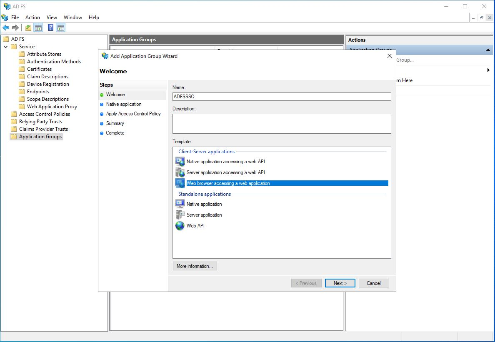
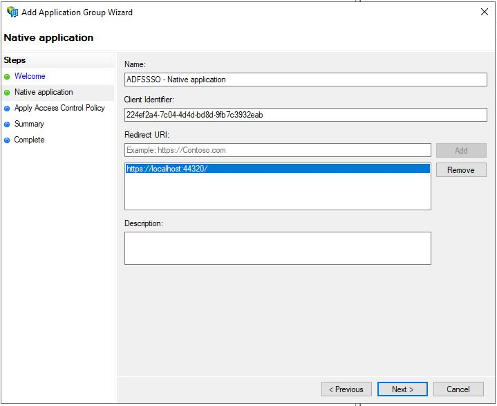
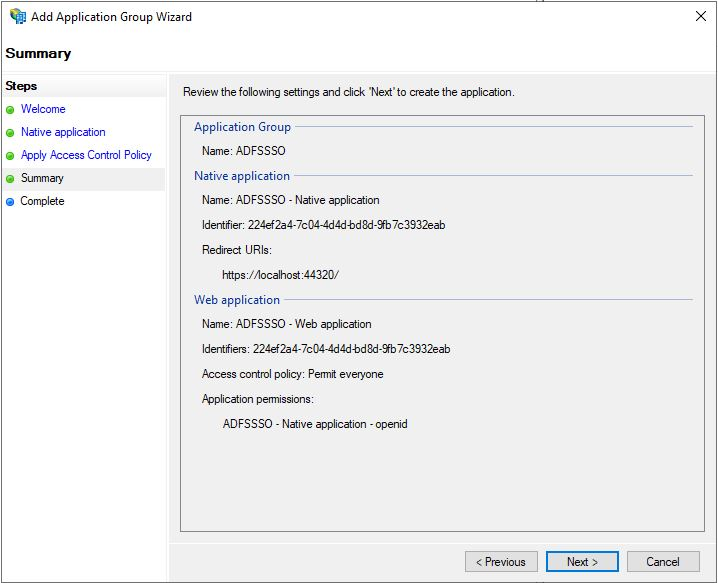
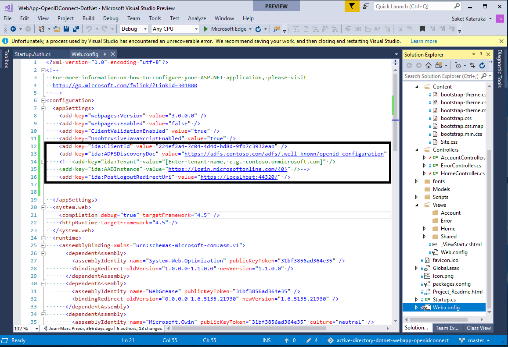
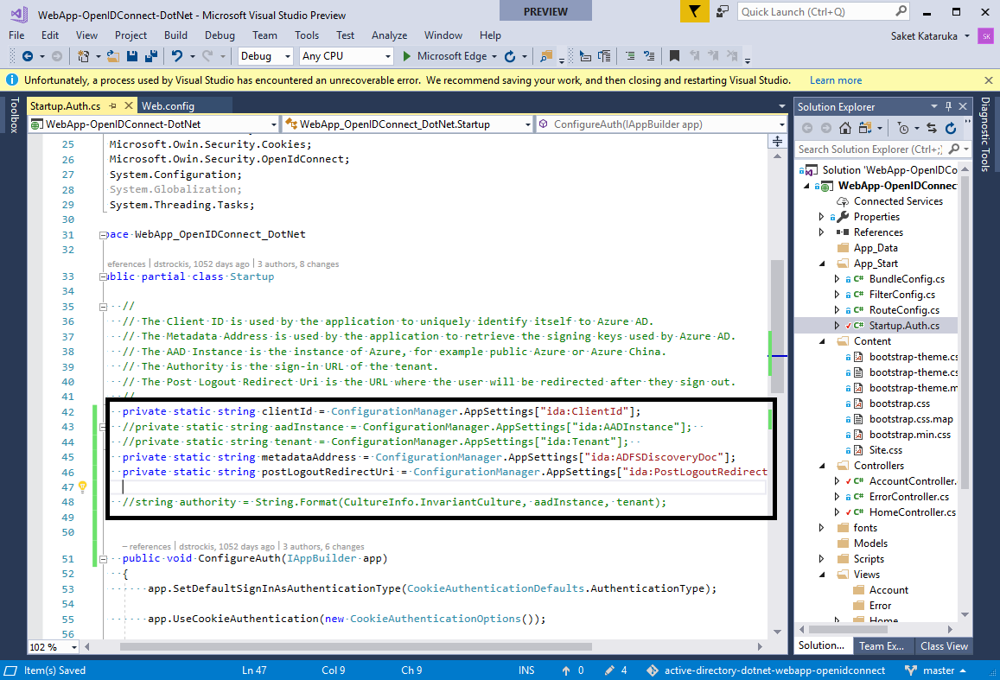
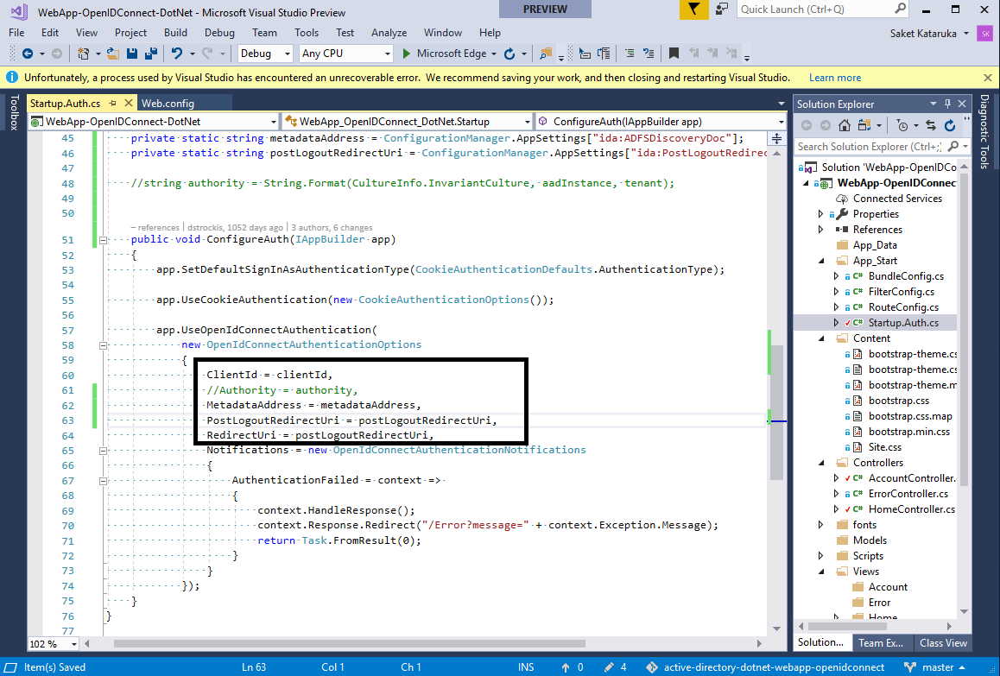
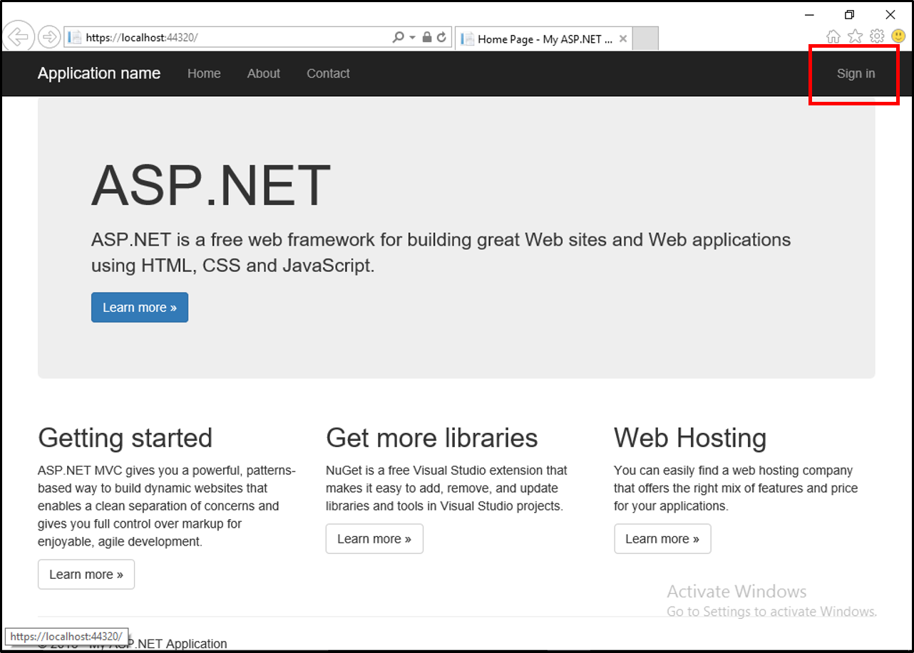
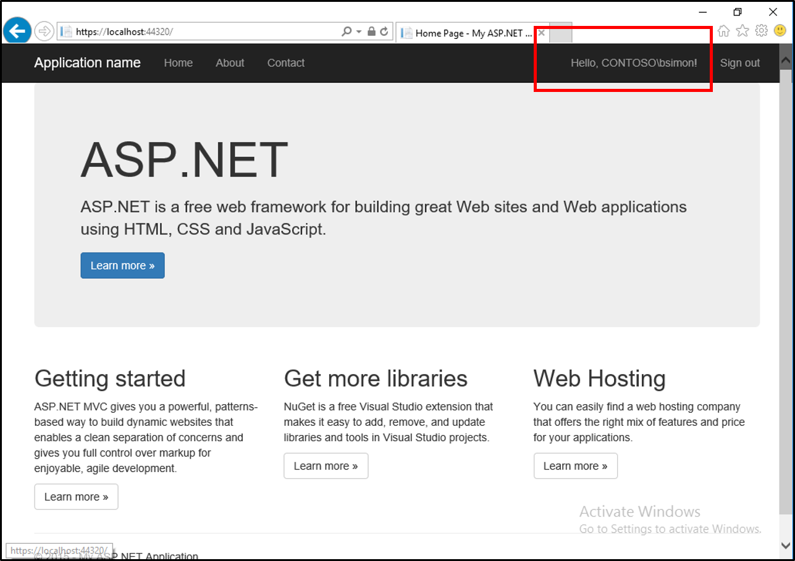

# Build a web application using OpenID Connect with AD FS 2016 and later

>Applies To: Windows Server 2016 and later

## Pre-requisites  
The following are a list of pre-requisites that are required prior to completing this document. This document assumes that AD FS has been installed and an AD FS farm has been created.  

-   GitHub client tools  

-   AD FS in Windows Server 2016 TP4 or later  

-   Visual Studio 2013 or later.  

## Create an Application Group in AD FS 2016 and later
The following section describes how to configure the application group in AD FS 2016 and later.  

#### Create Application Group  

1.  In AD FS Management, right-click on Application Groups and select **Add Application Group**.  

2.  On the Application Group Wizard, for the name enter **ADFSSSO** and under **Client-Server applications** select the **Web browser accessing a web application** template.  Click **Next**.

      

3.  Copy the **Client Identifier** value.  It will be used later as the value for ida:ClientId  in the applications web.config file.  

4.  Enter the following for **Redirect URI:** - **https://localhost:44320/**.  Click **Add**. Click **Next**.  

      

5.  On the **Summary** screen,  click **Next**.  

    

6.  On the **Complete** screen,  click **Close**.  

## Download and modify sample application to authenticate via OpenID Connect and AD FS  
This section discusses how to download the sample Web APP and modify it in Visual Studio.   We will be using the Azure AD sample that is [here](https://github.com/Azure-Samples/active-directory-dotnet-webapp-openidconnect).  

To download the sample project, use Git Bash and type the following:  

```  
git clone https://github.com/Azure-Samples/active-directory-dotnet-webapp-openidconnect  
```  

  

#### To Modify the app  

1.  Open the sample using Visual Studio.  

2.  Rebuild the app so that all of the missing NuGets are restored.  

3.  Open the web.config file.  Modify the following values so the look like the following:  

    ```  
    <add key="ida:ClientId" value="[Replace this Client Id obtained while creating application group]" />  
    <add key="ida:ADFSDiscoveryDoc" value="https://[Your ADFS hostname]/adfs/.well-known/openid-configuration" />  
    <!--<add key="ida:Tenant" value="[Enter tenant name, e.g. contoso.onmicrosoft.com]" />      
    <add key="ida:AADInstance" value="https://login.microsoftonline.com/{0}" />-->  
    <add key="ida:PostLogoutRedirectUri" value="https://localhost:44320/" />  
    ```  

      

4.  Open the Startup.Auth.cs file and make the following changes:  

    -   Comment out the following:  

        ```  
        //string Authority = String.Format(CultureInfo.InvariantCulture, aadInstance, tenant);  
        ```  

    -   Tweak the OpenId Connect middleware initialization logic with the following changes:  

        ```  
        private static string clientId = ConfigurationManager.AppSettings["ida:ClientId"];  
        //private static string aadInstance = ConfigurationManager.AppSettings["ida:AADInstance"];  
        //private static string tenant = ConfigurationManager.AppSettings["ida:Tenant"];  
        private static string metadataAddress = ConfigurationManager.AppSettings["ida:ADFSDiscoveryDoc"];  
        private static string postLogoutRedirectUri = ConfigurationManager.AppSettings["ida:PostLogoutRedirectUri"];  
        ```  

          

    -   Further down, modify the OpenId Connect middleware options as in the following:  

        ```  
        app.UseOpenIdConnectAuthentication(  
            new OpenIdConnectAuthenticationOptions  
            {  
                ClientId = clientId,  
                //Authority = authority,  
                MetadataAddress = metadataAddress,  
                PostLogoutRedirectUri = postLogoutRedirectUri,
                RedirectUri = postLogoutRedirectUri
        ```  

          

        By changing the above we are doing the following:  

        -   Instead of using the Authority for communicating data about the trusted issuer, we specify the discovery doc location directly via MetadataAddress  

        -   Azure AD does not enforce the presence of a redirect_uri in the request, but ADFS does. So, we need to add it here  

## Verify the app is working  
Once the above changes have been made, hit F5.  This will bring up the sample page.  Click on sign in.  

  

You will be re-directed to the AD FS sign-in page.  Go ahead and sign in.  

  

Once this is successful you should see that you are now signed in.  

  

## Next Steps
[AD FS Development](../../ad-fs/AD-FS-Development.md)  
