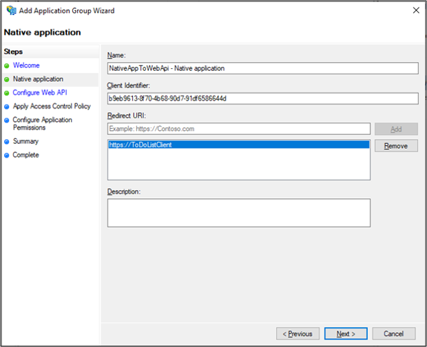
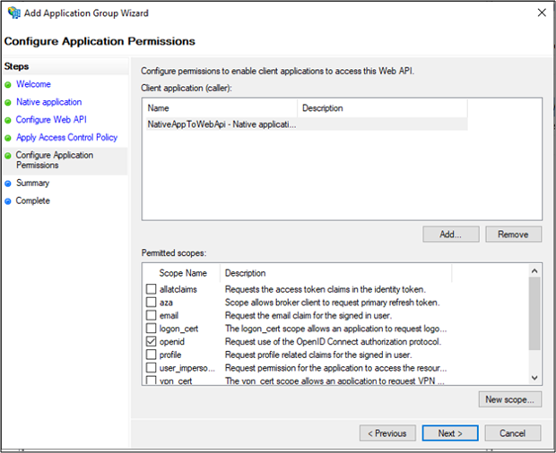
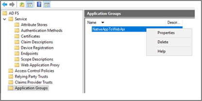
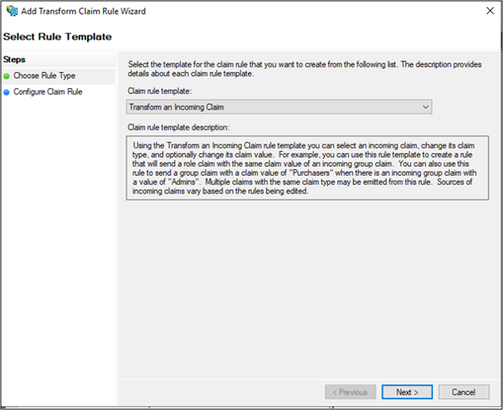
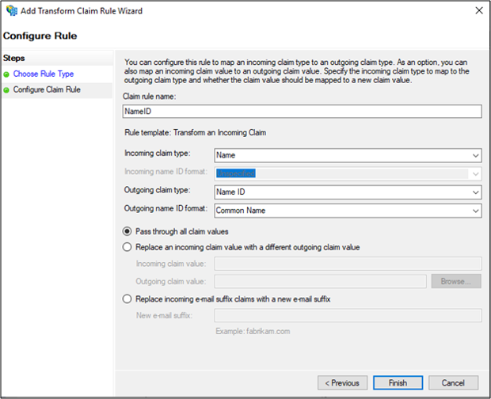
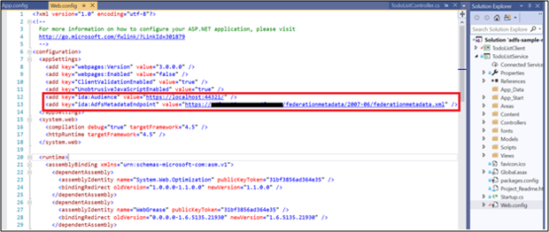
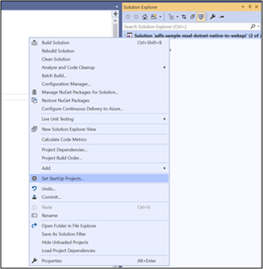
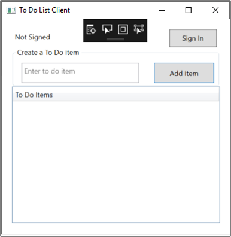
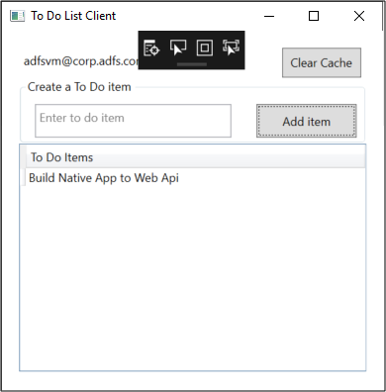

# Scenario: Native app calling Web API 
>Applies To: AD FS 2019 or later 
 
Learn how to build a native app signing-in users authenticated by AD FS 2019 and acquiring tokens using [MSAL library](https://github.com/AzureAD/microsoft-authentication-library-for-dotnet/wiki)  to call web APIs.  
 
Before reading this article, you should be familiar with the [AD FS concepts](../adfs-modern-auth-concepts.md)
 
## Overview 
 
 

In this flow you add authentication to your Native App (public client), which can therefore sign in users and calls a web API. To call a Web API from a native app that signs in users, use MSAL's [AcquireTokenInteractive](https://github.com/AzureAD/microsoft-authentication-library-for-dotnet/wiki/Acquiring-tokens-interactively) token acquisition method. To enable this interaction, MSAL leverages a web browser.  

For applications running in intranet, there's another possibility. These applications can acquire a token silently by using MSAL’s AcquireTokenSilent token acquisition method.  
 
To better understand how to configure a Native App in ADFS to acquire access token interactively, let’s use a sample Native App calling a Web API available here Add github link and walkthrough the app registration and code configuration steps.  
 

## Pre-requisites 

- GitHub client tools 
- AD FS 2019 or later configured and running 
- Visual Studio 2013 or later 
 

## App Registration in AD FS 
This section shows how to register the Native App as a public client and Web API as a Relying Party (RP) in AD FS 

  1. In AD FS Management, right-click on Application Groups and select Add Application Group.  
  2. On the Application Group Wizard, for the Name enter NativeAppToWebApi and under Client-Server applications select the Native application accessing a Web API template. Click Next.  
    

  3. Copy the Client Identifier value. It will be used later as the value for ClientId in the applications App.xaml.cs file. Enter the following for Redirect URI: - https://ToDoListClient. Click Add. Click Next.  
   

  4. On the Configure Web API screen, enter the Identifier - https://localhost:44321/. Click Add. Click Next. This value will be used later for Resource in the applications App.xaml.cs file.  
     
  5. On the Apply Access Control Policy screen, select Permit everyone and click Next. 
    
  6. On the Configure Application Permissions screen, click Next.  
  

  7. On the Summary screen, click Next.
  
  8. On the Complete screen, click Close. 
  
  9. In AD FS Management, click on Application Groups and select CustomIdTokenClaims application group. Right-click and select Properties 
   

  10. On NativeAppToWebApi properties screen, select NativeAppToWebApi – Web API under Web API and click Edit… 
   

  11. On NativeAppToWebApi – Web API Properties screen, select Issuance Transform Rules tab and click Add Rule… 
   

  12. On Add Transform Claim Rule Wizard, select Transform an Incoming Claim from the Claim rule template: dropdown and click Next.  
   

  13. Enter NameID in Claim rule name: field. Select Name for Incoming claim type, Name ID for Outgoing claim type and Common Name for Outgoing name ID format. click Finish.
   

  14. Click OK on NativeAppToWebApi – Web API Properties screen and then NativeAppToWebApi Properties screen.  
 
## Code Configuration 
This section shows how to configure a Native App to sign-in user and retrieve token to call the Web API 

1. Download the sample from here Add link  
2. Open the sample using Visual Studio 
3. Open the App.config file. Modify the following: 
 - ida:Authority - enter https://[your AD FS hostname]/adfs
 - ida:ClientId - enter the value from #3 in App Registration in AD FS section above. 
 - ida:RedirectUri - enter the value from #3 in App Registration in AD FS section above.
 - todo:TodoListResourceId – enter the Identifier value from #4 in App Registration in AD FS section above 
 - ida: todo:TodoListBaseAddress - enter the Identifier value from #4 in App Registration in AD FS section above. 
 

 4. Open the Web.config file. Modify the following: 
  - ida:Audience - enter the Identifier value from #4 in App Registration in AD FS section above 
  - ida: AdfsMetadataEndpoint - enter https://[your AD FS hostname]/federationmetadata/2007-06/federationmetadata.xml 
 
 
 
 
## Test the sample 
This section shows how to test the sample configured above. 

  1. Once the code changes are made rebuild the solution 
  2. On Visual Studio, right click on solution and select Set StartUp Projects…  
  

  3. On the Properties pages make sure Action is set to Start  for each of the Projects 
  

  4. At the top of Visual Studio, click the green arrow.  
  

  5. On the Native App’s Main screen, click on Sign In.  
  
  Note: If you don’t see the native app screen, search and remove *msalcache.bin files from the folder where project repo is saved on your system. 

  6. You will be re-directed to the AD FS sign-in page. Go ahead and sign in. 
  

  7. Once signed-in, enter text Build Native App to Web Api in the Create a To Do item. Click Add item.  This will call the To Do List Service and add the item in the cache. 
    
 
 
 
 