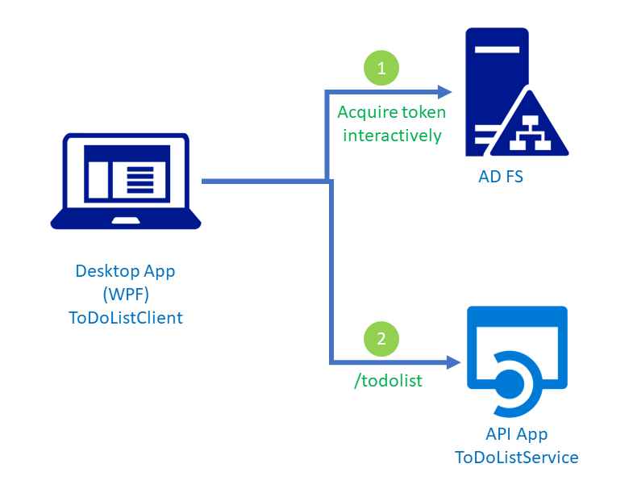
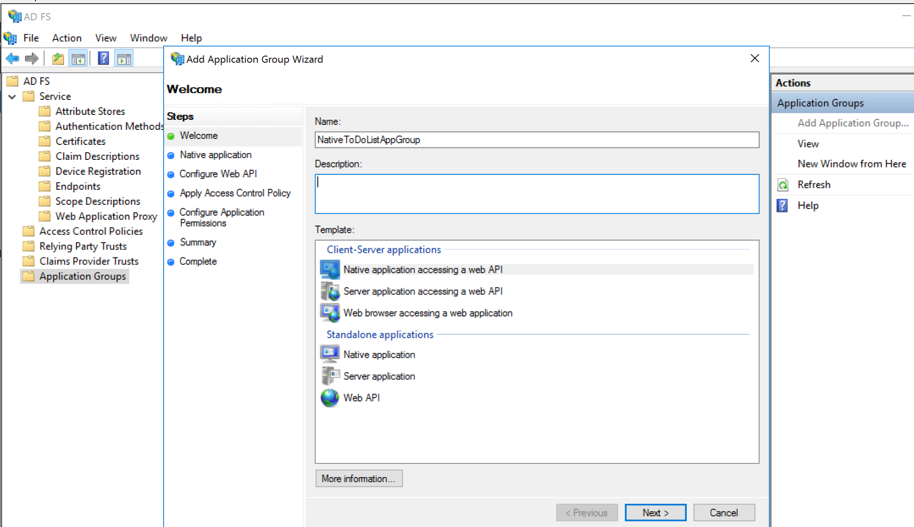
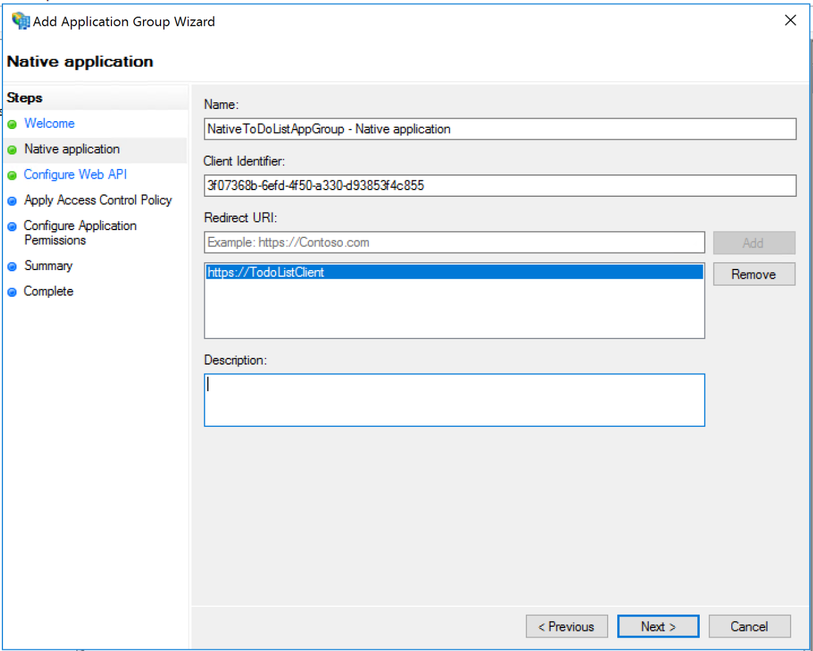
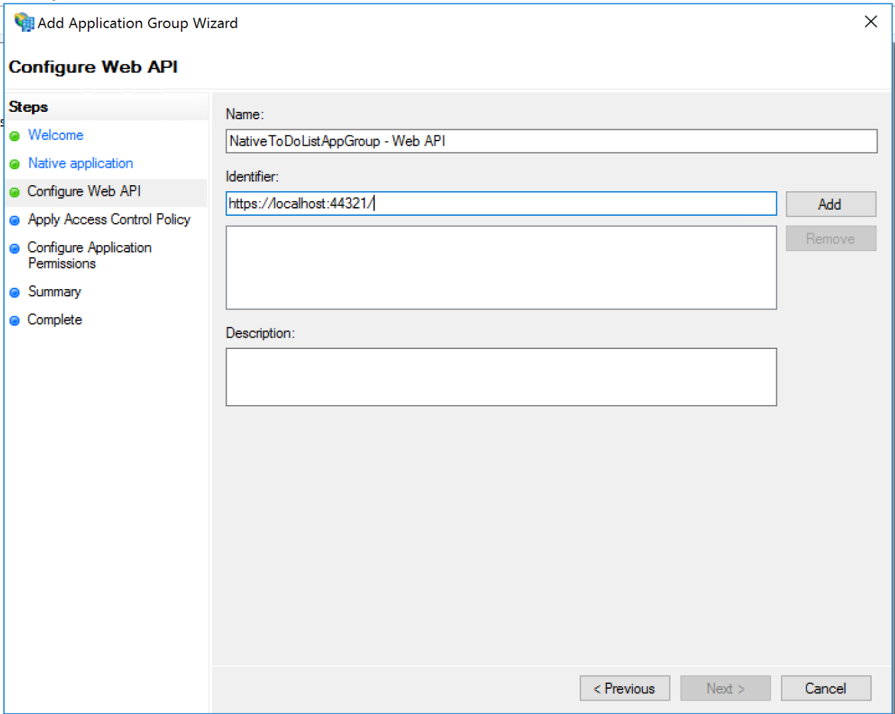
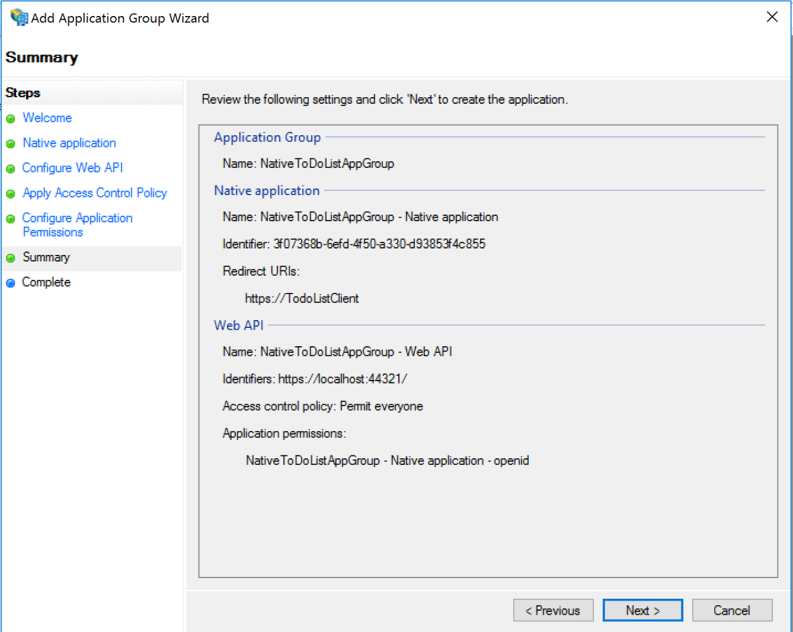
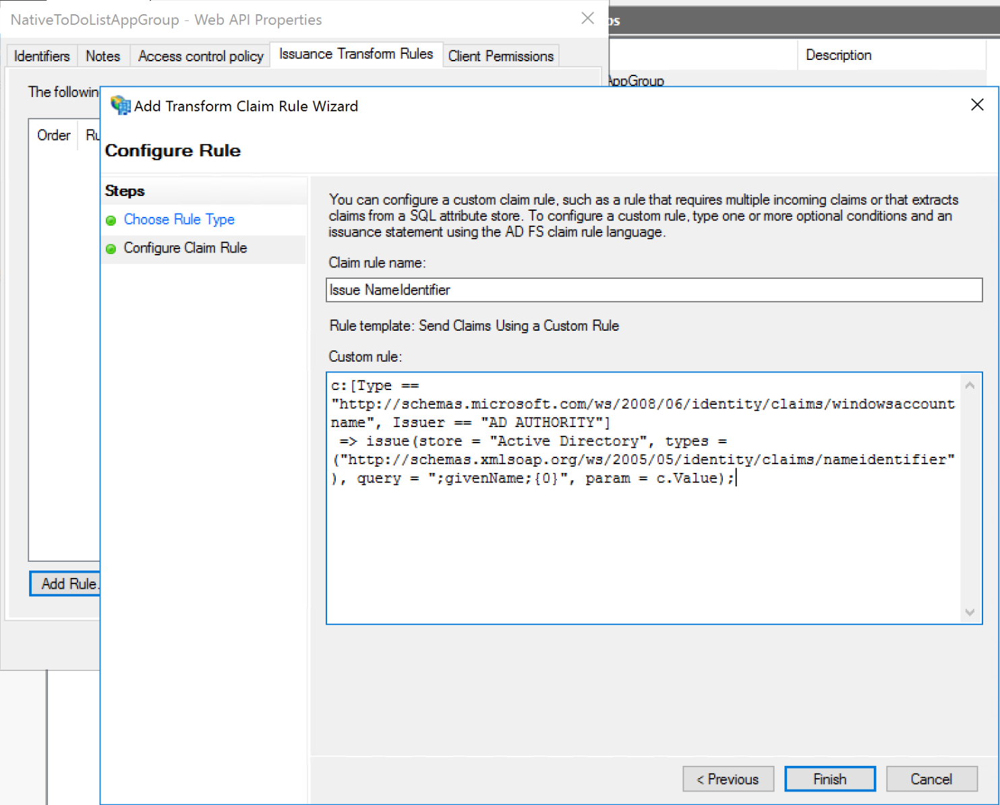
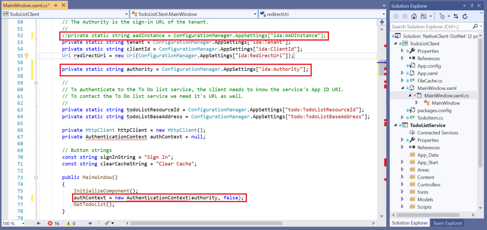
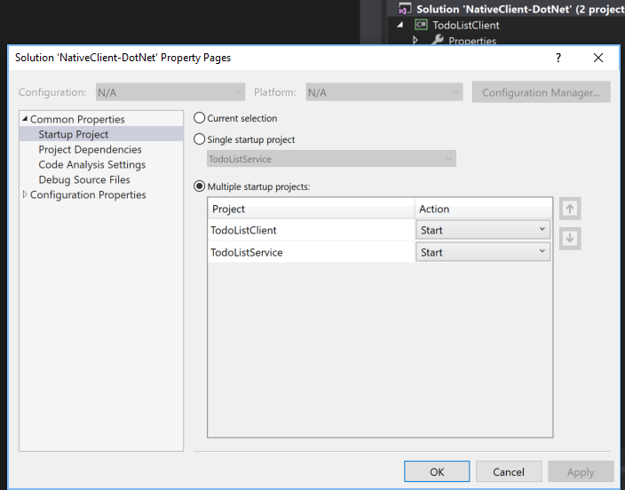
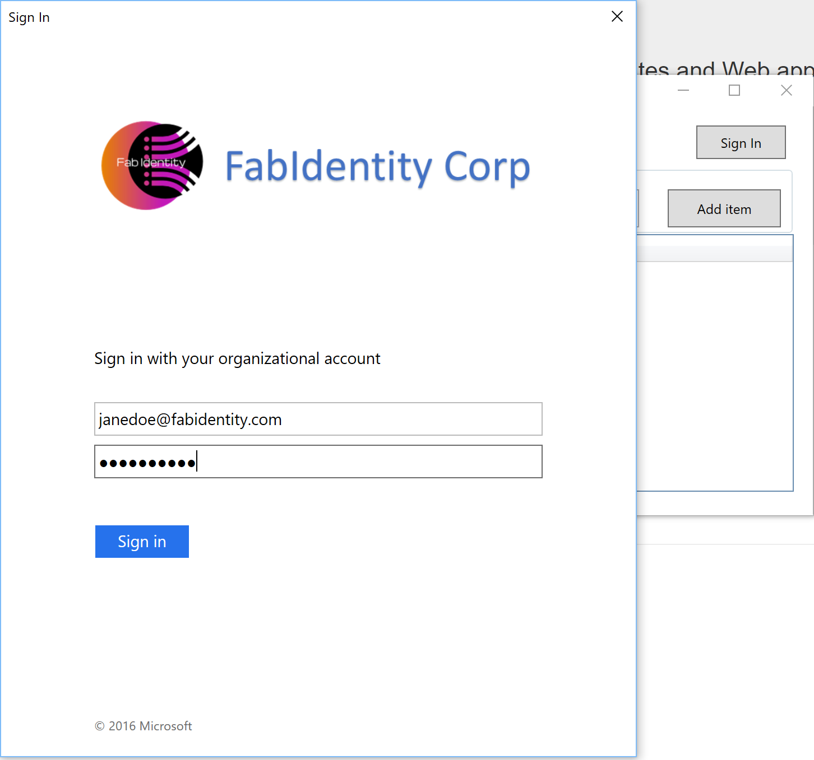
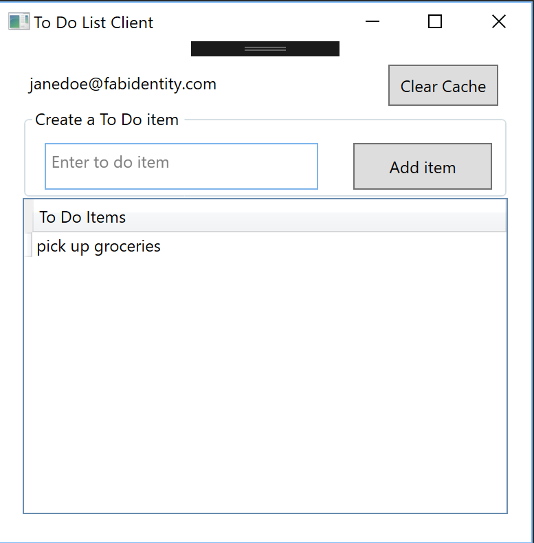

# Build a native client application using OAuth public clients with AD FS 2016 or later

## Overview

This article shows how to build a native application that interacts with a Web API protected by AD FS 2016 or later.

1. The .Net TodoListClient WPF application uses the Active Directory Authentication Library (ADAL) to obtain a JWT access token from Azure Active Directory (Azure AD) through the OAuth 2.0 protocol
2. The access token is used as a bearer token to authenticate the user when calling the /todolist endpoint of the TodoListService web API.
 We will be using the application example for Azure AD here and then modify it for AD FS 2016 or later.



## Pre-requisites
The following are a list of pre-requisites that are required prior to completing this document. This document assumes that AD FS has been installed and an AD FS farm has been created.

* GitHub client tools
* AD FS in Windows Server 2016 or later
* Visual Studio 2013 or later

## Creating the sample walkthrough

### Create the application group in AD FS

1. In AD FS Management, right-click on **Application Groups** and select **Add Application Group**.

2. On the Application Group Wizard, for the name enter any name you prefer, e.g. NativeToDoListAppGroup. Select the **Native application accessing a web API** template . Click **Next**.
 

3. On the **Native application** page, note the identifier generated by AD FS. This is the id with which AD FS will recognize the public client app. Copy the **Client Identifier** value. It will be used later as the value for **ida:ClientId** in the application code. If you wish you can give any custom identifier here. The redirect URI is any arbitrary value, example, put https://ToDoListClient


4. On the **Configure Web API** page, set the identifier value for the Web API. For this example, this should be the value of the **SSL URL** where the Web App is supposed to be running. You can get this value by clicking on the properties of the TooListServer project in the solution. This will be later used as the **todo:TodoListResourceId** value in **App.config** file of the native client application and also as the **todo:TodoListBaseAddress**.


5. Go through the **Apply Access Control Policy** and **Configure Application Permissions** with the default values in place. The summary page should look like below.


Click next and then complete the wizard.

### Add the NameIdentifier claim to the list of claims issued
The demo application uses the value in NameIdentifier claim at various places. Unlike Azure AD, AD FS does not issue a NameIdentifier claim by default. Therefore, we need to add a claim rule to issue the NameIdentifier claim so that the application can use the correct value. In this example, the given name of the user is issued as the NameIdentifier value for the user in the token.
To configure the claim rule, open the application group just created, and double click on the Web API. Select the Issuance Transform Rules tab and then click on Add Rule button. In the type of claim rule, choose Custom claim rule and then add the claim rule as shown below.

```
c:[Type == "https://schemas.microsoft.com/ws/2008/06/identity/claims/windowsaccountname", Issuer == "AD AUTHORITY"]
 => issue(store = "Active Directory", types = ("http://schemas.xmlsoap.org/ws/2005/05/identity/claims/nameidentifier"), query = ";givenName;{0}", param = c.Value);
```



### Modify the application code

This section discusses how to download the sample Web API and modify it in Visual Studio.   We will be using the Azure AD sample that is [here](https://github.com/Azure-Samples/active-directory-dotnet-native-desktop).

To download the sample project, use Git Bash and type the following:

```
git clone https://github.com/Azure-Samples/active-directory-dotnet-native-desktop
```

#### Modify ToDoListClient

This project in the solution represents the native client application. We need to make sure that the client application knows:

1. Where to go to get the user authenticated when required?
2. What is the ID that client needs to provide to the authenticating authority (AD FS)?
3. What is the ID of the resource that we are asking the access token for?
4. What is the base address of the Web API?

The following code changes are needed in order to get the above information to the native client application.

**App.config**

* Add the key **ida:Authority** with the value depicting the AD FS service. For example, https://fs.contoso.com/adfs/
* Modify **ida:ClientId** key with the value from **Client Identifier** in the **Native Application** page during the Application Group creation in AD FS. For example, 3f07368b-6efd-4f50-a330-d93853f4c855
* Modify the **todo:todo:TodoListResourceId** with the value from **Identifier** in the **Configure Web API** page during the Application Group creation in AD FS. For example, https://localhost:44321/
* Modify the **todo:TodoListBaseAddress** with the value from **Identifier** in the **Configure Web API** page during the Application Group creation in AD FS. For example, https://localhost:44321/
* Set the value of **ida:RedirectUri** with the value from **Redirect URI** in the **Native application** page during the Application Group creation in AD FS. For example, https://ToDoListClient
* For ease of reading you can remove / comment the key for **ida:Tenant** and **ida:AADInstance**.

  

**MainWindow.xaml.cs**

* Comment the line for aadInstance as below

    `// private static string aadInstance = ConfigurationManager.AppSettings["ida:AADInstance"];`

* Add the value for authority as below

    `private static string authority = ConfigurationManager.AppSettings["ida:Authority"];`

* Delete the line for creating the **authority** value from aadInstance and tenant

    `private static string authority = String.Format(CultureInfo.InvariantCulture, aadInstance, tenant);`

* In the function **MainWindow**, change the authContext instantiation to

   `authContext = new AuthenticationContext(authority,false);`

    ADAL does not support validating AD FS as authority and therefore we have to pass a false value flag for validateAuthority parameter.

  

#### Modify TodoListService
Two files need changes in this project – Web.config and Startup.Auth.cs. Web.Config changes are required to get the correct values of the parameters. Startup.Auth.cs changes are required to set the WebAPI to authenticate against AD FS rather than Azure AD.

**Web.config**

* Comment the key **ida:Tenant** as we don't need it
* Add the key for **ida:Authority** with value indicating the FQDN of the federation service, example, https://fs.contoso.com/adfs/
* Modify key **ida:Audience** with the value of the Web API identifier that you specified in the **Configure Web API** page during Add Application Group in AD FS.
* Add key **ida:AdfsMetadataEndpoint** with value corresponding to the federation metadata URL of the AD FS service, for ex: https://fs.contoso.com/federationmetadata/2007-06/federationmetadata.xml


**Startup.Auth.cs**

Modify the ConfigureAuth function as below

```
    public void ConfigureAuth(IAppBuilder app)
    {
        app.UseActiveDirectoryFederationServicesBearerAuthentication(
            new ActiveDirectoryFederationServicesBearerAuthenticationOptions
            {
                MetadataEndpoint = ConfigurationManager.AppSettings["ida:AdfsMetadataEndpoint"],
                TokenValidationParameters = new TokenValidationParameters()
                {
                    SaveSigninToken = true,
                    ValidAudience = ConfigurationManager.AppSettings["ida:Audience"]
                }

            });
    }
```

Essentially, we are configuring the authentication to use AD FS and further provide information about the AD FS metadata, and to validate the token, the audience claim should be the value expected by the Web API.
Running the application

1. On the solution NativeClient-DotNet, right click and go to properties. Change the Startup Project as shown below to Multiple Startup projects and set both TodoListClient and TodoListService to Start.


2.	Press F5 button or select Debug > Continue in the menu bar. This will launch both the native application and the WebAPI. Click on Sign-in button on the native application and it will pop-up an interactive logon from AD AL and redirect to your AD FS service. Enter the credentials of a valid user.


In this step, the native application redirected to AD FS and got an ID token and an access token for the Web API

3. Enter a to do item in the text box and click on Add item. In this step, the application reaches out to the Web API to add the to do item, and in order to do so, presents the access token to the WebAPI obtained from AD FS. The Web API matches the audience value to make sure the token is intended for it and verifies the token signature using the info from the federation metadata.



## Next Steps
[AD FS Development](../../ad-fs/AD-FS-Development.md)
