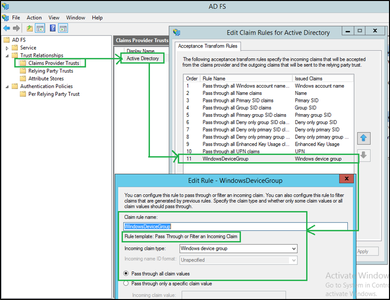
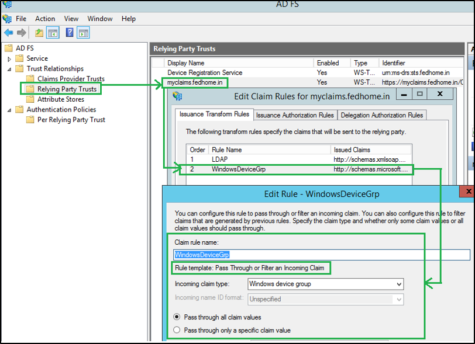
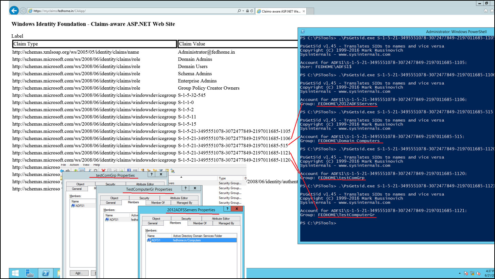

# Compound authentication and AD DS claims in AD FS
Windows Server 2012 enhances Kerberos authentication by introducing compound authentication.  Compound authentication enables a Kerberos Ticket-Granting Service (TGS) request to include two identities:

- the identity of the user
- the identity of the user's device.

Windows accomplishes compound authentication by extending [Kerberos Flexible Authentication Secure Tunneling (FAST), or Kerberos armoring](/previous-versions/windows/it-pro/windows-server-2012-R2-and-2012/hh831747(v=ws.11)).

AD FS 2012 and later versions allows consumption of AD DS issued user or device claims that reside in a Kerberos authentication ticket. In previous versions of AD FS, the claims engine could only read user and group security IDs (SIDs) from Kerberos but was not able to read any claims information contained within a Kerberos ticket.

You can enable richer access control for federated applications by using Active Directory Domain Services (AD DS)-issued user and device claims together, with Active Directory Federation Services (AD FS).

## Requirements
1.	The Computers accessing federated applications, must Authenticate to AD FS using **Windows Integrated Authentication**.
	- Windows Integrated Authentication is only available when connecting to the Backend AD FS Servers.
	- Computers must be able to reach the Backend AD FS Servers for Federation Service Name
	- AD FS Servers must offer Windows Integrated Authentication as a Primary Authentication method in its Intranet settings.

2.	The policy **Kerberos client support for claims compound authentication and Kerberos armoring** must be applied to all Computers accessing federated applications that are protected by Compound Authentication. This is applicable in case of single forest or cross forest scenarios.

3.	The Domain housing the AD FS Servers must have the **KDC support for claims compound authentication and Kerberos armoring** policy setting applied to the Domain Controllers.

## Steps for configuring AD FS in Windows Server 2012 R2
Use the following steps for configuring compound authentication and claims

### Step 1:  Enable KDC support for claims, compound authentication, and Kerberos armoring on the Default Domain Controller Policy
1.  In Server Manager, select Tools, **Group Policy Management**.
2.  Navigate down to the **Default Domain Controller Policy**, right-click and select **edit**.

3.  On the **Group Policy Management Editor**, under **Computer Configuration**, expand **Policies**, expand **Administrative Templates**, expand **System**, and select **KDC**.
4.  In the right pane, double-click **KDC support for claims, compound authentication, and Kerberos armoring**.

5.  In the new dialog window, set KDC support for claims to **Enabled**.
6.  Under Options, select **Supported** from the drop-down menu and then click **Apply** and **OK**.


### Step 2: Enable Kerberos client support for claims, compound authentication, and Kerberos armoring on computers accessing federated applications

1.	On a Group Policy applied to the computers accessing federated applications,  in the **Group Policy Management Editor**, under **Computer Configuration**, expand **Policies**, expand **Administrative Templates**, expand **System**, and select **Kerberos**.
2.	In the right pane of the Group Policy Management Editor window, double-click **Kerberos client support for claims, compound authentication, and Kerberos armoring.**
3.	In the new dialog window, set Kerberos client support to **Enabled** and click **Apply** and **OK**.

4.	Close the Group Policy Management Editor.

### Step 3: Ensure the AD FS servers have been updated.
You need to ensure that the following updates are installed on your AD FS servers.

|Update|Description|
|----- | ----- |
|[KB2919355](https://www.microsoft.com/download/details.aspx?id=42335)|Cumulative security update(includes KB2919355,KB2932046,KB2934018,KB2937592,KB2938439)|
|[KB2959977](https://www.microsoft.com/download/details.aspx?id=42530)|Update for Server 2012 R2|
|[Hotfix 3052122](https://support.microsoft.com/help/3052122/update-adds-support-for-compound-id-claims-in-ad-fs-tokens-in-windows)|This update adds support for compound ID claims in Active Directory Federation Services.|

### Step 4: Configure the Primary Authentication Provider

1. Set the Primary Authentication Provider to **Windows Authentication** for AD FS Intranet settings.
2. In AD FS Management, under **Authentication Policies**, select **Primary Authentication** and under **Global Settings** click **edit**.
3. On **Edit Global Authentication Policy** under **Intranet** select **Windows Authentication**.
4. Click **Apply** and **Ok**.

    

5. Using PowerShell you can use the **Set-AdfsGlobalAuthenticationPolicy** cmdlet.

``` powershell
Set-AdfsGlobalAuthenticationPolicy -PrimaryIntranetAuthenticationProvider 'WindowsAuthentication'
```
>[!NOTE]
>In a WID based farm, the PowerShell command must be executed on the Primary AD FS Server.
>In a SQL based farm, the PowerShell command may be executed on any AD FS server that is a member of the farm.

### Step 5:  Add the claim description to AD FS
1. Add the following Claim Description to the farm. This Claim Description is not present by default in ADFS 2012 R2 and needs to be manually added.
2. In AD FS Management, under **Service**, right-click **Claim description** and select **Add claim description**
3. Enter the following information in the claim description
   - Display Name: 'Windows device group'
   - Claim Description: '<https://schemas.microsoft.com/ws/2008/06/identity/claims/windowsdevicegroup>' `
4. Place a check in both boxes.
5. Click **OK**.

    

6. Using PowerShell you can use the **Add-AdfsClaimDescription** cmdlet.
   ``` powershell
   Add-AdfsClaimDescription -Name 'Windows device group' -ClaimType 'https://schemas.microsoft.com/ws/2008/06/identity/claims/windowsdevicegroup' `
   -ShortName 'windowsdevicegroup' -IsAccepted $true -IsOffered $true -IsRequired $false -Notes 'The windows group SID of the device'
   ```


>[!NOTE]
>In a WID based farm, the PowerShell command must be executed on the Primary AD FS Server.
>In a SQL based farm, the PowerShell command may be executed on any AD FS server that is a member of the farm.

### Step 6:  Enable the compound authentication bit on the msDS-SupportedEncryptionTypes attribute

1.	Enable compound authentication bit on the msDS-SupportedEncryptionTypes attribute on the account you designated to run the AD FS service using the **Set-ADServiceAccount** PowerShell cmdlet.

>[!NOTE]
>If you change the service account, then you must manually enable compound authentication by running the **Set-ADUser -compoundIdentitySupported:$true** Windows PowerShell cmdlets.

``` powershell
Set-ADServiceAccount -Identity “ADFS Service Account” -CompoundIdentitySupported:$true
```
2. Restart the ADFS Service.

>[!NOTE]
>Once ‘CompoundIdentitySupported' is set to true, installation of the same gMSA on new Servers (2012R2/2016) fails with the following error –
**Install-ADServiceAccount : Cannot install service account. Error Message: 'The provided context did not match the target.'**.
>
>**Solution**: Temporarily set CompoundIdentitySupported to $false. This step causes ADFS to stop issuing WindowsDeviceGroup claims.
Set-ADServiceAccount -Identity 'ADFS Service Account' -CompoundIdentitySupported:$false
Install the gMSA on the new Server and then enable CompoundIdentitySupported back to $True.
Disabling CompoundIdentitySupported and then reenabling does not need ADFS service to be restarted.

### Step 7: Update the AD FS Claims Provider Trust for Active Directory

1. Update the AD FS Claims Provider Trust for Active Directory to include the following ‘Pass-through' Claim rule for ‘WindowsDeviceGroup' Claim.
2.  In **AD FS Management**, click **Claims Provider Trusts** and in the right pane, righ-click **Active Directory** and select **Edit Claim Rules**.
3.  On the **Edit Claim Rules for Active Director** click **Add Rule**.
4.  On the **Add Transform Claim Rule Wizard** select **Pass Through or Filter an Incoming Claim** and click **Next**.
5.  Add a display name and select **Windows device group** from the **Incoming claim type** drop-down.
6.  Click **Finish**.  Click **Apply** and **Ok**.
    

### Step 8: On the Relying Party where the ‘WindowsDeviceGroup' claims are expected, add a similar ‘Pass-through' Or ‘Transform' claim rule.
2. In **AD FS Management**, click **Relying Party Trusts** and in the right pane, righ-click your RP and select **Edit Claim Rules**.
3. On the **Issuance Transform Rules** click **Add Rule**.
4. On the **Add Transform Claim Rule Wizard** select **Pass Through or Filter an Incoming Claim** and click **Next**.
5. Add a display name and select **Windows device group** from the **Incoming claim type** drop-down.
6. Click **Finish**.  Click **Apply** and **Ok**.
   


## Steps for configuring AD FS in Windows Server 2016
The following will detail the steps for configuring compound authentication on AD FS for Windows Server 2016.

### Step 1:  Enable KDC support for claims, compound authentication, and Kerberos armoring on the Default Domain Controller Policy
1.  In Server Manager, select Tools, **Group Policy Management**.
2.  Navigate down to the **Default Domain Controller Policy**, right-click and select **edit**.
3.  On the **Group Policy Management Editor**, under **Computer Configuration**, expand **Policies**, expand **Administrative Templates**, expand **System**, and select **KDC**.
4.  In the right pane, double-click **KDC support for claims, compound authentication, and Kerberos armoring**.
5.  In the new dialog window, set KDC support for claims to **Enabled**.
6.  Under Options, select **Supported** from the drop-down menu and then click **Apply** and **OK**.


### Step 2: Enable Kerberos client support for claims, compound authentication, and Kerberos armoring on computers accessing federated applications

1.	On a Group Policy applied to the computers accessing federated applications,  in the **Group Policy Management Editor**, under **Computer Configuration**, expand **Policies**, expand **Administrative Templates**, expand **System**, and select **Kerberos**.
2.	In the right pane of the Group Policy Management Editor window, double-click **Kerberos client support for claims, compound authentication, and Kerberos armoring.**
3.	In the new dialog window, set Kerberos client support to **Enabled** and click **Apply** and **OK**.
4.	Close the Group Policy Management Editor.

### Step 3: Configure the Primary Authentication Provider

1. Set the Primary Authentication Provider to **Windows Authentication** for AD FS Intranet settings.
2. In AD FS Management, under **Authentication Policies**, select **Primary Authentication** and under **Global Settings** click **edit**.
3. On **Edit Global Authentication Policy** under **Intranet** select **Windows Authentication**.
4. Click **Apply** and **Ok**.
5. Using PowerShell you can use the **Set-AdfsGlobalAuthenticationPolicy** cmdlet.

``` powershell
Set-AdfsGlobalAuthenticationPolicy -PrimaryIntranetAuthenticationProvider 'WindowsAuthentication'
```
>[!NOTE]
>In a WID based farm, the PowerShell command must be executed on the Primary AD FS Server.
>In a SQL based farm, the PowerShell command may be executed on any AD FS server that is a member of the farm.

### Step 4:  Enable the compound authentication bit on the msDS-SupportedEncryptionTypes attribute

1.	Enable compound authentication bit on the msDS-SupportedEncryptionTypes attribute on the account you designated to run the AD FS service using the **Set-ADServiceAccount** PowerShell cmdlet.

>[!NOTE]
>If you change the service account, then you must manually enable compound authentication by running the **Set-ADUser -compoundIdentitySupported:$true** Windows PowerShell cmdlets.

``` powershell
Set-ADServiceAccount -Identity “ADFS Service Account” -CompoundIdentitySupported:$true
```
2. Restart the ADFS Service.

>[!NOTE]
>Once ‘CompoundIdentitySupported' is set to true, installation of the same gMSA on new Servers (2012R2/2016) fails with the following error –
**Install-ADServiceAccount : Cannot install service account. Error Message: 'The provided context did not match the target.'**.
>
>**Solution**: Temporarily set CompoundIdentitySupported to $false. This step causes ADFS to stop issuing WindowsDeviceGroup claims.
Set-ADServiceAccount -Identity 'ADFS Service Account' -CompoundIdentitySupported:$false
Install the gMSA on the new Server and then enable CompoundIdentitySupported back to $True.
Disabling CompoundIdentitySupported and then reenabling does not need ADFS service to be restarted.

### Step 5: Update the AD FS Claims Provider Trust for Active Directory

1. Update the AD FS Claims Provider Trust for Active Directory to include the following ‘Pass-through' Claim rule for ‘WindowsDeviceGroup' Claim.
2.  In **AD FS Management**, click **Claims Provider Trusts** and in the right pane, righ-click **Active Directory** and select **Edit Claim Rules**.
3.  On the **Edit Claim Rules for Active Director** click **Add Rule**.
4.  On the **Add Transform Claim Rule Wizard** select **Pass Through or Filter an Incoming Claim** and click **Next**.
5.  Add a display name and select **Windows device group** from the **Incoming claim type** drop-down.
6.  Click **Finish**.  Click **Apply** and **Ok**.


### Step 6: On the Relying Party where the ‘WindowsDeviceGroup' claims are expected, add a similar ‘Pass-through' Or ‘Transform' claim rule.
2. In **AD FS Management**, click **Relying Party Trusts** and in the right pane, righ-click your RP and select **Edit Claim Rules**.
3. On the **Issuance Transform Rules** click **Add Rule**.
4. On the **Add Transform Claim Rule Wizard** select **Pass Through or Filter an Incoming Claim** and click **Next**.
5. Add a display name and select **Windows device group** from the **Incoming claim type** drop-down.
6. Click **Finish**.  Click **Apply** and **Ok**.

## Validation
To validate the release of ‘WindowsDeviceGroup' claims, create a test Claims Aware Application using .Net 4.6. With WIF SDK 4.0.
Configure the Application as a Relying Party in ADFS and update it with Claim Rule as specified in steps above.
When authenticating to the Application using Windows Integrated Authentication provider of ADFS, the following claims are casted.


The Claims for the computer/device may now be consumed for richer access controls.

For example – The following **AdditionalAuthenticationRules** Tells AD FS to invoke MFA if – The Authenticating User is not member of the security group “-1-5-21-2134745077-1211275016-3050530490-1117” AND the Computer (where is the user is Authenticating from) is not member of the security group "S-1-5-21-2134745077-1211275016-3050530490-1115 (WindowsDeviceGroup)"

However, if any of the above conditions are met, do not invoke MFA.

```
'NOT EXISTS([Type == "https://schemas.microsoft.com/ws/2008/06/identity/claims/windowsdevicegroup", Value =~ "S-1-5-21-2134745077-1211275016-3050530490-1115"])
&& NOT EXISTS([Type == "https://schemas.microsoft.com/ws/2008/06/identity/claims/groupsid", Value =~ "S-1-5-21-2134745077-1211275016-3050530490-1117"])
=> issue(Type = "https://schemas.microsoft.com/ws/2008/06/identity/claims/authenticationmethod", Value = "https://schemas.microsoft.com/claims/multipleauthn");'
```
