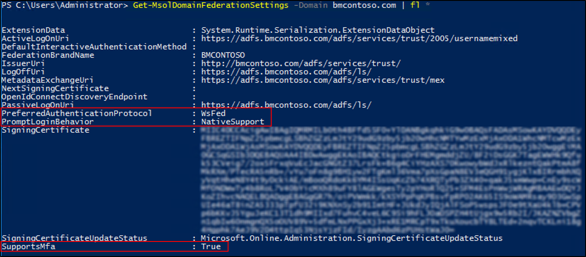

# Active Directory Federation Services prompt=login parameter support
The following document describes the native support for the prompt=login parameter that is available in AD FS.

## What is prompt=login?  

Some Office 365 applications (with modern authentication enabled) send the prompt=login parameter to Azure AD as part of each authentication request.  By default, Azure AD translates this into two parameters: <code><b>wauth</b>=urn:oasis:names:tc:SAML:1.0:am:password</code>, and <code><b>wfresh</b>=0</code>.

This can cause problems with corporate intranet and multi-factor authentication scenarios in which an authentication type other than username and password is desired.  

AD FS in Windows Server 2012 R2 with the July 2016 update rollup introduced native support for the prompt=login parameter.  This means, you now have the option of configuring Azure AD to send this parameter as-is to your AD FS service as part of Azure AD and Office 365 authentication requests.

### AD FS versions that support prompt=login
The following is a list of AD FS versions that support the prompt=login parameter.

- AD FS in Windows Server 2012 R2 with the July 2016 update rollup

- AD FS in Windows Server 2016

## How do to configure your Azure AD tenant to send prompt=login to AD FS

Use the Azure AD PowerShell module to configure the setting.

> [!NOTE]
> The prompt=login capability (enabled by the PromptLoginBehavior property) is currently available only in the [‘version 1.0’ Azure AD Powershell module](https://connect.microsoft.com/site1164/Downloads/DownloadDetails.aspx?DownloadID=59185), in which the cmdlets have names that include “Msol”, such as Set-MsolDomainFederationSettings.  It is not currently available via ‘version 2.0’ Azure AD PowerShell module, whose cmdlets have names like “Set-AzureAD\*”.

To configure prompt=login behavior, the cmdlet syntax below:

Example 1:
```powershell
    Set-MsolDomainFederationSettings –DomainName <your domain name> -PreferredAuthenticationProtocol <your current protocol setting> 
```

Example 2:
```powershell
    Set-MsolDomainFederationSettings –DomainName <your domain name> -SupportsMfa <$True|$False>
```

Example 3:
```powershell
    Set-MsolDomainFederationSettings –DomainName <your domain name> -PromptLoginBehavior <TranslateToFreshPasswordAuth|NativeSupport|Disabled>
```

 
 The PreferredAuthenticationProtocol, SupportsMfa, and PromptLoginBehavior property values can be found by viewing the output from the cmdlet:

```powershell
    Get-MsolDomainFederationSettings -DomainName <your_domain_name> | fl *
 ```
> [!NOTE]
> By default, when running Get-MsolDomainFederationSettings, certain properties are not displayed in the console.  To view these parameters it is recommended that you use the | fl * to force the output of all of the properties of the object.


The following is more information about the PromptLoginBehavior paramter and its settings.
   
   - <b>TranslateToFreshPasswordAuth</b> means the default Azure AD behavior of sending <b>wauth</b> and <b>wfresh</b> to AD FS instead of prompt=login
   - <b>NativeSupport</b> means that the prompt=login parameter will be sent as is to AD FS
   - <b>Disabled</b> means nothing will be sent to AD FS

