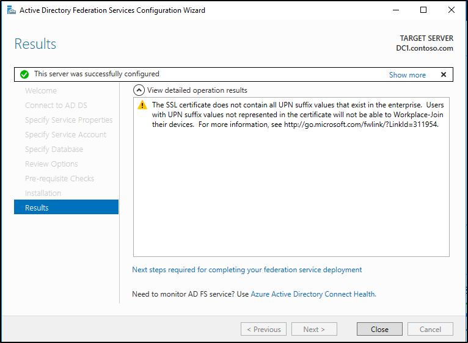
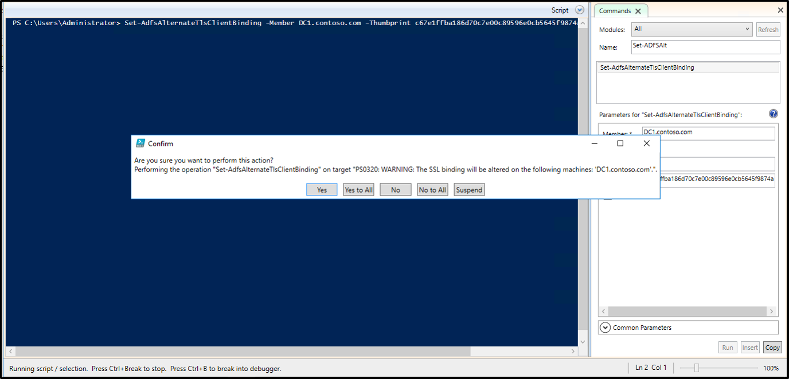

# AD FS support for alternate hostname binding for certificate authentication

Applies to: Windows Server 2016 and later

On many networks, the local firewall policies may not allow traffic through nonstandard ports like 49443. Nonstandard ports created issue when trying to accomplish certificate authentication with AD FS prior to Windows Server 2016 because different bindings for device authentication and user certificate authentication on the same host isn't possible. Prior to Windows Server 2016, default port 443 is bound to receive device certificates and can't be altered to support multiple binding in the same channel. Smart card authentication doesn't work and there's no notification to users explaining the cause.

## AD FS in Windows Server supports alternate host name binding

AD FS in Windows Server provides support for alternate host name binding. Two modes are supported. The first mode uses the same host (that is, adfs.contoso.com) with different ports (443, 49443). The second mode uses different hosts (adfs.contoso.com and certauth.adfs.contoso.com) with the same port (443). The second mode requires an TLS/SSL certificate to support "certauth.\<adfs-service-name>" as an alternate subject name. Alternate host name binding can be configured at the time of the farm creation or later via PowerShell.

## How to configure alternate host name binding for certificate authentication

There are two ways you can add the alternate host name binding for certificate authentication.

- When setting up a new AD FS farm with AD FS for Windows Server 2016, if the certificate contains a subject alternative name (SAN), it's automatically set up to use the second mode mentioned in the preceding section. Meaning it automatically sets up two different hosts (sts.contoso.com and certauth.sts.contoso.com) with the same port.

If the certificate doesn't contain a SAN, you see a warning telling you that certificate subject alternative names doesn't support certauth.*. See the following screenshots. The first screenshot shows an installation where the certificate contains a SAN. The second screenshot shows a certificate that didn't contain a SAN.




- After AD FS in Windows Server has been deployed, you can use the PowerShell cmdlet `Set-AdfsAlternateTlsClientBinding` to add the alternate host name binding for certificate authentication. For more information, see [Set-AdfsAlternateTlsClientBinding](/powershell/module/adfs/set-adfsalternatetlsclientbinding).

```powershell
Set-AdfsAlternateTlsClientBinding -Member ADFS1.contoso.com -Thumbprint '<thumbprint of cert>'
```

When prompted, select Yes to confirm.



## Related links

- [Managing SSL Certificates in AD FS and WAP in Windows Server 2016](./manage-ssl-certificates-ad-fs-wap.md)
