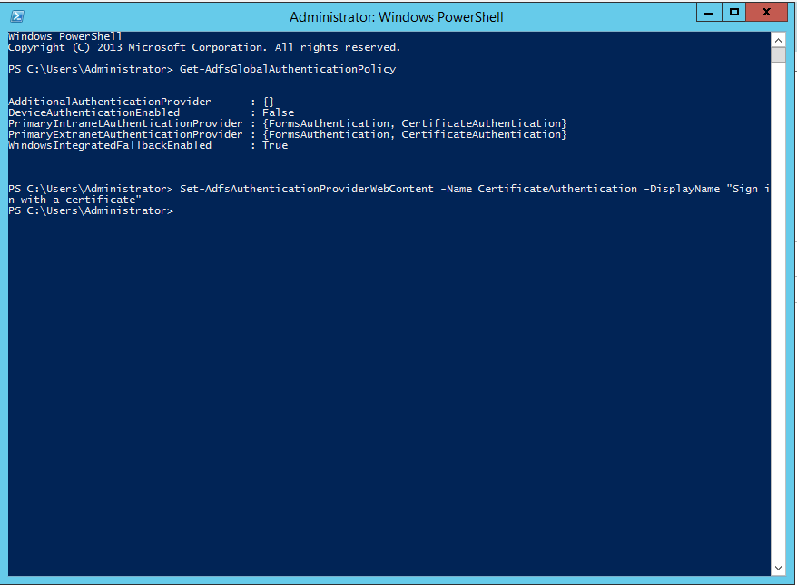
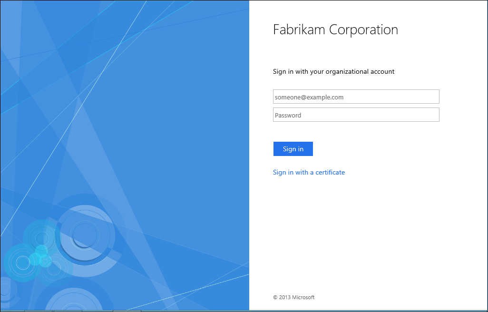

---
ms.assetid: 309d6358-777d-496a-856d-728246c7d9a1
title: Customize the display names and descriptions for authentication methods
description:
author: billmath
ms.author: billmath
manager: femila
ms.date: 08/31/2016
ms.topic: article
ms.prod: windows-server-threshold
ms.service: active-directory
ms.technology: identity-adfs
---
# Customize the display names and descriptions for authentication methods 

>Applies To: Windows Server 2016, Windows Server 2012 R2

To customize the display names and descriptions for authentication methods you can use the `Set-AdfsAuthenticationProviderWebContent` PowerShell cmdlt.  In order to use this cmdlt, you must first obtain the name of the authentication method you wish to customize.  This can be done using `Get-AdfsGlobalAuthenticationPolicy`.  In the example below we see that, on our sign\-in page, the following is displayed:  “Sign in using an X.509 certificate”.  We want to simplify this for our users.  
  
  
  
So first we get the name of the authentication method and then we edit the displayed text.  
  
 
    Get-AdfsGlobalAuthenticationPolicy  
      
    AdditionalAuthenticationProvider  : {}  
    DeviceAuthenticationEnabled   : False  
    PrimaryIntranetAuthenticationProvider : {FormsAuthentication, CertificateAuthentication}  
    PrimaryExtranetAuthenticationProvider : {FormsAuthentication, CertificateAuthentication}  
    WindowsIntegratedFallbackEnabled  : True  
      
    Set-AdfsAuthenticationProviderWebContent -Name CertificateAuthentication -DisplayName "Sign in with a certificate"  
  
  
  
  
Now we see that our display message has changed.  
  
  

## Additional references 
[AD FS User Sign-in Customization](AD-FS-user-sign-in-customization.md) 
