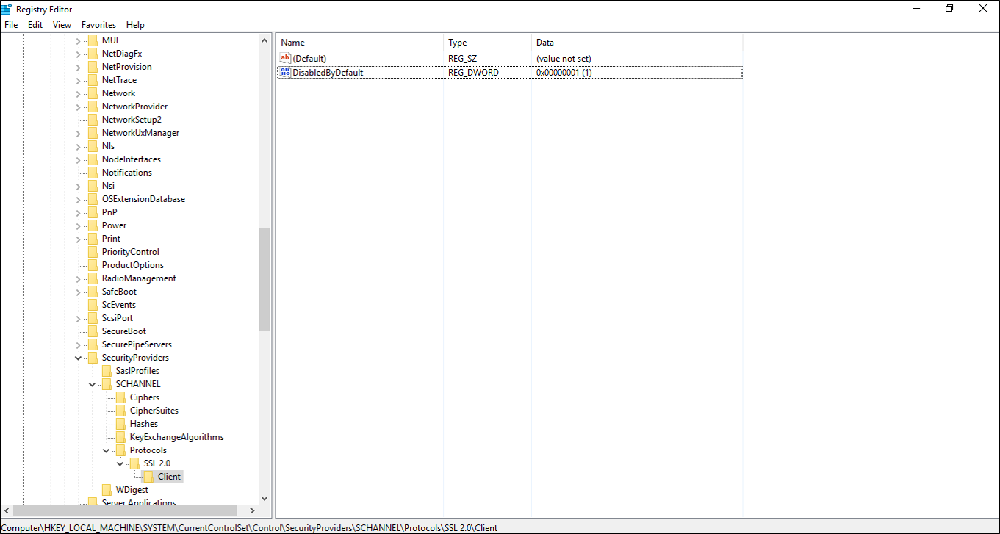
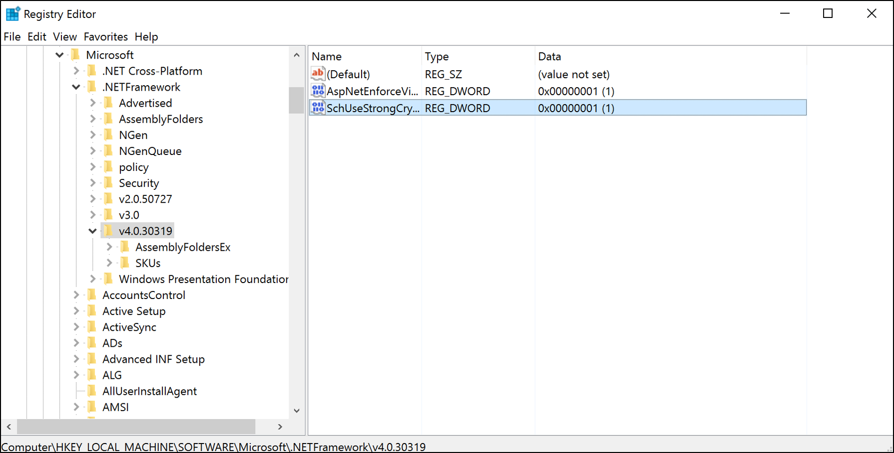

# Managing SSL/TLS Protocols and Cipher Suites for AD FS
The following documentation provides information on how to disable and enable certain TLS/SSL protocols and cipher suites that are used by AD FS

## TLS/SSL, SChannel and Cipher Suites in AD FS

The Transport Layer Security (TLS) and Secure Sockets Layer (SSL) are protocols that provide for secure communications.  Active Directory Federation Services uses these protocols for communications.  Today several versions of these protocols exist.

Schannel is a Security Support Provider (SSP) that implements the SSL, TLS and DTLS Internet standard authentication protocols. The Security Support Provider Interface (SSPI) is an API used by Windows systems to perform security-related functions including authentication. The SSPI functions as a common interface to several Security Support Providers (SSPs), including the Schannel SSP.

A cipher suite is a set of cryptographic algorithms. The schannel SSP implementation of the TLS/SSL protocols use algorithms from a cipher suite to create keys and encrypt information. A cipher suite specifies one algorithm for each of the following tasks:

- Key exchange
- Bulk encryption
- Message authentication

AD FS uses Schannel.dll to perform its secure communications interactions.  Currently AD FS supports all of the protocols and cipher suites that are supported by Schannel.dll.

## Managing the TLS/SSL Protocols and Cipher Suites
> [!IMPORTANT]
> This section contains steps that tell you how to modify the registry. However, serious problems might occur if you modify the registry incorrectly. Therefore, make sure that you follow these steps carefully.
>
> Be aware that changing the default security settings for SCHANNEL could break or prevent communications between certain clients and servers.  This will occur if secure communication is required and they do not have a protocol to negotiate communications with.
>
> If you are applying these changes, they must be applied to all of your AD FS servers in your farm.  After applying these changes a reboot is required.

In today's day and age, hardening your servers and removing older or weak cipher suites is becoming a major priority for many organizations.  Software suites are available that will test your servers and provide detailed information on these protocols and suites.  In order to remain compliant or achieve secure ratings, removing or disabling weaker protocols or cipher suites has become a must.  The remainder of this document will provide guidance on how to enable or disable certain protocols and cipher suites.

The registry keys below are located in the same location:  HKEY_LOCAL_MACHINE\SYSTEM\CurrentControlSet\Control\SecurityProviders\SCHANNEL\Protocols.  Use regedit or PowerShell to enable or disable these protocols and cipher suites.



## Enable and Disable SSL 2.0
Use the following registry keys and their values to enable and disable SSL 2.0.

### Enable SSL 2.0
- [HKEY_LOCAL_MACHINE\SYSTEM\CurrentControlSet\Control\SecurityProviders\SCHANNEL\Protocols\SSL 2.0\Server] "Enabled"=dword:00000001
- [HKEY_LOCAL_MACHINE\SYSTEM\CurrentControlSet\Control\SecurityProviders\SCHANNEL\Protocols\SSL 2.0\Server] "DisabledByDefault"=dword:00000000
- [HKEY_LOCAL_MACHINE\SYSTEM\CurrentControlSet\Control\SecurityProviders\SCHANNEL\Protocols\SSL 2.0\Client] "Enabled"=dword:00000001
- [HKEY_LOCAL_MACHINE\SYSTEM\CurrentControlSet\Control\SecurityProviders\SCHANNEL\Protocols\SSL 2.0\Client] "DisabledByDefault"=dword:00000000

### Disable SSL 2.0
- [HKEY_LOCAL_MACHINE\SYSTEM\CurrentControlSet\Control\SecurityProviders\SCHANNEL\Protocols\SSL 2.0\Server] "Enabled"=dword:00000000
- [HKEY_LOCAL_MACHINE\SYSTEM\CurrentControlSet\Control\SecurityProviders\SCHANNEL\Protocols\SSL 2.0\Server] "DisabledByDefault"=dword:00000001
- [HKEY_LOCAL_MACHINE\SYSTEM\CurrentControlSet\Control\SecurityProviders\SCHANNEL\Protocols\SSL 2.0\Client] "Enabled"=dword:00000000
- [HKEY_LOCAL_MACHINE\SYSTEM\CurrentControlSet\Control\SecurityProviders\SCHANNEL\Protocols\SSL 2.0\Client] "DisabledByDefault"=dword:00000001

### Using PowerShell to disable SSL 2.0

``` powershell
New-Item 'HKLM:\SYSTEM\CurrentControlSet\Control\SecurityProviders\SCHANNEL\Protocols\SSL 2.0\Server' -Force | Out-Null

New-ItemProperty -path 'HKLM:\SYSTEM\CurrentControlSet\Control\SecurityProviders\SCHANNEL\Protocols\SSL 2.0\Server' -name 'Enabled' -value '0' -PropertyType 'DWord' -Force | Out-Null

New-ItemProperty -path 'HKLM:\SYSTEM\CurrentControlSet\Control\SecurityProviders\SCHANNEL\Protocols\SSL 2.0\Server' -name 'DisabledByDefault' -value 1 -PropertyType 'DWord' -Force | Out-Null

New-Item 'HKLM:\SYSTEM\CurrentControlSet\Control\SecurityProviders\SCHANNEL\Protocols\SSL 2.0\Client' -Force | Out-Null

New-ItemProperty -path 'HKLM:\SYSTEM\CurrentControlSet\Control\SecurityProviders\SCHANNEL\Protocols\SSL 2.0\Client' -name 'Enabled' -value '0' -PropertyType 'DWord' -Force | Out-Null

New-ItemProperty -path 'HKLM:\SYSTEM\CurrentControlSet\Control\SecurityProviders\SCHANNEL\Protocols\SSL 2.0\Client' -name 'DisabledByDefault' -value 1 -PropertyType 'DWord' -Force | Out-Null
Write-Host 'SSL 2.0 has been disabled.'
```

## Enable and Disable SSL 3.0
Use the following registry keys and their values to enable and disable SSL 3.0.

### Enable SSL 3.0
- [HKEY_LOCAL_MACHINE\SYSTEM\CurrentControlSet\Control\SecurityProviders\SCHANNEL\Protocols\SSL 3.0\Server] "Enabled"=dword:00000001
- [HKEY_LOCAL_MACHINE\SYSTEM\CurrentControlSet\Control\SecurityProviders\SCHANNEL\Protocols\SSL 3.0\Server] "DisabledByDefault"=dword:00000000
- [HKEY_LOCAL_MACHINE\SYSTEM\CurrentControlSet\Control\SecurityProviders\SCHANNEL\Protocols\SSL 3.0\Client] "Enabled"=dword:00000001
- [HKEY_LOCAL_MACHINE\SYSTEM\CurrentControlSet\Control\SecurityProviders\SCHANNEL\Protocols\SSL 3.0\Client] "DisabledByDefault"=dword:00000000

### Disable SSL 3.0
- [HKEY_LOCAL_MACHINE\SYSTEM\CurrentControlSet\Control\SecurityProviders\SCHANNEL\Protocols\SSL 3.0\Server] "Enabled"=dword:00000000
- [HKEY_LOCAL_MACHINE\SYSTEM\CurrentControlSet\Control\SecurityProviders\SCHANNEL\Protocols\SSL 3.0\Server] "DisabledByDefault"=dword:00000001
- [HKEY_LOCAL_MACHINE\SYSTEM\CurrentControlSet\Control\SecurityProviders\SCHANNEL\Protocols\SSL 3.0\Client] "Enabled"=dword:00000000
- [HKEY_LOCAL_MACHINE\SYSTEM\CurrentControlSet\Control\SecurityProviders\SCHANNEL\Protocols\SSL 3.0\Client] "DisabledByDefault"=dword:00000001

### Using PowerShell to disable SSL 3.0

```powershell
	New-Item 'HKLM:\SYSTEM\CurrentControlSet\Control\SecurityProviders\SCHANNEL\Protocols\SSL 3.0\Server' -Force | Out-Null

	New-ItemProperty -path 'HKLM:\SYSTEM\CurrentControlSet\Control\SecurityProviders\SCHANNEL\Protocols\SSL 3.0\Server' -name 'Enabled' -value '0' -PropertyType 'DWord' -Force | Out-Null

	New-ItemProperty -path 'HKLM:\SYSTEM\CurrentControlSet\Control\SecurityProviders\SCHANNEL\Protocols\SSL 3.0\Server' -name 'DisabledByDefault' -value 1 -PropertyType 'DWord' -Force | Out-Null

	New-Item 'HKLM:\SYSTEM\CurrentControlSet\Control\SecurityProviders\SCHANNEL\Protocols\SSL 3.0\Client' -Force | Out-Null

	New-ItemProperty -path 'HKLM:\SYSTEM\CurrentControlSet\Control\SecurityProviders\SCHANNEL\Protocols\SSL 3.0\Client' -name 'Enabled' -value '0' -PropertyType 'DWord' -Force | Out-Null

	New-ItemProperty -path 'HKLM:\SYSTEM\CurrentControlSet\Control\SecurityProviders\SCHANNEL\Protocols\SSL 3.0\Client' -name 'DisabledByDefault' -value 1 -PropertyType 'DWord' -Force | Out-Null
	Write-Host 'SSL 3.0 has been disabled.'
```

## Enable and Disable TLS 1.0
Use the following registry keys and their values to enable and disable TLS 1.0.

> [!IMPORTANT]
> Disabling TLS 1.0 will break the WAP to AD FS trust.  If you disable TLS 1.0 you should enable strong auth for your applications.  See [Enable Strong Authentication](#enabling-strong-authentication-for-net-applications)


### Enable TLS 1.0
- [HKEY_LOCAL_MACHINE\SYSTEM\CurrentControlSet\Control\SecurityProviders\SCHANNEL\Protocols\TLS 1.0\Server] "Enabled"=dword:00000001
- [HKEY_LOCAL_MACHINE\SYSTEM\CurrentControlSet\Control\SecurityProviders\SCHANNEL\Protocols\TLS 1.0\Server] "DisabledByDefault"=dword:00000000
- [HKEY_LOCAL_MACHINE\SYSTEM\CurrentControlSet\Control\SecurityProviders\SCHANNEL\Protocols\TLS 1.0\Client] "Enabled"=dword:00000001
- [HKEY_LOCAL_MACHINE\SYSTEM\CurrentControlSet\Control\SecurityProviders\SCHANNEL\Protocols\TLS 1.0\Client] "DisabledByDefault"=dword:00000000

### Disable TLS 1.0
- [HKEY_LOCAL_MACHINE\SYSTEM\CurrentControlSet\Control\SecurityProviders\SCHANNEL\Protocols\TLS 1.0\Server] "Enabled"=dword:00000000
- [HKEY_LOCAL_MACHINE\SYSTEM\CurrentControlSet\Control\SecurityProviders\SCHANNEL\Protocols\TLS 1.0\Server] "DisabledByDefault"=dword:00000001
- [HKEY_LOCAL_MACHINE\SYSTEM\CurrentControlSet\Control\SecurityProviders\SCHANNEL\Protocols\TLS 1.0\Client] "Enabled"=dword:00000000
- [HKEY_LOCAL_MACHINE\SYSTEM\CurrentControlSet\Control\SecurityProviders\SCHANNEL\Protocols\TLS 1.0\Client] "DisabledByDefault"=dword:00000001

### Using PowerShell to disable TLS 1.0

```powershell
	New-Item 'HKLM:\SYSTEM\CurrentControlSet\Control\SecurityProviders\SCHANNEL\Protocols\TLS 1.0\Server' -Force | Out-Null

	New-ItemProperty -path 'HKLM:\SYSTEM\CurrentControlSet\Control\SecurityProviders\SCHANNEL\Protocols\TLS 1.0\Server' -name 'Enabled' -value '0' -PropertyType 'DWord' -Force | Out-Null

	New-ItemProperty -path 'HKLM:\SYSTEM\CurrentControlSet\Control\SecurityProviders\SCHANNEL\Protocols\TLS 1.0\Server' -name 'DisabledByDefault' -value 1 -PropertyType 'DWord' -Force | Out-Null

	New-Item 'HKLM:\SYSTEM\CurrentControlSet\Control\SecurityProviders\SCHANNEL\Protocols\TLS 1.0\Client' -Force | Out-Null

	New-ItemProperty -path 'HKLM:\SYSTEM\CurrentControlSet\Control\SecurityProviders\SCHANNEL\Protocols\TLS 1.0\Client' -name 'Enabled' -value '0' -PropertyType 'DWord' -Force | Out-Null

	New-ItemProperty -path 'HKLM:\SYSTEM\CurrentControlSet\Control\SecurityProviders\SCHANNEL\Protocols\TLS 1.0\Client' -name 'DisabledByDefault' -value 1 -PropertyType 'DWord' -Force | Out-Null
	Write-Host 'TLS 1.0 has been disabled.'
```


## Enable and Disable TLS 1.1
Use the following registry keys and their values to enable and disable TLS 1.1.

### Enable TLS 1.1
- [HKEY_LOCAL_MACHINE\SYSTEM\CurrentControlSet\Control\SecurityProviders\SCHANNEL\Protocols\TLS 1.1\Server] "Enabled"=dword:00000001
- [HKEY_LOCAL_MACHINE\SYSTEM\CurrentControlSet\Control\SecurityProviders\SCHANNEL\Protocols\TLS 1.1\Server] "DisabledByDefault"=dword:00000000
- [HKEY_LOCAL_MACHINE\SYSTEM\CurrentControlSet\Control\SecurityProviders\SCHANNEL\Protocols\TLS 1.1\Client] "Enabled"=dword:00000001
- [HKEY_LOCAL_MACHINE\SYSTEM\CurrentControlSet\Control\SecurityProviders\SCHANNEL\Protocols\TLS 1.1\Client] "DisabledByDefault"=dword:00000000

### Disable TLS 1.1
- [HKEY_LOCAL_MACHINE\SYSTEM\CurrentControlSet\Control\SecurityProviders\SCHANNEL\Protocols\TLS 1.1\Server] "Enabled"=dword:00000000
- [HKEY_LOCAL_MACHINE\SYSTEM\CurrentControlSet\Control\SecurityProviders\SCHANNEL\Protocols\TLS 1.1\Server] "DisabledByDefault"=dword:00000001
- [HKEY_LOCAL_MACHINE\SYSTEM\CurrentControlSet\Control\SecurityProviders\SCHANNEL\Protocols\TLS 1.1\Client] "Enabled"=dword:00000000
- [HKEY_LOCAL_MACHINE\SYSTEM\CurrentControlSet\Control\SecurityProviders\SCHANNEL\Protocols\TLS 1.1\Client] "DisabledByDefault"=dword:00000001

### Using PowerShell to disable TLS 1.1

``` powershell
	New-Item 'HKLM:\SYSTEM\CurrentControlSet\Control\SecurityProviders\SCHANNEL\Protocols\TLS 1.1\Server' -Force | Out-Null

	New-ItemProperty -path 'HKLM:\SYSTEM\CurrentControlSet\Control\SecurityProviders\SCHANNEL\Protocols\TLS 1.1\Server' -name 'Enabled' -value '0' -PropertyType 'DWord' -Force | Out-Null

	New-ItemProperty -path 'HKLM:\SYSTEM\CurrentControlSet\Control\SecurityProviders\SCHANNEL\Protocols\TLS 1.1\Server' -name 'DisabledByDefault' -value 1 -PropertyType 'DWord' -Force | Out-Null

	New-Item 'HKLM:\SYSTEM\CurrentControlSet\Control\SecurityProviders\SCHANNEL\Protocols\TLS 1.1\Client' -Force | Out-Null

	New-ItemProperty -path 'HKLM:\SYSTEM\CurrentControlSet\Control\SecurityProviders\SCHANNEL\Protocols\TLS 1.1\Client' -name 'Enabled' -value '0' -PropertyType 'DWord' -Force | Out-Null

	New-ItemProperty -path 'HKLM:\SYSTEM\CurrentControlSet\Control\SecurityProviders\SCHANNEL\Protocols\TLS 1.1\Client' -name 'DisabledByDefault' -value 1 -PropertyType 'DWord' -Force | Out-Null
	Write-Host 'TLS 1.1 has been disabled.'
```

## Enable and Disable TLS 1.2

Use the following registry keys and their values to enable and disable TLS 1.2.

### Enable TLS 1.2
- [HKEY_LOCAL_MACHINE\SYSTEM\CurrentControlSet\Control\SecurityProviders\SCHANNEL\Protocols\TLS 1.2\Server] "Enabled"=dword:00000001
- [HKEY_LOCAL_MACHINE\SYSTEM\CurrentControlSet\Control\SecurityProviders\SCHANNEL\Protocols\TLS 1.2\Server] "DisabledByDefault"=dword:00000000
- [HKEY_LOCAL_MACHINE\SYSTEM\CurrentControlSet\Control\SecurityProviders\SCHANNEL\Protocols\TLS 1.2\Client] "Enabled"=dword:00000001
- [HKEY_LOCAL_MACHINE\SYSTEM\CurrentControlSet\Control\SecurityProviders\SCHANNEL\Protocols\TLS 1.2\Client] "DisabledByDefault"=dword:00000000

### Disable TLS 1.2
- [HKEY_LOCAL_MACHINE\SYSTEM\CurrentControlSet\Control\SecurityProviders\SCHANNEL\Protocols\TLS 1.2\Server] "Enabled"=dword:00000000
- [HKEY_LOCAL_MACHINE\SYSTEM\CurrentControlSet\Control\SecurityProviders\SCHANNEL\Protocols\TLS 1.2\Server] "DisabledByDefault"=dword:00000001
- [HKEY_LOCAL_MACHINE\SYSTEM\CurrentControlSet\Control\SecurityProviders\SCHANNEL\Protocols\TLS 1.2\Client] "Enabled"=dword:00000000
- [HKEY_LOCAL_MACHINE\SYSTEM\CurrentControlSet\Control\SecurityProviders\SCHANNEL\Protocols\TLS 1.2\Client] "DisabledByDefault"=dword:00000001

### Using PowerShell to disable TLS 1.2

```powershell
	New-Item 'HKLM:\SYSTEM\CurrentControlSet\Control\SecurityProviders\SCHANNEL\Protocols\TLS 1.2\Server' -Force | Out-Null

	New-ItemProperty -path 'HKLM:\SYSTEM\CurrentControlSet\Control\SecurityProviders\SCHANNEL\Protocols\TLS 1.2\Server' -name 'Enabled' -value '0' -PropertyType 'DWord' -Force | Out-Null

	New-ItemProperty -path 'HKLM:\SYSTEM\CurrentControlSet\Control\SecurityProviders\SCHANNEL\Protocols\TLS 1.2\Server' -name 'DisabledByDefault' -value 1 -PropertyType 'DWord' -Force | Out-Null

	New-Item 'HKLM:\SYSTEM\CurrentControlSet\Control\SecurityProviders\SCHANNEL\Protocols\TLS 1.2\Client' -Force | Out-Null

	New-ItemProperty -path 'HKLM:\SYSTEM\CurrentControlSet\Control\SecurityProviders\SCHANNEL\Protocols\TLS 1.2\Client' -name 'Enabled' -value '0' -PropertyType 'DWord' -Force | Out-Null

	New-ItemProperty -path 'HKLM:\SYSTEM\CurrentControlSet\Control\SecurityProviders\SCHANNEL\Protocols\TLS 1.2\Client' -name 'DisabledByDefault' -value 1 -PropertyType 'DWord' -Force | Out-Null
	Write-Host 'TLS 1.2 has been disabled.'
```

## Enable and Disable RC4

Use the following registry keys and their values to enable and disable RC4.  This cipher suite's registry keys are located here:

- HKEY_LOCAL_MACHINE\SYSTEM\CurrentControlSet\Control\SecurityProviders\SCHANNEL\Ciphers\


### Enable RC4

- [HKEY_LOCAL_MACHINE\SYSTEM\CurrentControlSet\Control\SecurityProviders\SCHANNEL\Ciphers\RC4 128/128] "Enabled"=dword:00000001
- [HKEY_LOCAL_MACHINE\SYSTEM\CurrentControlSet\Control\SecurityProviders\SCHANNEL\Ciphers\RC4 40/128] "Enabled"=dword:00000001
- [HKEY_LOCAL_MACHINE\SYSTEM\CurrentControlSet\Control\SecurityProviders\SCHANNEL\Ciphers\RC4 56/128] "Enabled"=dword:00000001

### Disable RC4

- [HKEY_LOCAL_MACHINE\SYSTEM\CurrentControlSet\Control\SecurityProviders\SCHANNEL\Ciphers\RC4 128/128] "Enabled"=dword:00000000
- [HKEY_LOCAL_MACHINE\SYSTEM\CurrentControlSet\Control\SecurityProviders\SCHANNEL\Ciphers\RC4 40/128] "Enabled"=dword:00000000
- [HKEY_LOCAL_MACHINE\SYSTEM\CurrentControlSet\Control\SecurityProviders\SCHANNEL\Ciphers\RC4 56/128] "Enabled"=dword:00000000

### Using PowerShell

```powershell
	([Microsoft.Win32.RegistryKey]::OpenRemoteBaseKey([Microsoft.Win32.RegistryHive]::LocalMachine,$env:COMPUTERNAME)).CreateSubKey('SYSTEM\CurrentControlSet\Control\SecurityProviders\SCHANNEL\Ciphers\RC4 128/128')
	New-ItemProperty -path 'HKLM:\SYSTEM\CurrentControlSet\Control\SecurityProviders\SCHANNEL\Ciphers\RC4 128/128' -name 'Enabled' -value '0' -PropertyType 'DWord' -Force | Out-Null

	([Microsoft.Win32.RegistryKey]::OpenRemoteBaseKey([Microsoft.Win32.RegistryHive]::LocalMachine,$env:COMPUTERNAME)).CreateSubKey('SYSTEM\CurrentControlSet\Control\SecurityProviders\SCHANNEL\Ciphers\RC4 40/128')
	New-ItemProperty -path 'HKLM:\SYSTEM\CurrentControlSet\Control\SecurityProviders\SCHANNEL\Ciphers\RC4 40/128' -name 'Enabled' -value '0' -PropertyType 'DWord' -Force | Out-Null

	([Microsoft.Win32.RegistryKey]::OpenRemoteBaseKey([Microsoft.Win32.RegistryHive]::LocalMachine,$env:COMPUTERNAME)).CreateSubKey('SYSTEM\CurrentControlSet\Control\SecurityProviders\SCHANNEL\Ciphers\RC4 56/128')
	New-ItemProperty -path 'HKLM:\SYSTEM\CurrentControlSet\Control\SecurityProviders\SCHANNEL\Ciphers\RC4 56/128' -name 'Enabled' -value '0' -PropertyType 'DWord' -Force | Out-Null
```

## Enabling or Disabling additional cipher suites

You can disable certain specific ciphers by removing them from HKEY_LOCAL_MACHINE\SYSTEM\CurrentControlSet\Control\Cryptography\Configuration\Local\SSL\00010002


To enable a cipher suite, add its string value to the Functions multi-string value key.  For example, if we want to enable TLS_ECDHE_RSA_WITH_AES_256_CBC_SHA384_P521 then we would add it to the string.

For a full list of supported Cipher suites see [Cipher Suites in TLS/SSL (Schannel SSP)](/windows/win32/secauthn/cipher-suites-in-schannel).  This document provides a table of suites that are enabled by default and those that are supported but not enabled by default.  To prioritize the cipher suites see [Prioritizing Schannel Cipher Suites](/windows/win32/secauthn/prioritizing-schannel-cipher-suites).

## Enabling Strong Authentication for .NET applications
The .NET Framework 3.5/4.0/4.5.x applications can switch the default protocol to TLS 1.2 by enabling the SchUseStrongCrypto registry key.  This registry key will force .NET applications to use TLS 1.2.

> [!IMPORTANT]
> For AD FS on Windows Server 2016 and Windows Server 2012 R2 you need to use the .NET Framework 4.0/4.5.x key:  HKEY_LOCAL_MACHINE\SOFTWARE\Microsoft\\.NETFramework\v4.0.30319


For the .NET Framework 3.5 use the following registry key:

[HKEY_LOCAL_MACHINE\SOFTWARE\Wow6432Node\Microsoft\\.NETFramework\v2.0.50727]
"SchUseStrongCrypto"=dword:00000001

For the .NET Framework 4.0/4.5.x use the following registry key:
HKEY_LOCAL_MACHINE\SOFTWARE\Microsoft\\.NETFramework\v4.0.30319
"SchUseStrongCrypto"=dword:00000001



```powershell

	New-ItemProperty -path 'HKLM:\SOFTWARE\Microsoft\.NetFramework\v4.0.30319' -name 'SchUseStrongCrypto' -value '1' -PropertyType 'DWord' -Force | Out-Null
```

## Additional Information

- [Cipher Suites in TLS/SSL (Schannel SSP)](/windows/win32/secauthn/cipher-suites-in-schannel)
- [TLS Cipher Suites in Windows 8.1](/windows/win32/secauthn/tls-cipher-suites-in-windows-8-1)
- [Prioritizing Schannel Cipher Suites](/windows/win32/secauthn/prioritizing-schannel-cipher-suites)
- [Speaking in Ciphers and other Enigmatic tongues](/archive/blogs/askds/speaking-in-ciphers-and-other-enigmatic-tonguesupdate)
