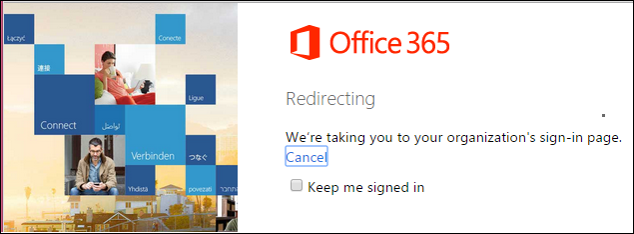
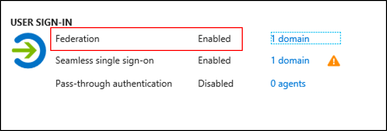
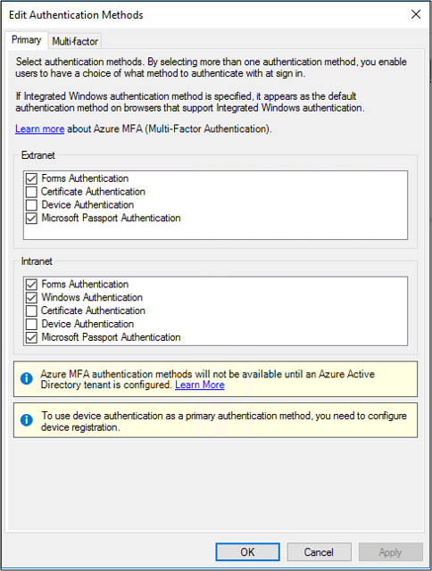

# AD FS Troubleshooting - Azure AD
With the growth of the cloud, a lot of companies have been moving to use Azure AD for their various apps and services.  Federating with Azure AD has become a standard practice with many organizations.  This document will cover some of the aspects of troubleshooting issues that arise with this federation.  Several of the topics in the general troubleshooting document still pertain to federating with Azure so this document will focus on just specifics with Azure AD and AD FS interaction.

## Redirection to AD FS
Redirection occurs when you sign-in to an application such as Office 365 and you are "redirected" to your organizations AD FS servers to sign-in.




### First things to check
If redirection is not occuring there are a few things you want to check

   1. Make sure that your Azure AD tenant is enabled for federation by signing in to the Azure portal and checking under Azure AD Connect.



   2.  Make sure that your custom domain is verified by clicking on the domain next to Federation in the Azure portal.


   3. Finally, you want to check [DNS](ad-fs-tshoot-dns.md) and make sure that your AD FS servers or WAP servers are resolving from the internet.  Verify that this resolves and that you are able to navigate to it.
   4. You can also use the PowerShell cmdlt `Get-AzureADDomain` to get this information also.


### You are receiving an Unknown Auth method error
You may encounter an "Unknown Auth method” error stating that AuthnContext is not supported at the AD FS or STS level when you are redirected from Azure. 

This is most common when Azure AD redirects to the AD FS or STS by using a parameter that enforces an authentication method. 

To enforce an authentication method, use one of the following methods:
- For WS-Federation, use a WAUTH query string to force a preferred authentication method.

- For SAML2.0, use the following:
```
<saml:AuthnContext>
<saml:AuthnContextClassRef>
urn:oasis:names:tc:SAML:2.0:ac:classes:PasswordProtectedTransport
</saml:AuthnContextClassRef>
</saml:AuthnContext>
```
When the enforced authentication method is sent with an incorrect value, or if that authentication method is not supported on AD FS or STS, you receive an error message before you are authenticated.

|Method of authentication wanted|wauth URI|
|-----|-----|
|User name and password authentication|urn:oasis:names:tc:SAML:1.0:am:password|
|SSL client authentication|urn:ietf:rfc:2246|
|Windows integrated authentication|urn:federation:authentication:windows|

Supported SAML authentication context classes

|Authentication method|Authentication context class URI|
|-----|-----| 
|User name and password|urn:oasis:names:tc:SAML:2.0:ac:classes:Password|
|Password protected transport|urn:oasis:names:tc:SAML:2.0:ac:classes:PasswordProtectedTransport|
|Transport Layer Security (TLS) client|urn:oasis:names:tc:SAML:2.0:ac:classes:TLSClient
|X.509 certificate|urn:oasis:names:tc:SAML:2.0:ac:classes:X509
|Integrated Windows authentication|urn:federation:authentication:windows|
|Kerberos|urn:oasis:names:tc:SAML:2.0:ac:classes:Kerberos|

To make sure that the authentication method is supported at the AD FS level, check the following.

#### AD FS 2.0 

Under **/adfs/ls/web.config**, make sure that the entry for the authentication type is present.

```
<microsoft.identityServer.web>
<localAuthenticationTypes>
<add name="Forms" page="FormsSignIn.aspx" />
<add name="Integrated" page="auth/integrated/" />
<add name="TlsClient" page="auth/sslclient/" />
<add name="Basic" page="auth/basic/" />
</localAuthenticationTypes>
```

#### AD FS 2012 R2

Under **AD FS Management**, click **Authentication Policies** in the AD FS snap-in.

In the **Primary Authentication** section, click Edit next to Global Settings. You can also right-click Authentication Policies and then select Edit Global Primary Authentication. Or, in the Actions pane, select Edit Global Primary Authentication.

In the Edit Global Authentication Policy window, on the Primary tab, you can configure settings as part of the global authentication policy. For example, for primary authentication, you can select available authentication methods under Extranet and Intranet.

**Make sure that the required authentication method check box is selected. 

#### AD FS 2016

Under **AD FS Management**, click **Service** and **Authentication Methods** in the AD FS snap-in.

In the **Primary Authentication** section, click Edit.

In the **Edit Authentication Methods** window, on the Primary tab, you can configure settings as part of the authentication policy.



## Tokens issued by AD FS

### Azure AD throws error after token issuance
After AD FS issues a token, Azure AD may throw an error. In this situation, check for the following issues:
- The claims that are issued by AD FS in token should match the respective attributes of the user in Azure AD.
- the token for Azure AD should contain the following required claims:
    - WSFED: 
        - UPN: The value of this claim should match the UPN of the users in Azure AD.
        - ImmutableID: The value of this claim should match the sourceAnchor or ImmutableID of the user in Azure AD.

To get the User attribute value in Azure AD, run the following command line: `Get-AzureADUser –UserPrincipalName <UPN>`


   - SAML 2.0:
       - IDPEmail: The value of this claim should match the user principal name of the users in Azure AD.
       - NAMEID: The value of this claim should match the sourceAnchor or ImmutableID of the user in Azure AD.

For more information, see [Use a SAML 2.0 identity provider to implement single sign-on](https://technet.microsoft.com/library/dn641269.aspx).

### Token-signing certificate mismatch between AD FS and Azure AD.

AD FS uses the token-signing certificate to sign the token that's sent to the user or application. The trust between the AD FS and Azure AD is a federated trust that's based on this token-signing certificate.

However, if the token-signing certificate on the AD FS side is changed because of Auto Certificate Rollover or by some intervention, the details of the new certificate must be updated on the Azure AD side for the federated domain. When the Primary token-signing certificate on the AD FS is different from Azure ADs, the token that's issued by AD FS is not trusted by Azure AD. Therefore, the federated user is not allowed to log on.

To fix this you can use the steps outline in [Renew federation certificates for Office 365 and Azure Active Directory](https://docs.microsoft.com/azure/active-directory/connect/active-directory-aadconnect-o365-certs).

## Other common things to check
The following is a quick list of things to check if you are having issues with AD FS and Azure AD interaction.
- stale or cached credentials in Windows Credential Manager
- Secure Hash Algorithm that's configured on the Relying Party Trust for Office 365 is set to SHA1

## Next Steps

- [AD FS Troubleshooting](ad-fs-tshoot-overview.md)