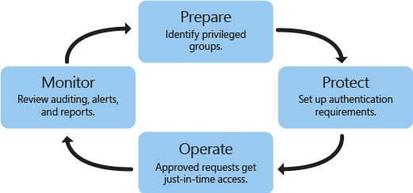
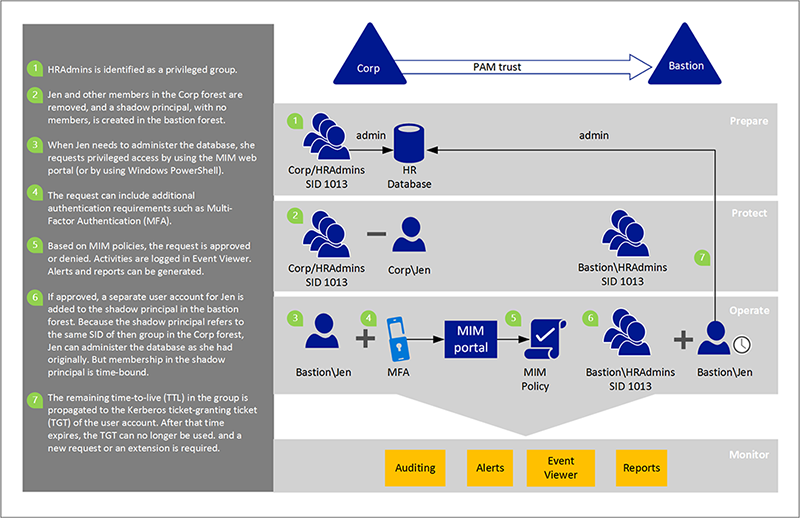

# Privileged Access Management for Active Directory Domain Services (AD DS)
Privileged Access Management \(PAM\) for Active Directory Domain Services \(AD DS\) is a solution that is based on Microsoft Identity Manager \(MIM\) and Windows Server 2012 R2 and Windows Server 2016 Technical Preview. It helps organizations restrict privileged access within an existing Active Directory environment.  
  
The process for setting up PAM includes creating a new bastion Active Directory forest. The bastion forest has a trust with your existing forest. It establishes a pristine environment that is known to be free of artifacts resulting from earlier malicious users or privileged credential theft, which helps an organization whose Active Directory environment might already be compromised have a foundation for re\-establishing control. It also isolates the use of privileged accounts and reduces the corresponding risk of those credentials being stolen as they are not needed for non\-administrative tasks.  
  
As a result of this design, PAM does not require any changes to existing applications or users in the Active Directory environment. There is no need to upgrade any servers or raise the domain or forest functional levels in that environment to get started using PAM.  
  
## What problems does PAM help solve?  
A real concern for enterprises today is the uncertainty regarding resource access within an Active Directory environment. Particularly troubling is news about vulnerabilities, unauthorized privilege escalations, and other types of unauthorized access, including pass\-the\-hash, pass\-the\-ticket, spear phishing, and Kerberos compromises. All of these attack capabilities are a concern for enterprises.  
  
Could their Active Directory environment already be compromised? If not, how long can it take an attacker to find and then compromise a Domain Admins account? After attackers achieve such access, what can stop them? How long can they lurk on the network with that access? How long can the environment be at risk before the compromise is detected? Attackers can leave backdoors \(create a way that allows them to get back in but not using the normal procedures\), perform data exfiltration, and carry out other exploits.  
  
The goal of PAM is to change the timeframes in which these vulnerabilities can be exploited. Today, it’s too easy for attackers to obtain Domain Admins account credentials, and it’s too hard to discover these attacks after the fact. Along with other investments, PAM will make it harder for attackers to penetrate a network and obtain privileged account access. PAM adds protection to privileged groups that control access across a range of domain\-joined computers and applications on those computers. It also adds more monitoring, more visibility, and more fine\-grained controls so that organizations can see who their privileged administrators are, and what are they doing. PAM gives organizations more insight into how such administrative accounts are used in the environment.  
  
## How is PAM set up?  
PAM builds on the principle of just\-in\-time administration, which works in combination with related features for [just enough administration (JEA)](http://channel9.msdn.com/Events/TechEd/NorthAmerica/2014/DCIM-B362). JEA is a Windows PowerShell toolkit that defines a set of commands for performing privileged activities and an endpoint where administrators can get authorization to run those commands. If JEA allows a certain task for users with a certain privilege, a user can request the privilege and then be able to perform the task for a limited amount of time. An administrator can specify what that time period might be, and after that time period elapses, the privileged account can no longer be used. PAM Just\-in\-Time and just enough administration can be deployed independently or together.  
  
PAM setup and operation has four steps.  
  
  
  
1.  **Prepare**: Identify which groups in your existing forest have significant privileges. As part of PAM setup, these groups will have their members removed in the current forest and the groups will be created without members in the bastion forest.  
  
2.  **Protect**: Set up lifecycle and authentication protection, such as Multi\-Factor Authentication \(MFA\), for when users request just\-in\-time administration. MFA helps prevent programmatic attacks from malicious software or following credential theft.  
  
3.  **Operate**: After authentication requirements are met and a request is approved, a user accounts gets added to a privileged group in the bastion forest. For example, a Microsoft SharePoint administrator can request privileges. That request may require MFA before it can be approved. After the SharePoint administrator authenticates using his or her phone, the administrator’s account will be added to a privileged group in the bastion forest for a specified time period, such as 4 hours. During that time, the administrator has all privileges and access permissions that are assigned to that group. After 4 hours, the account is removed from the group.  
  
4.  **Monitor**: PAM adds auditing, alerts, and reports of privileged access requests. You can always review the history of privileged access, and see who performed an activity. You can understand whether the activity is valid or not and easily identify unauthorized activity, such as an attempt to add a user directly to a privileged group in the original forest. This step is important not only to identify malicious software but also for tracking "inside" attackers.  
  
## How does PAM work?  
PAM is based on new capabilities in AD DS, particularly for domain account authentication and authorization, and new capabilities in MIM. PAM provides a way to separate privileged accounts from an existing Active Directory environment. When a privileged account needs to be used, it first needs to be requested, and then approved. After approval, the privileged account is given permission via a foreign principal group in a new bastion forest rather than in the current forest of the user or application. The use of a bastion forest gives the organization greater control, such as when a user can be a member of a privileged group, and how the user needs to authenticate.  
  
Active Directory, the MIM Service, and other portions of this solution can also be deployed in a high availability configuration.  
  
The following example shows how PAM works in more detail.  
  
  
  
This administrative access pattern allows the bastion forest to issue time\-limited group memberships, which in turn produce time\-limited TGTs that existing Kerberos\-based applications or services can honor and enforce, including applications and services in other forests that trust the bastion forest.  
  
Users’ day\-to\-day accounts do not need to move to a new forest that is operating at a specific functional level. They stay in their existing forest regardless of its functional level. The same is true with the computers, applications, and their groups. They stay where they are today in an existing forest. They don’t need to be upgraded. Consider the example of an organization that is concerned with these cybersecurity issues today, but has no immediate plans to upgrade the server infrastructure to the next version of Windows Server. That organization can still take advantage of this combined solution by using MIM and a new bastion forest, and can better control access to existing resources.  
  
PAM offers the following advantages:  
  
-   **Isolation\/scoping of privileges**: Users do not hold privileges on accounts that perform tasks that do not require privileged access. For example, if they have accounts that they use for everyday activities like checking email or surfing the web, those accounts would not have any administrator privileges. Users need to request privileges. Requests are approved or denied based on MIM policies defined by a PAM administrator. Until a request is approved, privileged access is not available.  
  
-   **Step\-up and proof\-up**: These are new authentication and authorization challenges to help manage the lifecycle of separate administrative accounts. The user can request the elevation of an administrative account and that request goes through MIM workflows.  
  
-   **Additional logging**: In addition to the built\-in MIM workflows, there is additional logging for PAM that identifies the request, how it was authorized, and any events that occur after approval.  
  
-   **Customizable workflow**: The MIM workflows can be configured for different scenarios, and multiple workflows can be used, based on the parameters of the requesting user or requested roles.  
  
## How else can users request privileged access?  
There are a number of ways in which a user can submit a request: by using traditional options such as the MIM Services Web Services API, and by using new interfaces: through a REST endpoint and Windows PowerShell \(**New\-PAMRequest**\), which makes it easy for users to create new requests.  
  
## What workflows and monitoring options are available?  
As an example, let’s say a user was a member of an administrative group before PAM is set up. As part of PAM setup, the user is removed from the administrative group, and a policy is created in MIM. The policy specifies that if that user requests administrative privileges and is authenticated by MFA, the request is approved and a separate account for the user will be added to the privileged group in the bastion forest.  
  
Assuming the request is approved, the Action workflow communicates directly with bastion forest Active Directory to put a user in a group. For example, when Jen requests to administer the HR database, the administrative account for Jen is added to the privileged group in the bastion forest within seconds. Her administrative account’s membership in that group will expire after a time limit, such as an hour, or a day, or a week, or whatever is appropriate for that request. With Windows Server 2016 Technical Preview, that membership is associated in Active Directory with a time limit; with Windows Server 2012 R2 in the bastion forest, that time limit is enforced by MIM.  
  
> [!NOTE]  
> When you add a new member to a group, the change needs to replicate to other domain controllers \(DCs\) in the bastion forest. Replication latency can impact the ability for users to access resources. For more information about replication latency, see [How Active Directory Replication Topology Works](https://technet.microsoft.com/library/cc755994(v=ws.10).aspx).  
>   
> In contrast, an expiring link is evaluated in real time by the Security Accounts Manager \(SAM\). This means that even though the addition of a group member is a change that needs to be replicated by the DC that receives the access request, the removal of a group member does not need to replicate. It’s evaluated instantaneously on any DC.  
  
This workflow is specifically intended for these administrative accounts. Administrators \(or even scripts\) who need only occasional access for privileged groups, can precisely request that access. MIM logs the request and the changes in Active Directory, and you can view them in Event Viewer. It is very easy to send the output of this system to enterprise monitoring solutions such as System Center 2012 \- Operations Manager Audit Collection Services \(ACS\), or other third\-party tools.  
  
After the workflows are complete, users can verify that their accounts in the bastion forest are in the same groups in which their already\-existing \(“Corp” in the previous diagram\) forest accounts were originally members, just as if they had been members all along. They can then use their account in the bastion forest to access existing apps in the existing forest. Those access rights will disappear automatically when the ticket expires, and all their group memberships will also expire, unless they are renewed.  
  

